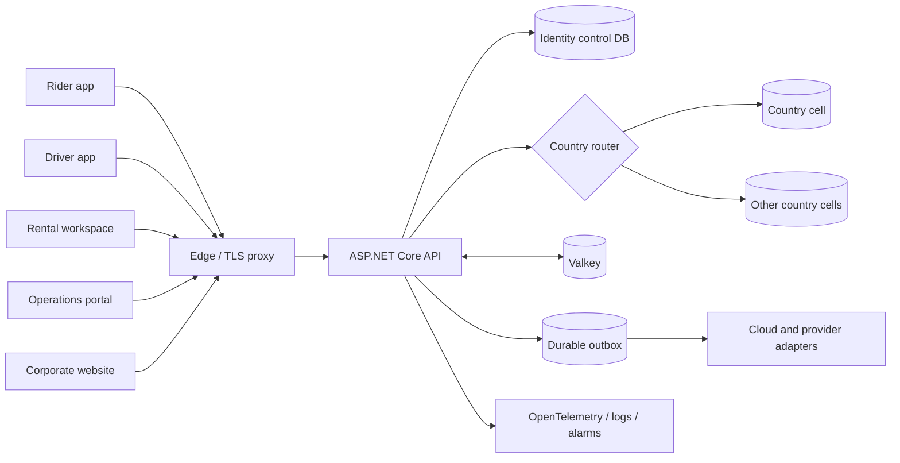

# KiloDrive Architecture & Operations Runbooks

Public, implementation-aligned documentation for the KiloDrive transportation,
delivery, wallet, membership, rental, and operations platform.

> **Public-safe scope:** this repository intentionally contains no credentials,
> private keys, tokens, account identifiers, internal IP addresses, private
> object-store names, production connection strings, customer data, or exact
> security-group rules. It explains architecture and operating principles, not
> access to KiloDrive production systems.

## What this repository covers

KiloDrive is implemented as a .NET 9 API, ASP.NET Core portal and corporate
website, and a Flutter mobile application. The platform uses a global identity
control plane and independently routed country data cells. MySQL is the durable
system of record; Valkey supports distributed cache, realtime scale-out,
short-lived security ceremonies, and high-frequency location state. Provider
side effects are isolated behind adapters and durable outbox processing.

## Documentation map

### Architecture

- [System context](architecture/system-context.md)
- [API architecture](architecture/api.md)
- [Mobile architecture](architecture/mobile.md)
- [Portal and website](architecture/portal-and-website.md)
- [Entity identification](architecture/entity-identification.md)
- [Tenancy and country cells](architecture/tenancy-and-country-cells.md)
- [Realtime and asynchronous processing](architecture/realtime-and-events.md)
- [Geospatial and routing](architecture/geospatial.md)
- [Wallet, billing, and accounting](architecture/financial-systems.md)
- [Documents, media, and voice](architecture/documents-media-voice.md)
- [Plugins and extension points](architecture/plugins-and-extension-points.md)
- [Hosting and deployment topology](architecture/hosting.md)
- [Observability](architecture/observability.md)

### Data and cloud integrations

- [Database architecture](database/README.md)
- [Schema lifecycle](database/schema-lifecycle.md)
- [Data ownership and retention](database/data-ownership.md)
- [AWS integration overview](aws/README.md)
- [Identity and access management](aws/iam.md)
- [Storage and encryption](aws/storage.md)
- [Messaging and notifications](aws/messaging.md)
- [EventBridge and SQS](aws/eventbridge-sqs.md)
- [Monitoring and telemetry](aws/monitoring.md)
- [LiveKit on AWS](aws/livekit.md)
- [Valkey architecture](integrations/valkey.md)
- [Third-party services](integrations/providers.md)

### Security

- [Security posture](security/README.md)
- [Identity, authentication, and authorization](security/identity-and-access.md)
- [Application and API security](security/application-security.md)
- [Privacy and data protection](security/privacy-and-data-protection.md)
- [Threat boundaries](security/threat-boundaries.md)
- [Vulnerability reporting](SECURITY.md)

### Operations runbooks

- [Runbook index](runbooks/README.md)
- [API deployment and rollback](runbooks/api-deployment.md)
- [Schema alignment](runbooks/schema-alignment.md)
- [Readiness and incident triage](runbooks/readiness-triage.md)
- [Valkey degradation](runbooks/valkey-degradation.md)
- [Outbox recovery](runbooks/outbox-recovery.md)
- [Provider outage](runbooks/provider-outage.md)
- [LiveKit and voice](runbooks/livekit-voice.md)
- [Upload quarantine](runbooks/upload-quarantine.md)
- [JWT key rotation](runbooks/jwt-key-rotation.md)
- [Country activation](runbooks/country-activation.md)
- [Backup and recovery](runbooks/backup-and-recovery.md)
- [Security incident response](runbooks/security-incident.md)
- [Authentication and session incident](runbooks/authentication-session.md)
- [Wallet and accounting reconciliation](runbooks/wallet-reconciliation.md)
- [Realtime and SignalR](runbooks/realtime-signalr.md)
- [Geospatial provider degradation](runbooks/geospatial-degradation.md)
- [Mobile release](runbooks/mobile-release.md)
- [Portal and website release](runbooks/portal-website-release.md)
- [Notification canaries](runbooks/notification-canaries.md)
- [Privacy and deletion orchestration](runbooks/privacy-deletion.md)

### Dependencies and governance

- [Third-party dependency policy](third-party/README.md)
- [.NET direct packages](third-party/dotnet-packages.md)
- [Flutter direct packages](third-party/flutter-packages.md)
- [Third-party licenses](third-party/licenses.md)
- [Documentation safety policy](governance/public-documentation-policy.md)
- [Architecture decision process](governance/architecture-decisions.md)
- [Glossary](GLOSSARY.md)

## Status language

Every chapter uses these terms deliberately:

- **Implemented** — represented in the current application code or canonical
  database scripts.
- **Configurable** — implemented but active only when an operator supplies an
  approved provider or feature configuration.
- **Operational policy** — a required procedure around the implementation.
- **Planned** — a design direction that must not be interpreted as deployed.

## Public assurance versus certification

This repository is an architectural disclosure, not a penetration-test report,
regulatory certification, uptime guarantee, or representation that every
optional provider is enabled in every country. Operational readiness is decided
by private deployment evidence, health checks, schema fingerprints, provider
canaries, store reviews, and jurisdiction-specific approvals.

## Document metadata

- Documentation baseline: KiloDrive mobile `1.0.0+66`
- API/runtime family: .NET 9
- Database family: MySQL 8
- Last reviewed: 2026-08-23

Copyright © 2026 Eprecus LLC. See [NOTICE](NOTICE.md).
