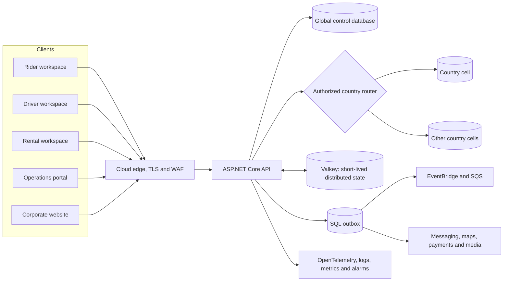

# KiloDrive Architecture & Operations Runbooks

KiloDrive is a transportation marketplace with more moving parts than a typical
CRUD application. A rider can publish a trip, several drivers can receive it at
nearly the same time, bids can change while phones move between networks, and a
wallet payment may complete even when a notification provider is unavailable.
That combination makes the system interesting—and occasionally unforgiving.

This repository explains how KiloDrive is designed, secured, and operated. It
is written for junior and mid-level engineers who want to understand the
reasoning behind the design, not merely memorize component names. Wherever a
choice has a cost, the documentation says so. Wherever production taught us a
painful lesson, the lesson is recorded beside the design it changed.

> **Public-safe scope:** this repository contains no credentials, signing keys,
> tokens, cloud account identifiers, private addresses, production connection
> strings, customer data, or copy-and-paste access instructions. It explains
> architecture and operating principles. Restricted values and private incident
> evidence belong in controlled operational systems.

## Start here

If this is your first day with a sharded, realtime platform, use the following
reading order. It builds one idea at a time:

1. [System context](docs/architecture/system-context.md) — what KiloDrive does
   and where the important trust boundaries sit.
2. [Tenancy and country cells](docs/architecture/tenancy-and-country-cells.md) —
   why identity is global while trips and money remain country-local.
3. [Entity identification](docs/architecture/entity-identification.md) — why
   UUIDv7 is used and why public support IDs are not database keys.
4. [Realtime and asynchronous processing](docs/architecture/realtime-and-events.md) —
   the difference between durable truth and fast delivery.
5. [Geospatial processing](docs/architecture/geospatial.md) — how location,
   route matching, and deviation detection work without treating noisy GPS as
   perfect evidence.
6. [Rider and driver safety](docs/architecture/rider-driver-safety.md) — how
   eligibility, pre-trip confirmation, RideCheck, emergency actions, evidence,
   and human response protect both sides of a trip.
7. [Jurisdictional compliance](docs/architecture/jurisdictional-compliance.md) —
   how country dossiers, shard gates, effective rules, approvals, and retained
   evidence turn legal requirements into enforceable operations.
8. [Financial systems](docs/architecture/financial-systems.md) — wallets,
   holds, double-entry journals, idempotency, and reconciliation.
9. [Rental marketplace](docs/architecture/rental-marketplace.md) — how fleet,
   availability, payment authorization, evidence, deposits, and disputes form
   one lifecycle.
10. [Runbook fundamentals](docs/runbooks/README.md) — how to diagnose and recover
   production safely.

The [documentation guide](docs/README.md) also provides role-based paths for
mobile, API, database, security, and operations engineers.

## The system in one picture



The most important idea in this diagram is that the arrows do not all mean the
same thing:

- MySQL owns durable business truth.
- Valkey owns fast, replaceable, short-lived state such as fresh driver
  positions and SignalR scale-out messages.
- The outbox owns the promise that a committed side effect will eventually be
  attempted.
- EventBridge and SQS improve dispatch throughput and isolation, but they do
  not replace the transactional record in the country cell.
- Push, email, SMS, WhatsApp, maps, payment, and voice providers are external
  dependencies. Their success must never be guessed from a network timeout.

This distinction prevents a common distributed-systems mistake: treating the
fastest component as the source of truth. Fast state can disappear. Durable
state must still explain what happened.

## What KiloDrive contains

| Area | Primary implementation | Responsibility |
| --- | --- | --- |
| API | ASP.NET Core on .NET 9 | Authentication, authorization, workflows, validation, country routing, durable commands and queries |
| Operations portal | ASP.NET Core MVC | Administrative and operational workflows through the API |
| Corporate website | ASP.NET Core Razor Pages | Public content and calculators backed by reviewed API contracts |
| Mobile | Flutter 3.41 / Dart 3.11 | Rider, driver, rental, tools-only, and System Admin workspaces |
| Durable data | MySQL 8 | Global identity control plane plus independent country cells |
| Distributed state | Valkey over TLS | Cache, SignalR backplane, geospatial freshness, rate coordination, and short-lived ceremonies |
| Routing | Google provider adapters and OSRM | Geocoding, route calculation, map matching, and degraded fallback paths |
| Events | SQL outbox, EventBridge, and SQS | Durable side effects, scalable dispatch, retries, and dead-letter recovery |
| Object storage | Private S3-compatible object storage | Quarantined uploads, reviewed documents, report artifacts, and authorized call recordings |
| Realtime media | LiveKit and TURN | Consent-aware rider/driver voice, room tokens, connectivity, and optional egress |
| Observability | OpenTelemetry, ADOT, CloudWatch, Serilog | Correlated traces, bounded metrics, sanitized logs, readiness, dashboards, and alarms |

Version numbers in this public repository are a reviewed documentation
baseline, not an instruction to upgrade every dependency at once. Native mobile
packages are deliberately upgraded in isolated batches because WebRTC, social
authentication, local authentication, and state-management changes have very
different failure modes.

## Five questions every feature must answer

A feature is not production-ready merely because its happy-path endpoint
returns `200`. Before adding or reviewing a feature, ask:

1. **Who owns the data?** Is it global identity data, country operational data,
   tenant data, provider state, or replaceable cache state?
2. **What happens after the commit?** If a notification, webhook, audit write,
   or realtime publish fails, can the operation be retried without lying to the
   caller or duplicating work?
3. **What prevents a retry from doing it twice?** Which idempotency key,
   conditional version, unique reference, or provider reconciliation rule makes
   the mutation safe?
4. **What does the user see while dependencies are slow?** A bounded loading
   state, a useful partial result, a retry, or an indefinite spinner?
5. **How will an operator know it is broken?** Which health check, metric,
   trace, audit event, alarm, and runbook reveal the failure without logging
   sensitive payloads?

These questions sound basic. They catch a surprising number of serious defects.

## Hard-learned lessons

The detailed chapters contain the complete stories. These are the short
versions worth remembering:

- **Database version is not application version.** A current schema marker does
  not prove that IIS is running the newest binary. Identify the deployed build
  independently, then verify its schema contract.
- **A realtime event is a hint, not the record.** SignalR makes an accepted bid
  appear quickly; the locked database transition proves who won. Clients still
  reconcile after reconnecting.
- **Do not perform critical post-commit work with the HTTP cancellation token.**
  A user can close the app after the database commits. Durable outbox work must
  continue from its own worker scope.
- **Do not turn a cancelled request into a failed business operation.** If the
  commit succeeded but audit or publish failed, returning an ordinary failure
  invites the client to repeat a completed command.
- **Never use wall-clock ticks as an entity version.** Multiple nodes can have
  clock skew. Persisted monotonic versions make stale-event rejection
  deterministic.
- **A feed refresh is not proof that a driver viewed an offer.** Viewer counts
  require an explicit, expiring visibility heartbeat for the particular ride.
- **GPS is evidence with uncertainty.** Age, accuracy, impossible speed, road
  matching, and parallel-road ambiguity all matter. A point near a toll plaza
  does not prove the vehicle crossed it.
- **Money needs two views.** A wallet transaction explains the user balance; a
  balanced immutable journal explains the accounting event. One cannot safely
  substitute for the other.
- **Unknown payment outcomes must be reconciled before retry.** A timeout after
  provider capture is not the same as a declined payment.
- **Never repair accounting by editing immutable history.** Post a reviewed
  reversing entry, retain the original evidence, and investigate the cause.
- **Schema drift messages must name the actual difference.** A hash alone tells
  an on-call engineer that something is wrong; normalized table, column, index,
  and foreign-key differences tell them what to inspect.
- **Optional providers need honest degraded states.** Missing LiveKit, maps, or
  messaging configuration should be visible and bounded—not converted into a
  confusing generic error or an infinite loader.
- **Secret redaction must cover URLs.** OAuth tokens and SignalR access tokens
  can leak through query strings even when request bodies are masked.
- **A malware scanner that silently allows files is not a scanner.** Uploads
  remain quarantined until a trusted clean result exists. Timeout is not clean.
- **Mobile store review inspects the shipped binary.** Source searches alone do
  not catch private selectors embedded in native frameworks or permissions
  merged from transitive dependencies.
- **Do not serialize production configuration merely to change one setting.**
  A serializer can rewrite meaningful strings and corrupt strict CSP values.
  Read the file, make a targeted reviewed change, and validate the result.
- **Tests need canonical fixtures.** A half-built user, vehicle, wallet, or
  membership graph produces false defects and hides real ones. Fixture
  readiness is an explicit assertion, not an assumption.

## Documentation map

### Architecture and data

- [Architecture index](docs/architecture/README.md)
- [System context](docs/architecture/system-context.md)
- [Capability status and evidence](docs/architecture/capability-status.md)
- [API architecture](docs/architecture/api.md)
- [Mobile architecture](docs/architecture/mobile.md)
- [Portal and website](docs/architecture/portal-and-website.md)
- [Tenancy and country cells](docs/architecture/tenancy-and-country-cells.md)
- [Entity identification](docs/architecture/entity-identification.md)
- [Realtime and events](docs/architecture/realtime-and-events.md)
- [Geospatial processing](docs/architecture/geospatial.md)
- [Rider and driver safety](docs/architecture/rider-driver-safety.md)
- [Jurisdictional compliance](docs/architecture/jurisdictional-compliance.md)
- [Financial systems](docs/architecture/financial-systems.md)
- [Rental marketplace](docs/architecture/rental-marketplace.md)
- [Documents, media, and voice](docs/architecture/documents-media-voice.md)
- [Hosting topology](docs/architecture/hosting.md)
- [Observability](docs/architecture/observability.md)
- [Scaling and capacity planning](docs/architecture/scaling-and-capacity.md)
- [Database guide](docs/database/README.md)

### Cloud, integrations, and security

- [AWS integration guide](docs/aws/README.md)
- [Valkey](docs/integrations/valkey.md)
- [Provider boundaries](docs/integrations/providers.md)
- [Security posture](docs/security/README.md)
- [Identity and access](docs/security/identity-and-access.md)
- [Application security](docs/security/application-security.md)
- [Privacy and data protection](docs/security/privacy-and-data-protection.md)
- [Threat boundaries](docs/security/threat-boundaries.md)

### Operations and decisions

- [Runbook index](docs/runbooks/README.md)
- [Architecture Decision Records](docs/adr/README.md)
- [Architecture decision process](docs/governance/architecture-decisions.md)
- [Public documentation policy](docs/governance/public-documentation-policy.md)
- [Learning diagrams](docs/diagrams/README.md)
- [Engineering tutorials](docs/tutorials/README.md)
- [Engineering lessons from production](docs/engineering-lessons.md)
- [Primary-source further reading](docs/further-reading.md)

### Dependencies and licensing

- [Third-party dependency policy](docs/third-party/README.md)
- [.NET packages](docs/third-party/dotnet-packages.md)
- [Flutter packages](docs/third-party/flutter-packages.md)
- [License obligations](docs/third-party/licenses.md)
- [SBOM guide](docs/third-party/sbom.md)
- [Machine-readable public CycloneDX baseline](docs/third-party/kilodrive-public-direct.cdx.json)

## Quickstart for documentation contributors

This public repository contains documentation tooling, not the private KiloDrive
application source.

```powershell
git clone https://github.com/Eprecus-LLC/KiloDrive-Architecture.git
Set-Location KiloDrive-Architecture
python tools/audit_docs.py
```

Before opening a pull request:

1. verify claims against source, canonical schema, tests, or approved policy;
2. label optional behavior as **Configurable** and future design as **Planned**;
3. explain the reason and tradeoff, not only the mechanism;
4. add or update the affected ADR and runbook;
5. keep examples synthetic and public-safe; and
6. run the documentation audit on a clean checkout.

See [CONTRIBUTING.md](CONTRIBUTING.md) for the full writing and review guide.

## Status language

Every chapter uses these terms deliberately:

- **Implemented** — represented in current application code or canonical MySQL
  scripts and supported by relevant tests.
- **Configurable** — implemented, but active only when approved provider or
  deployment configuration is supplied.
- **Operational policy** — a required human or automated procedure surrounding
  the implementation.
- **Planned** — a design direction that must not be presented as deployed.

## Public assurance versus certification

This repository is an architectural disclosure and educational resource. It is
not a penetration-test report, regulatory certification, availability promise,
or claim that every optional provider is enabled in every country. Production
readiness is decided by restricted deployment evidence, health checks, schema
fingerprints, provider canaries, reconciliation, restore exercises, and
jurisdiction-specific approval.

## Documentation baseline

- Mobile baseline: KiloDrive `1.0.0+66`
- Flutter baseline: `3.41.7` / Dart `3.11.5`
- API/runtime family: .NET `9`
- Database family: MySQL `8`
- Last architecture review: 2026-08-23

Copyright © 2026 Eprecus LLC. See [NOTICE.md](NOTICE.md).
