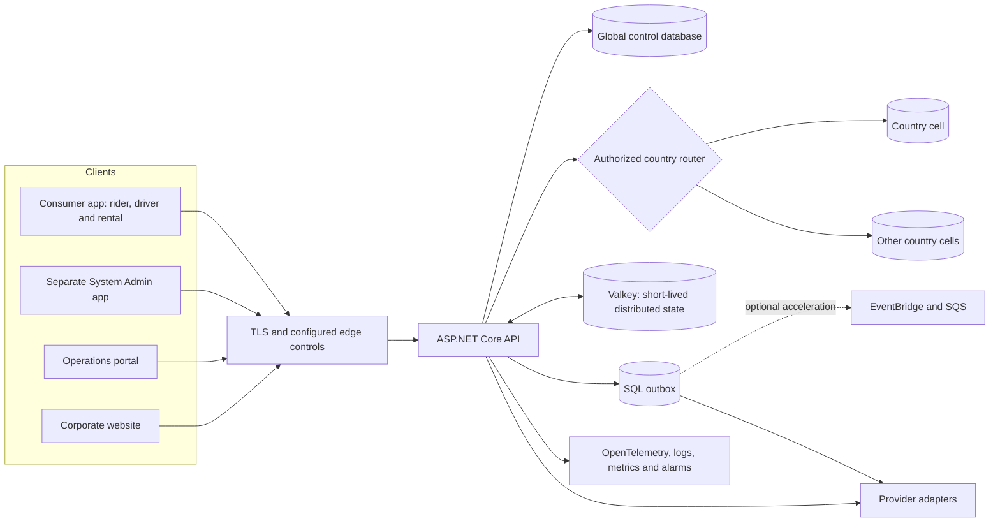

# KiloDrive Architecture & Operations Runbooks

KiloDrive is a transportation marketplace with more moving parts than a typical
CRUD application. A rider can publish a trip, several drivers can receive it at
nearly the same time, bids can change while phones move between networks, and a
wallet payment may complete even when a notification provider is unavailable.
That combination makes the system interesting—and occasionally unforgiving.

This repository explains how KiloDrive is designed, secured, and operated. It
is written for junior and mid-level engineers who want to understand the
reasoning behind the design, not merely memorize component names. Wherever a
choice has a cost, the documentation says so. Wherever production taught us a
painful lesson, the lesson is recorded beside the design it changed.

> **Publication boundary:** credentials, signing keys, tokens, cloud account
> identifiers, private addresses, production connection strings, customer data
> and production access instructions belong in restricted systems. This
> repository explains reviewed architecture and operating principles. Report
> suspected sensitive material through [SECURITY.md](SECURITY.md).

For the product itself, visit the [KiloDrive website](https://kilodrive.com/),
read the [user manuals](https://kilodrive.com/manuals) or
[latest public changes](https://kilodrive.com/changelog), and use
[Contact KiloDrive](https://kilodrive.com/contact) for help. The
[Privacy Policy](https://kilodrive.com/privacy),
[Terms of Service](https://kilodrive.com/terms), and
[consumer Android listing on Google Play](https://play.google.com/store/apps/details?id=com.kilodrive.app)
are linked from the [official product-links guide](docs/public-product-links.md).
The separate System Admin app is not the public consumer download.

[Documentation guide](docs/README.md) · [Glossary](GLOSSARY.md) ·
[Contributing](CONTRIBUTING.md) · [Security reporting](SECURITY.md) ·
[Publication notice](NOTICE.md)

## Start here

Read the [current baseline and evidence guide](docs/current-baseline.md) to
distinguish current source, historical releases, configuration and certification.
The [documentation review record](docs/quality/documentation-audit-2026-10-03.md)
lists corrected mistakes and remaining semantic-review work explicitly.

For security, read the [control model](docs/security/security-control-model.md)
and the [OWASP API Top 10 mapping](docs/security/owasp-api-top-10-2023.md).
They explain authentication, authorization, device admission, financial safeguards
and abuse controls, with source evidence and deployment qualifications.

For HTTP contracts, start with the [KiloDrive API Guide](docs/api/README.md).
It includes plain-English endpoint purposes, a linked field dictionary,
authentication/tenancy rules, money and timestamp conventions, safe recovery,
workflow guides and a curated OpenAPI export. The
[documentation baseline](#documentation-baselines) below agrees with the
[published manifest](docs/api/openapi/manifest.json). Publication does not grant
partner or administrator access or certify every production dependency.

| What you need | Start with |
| --- | --- |
| Current scope, evidence and known limitations | [Baseline](docs/current-baseline.md) and [correction record](docs/quality/documentation-audit-2026-10-03.md) |
| Endpoint purposes, request/response fields and enums | [API guide](docs/api/README.md), [operation finder](docs/api/reference/operations.md) and [field dictionary](docs/api/schemas/README.md) |
| Consumer and administrative responsibilities | [Two-client model](#two-mobile-apps-one-authoritative-api) and [System Admin chapter](docs/architecture/system-admin-mobile-app.md) |
| Authentication, admission, money and abuse protection | [Control model](docs/security/security-control-model.md) and [OWASP mapping](docs/security/owasp-api-top-10-2023.md) |
| Recovery, release and verification | [Runbooks](docs/runbooks/README.md) and [testing guide](docs/quality/testing-and-verification.md) |
| Terminology, rights and disclosure | [Glossary](GLOSSARY.md), [NOTICE](NOTICE.md) and [SECURITY](SECURITY.md) |

### Suggested architecture reading order

If this is your first day with a sharded, realtime platform, use the following
reading order. It builds one idea at a time:

1. [System context](docs/architecture/system-context.md) — what KiloDrive does
   and where the important trust boundaries sit.
2. [Product and operational doctrine](docs/governance/product-and-operational-doctrine.md) —
   the rules that connect product intent, security, money, safety, failure
   recovery, honest status, and production evidence.
3. [Tenancy and country cells](docs/architecture/tenancy-and-country-cells.md) —
   why identity is global while trips and money remain country-local.
4. [Entity identification](docs/architecture/entity-identification.md) — why
   UUIDv7 is used and why public support IDs are not database keys.
5. [Realtime and asynchronous processing](docs/architecture/realtime-and-events.md) —
   the difference between durable truth and fast delivery.
6. [Geospatial processing](docs/architecture/geospatial.md) — how location,
   route matching, and deviation detection work without treating noisy GPS as
   perfect evidence.
7. [Rider and driver safety](docs/architecture/rider-driver-safety.md) — how
   eligibility, pre-trip confirmation, RideCheck, emergency actions, evidence,
   and human response protect both sides of a trip.
8. [Marketplace product lifecycles](docs/architecture/marketplace-product-lifecycles.md) —
   how scheduled and multi-stop rides, driver business tools, family/business
   travel, courier, rentals, reputation, and support remain recoverable.
9. [Jurisdictional compliance](docs/architecture/jurisdictional-compliance.md) —
   how country dossiers, shard gates, effective rules, approvals, and retained
   evidence turn legal requirements into enforceable operations.
10. [Financial systems](docs/architecture/financial-systems.md) — wallets,
   holds, double-entry journals, idempotency, and reconciliation.
11. [Rental marketplace](docs/architecture/rental-marketplace.md) — how fleet,
    availability, payment authorization, evidence, deposits, and disputes form
    one lifecycle.
12. [System Administration](docs/architecture/system-administration.md) — how
    capabilities, country workspaces, work queues, investigations, step-up,
    audit, and safe recovery fit together.
    The [System Admin mobile app](docs/architecture/system-admin-mobile-app.md)
    chapter describes the separate operator client and its current limits.
13. [Runbook fundamentals](docs/runbooks/README.md) — how to diagnose and recover
    production safely.
14. [Public quality assurance and concurrency guarantees](docs/quality/public-assurance-and-concurrency.md)
    and [testing and verification](docs/quality/testing-and-verification.md) —
    how outcome-oriented coverage, invariants, negative authorization, races,
    failure injection, real boundaries, and signed artifacts become release
    evidence.
15. [Runtime boundaries and certification](docs/architecture/runtime-boundaries-and-certification.md) —
    how anonymous tenancy, public routes, hardened failures, typed clients,
    work queues, negotiated fares, realtime recovery, and capacity proof fit
    together.
16. [Runtime profiles](docs/architecture/runtime-profiles.md) — how the modular
    monolith can run as Public API, realtime gateway, country worker, media
    worker, reporting worker, or the compatibility Combined host without
    splitting a country-cell transaction.
17. [Authoritative foreign exchange](docs/architecture/authoritative-foreign-exchange.md) —
    how reviewed rates, fee policy, immutable quotes, transaction snapshots,
    configurable approval controls, and reconciliation keep cross-currency money honest.

The [documentation guide](docs/README.md) also provides role-based paths for
mobile, API, database, security, and operations engineers.

## Two mobile apps, one authoritative API

| Client | Intended work | Authority boundary |
| --- | --- | --- |
| Consumer Android/iOS app | Rider, driver, rental and account journeys: onboarding, vehicles, trips, wallet, membership, communications and preferences | Consumer-scoped sessions and server-enforced ownership, eligibility and lifecycle rules |
| Restricted System Admin Android/iOS app | People dossiers, driver/document review, Membership Center, security, devices, notifications, financial investigations, audit and operational recovery | Administrative role/capability checks, selected country workspace, required proofs and durable audit |
| Portal and Website | Their reviewed browser operations and public content | The same API authorization and domain rules; browser rendering does not grant permission |

System Admin tasks belong in the separate Admin app, not the consumer app. One
global identity may also have an active rider membership, but that consumer
session does not inherit administrative authority. The API computes driver
readiness and membership entitlements; an app screen cannot override them.

The Admin chapter describes document viewing and decision/re-upload workflows,
plan creation and benefit/pricing editing, member drill-down, expiry management,
user security and readable audit details. New paid plans remain drafts until
the required store/country setup is complete. Independent second approval is
configurable per supported domain, with disabled source defaults; authorization,
audit and concurrency checks remain in force. Actual deployed settings and
complete signed-device workflow coverage need their own evidence.

Both apps use adapters to translate platform/provider observations into typed
results. StoreKit, Google Play, camera, secure storage, push, location and media
callbacks do not directly establish server authority. Account-switch fencing,
installation/session binding and safe recovery are detailed in
[native adapters](docs/architecture/native-adapters-and-store-billing.md),
[mobile sessions and installations](docs/architecture/mobile-session-and-device-lifecycle.md)
and [notification delivery](docs/architecture/notification-delivery-lifecycle.md).

## The system in one picture


```mermaid
flowchart LR
    subgraph Clients
      Consumer[Consumer app: rider, driver and rental]
      Admin[Separate System Admin app]
      Portal[Operations portal]
      Web[Corporate website]
    end

    Consumer --> Edge[TLS and configured edge controls]
    Admin --> Edge
    Portal --> Edge
    Web --> Edge
    Edge --> API[ASP.NET Core API]

    API --> Control[(Global control database)]
    API --> Router{Authorized country router}
    Router --> JM[(Country cell)]
    Router --> Other[(Other country cells)]

    API <--> Valkey[(Valkey: short-lived distributed state)]
    API --> Outbox[(SQL outbox)]
    Outbox -. optional acceleration .-> Bus[EventBridge and SQS]
    Outbox --> Providers[Provider adapters]
    API --> Providers
    API --> Telemetry[OpenTelemetry, logs, metrics and alarms]
```

This diagram shows responsibility and communication boundaries, not a complete
live deployment or literal middleware order. API requests can call provider
adapters directly where their contract requires it; durable queued effects use
the outbox. Optional infrastructure needs verified deployment configuration.
The arrows do not all mean the same thing:

- MySQL owns durable business truth.
- Valkey owns fast, replaceable, short-lived state such as fresh driver
  positions and SignalR scale-out messages.
- The outbox owns the promise that a committed side effect will eventually be
  attempted.
- EventBridge and SQS improve dispatch throughput and isolation, but they do
  not replace the transactional record in the country cell.
- Push, email, SMS, WhatsApp, maps, payment, and voice providers are external
  dependencies. Their success must never be guessed from a network timeout.

The [marketplace lifecycle map](docs/architecture/marketplace-product-lifecycles.md)
explains the reviewed product baseline. It covers scheduled guarantees,
multi-stop and hourly rides, advisory marketplace intelligence, professional
driver tools, family/business delegation, assisted riders, wallet fare splitting,
courier chain of custody, rentals, two-sided reputation, and support. Each
capability is labelled separately for source maturity, country activation, and
runtime certification.
Active-trip native location behavior, privacy limits, recovery, and release
proof are maintained in the
[Active-trip location and privacy runbook](docs/runbooks/active-trip-location-and-privacy.md).

This distinction prevents a common distributed-systems mistake: treating the
fastest component as the source of truth. Fast state can disappear. Durable
state must still explain what happened.

## Major components in the reviewed design

| Area | Primary implementation | Responsibility |
| --- | --- | --- |
| API | ASP.NET Core on .NET 9 | Authentication, authorization, workflows, validation, country routing, durable commands and queries |
| Operations portal | ASP.NET Core MVC | Administrative and operational workflows through the API |
| Corporate website | ASP.NET Core Razor Pages | Public content and calculators backed by reviewed API contracts |
| Consumer mobile | Flutter 3.41 / Dart 3.11 | Rider, driver, rental, and tools-only workspaces; no operative System Admin UI |
| System Admin mobile | Separate Flutter Android/iOS package | People/readiness review, Membership Center and capability-scoped operations; complete migration parity and signed-device certification require their own evidence |
| Durable data | MySQL 8 | Global identity control plane plus independent country cells |
| Distributed state | Valkey over TLS | Cache, SignalR backplane, geospatial freshness and short-lived ceremonies; reviewed ASP.NET request-limit counters remain process-local |
| Routing | Google provider adapters and OSRM | Geocoding, route calculation, map matching, and degraded fallback paths |
| Events | SQL outbox, optional EventBridge and SQS acceleration | Durable side effects, scalable dispatch, retries, and dead-letter recovery; SQL remains the recovery authority |
| Object storage | Private S3-compatible object storage | Quarantined uploads, reviewed documents, report artifacts, and authorized call recordings |
| Realtime media | LiveKit and TURN | Configurable consent-aware voice, room tokens, connectivity, and egress only where provider, jurisdiction, consent, and retention gates are approved |
| Observability | Serilog rolling logs, OpenTelemetry and optional cloud exporters | Correlated traces, bounded metrics, sanitized logs and readiness; CloudWatch is optional and alert delivery must be verified |

Version numbers in this public repository are a reviewed documentation
baseline, not an instruction to upgrade every dependency at once. Native mobile
packages are deliberately upgraded in isolated batches because WebRTC, social
authentication, local authentication, and state-management changes have very
different failure modes.

## Security posture and evidence

| Area | Architectural protection | Limit that matters |
| --- | --- | --- |
| Authentication | Central credentials, asymmetric tokens, refresh families, secure recovery, passkeys and social linking | Local app unlock is not server reauthentication; legacy session scope needs review |
| Authorization | Role, capability, country, tenant, object, property and lifecycle checks | Hidden UI and a valid token do not grant permission to another record or function |
| Device admission | Verified app identity, installation credentials, session and push-channel binding | Installation identity is not permanent hardware identity; enforcement varies by entry policy |
| Financial safeguards | Integer minor units, holds, ledger invariants, durable operation identity and provider reconciliation | Unknown outcomes retain the original command; a fresh key can duplicate value |
| Abuse and availability | Endpoint budgets, bounded work, lifecycle rules and action-specific financial risk controls | Observation mode is not enforcement and per-node counters are not aggregate limits |
| Documents and operations | Private uploads, scan evidence, authorized review, safe errors and durable audit | Scanning does not prove document authenticity; audit storage alone is not tamper-proof assurance |

The [security control model](docs/security/security-control-model.md) identifies
source evidence, configuration responsibilities and release checks. The
[OWASP API Security Top 10 mapping](docs/security/owasp-api-top-10-2023.md)
covers all ten 2023 categories without claiming OWASP certification. Report
suspected weaknesses privately through [SECURITY.md](SECURITY.md).

## Five questions every feature must answer

A feature is not production-ready merely because its happy-path endpoint
returns `200`. Before adding or reviewing a feature, ask:

1. **Who owns the data?** Is it global identity data, country operational data,
   tenant data, provider state, or replaceable cache state?
2. **What happens after the commit?** If a notification, webhook, audit write,
   or realtime publish fails, can the operation be retried without lying to the
   caller or duplicating work?
3. **What prevents a retry from doing it twice?** Which idempotency key,
   conditional version, unique reference, or provider reconciliation rule makes
   the mutation safe?
4. **What does the user see while dependencies are slow?** A bounded loading
   state, a useful partial result, a retry, or an indefinite spinner?
5. **How will an operator know it is broken?** Which health check, metric,
   trace, audit event, alarm, and runbook reveal the failure without logging
   sensitive payloads?

These questions sound basic. They catch a surprising number of serious defects.

## Hard-learned lessons

The detailed chapters contain the longer explanations. These are the short
versions worth remembering:

- **Database version is not application version.** A current schema marker does
  not prove that IIS is running the newest binary. Identify the deployed build
  independently, then verify its schema contract.
- **A realtime event is a hint, not the record.** SignalR makes an accepted bid
  appear quickly; the locked database transition proves who won. Clients still
  reconcile after reconnecting.
- **Do not perform critical post-commit work with the HTTP cancellation token.**
  A user can close the app after the database commits. Durable outbox work must
  continue from its own worker scope.
- **Do not turn a cancelled request into a failed business operation.** If the
  commit succeeded but audit or publish failed, returning an ordinary failure
  invites the client to repeat a completed command.
- **Never use wall-clock ticks as an entity version.** Multiple nodes can have
  clock skew. Persisted monotonic versions make stale-event rejection
  deterministic.
- **A feed refresh is not proof that a driver viewed an offer.** Viewer counts
  require an explicit, expiring visibility heartbeat for the particular ride.
- **GPS is evidence with uncertainty.** Age, accuracy, impossible speed, road
  matching, and parallel-road ambiguity all matter. A point near a toll plaza
  does not prove the vehicle crossed it.
- **Money needs two views.** A wallet transaction explains the user balance; a
  balanced immutable journal explains the accounting event. One cannot safely
  substitute for the other.
- **Unknown payment outcomes must be reconciled before retry.** A timeout after
  provider capture is not the same as a declined payment.
- **Never repair accounting by editing immutable history.** Post a reviewed
  reversing entry, retain the original evidence, and investigate the cause.
- **Schema drift messages must name the actual difference.** A hash alone tells
  an on-call engineer that something is wrong; normalized table, column, index,
  and foreign-key differences tell them what to inspect.
- **Optional providers need honest degraded states.** Missing LiveKit, maps, or
  messaging configuration should be visible and bounded—not converted into a
  confusing generic error or an infinite loader.
- **Secret redaction must cover URLs.** OAuth tokens and SignalR access tokens
  can leak through query strings even when request bodies are masked.
- **A malware scanner that silently allows files is not a scanner.** Uploads
  remain quarantined until a trusted clean result exists. Timeout is not clean.
- **Mobile store review inspects the shipped binary.** Source searches alone do
  not catch private selectors embedded in native frameworks or permissions
  merged from transitive dependencies.
- **Do not serialize production configuration merely to change one setting.**
  A serializer can rewrite meaningful strings and corrupt strict CSP values.
  Read the file, make a targeted reviewed change, and validate the result.
- **Tests need canonical fixtures.** A half-built user, vehicle, wallet, or
  membership graph produces false defects and hides real ones. Fixture
  readiness is an explicit assertion, not an assumption.

## Documentation map

### API contracts and field reference

- [API guide and getting started](docs/api/README.md)
- [Authentication](docs/api/access-and-authentication.md)
- [Authorization and tenancy](docs/api/authorization-and-tenancy.md)
- [Operation finder](docs/api/reference/operations.md)
- [Field dictionary](docs/api/schemas/README.md)
- [Errors and safe recovery](docs/api/errors-and-recovery.md)
- [Curated OpenAPI and provenance](docs/api/openapi/manifest.json)
- [Semantic coverage and remaining review queue](docs/api/reference/coverage.md)

### Architecture and data

- [Architecture index](docs/architecture/README.md)
- [System context](docs/architecture/system-context.md)
- [Capability status and evidence](docs/architecture/capability-status.md)
- [Runtime boundaries and certification](docs/architecture/runtime-boundaries-and-certification.md)
- [Runtime profiles](docs/architecture/runtime-profiles.md)
- [Authoritative foreign exchange](docs/architecture/authoritative-foreign-exchange.md)
- [API architecture](docs/architecture/api.md)
- [Mobile architecture](docs/architecture/mobile.md)
- [Native adapters and store billing](docs/architecture/native-adapters-and-store-billing.md)
- [Portal and website](docs/architecture/portal-and-website.md)
- [System Administration](docs/architecture/system-administration.md)
- [System Admin mobile app](docs/architecture/system-admin-mobile-app.md)
- [Mobile sessions and installations](docs/architecture/mobile-session-and-device-lifecycle.md)
- [Notification delivery lifecycle](docs/architecture/notification-delivery-lifecycle.md)
- [Tenancy and country cells](docs/architecture/tenancy-and-country-cells.md)
- [Entity identification](docs/architecture/entity-identification.md)
- [Realtime and events](docs/architecture/realtime-and-events.md)
- [Geospatial processing](docs/architecture/geospatial.md)
- [Rider and driver safety](docs/architecture/rider-driver-safety.md)
- [Marketplace product lifecycles](docs/architecture/marketplace-product-lifecycles.md)
- [Jurisdictional compliance](docs/architecture/jurisdictional-compliance.md)
- [Financial systems](docs/architecture/financial-systems.md)
- [Rental marketplace](docs/architecture/rental-marketplace.md)
- [Documents, media, and voice](docs/architecture/documents-media-voice.md)
- [Hosting topology](docs/architecture/hosting.md)
- [Observability](docs/architecture/observability.md)
- [Scaling and capacity planning](docs/architecture/scaling-and-capacity.md)
- [Plugins and extension points](docs/architecture/plugins-and-extension-points.md)
- [Database guide](docs/database/README.md)

### Cloud, integrations, and security

- [AWS integration guide](docs/aws/README.md)
- [Valkey](docs/integrations/valkey.md)
- [Provider boundaries](docs/integrations/providers.md)
- [Security posture](docs/security/README.md)
- [Security controls and assurance boundaries](docs/security/security-control-model.md)
- [KiloDrive and OWASP API Security Top 10](docs/security/owasp-api-top-10-2023.md)
- [Identity and access](docs/security/identity-and-access.md)
- [Application security](docs/security/application-security.md)
- [Privacy and data protection](docs/security/privacy-and-data-protection.md)
- [Threat boundaries](docs/security/threat-boundaries.md)

### Operations and decisions

- [Runbook index](docs/runbooks/README.md)
- [Build-168 operational handover](docs/runbooks/build168-operational-handover.md)
- [Native-store entitlement reconciliation](docs/runbooks/store-entitlement-reconciliation.md)
- [Testing and verification](docs/quality/testing-and-verification.md)
- [Architecture Decision Records](docs/adr/README.md)
- [Architecture decision process](docs/governance/architecture-decisions.md)
- [Product and operational doctrine](docs/governance/product-and-operational-doctrine.md)
- [Public documentation policy](docs/governance/public-documentation-policy.md)
- [Learning diagrams](docs/diagrams/README.md)
- [Engineering tutorials](docs/tutorials/README.md)
- [Engineering lessons from production](docs/engineering-lessons.md)
- [Primary-source further reading](docs/further-reading.md)

### Dependencies and licensing

- [Third-party dependency policy](docs/third-party/README.md)
- [.NET packages](docs/third-party/dotnet-packages.md)
- [Flutter packages](docs/third-party/flutter-packages.md)
- [License obligations](docs/third-party/licenses.md)
- [SBOM guide](docs/third-party/sbom.md)
- [Readable direct-package inventory](docs/third-party/direct-packages.md)
- [Machine-readable public CycloneDX baseline](docs/third-party/kilodrive-public-direct.cdx.json)
- [Publication, rights and attribution notice](NOTICE.md)

## Official repositories

- [KiloDrive Architecture & Operations Runbooks](https://github.com/KiloDriveApp/KiloDrive-Architecture)
  contains this public-safe architecture, quality, security, and operations
  documentation.
- [KiloDrive application](https://github.com/KiloDriveApp/KiloDrive) is the
  separately maintained application repository. Its access policy and release
  evidence are managed independently from this documentation repository.

## Quickstart for documentation contributors

This public repository contains documentation tooling, not the private KiloDrive
application source. The current CI uses Python 3.12 and Node.js 22. Start with
this minimal local check:

```powershell
git clone https://github.com/KiloDriveApp/KiloDrive-Architecture.git
Set-Location KiloDrive-Architecture
python tools/audit_docs.py
```

Before opening a pull request:

1. verify claims against source, canonical schema, tests, or approved policy;
2. label optional behavior as **Configurable** and future design as **Planned**;
3. explain the reason and tradeoff, not only the mechanism;
4. add or update the affected ADR and runbook;
5. keep examples synthetic and public-safe; and
6. run the full documentation checks below, not only the initial link audit.

```powershell
python -m pip install openapi-spec-validator==0.7.2 codespell==2.4.3
python -m compileall -q tools
python tools/audit_docs.py
python tools/generate_public_sbom.py --check
python tools/public_api.py --check
python -m unittest discover -s tools -p "test_*.py"
python -c "import json; from openapi_spec_validator import validate; validate(json.load(open('docs/api/openapi/kilodrive-public-v1.json', encoding='utf-8')))"
npx --yes markdownlint-cli2@0.23.2 "**/*.md"
codespell .
git diff --check
```

Each command must pass. The [CI workflow](.github/workflows/docs-audit.yml) is
versioned alongside the tools. Regenerate owned API/dependency artifacts when
their inputs change; do not hand-edit generated tables. Public CI verifies
published consistency and structure; a maintainer with source access performs
the separate private-contract comparison. These are documentation checks, not
application or production certification.

See [CONTRIBUTING.md](CONTRIBUTING.md) for the full writing and review guide.

## Status language

Every chapter separates **source maturity**—Implemented, Incremental, or
Planned—from **deployment state**—Configurable, Uncertified, Certified, Active,
or Unavailable. Operational policy names a required procedure and its retained
evidence; it is not a maturity level. Read the exact definitions in the
[product and operational doctrine](docs/governance/product-and-operational-doctrine.md).

## Public assurance versus certification

This repository is an architectural disclosure and educational resource. It is
not a penetration-test report, regulatory certification, availability promise,
or claim that every optional provider is enabled in every country. Production
readiness is decided by restricted deployment evidence, health checks, schema
fingerprints, provider canaries, reconciliation, restore exercises, and
jurisdiction-specific approval.

## Documentation baselines

The published source checkpoint is **2026-10-03**, pinned to product commit
`1cd27c58f0fd9df6d974fab3718c3cb0b485f251`. The values below come from its
committed app metadata and schema contract, as recorded in the
[API manifest](docs/api/openapi/manifest.json) and
[current baseline guide](docs/current-baseline.md). They do not describe
uncommitted source edits, current store availability or an independently
verified live deployment.

| Item | Reviewed snapshot |
| --- | --- |
| Consumer app source | `1.0.0+172` |
| System Admin app source | `0.1.0+16` |
| Schema contract | `2026.10.03.1` |
| Complete private canonical API | 996 paths / 1,123 operations |
| Curated public API | 459 paths / 528 operations / 659 models / 5,012 model properties |
| Public dependency baseline | 117 direct/override package coordinates; not the full release SBOM |
| API/runtime and database families | .NET 9 and MySQL 8 |
| Mobile locales | `en`, `es`, `fr`, `ja`, `zh_Hans`, `zh_Hant` |

The API is versioned under `/api/v1/...`. Compatibility `/api/...` aliases have
a documented sunset of 2027-02-10; the lifecycle date is not evidence that
removal has already occurred. Administrative, operational and provider-callback
contracts are excluded from the public export. The
[coverage report](docs/api/reference/coverage.md) separates reviewed semantics
from route-derived descriptions and remaining field explanations.

### Historical checkpoints

| Checkpoint | Original scope |
| --- | --- |
| [Build 168 handover](docs/runbooks/build168-operational-handover.md) | Consumer `1.0.0+168`, Admin `0.1.0+10`, schema `2026.10.02.3`; bounded release observations for that candidate |
| [2026-09-30 two-app checkpoint](docs/architecture/two-mobile-apps-and-security-2026-09-30.md) | Consumer `1.0.0+159`, Admin `0.1.0+4`, schema `2026.09.30.2`; the earlier app split and then-open work |
| [Build 156 update](docs/architecture/release-1.0.0-156.md) | Historical source/release documentation and consolidated public changes |
| [Build 144 baseline](docs/architecture/release-1.0.0-144.md) | Earlier architecture and API snapshot; retain its original date, counts and evidence |

Historical results stay attached to their original build and environment. The
[Admin workflow map](docs/architecture/admin-workflow-contracts.md),
[critical journeys](docs/diagrams/admin-critical-journeys.md) and
[two-app release runbook](docs/runbooks/two-app-release-and-compatibility.md)
explain how to collect fresh evidence without relabeling an older pass.

Copyright © 2026 Eprecus LLC. See [NOTICE.md](NOTICE.md).
