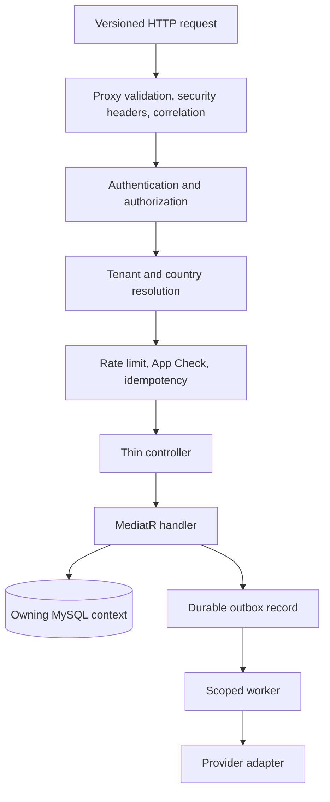

# API Architecture

## Shape

The API is a single ASP.NET Core .NET 9 deployable organized by feature folders.
It deliberately avoids a proliferation of separately deployed services while
maintaining domain boundaries through MediatR handlers, repository/services,
validation, EF Core contexts, and provider interfaces.

## Request pipeline

Implemented middleware establishes invariant response hardening and request
identity before business execution. The pipeline includes trusted proxy handling,
HSTS, security headers, correlation, telemetry, sensitive-data redaction, body
limits, API versioning, routing, sanitized exception handling, authentication,
authorization, tenant resolution, rate limiting, application attestation,
idempotency, and mutation auditing.

Authorization precedes tenant database work for protected endpoints. Tenant
resolution precedes tenant-partitioned rate limiting. Expected domain failures
use stable problem/error contracts; unhandled exceptions are converted to
sanitized error responses without stack traces or payloads.

## Contracts

- The public client contract is URL-versioned under `/api/v1`.
- OpenAPI is generated from endpoint metadata and reviewed as a committed
  artifact in the private product repository.
- JSON enums currently use numeric wire values for client compatibility.
- Money uses signed 64-bit minor units and an explicit ISO currency code.
- API timestamps are UTC; clients render them in the user's locale/timezone.
- Mutations with material financial or lifecycle impact require idempotency keys.
- Conditional updates and entity versions prevent stale realtime writes.

## Feature boundaries

Implemented feature areas include account/authentication, administration,
calculators, cashouts, content, deliveries, driver documents and onboarding,
entitlements, favourites, leaderboards, memberships, notifications, recurring
rides, reference data, rentals, reports, rides, safety, support, tolls, trips,
vehicles, voice, and wallets.

Controllers orchestrate transport concerns. Business decisions belong in
handlers and services. Transactional command behavior coordinates short database
transactions and durable events; external provider calls are excluded from those
transactions.

## Scale and failure behavior

SignalR can scale across API nodes with a Valkey backplane. Stateless request
processing is preferred, while distributed stores hold the limited ephemeral
state that must survive recycling or node changes. Readiness verifies schema and
required dependencies before a node should receive normal traffic.
