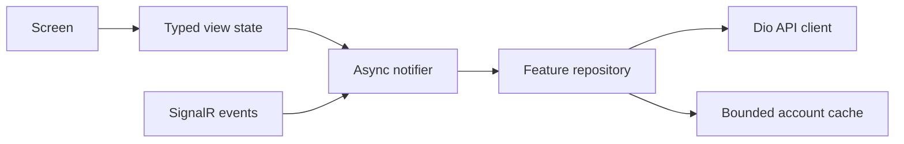

# Mobile Architecture

## Technology and workspaces

The mobile client is Flutter with Riverpod, Dio, Firebase, Google Maps, local
notifications, secure storage, biometric APIs, social login adapters, Play/App
Store billing, and LiveKit/WebRTC. One binary exposes authorized rider, driver,
rental, tools-only, and System Admin workspaces.

Workspace choice is derived from authenticated API claims and profile data. A
stored mode is only a preference: it is reconciled against the current user's
authorized roles before the application shell renders.

## State and data flow

Feature slices use repository interfaces and `AsyncNotifier`/typed view states.
Network DTOs remain transport models; presentation state adds loading, empty,
partial-error, stale-data, and mutation status. Superseded search and route calls
are cancelled where possible and guarded by request generations otherwise.
Realtime entities are merged by server version.

## Resilience and lifecycle

- Startup calls `runApp` with deterministic bootstrap state and bounds optional
  plugin initialization so a plugin cannot strand the splash screen.
- Access/refresh tokens live in platform secure storage; logout revokes the
  server refresh token and wipes account-bound state.
- A typed session-expired event clears credentials, disconnects realtime
  services, wipes caches, and routes to authentication.
- Offline mutations that are safe to queue retain idempotency keys and account
  binding. Sensitive operations are never proven by a local device PIN alone.
- Background/killed notification handlers are top-level and do not depend on a
  widget context.

## UI system

Material 3 themes, semantic status colors, high-contrast palettes, localization,
safe-area primitives, responsive drawers/rails, shared shimmer/empty/error
states, and 48 dp interaction targets are architectural rules. API timestamps
use centralized UTC parsing and locale-aware display. Money is formatted from
minor units using ISO currency context.

## Mobile security boundary

The APK/IPA is treated as attacker-controlled. Administrative authorization,
tenant boundaries, membership limits, bidding eligibility, wallet restrictions,
document decisions, and security changes are revalidated server-side. App Check
is a defense-in-depth signal, never a substitute for authentication and
authorization.
