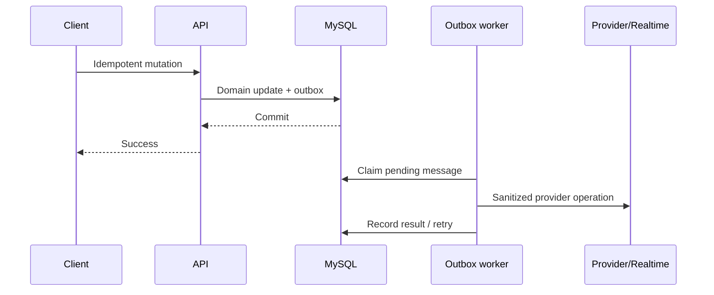

# Realtime and Asynchronous Processing

## SignalR

SignalR delivers ride, bid, trip, chat, call, notification, and administrative
updates. A Valkey/Redis backplane distributes hub messages across API nodes. Hub
authorization is enforced from authenticated identity and domain membership;
short-lived scoped hub tokens reduce exposure.

Realtime delivery is an acceleration path. Durable state remains queryable and
clients retain bounded refresh/reconnect behavior.

## Durable outbox

Business handlers commit domain state and an outbox message atomically in the
same country database. Workers claim messages, dispatch the correct handler, and
record retry/failure state. Provider payloads are not logged.

External POST-like operations are not blindly transport-retried. Provider
adapters require a stable provider idempotency key or reconciliation of an
unknown result before retry.

## High-throughput dispatch

The matching path can publish events to AWS EventBridge and route them to SQS.
The database dispatch/outbox path remains the recovery authority when the broker
is unavailable. Consumers must be idempotent because at-least-once delivery is
expected.

## Ordering

Entity versions and conditional transitions provide correctness. Event arrival
order, timestamps, or a single SignalR connection are never treated as the sole
source of truth.
