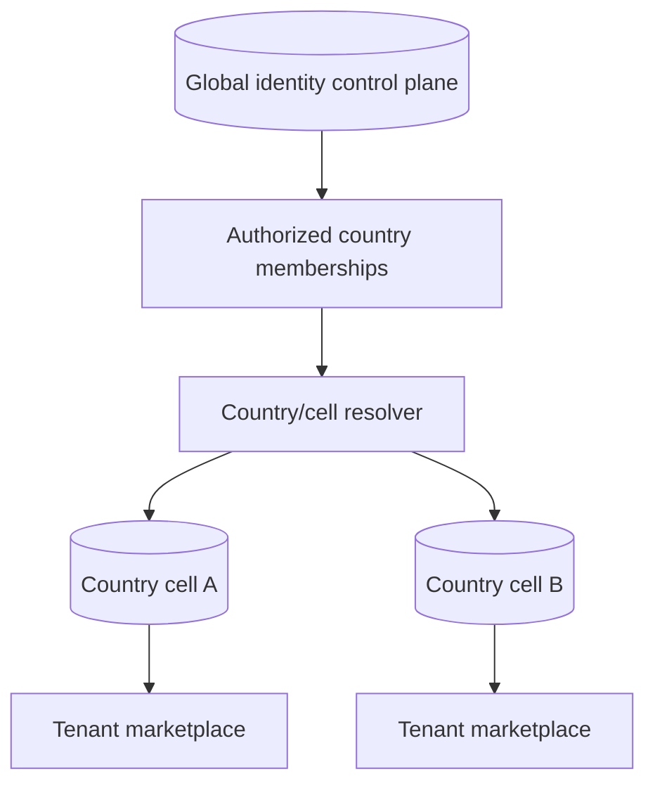

# Tenancy and Country Cells

## Model

KiloDrive combines global identity with country-local operations.

The control plane owns credentials, password/refresh/reset state, 2FA, passkeys,
social identities, global security audit, support/privacy coordination, country
routing, and memberships. Country `Users` records are credential-free
operational projections used by country-local foreign keys.

Country cells own trips, rides, deliveries, rentals, wallets, payments,
settlement, documents that must remain cell-local, notifications, domain audit,
and outbox work. A financial transaction is never split across control and cell
databases.

## Tenant enforcement

The authenticated identity supplies authorized claims; tenant middleware resolves
and validates the effective tenant. EF Core global query filters apply tenant
scope to tenant-owned tables. Cross-tenant System Admin operations require an
explicit authorized workspace and are audit logged.

## Country activation

Country availability is database-driven. A country can be selectable only after:

1. a control-plane country record exists;
2. its shard/cell is provisioned;
3. canonical schema metadata matches the compiled contract;
4. required country rules and reference catalogues are present;
5. the operating, financial, privacy, and provider model is approved; and
6. activation is recorded through the governed workflow.

The current code baseline contains connection aliases for Jamaica, Cayman
Islands, Barbados, Trinidad and Tobago, Bermuda, the United States, and Canada.
This statement describes software support, not a claim that every regulated
service is commercially available in every jurisdiction.

## Failure containment

A country-cell failure should not corrupt global authentication or another
country's financial ledger. Registration uses a durable saga/outbox so partial
control/cell creation can be reconciled idempotently.
