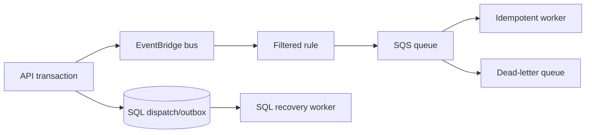

# EventBridge and SQS Dispatch

## Purpose

Ride matching and alert dispatch can create bursty workloads. EventBridge accepts
sanitized dispatch events and routes them to an SQS queue that workers consume at
a controlled rate.

## Delivery semantics

The bus/queue is at least once. Every event carries a stable event/entity ID,
version, country/tenant routing context, event type, and safe correlation
metadata. Consumers claim idempotently and reject stale entity versions.

## Recovery

SQL recovery remains enabled. A broker publication failure does not lose the
committed dispatch intent. Queue age, dead-letter count, consumer heartbeat,
publish failure, and SQL recovery lag are monitored together.

## Security

The API publisher can only put approved events on the designated bus. The bus
rule can only target the designated queue, and the worker can only consume its
queue. Payloads exclude PII and precise route/customer data.
