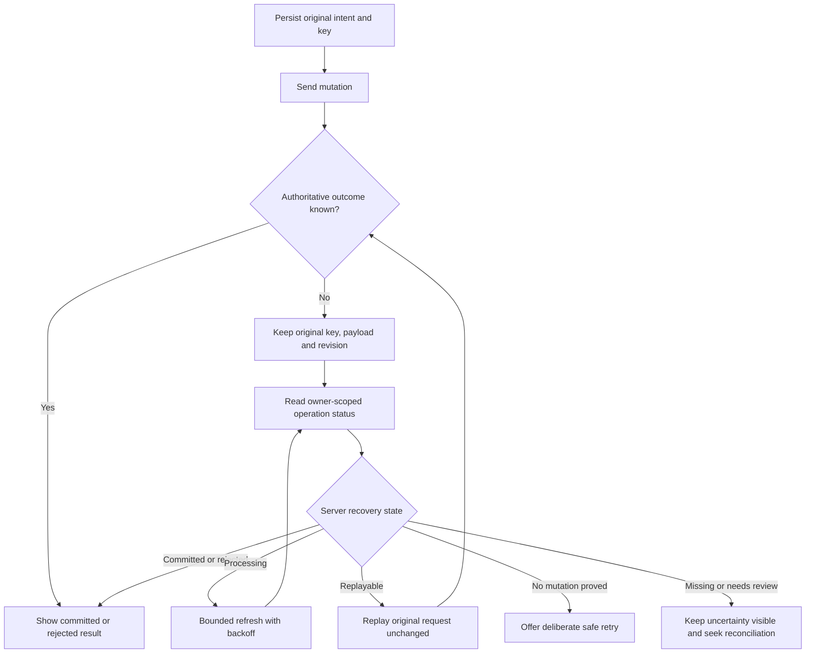

# Errors, idempotency and safe outcome recovery

[API Guide](README.md) · [Payment recovery runbook](../runbooks/payment-operation-recovery.md)

## Read the business outcome

HTTP status answers part of the question. Error responses also carry sanitized
semantic/support context. The reviewed result filter enriches applicable
Problem Details and loose error envelopes with `code`, `supportCode`, `outcome`,
`safeAction`, `supportMeaning`, `retryable`, `correlationId` and help metadata.
`X-KiloDrive-Support-Code` can accompany the response.

Do not require all failures to have one exact JSON shape. Middleware, model
validation, admission and provider paths can differ. A 200 can also contain
warnings or a pending state. Parse the declared model, retain safe diagnostics
and show readable language instead of raw JSON.

| Status | Typical interpretation | Safe client response |
| --- | --- | --- |
| 400 | Invalid input or context | Explain validation; correct the input before a new intent |
| 401 | Authentication failed, expired or absent | Stop protected polling; complete the legitimate authentication path |
| 403 | Permission, ownership, admission or feature restriction | Explain the denial; do not switch roles/countries to evade it |
| 404 | Resource absent or unavailable to this caller | Refresh the parent view; do not enumerate other IDs |
| 409 | Concurrent work, changed state or revision conflict | Inspect the semantic code; wait/reconcile or refresh for a deliberate new edit |
| 415 | Unsupported media | Use the documented content type |
| 422 | Payload/precondition mismatch or semantic rejection | Preserve the original uncertain operation; do not change its payload under the same key |
| 426 | Required app update | Show the trusted update path and stop incompatible work |
| 428 | Required precondition missing | Read the resource and supply the correct revision for a new operation |
| 429 | Throttled | Honor `Retry-After`; avoid parallel retry storms |
| 5xx | Server/provider unavailable or response interrupted | Reads may back off; consequential mutations require outcome reconciliation |

This table describes general client handling. The endpoint reference lists the
statuses recorded by the reviewed artifact; it is not a guarantee that every
runtime business or middleware rejection has exhaustive OpenAPI metadata.

## One key for one logical mutation

Before sending a protected mutation, persist its account/country context,
canonical method/path, original payload, original revision if applicable and
one stable idempotency key. Keep that identity through timeout, disconnect,
process restart and authentication recovery.

The server atomically claims the scoped key. An identical concurrent request
can return `idempotency_in_progress`. A completed duplicate can replay the
original response. A changed payload or incompatible precondition under the
same key is rejected. A UUID generated for every tap defeats this protection.

The key is not an access credential. Another account cannot use it to discover
or replay someone else's operation. Do not put it in a query string, browser
history or a public screenshot.

## Unknown is not failed

If a connection closes after the server commits a transfer, the client may see
no response while the recipient already has the funds. A 5xx after possible
execution has the same ambiguity. The server retains uncertain claims and
durable command evidence. Only explicit proof that no domain/provider mutation
occurred can permit fresh execution.

The flow is a client decision model. It does not specify a provider retry
budget or publish internal recovery permissions.

## Read-only recovery contract

New clients use `GET /api/v1/operations/status` with the original key in
`Idempotency-Key`. It returns an owner-scoped `MoneyCommandRecoveryDto` for the
durable command boundary. The legacy `/api/v1/wallet/command-recovery` route
remains for compatibility. Neither executes the original command.

The source enum currently maps as follows; the JSON field is numeric:

| Value | State | Meaning for the client |
| ---: | --- | --- |
| 0 | Missing | No visible evidence found; this is not proof that an interrupted command did nothing |
| 1 | Processing | Wait and refresh with bounded backoff |
| 2 | Replayable | Replay the original request with its original key, payload and revision |
| 3 | NeedsReview | Preserve uncertainty; authoritative reconciliation is required |
| 4 | Succeeded | Show the committed result and refresh authoritative domain data |
| 5 | Rejected | Show the rejection; do not imply success |
| 6 | NoMutation | Server evidence explicitly proves no domain/provider mutation; follow the safe retry instruction |

Response-body retention and durable evidence retention are different. Missing
replay data, an expired claim or an absent operation reference must not be
treated as permission to send a new financial mutation. The server's
`noMutation` proof is materially different from a client guessing that a request
never arrived.

Some workflows expose their own operation status, such as PayPal top-ups,
store purchases, support changes and uploads. Use the recovery contract for the
actual operation family; do not assume the generic route covers every historical
endpoint. Applicable `X-Operation-Reference` and `X-Recovery-Operation-Reference`
headers provide additional durable references.

## Revisions and interrupted edits

For a new edit, read the current resource and its strong ETag/revision. Send
the required precondition where the contract declares one. If another editor
changed the record, refresh and ask for a deliberate new action.

For an uncertain existing operation, retain the **original** revision. Fetching
a newer revision and combining it with the old key can change the request's
identity and make safe replay impossible. Reconcile first; create a new logical
edit only after the earlier result is known.

## Practical recovery tests

Test a response lost before and after commit, concurrent same-key requests,
changed payload under the same key, stale revisions, logout during a request,
cold restart with a pending action, another user's recovery lookup and provider
pending results. Prove that the UI neither reports false success nor sends a
blind second mutation. Use explicit test barriers instead of scheduler timing.
