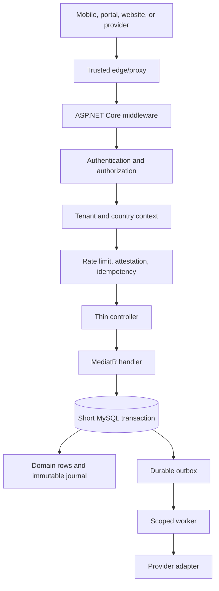

# API Architecture

## Purpose and verified baseline

The KiloDrive API is one ASP.NET Core application targeting .NET 9. It is a
modular monolith: one deployable process contains explicit feature slices. This
keeps local transactions and operations understandable without pretending every
folder is an independently reliable network service.

This chapter describes behavior verified in the source at the documentation
baseline. A provider described as **configurable** still needs approved
credentials and operational enablement. A future alternative is called
**planned**, not presented as working software.

## From request to durable result

The important boundary is between the database transaction and an external
provider. A ride acceptance, wallet transfer, or notification intent is first
committed locally. Email, push, queue publication, or another remote action is
then attempted by a recoverable worker. Holding a database lock while waiting on
a provider would make correctness and capacity worse.

## Middleware invariants

The request pipeline establishes transport and security invariants before a
feature handler executes. Implemented middleware covers trusted proxy addresses,
HSTS and security headers, correlation identifiers, API versioning, sanitized
exceptions, authentication, authorization, tenant/country resolution, bounded
request bodies, rate limiting, optional app attestation, mutation idempotency,
telemetry redaction, and mutation auditing.

A middleware ordering change is a security change:

- authorization rejects an anonymous caller before protected model or database
  work;
- tenant/country context exists before a tenant-partitioned policy uses it;
- correlation and security headers survive validation and exception paths;
- rate-limit responses carry a stable error and `Retry-After`; and
- logs exclude bearer/refresh tokens, provider credentials, document contents,
  message bodies, and request payloads.

Expected business conflicts return stable sanitized contracts. An unexpected
exception becomes a generic 5xx; protected diagnostics retain only safe context
and the correlation ID used to join evidence.

## Public contract rules

The public canonical prefix is `/api/v1`. Controller templates use the internal,
unversioned `api/...` convention; the versioning middleware maps the public v1
prefix before endpoint matching. Controllers never write `api/v1` themselves,
because doing so would publish the invalid double-version path
`/api/v1/v1/...`.

The former unversioned `/api/...` contract is a temporary compatibility alias.
It returns deprecation, successor-link, and sunset metadata and is scheduled to
sunset on 2027-02-10. New first-party clients use `/api/v1`; the double-version
form must return `404`.

One reviewed OpenAPI v1 artifact in the product repository describes the public
contract. A contract change is incomplete until endpoint metadata, canonical
path tests, artifact, and SHA-256 sidecar agree.

Wire conventions include:

- identifiers are opaque UUID values;
- enums retain their established numeric JSON representation unless a versioned
  contract intentionally changes it;
- money is a signed 64-bit integer in ISO-currency minor units, never binary
  floating point;
- timestamps are UTC and clients localize for display;
- required path/query/header parameters are marked required in OpenAPI;
- protected mutations document and enforce idempotency headers; and
- applicable 400, 401, 403, 404, 409, 415, 422, 429, and sanitized 5xx responses
  are documented.

Contract tests prevent anonymous actions inheriting bearer security, all
operations collapsing to one generic response, or a stale generated artifact.

## Feature slices and CQRS

Feature folders cover account/authentication, administration, calculators,
cashouts, content, deliveries, driver documents/onboarding, entitlements,
favourites, leaderboards, memberships, notifications, recurring rides,
reference data, rentals, reports, rides, safety, support, tolls, trips, vehicles,
voice, and wallets.

Controllers own HTTP mechanics. MediatR commands and queries own application
flow. Domain services own reusable policy/calculation. Provider adapters own SDK
details. This makes validation, transactions, outbox, audit, and tests consistent
without deploying a separate service for every concept.

Queries require deterministic ordering before pagination. `Distinct` can erase
an earlier order, and `Skip`/`Take` without `OrderBy` yields unstable pages.
Lists project only the DTO fields needed and retain tenant filters.

## Data ownership and country cells

The control database owns global identity/security: password material, refresh
and recovery state, 2FA, passkeys, social identities, global settings, country
membership, and global security audit. Country cells own operational state such
as trips, vehicles, wallets, payments, notifications, outbox, and country audit.

Country `Users` rows are operational projections, never a second credential
store. A cross-database registration is a durable saga: create an idempotent
intent, project it, reconcile partial failure, and alert rather than assuming two
MySQL commits are atomic.

EF Core query filters enforce tenant isolation. Code deliberately ignoring one
must prove the boundary at the call site. Cross-tenant/country administration
requires an authorized workspace and audit; a modified client cannot grant it.

Schema is managed by reviewed idempotent MySQL 8 scripts. Startup/readiness checks
the configured contract and fingerprints so an incompatible node cannot silently
serve traffic. See [Schema Alignment](../runbooks/schema-alignment.md).

## Transactions, idempotency, and concurrency

Financial and lifecycle mutations use short transactions, row locks, and
conditional state updates. An idempotency record is scoped to caller, operation,
key, and payload hash:

1. the first request claims a short lease;
2. an identical concurrent request receives an in-progress result;
3. a completed retry replays the recorded outcome;
4. the same key with a different payload is rejected; and
5. an exception or 5xx safely releases/expires the claim.

Idempotency prevents duplicate intent; it does not replace a state machine. Ride,
bid, trip, booking, cashout, and membership handlers also compare expected state
or entity version inside the transaction. Realtime versions come from persisted
monotonic state, not wall-clock ticks.

Wallet subledger rows describe customer-visible movement. The immutable
double-entry journal proves debits equal credits. Holds/escrow distinguish
reserved from spendable value. See [Financial Systems](financial-systems.md).

## Durable side effects and providers

The outbox is written in the state transaction. A worker opens a fresh tenant
scope, claims the message, invokes a typed handler, and records retry/failure
metadata. Business handlers do not wait for SMS, email, push, or webhook delivery.

Implemented/configurable adapters include Firebase push, Amazon SES, AWS/Twilio
messaging, Google Maps, OSRM-compatible routing/map matching, Stripe, PayPal,
Google Play and Apple store validation, LiveKit, S3, ClamAV, Valkey,
EventBridge/SQS, Cloudflare-compatible proxy headers, and OpenTelemetry. Source
presence does not mean every provider account is enabled in every country.

Outbound GET/HEAD may use bounded transient retries. Mutations are retried only
with stable provider idempotency and unknown-result reconciliation. Webhooks
authenticate provider signatures, restore scope from durable records, tolerate
duplicates/out-of-order delivery, and do not trust a caller tenant header.

## Realtime, cache, and scale-out

SignalR provides low-latency ride, bid, chat, and operations updates. Valkey can
serve as backplane across API nodes and also supports bounded cache,
high-frequency telemetry, matching deduplication, and single-use passkey state.
MySQL remains durable truth.

If realtime delivery fails after commit, durable lifecycle events, push fallback,
and bounded refresh recover the UI. The API never treats hub delivery as the
commit. Hub tokens are short-lived and trip/role scoped, and query-string tokens
are removed from telemetry.

EventBridge/SQS are configurable for high-throughput dispatch while SQL outbox
recovery remains the safety net. Capacity work measures queue lag, database waits,
cache hit rate, provider time, and SignalR connections separately.

## Readiness and observability

Liveness asks whether the process is alive. Readiness asks whether it is safe to
receive normal traffic. It can include schema validity, worker heartbeat, outbox
lag/failures, Valkey reachability, reconciliation exceptions, and required
providers. Optional-provider degradation must not masquerade as database failure.

OpenTelemetry divides work into meaningful stages: database, route/geocode, map
matching, report query/render, serialization, provider, and outbox. Metrics have
bounded cardinality and never label on user ID, contact, route text, or payload.

## Engineering checklist

Before changing an endpoint, answer:

1. Who is authorized, and how are tenant/country proven?
2. What stable DTO/error does OpenAPI promise?
3. What validation happens before database/provider work?
4. Is the mutation idempotent and conditionally versioned?
5. Which rows are locked, and can the transaction be shorter?
6. What journal, audit, and lifecycle evidence is required?
7. Which effects are placed in the outbox?
8. How are duplicate, late, unknown, and partial provider outcomes reconciled?
9. What happens when Valkey, queue, provider, or client disconnects?
10. Which authorization, race, contract, crash-point, and redaction tests prove
    it?

An endpoint is not ready merely because its happy path returns 200.

Related decisions: [country-cell sharding](../adr/001-country-cell-sharding.md),
[double-entry accounting](../adr/008-double-entry-wallet-accounting.md), and
[MySQL script-driven schema evolution](../adr/009-mysql-scripts-not-ef-migrations.md).
