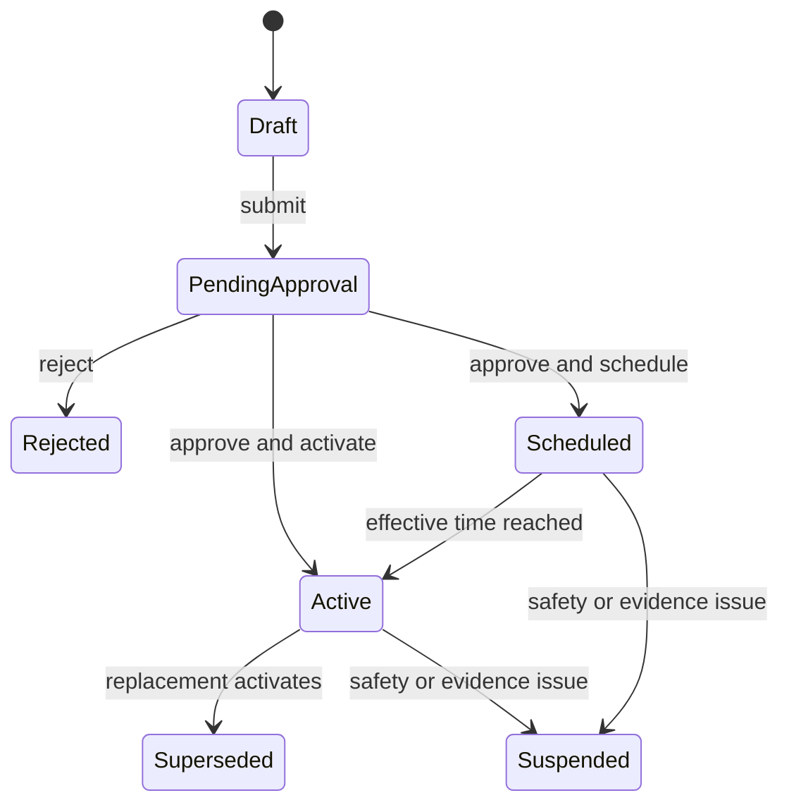

# Authoritative foreign exchange

KiloDrive uses a database-backed, versioned foreign-exchange catalogue. An
external webpage or market feed may support a reviewed proposal, but no
checkout, capture, wallet posting, refund, dispute, receipt or reconciliation
looks up a live web rate or reads an independent application-setting fallback.

## Ownership

| Record | Owner | Purpose |
| --- | --- | --- |
| Currency and minor-unit catalogue | Control database | Defines supported ISO currency semantics |
| FX rate version and evidence | Control database | Immutable reviewed rate, direction, source classification and evidence hash |
| Pair state | Control database | Current, scheduled or suspended authority for a source/destination pair |
| Provider-fee policy | Control database | Versioned fee evidence used in customer quotes |
| Customer FX quote | Country cell | Short-lived offer bound to account, provider, country and purpose |
| Transaction FX snapshot | Country cell | Immutable conversion evidence used for all later lifecycle events |
| Reconciliation exception | Country cell | Read-only mismatch evidence and reviewed next action |

The rate direction is explicit: destination currency units per one source
currency unit. Rates use exact decimal arithmetic; money uses signed 64-bit
minor units. Conversion owns one documented rounding rule. USD-to-USD is an
explicit identity conversion, not a missing-rate special case.

## Maker-checker lifecycle

The maker cannot approve their own version. Every command checks capability,
recent authentication/step-up policy, current revision, idempotency and reason.
Activation atomically supersedes the prior active version. A rollback is a new
version with new approval; it never edits or reactivates history.

## Quote and posting flow

1. Resolve country/wallet currency and provider settlement currency.
2. Require a currently effective, approved and fresh pair version.
3. Require a compatible provider-fee version and payment/product mapping.
4. Calculate source amount, fee, provider total and destination amount.
5. Persist or sign a short-lived quote with version, direction, rounding,
   freshness and safe evidence reference.
6. Revalidate the exact quote before remote provider I/O.
7. Snapshot the accepted evidence on the payment/operation.
8. Use that snapshot for capture, ledger posting, reversal, receipt and
   reconciliation.

The app may display cached reference data while refreshing, but stale cache
cannot authorize money. If current evidence is unavailable, no payment is
started and no pending wallet transaction is invented.

## Administrative and readiness surfaces

System Administration exposes pair state, versions, freshness, evidence,
maker/approver, representative conversions and one allowed transition. It does
not expose secret provider credentials. The production-readiness view keeps
policy activation, rate readiness, provider configuration, provider canary and
current reconciliation health as separate signals.

## Failure and recovery

- A quote expiry requires a new quote before checkout.
- A provider timeout after possible remote success becomes outcome unknown and
  reconciles using the original operation identity.
- A deterministic provider rejection before remote success becomes failed and
  permits a deliberate new attempt.
- A later rate never changes a historical transaction.
- A mismatch opens a restricted exception; reconciliation never edits ledger
  or snapshot history.
- Corrections are reviewed compensating postings linked to the original
  evidence graph.

See [Financial systems](financial-systems.md),
[ADR 014](../adr/014-authoritative-foreign-exchange.md), and the
[FX readiness runbook](../runbooks/foreign-exchange-readiness.md).
