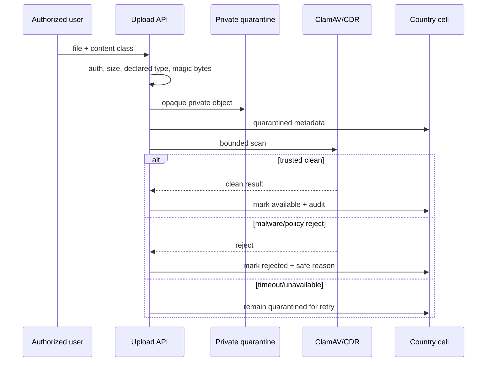

# Documents, media, and voice architecture

Documents, profile images, and call recordings are all “files” at the storage
layer, but their risks are different. This design starts with the business
content class and keeps object bytes, metadata, review state, consent, and
retention as separate concerns.

## Private upload pipeline

New uploads are not immediately viewable. Production scanning fails closed. A
reviewer receiving a `409` quarantine guard should see a friendly “still being
scanned” or “rejected” state, not a raw HTTP-client exception.

## Metadata and content are different records

The country database stores opaque storage key, owner, content class, document
type, upload time, review state, expiry, reviewer, safe notes, scan state, and
revision. S3 stores bytes. A document page can show metadata before the bytes are
available, but its download/view action honors quarantine and authorization.

Driver/vehicle compliance reads approved, unexpired evidence. Rejecting or
expiring required evidence revokes eligibility and publishes an idempotent
compliance update. System administrators can override only through explicit
permission, reason, audit, and the same state machine—not arbitrary row edits.

## Displayable images

Original avatars and vehicle photos stay private. The server produces a bounded,
re-encoded thumbnail that removes metadata and active content. The Flutter image
provider requests an authenticated thumbnail sized from logical pixels and
device pixel ratio, deduplicates in-flight requests, and uses a strict LRU byte
budget.

Revision participates in the cache key. Replacing an avatar changes revision;
logout wipes account-bound entries. Initials and an error state remain available
when image delivery fails.

## Document delivery policy

| Content | Browser behavior | Cache posture | Audit |
| --- | --- | --- | --- |
| Identity evidence | attachment or controlled authenticated viewer | no public cache | every view/download/review |
| Vehicle compliance | authenticated viewer/download | private, short where allowed | view and status mutation |
| Ticket attachment | ticket-party/admin authorization | private | view/download/reply context |
| Avatar thumbnail | authenticated bounded image | revision-aware private cache | metadata access as policy requires |
| Report | short-lived stream/download | no public cache | generation/download |
| Recording | explicit authorized playback/download | private, no public cache | access, hold, delete |

A presigned URL is a temporary bearer credential. Keep it very short lived and
out of logs, analytics, email, referrers, and screenshots.

### Restricted System Administrator viewer

Identity and compliance evidence does not use the operating system's generic
share/open flow. An authorized System Administrator obtains a short-lived
protected viewer session after the required recent authentication and 2FA
step-up. Every byte request rechecks the active administrator session/token
version, document-view capability, selected country workspace, tenant,
document ownership, and clean scan state.

The UI shows reviewed metadata—document type, human-readable status, upload
date, review notes, and audited actions—without exposing an object key, storage
path, internal user identifier, or raw signed URL. Restricted content cannot be
shared through the ordinary OS sheet. Temporary bytes are cleared on close,
logout, session revocation, and process restoration. Platform screenshot
protection is a useful best-effort control, not digital-rights management and
not a reason to weaken authorization or audit.

Expected `401`, `403`, `404`, expired-session, and `409` quarantine outcomes
render stable guidance. Cross-tenant/country and revoked-session tests prove
denial; access-audit tests prove that a successful view leaves accountable
evidence without copying the document contents.

## In-app voice boundary

LiveKit rooms belong to a specific trip and call session. The API authorizes both
participants, verifies trip contact state and driver membership, checks block
rules, and issues a short token. Call invitations and end events are durable
notification intents. The mobile app handles foreground, background, killed
launch, cancellation, decline, timeout, reconnect, and orphan cleanup.

The visible product state should distinguish:

- ringing;
- connecting;
- connected;
- recording awaiting consent;
- recording active;
- ended/declined/no answer/failed; and
- GSM fallback when in-app calling is unavailable or not entitled.

Closing/cancelling the trip closes chat/call channels. Old trip detail pages may
show safe call metadata and authorized recordings but cannot start a new call.

## Consent-aware recording

Recording is configurable and country restricted. If policy requires both
participants' consent, egress does not start until both durable consent
timestamps exist. The recording indicator remains visible while active.

An outbox handler reconciles LiveKit egress before starting or retrying. It stores
safe state and provider ID, never the API secret or media. Encrypted output uses
a private S3 prefix and least-privilege write role. Retention metadata records
jurisdiction, deletion deadline, and legal hold.

Safe call audit events include call/trip identifiers, actor surrogate, role,
timestamps, consent, status, end reason, and bounded duration. They exclude audio,
tokens, room secrets, contact details, and signed object URLs.

## Failure and recovery principles

- Scanner outage leaves uploads quarantined.
- S3 delivery failure does not change an approved document to rejected.
- A missing object is reconciled as an integrity incident, not hidden by a blank
  viewer.
- A LiveKit token failure offers only a policy-approved GSM fallback.
- Egress timeout is an unknown result; reconcile before starting another.
- Partial recording is not labeled complete.
- Repeated deletion is idempotent, while legal hold fails closed.
- User-facing provider errors use localized stable states, not raw JSON/409/503.

## Tests that matter

For uploads: wrong extension, mismatched magic, oversized file, EICAR/test
malware, scanner timeout, retry, cross-user access, cross-tenant access, clean
release, thumbnail metadata removal, and deletion/hold.

For voice: two participants, unauthorized third party, free/paid entitlement,
foreground/background/killed app, permission denial, Wi-Fi/cellular handoff,
TURN relay, decline/timeout/cancel, trip closure, two-party consent, egress
unknown result, object encryption, playback authorization, retention, and legal
hold.

See [Private storage](../aws/storage.md), [LiveKit on AWS](../aws/livekit.md),
[Upload quarantine](../runbooks/upload-quarantine.md), and
[LiveKit voice](../runbooks/livekit-voice.md).
