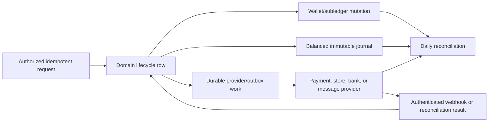

# Wallet, Membership, Billing, and Accounting

This chapter explains how KiloDrive treats money. It is written for engineers
who may be comfortable building CRUD features but have not yet worked on a
ledger-backed system. The essential rule is simple: a displayed wallet balance
is useful, but it is not sufficient accounting evidence. Every material money
movement also needs durable business records, immutable subledger entries, a
balanced accounting journal, and a way to reconcile KiloDrive with the external
provider that actually moved the funds.

## Status legend

This chapter uses the doctrine's two axes. **Implemented**, **Incremental**, and
**Planned** describe source maturity. **Configurable**, **Uncertified**,
**Certified**, **Active**, and **Unavailable** describe a named deployment.
Provider configuration, a country operating policy, and real reconciliation
evidence are therefore separate facts; none can substitute for another.

## Money representation

Durable amounts use signed 64-bit integer **minor units** plus an ISO 4217
currency code. For example, `1250` means 12.50 in a two-decimal currency, but
means 1,250 in a zero-decimal currency. The currency exponent is never inferred
from a dollar sign. Binary floating point is not used for charges, balances,
limits, journals, refunds, or settlement.

The transport contract therefore carries values such as `AmountMinor` and
`Currency`. UI clients convert only at the presentation boundary. User-entered
major-unit text is parsed once with exact decimal-string arithmetic and the ISO
minor-unit scale. An input with too many fractional digits is rejected rather
than rounded invisibly. Foreign exchange stores the source and target currency,
the reviewed rate snapshot, and both amounts; conversion must account for both
currencies' exponents.

## The four layers of financial evidence

It helps to think of a wallet operation as four related but different records:

1. **Domain record.** The transfer, top-up, ride, cashout, membership purchase,
   voucher, refund, or dispute and its lifecycle state.
2. **Wallet subledger.** User-facing credit/debit entries with a stable reference
   and balance-after value. These explain why a wallet changed.
3. **Double-entry journal.** An immutable accounting entry containing at least
   two lines whose debit total equals its credit total. These explain where
   value came from and where it went in accounting terms.
4. **Provider evidence.** A payment, webhook, payout, store transaction, or
   settlement identifier that can be compared with a statement outside
   KiloDrive.

The layers answer different questions. A support agent may use the subledger to
explain a balance. Finance uses journals to prepare reports. Reconciliation uses
provider evidence to prove that KiloDrive's books agree with the outside world.
Deleting one layer because another exists destroys that chain of evidence.

## Accounts and posting rules

The implemented posting rules distinguish wallet liability, held funds,
provider receivable or clearing, payout payable/clearing, membership revenue,
marketplace revenue, promotion expense, refund/reversal, and settlement
concepts. Account names in this public guide are conceptual; production codes
are governed by the accounting owner.

Every posting rule validates that:

- the line collection contains meaningful positive amounts;
- a line is not simultaneously a debit and a credit;
- the sum of debits equals the sum of credits; and
- the journal reference is stable and unique for the business event.

Posted journals are append-only. A correction uses a reversing or adjusting
journal with its own reviewed reason and reference. Operators do not edit a
posted amount to make a report look balanced.

## Wallet balances and concurrency

A wallet separates available balance from held balance. Available funds may be
spent; held funds are reserved for an accepted obligation such as delivery
escrow or a pending cashout. A hold is not a second charge. It is a controlled
movement from spendable value into a reserved state.

Financial commands use a short transaction and acquire the relevant wallet rows
in deterministic order. For a transfer, both sender and receiver are validated
and locked before either balance changes. Deterministic ordering prevents two
opposite transfers from deadlocking each other unnecessarily. Optimistic version
checks or conditional updates protect commands that cannot use the same locking
strategy.

The command validates account status, country feature gates, currency,
available balance, KYC/AML restrictions, block relationships, velocity/plan
limits, destination eligibility, and the exact requested state again inside the
transaction. A mobile check is helpful UX, but it is never the authority.

## Idempotency and unknown outcomes

Network clients retry. Users double-tap. Proxies time out after a server has
committed. Without idempotency, each of those normal events can move money
twice.

Protected mutations carry an idempotency key. The server scopes a claim to the
tenant, user, operation, and request hash. A completed replay receives the saved
result; a different payload using the same key is rejected; a request already
being processed receives a stable conflict response. The domain also uses unique
references so a middleware error cannot create a second journal.

Provider POST retries need an additional rule. A timeout after capture is an
**unknown outcome**, not a failed payment. The adapter first queries or waits for
the provider's idempotent result before attempting another mutation.

### Durable payment status after app or network loss

Checkout navigation is not the payment record. The API persists a payment-
status resource keyed by payment ID and idempotency key before handing control
to a provider. The client can immediately navigate to a durable state:
`Pending`, `Completed`, `Failed`, or `Needs attention`.

A repository/background reconciliation path survives app termination, delayed
or duplicate/out-of-order webhooks, and a provider timeout after capture. On
completion it refreshes wallet/entitlement state and offers the authorized
receipt; unresolved outcomes link to support without encouraging a second
payment attempt. This same state must be visible to authorized operations staff
with safe correlation evidence.

## Typical lifecycle examples

### Wallet transfer

The sender and recipient must be active, allowed to send/receive, and use a
compatible currency. The transaction decreases one wallet, increases the other,
adds paired subledger entries, records a human trace number, posts a balanced
journal, and stages notifications/receipt work in the outbox. Email, SMS, push,
or PDF generation never holds the HTTP request or database transaction open.

### Top-up and voucher

A card/provider top-up begins as a pending payment. Only verified provider
evidence finalizes the wallet credit. Voucher codes are stored as protected
digests rather than plaintext lookup values and enforce attempt/velocity limits.
Issuance, purchase, redemption, refund, expiry, and revocation use different
references and posting rules.

An administrative batch is itself a money-like operation even though no wallet
has been credited yet. One idempotency key and request hash bind the tenant,
administrator, route, quantity, face value, credit currency, and deterministic
`KDOP-…` operation reference. A completed retry replays the original identifiers
and one-time codes; an in-flight duplicate returns a conflict and a changed
payload is rejected. The protected replay record is retained for the supported
voucher lifetime and encrypted with the persistent Data Protection key ring.

Code lookup uses a keyed HMAC-SHA256 digest plus a small display suffix. The
plaintext code exists only at the authorized issuance/retrieval boundary. Batch
reconciliation compares requested count and value, issued identifiers, active /
redeemed / expired / revoked states, wallet credits, promotion expense, and
journals. A balanced ledger does not excuse an accidentally duplicated batch.

### Durable wallet top-up status

Wallet top-up does not treat an HTTP response as the financial truth. The
implemented status resource is keyed by payment ID and idempotency key and
exposes `Pending`, `Completed`, `Failed`, or `Needs attention`. Mobile retains
only an account-bound protected pending reference, restores it after process
death, reconciles in repository/background work, refreshes the wallet after
completion, and exposes receipt or support actions. Last-good status remains
visible during a recoverable refresh failure.

This contract is currently scoped to wallet top-ups. Membership, ride, rental,
cashout, or other payment entities must not be advertised as having the same
durable customer status until their own handlers, clients, and crash-point tests
prove it.

### Ride and delivery escrow

For wallet-paid work, acceptance can reserve the customer amount. Completion
releases the hold and credits the driver's net entitlement; eligible
cancellation releases it back to the customer. Cash transactions still create
a payment record and any platform receivable required by the active operating
model. Route or trip state must not advance independently of its financial
transition.

### Cashout

A request requires a verified payout method and snapshots an encrypted provider
token or payout instruction. Masked last-four display text is not sufficient to
execute or fraud-match a payout. Requesting a cashout holds the amount. Approval
moves it into payable state, provider settlement clears it, rejection or a safe
reversal releases the hold. A payout method cannot be removed while an active
cashout depends on it.

“Verified” must mean provider ownership verification for automation. The current
local user-confirmation path is not that proof and cannot by itself make a
destination eligible for automated payout.

Cashout approval is not proof of provider settlement. The source includes a
protected-destination provider adapter, durable outbox initiation and
reconciliation, signed-webhook transition path, payout-transfer evidence, and
return/reversal accounting. Those foundations remain dormant and
provider-specific: no supported administrative command currently records the
required provider or instant certification timestamps, the generic adapter is
not a named certified provider, and multi-country callback scope still needs
explicit proof. Unless the active country policy records provider
certification and a separate measured instant-payout certification, the product
uses a reviewed processing range and a durable status such as Pending review,
Approved for processing, Completed, Reversed, or Needs attention. Adapter
presence alone must never unlock **Instant payout** wording.

### Multi-payer trip settlement

Fare splitting is a source-implemented, fail-closed wallet candidate for immediate
rides. The rider configures one to five saved recipients before accepting a
driver. Each invited payer accepts or declines an expiring fixed-minor-unit or
basis-point share; the rider is recorded as the fallback payer. At acceptance, eligible
shares are allocated exactly, wallets are locked in deterministic order, and
the system holds each share. Completion settles those holds and records one
payment per payer; cancellation releases them.

An ordinary wallet transfer after settlement is still a different product and
cannot rewrite fare responsibility. Scheduled/guaranteed fare splitting is
explicitly unavailable. This is not production-ready: canonical `schema.sql`
omits the fare-split objects, conditional versions are optional on relevant
routes, client retries do not preserve one idempotency key, accepted-payer
insufficient funds fail acceptance rather than applying a reviewed fallback,
and a changed winning fare can alter percentage obligations without renewed
payer consent. Owner status, expiry/audit/reconciliation queues, Portal parity,
and notification coverage are incomplete. The source contains proportional reversal allocation,
but documentation must not claim refund or chargeback certification until that
allocator is integrated with the payment reversal lifecycle and provider,
journal, concurrency, insufficient-funds, notification, privacy, and daily
reconciliation matrices pass.

### Membership

Riders do not require rider subscription plans. Driver and rental organization
memberships operate in the membership/no-commission model. A subscription
preserves plan foreign key, audience, purchased term, actual billed price source,
service period, renewal/grace state, provider transaction, entitlement, payment,
and journal reference.

### Public tier language and reviewed published/store catalogue baseline

The tier name communicates a bounded entitlement, not social status, driver
quality, guaranteed demand, priority over safety rules, or promised earnings.
Use the audience-qualified names **Rider Free**, **Free Driver**, **Silver
Driver**, **Gold Driver**, **Rental Free**, **Rental Silver**, and **Rental
Gold**. Never shorten a label in a context where driver and rental plans can be
confused.

Riders use KiloDrive without a rider subscription. Driver and rental providers
choose Free, Silver, or Gold. Paid terms are one week, one month, or one quarter;
"quarterly" means the reviewed three-month term, not an instalment loan. The
published/store presentation catalogue reviewed on 2026-08-30 is:

| Audience and tier | Week | Month | Quarter | Published allocation or headline limit |
| --- | ---: | ---: | ---: | --- |
| Rider Free | USD 0 | USD 0 | USD 0 | No rider subscription plan |
| Free Driver | USD 0 | USD 0 | USD 0 | Up to 8 accepted trips/week and 1 registered vehicle |
| Silver Driver | USD 7.50 | USD 27 | USD 78 | Up to 40 accepted trips/week and 3 registered vehicles |
| Gold Driver | USD 25 | USD 90 | USD 260 | Up to 120 accepted trips/week and 5 registered vehicles; Preferred Driver eligibility still requires every safety/reputation rule |
| Rental Free | USD 0 | USD 0 | USD 0 | Published allocation: 1 active listing and owner-managed core tools |
| Rental Silver | USD 7.50 | USD 27 | USD 78 | Published allocation: up to 5 active fleet vehicles plus the approved team/reporting tools |
| Rental Gold | USD 25 | USD 90 | USD 260 | Published allocation: up to 25 active fleet vehicles plus expanded team/analytics tools |

These figures document the reviewed published/store presentation; they are not
proof that a live database, store console, or every server handler is aligned.
The canonical membership bootstrap/alignment scripts now use the reviewed
50%-reduced values above for driver and rental audiences. Runtime certification
still compares the named release's country plan rows with the native store
product, base plan, offer, term, currency, minor-unit amount, and localized
display price. A missing/stale mapping keeps the plan visible but disables that
purchase action.

Similarly, the rental vehicle counts above are published product allocations.
They must not be described as uniformly enforced limits until all rental
mutation handlers and contract tests prove the same rule. Apple and Google
storefront prices are the checkout authority in store builds; approved
non-store displays use the country currency and an explicit FX snapshot. The
active, verified plan record remains the runtime source for benefits that are
actually enforced. A manual or marketing page must be updated when the
catalogue changes and must not invent a benefit merely because the tier sounds
premium.

The no-commission statement is also precise: drivers retain 100% of the agreed
ordinary trip fare before their own taxes, fuel, maintenance, insurance, tolls,
refunds, chargebacks, or other disclosed adjustments. Membership does not
guarantee requests, acceptance, availability, income, safety, or payout timing.

Apple and Google purchases are validated server-side. Google acknowledgement is
durable outbox work, so `acknowledgement_pending` can be represented without
pretending the entitlement did not commit. Product, base plan, offer, account
type, currency, term, and environment must all match the internal mapping.
Upgrade/downgrade proration uses the customer's actual paid service period, not
only a catalogue default.

## Webhooks, provider adapters, and outbox

Provider callbacks are anonymous only at the HTTP authentication layer. They are
authenticated by the provider signature, timestamp, certificate, or signed
transaction rules. The handler locates the original payment, restores tenant
scope, claims the provider event idempotently, and applies only a legal state
transition.

Side effects are staged in the same transaction as the domain mutation through
an outbox. Workers process them after commit. This avoids two dangerous cases:
calling a provider and then rolling back locally, or committing locally and
returning failure because an email/provider call failed. Outbox handlers must be
idempotent because delivery is at least once.

Refund and dispute processing is entity-aware. A partial refund carries the
refunded amount; it does not automatically revoke an entire entitlement. A full
membership chargeback can change payment, entitlement, journal, notification,
and audit state as one governed transition.

## Reconciliation

Reconciliation does not merely compare a cached balance with the sum of wallet
transactions. The implemented daily process checks:

- every journal balances and has a unique reference;
- wallet available and held balances agree with active domain holds;
- cashout payable, clearing, completed, rejected, and reversed states agree;
- provider/store clearing totals agree with completed payments and reversals;
- membership payments use canonical payment-linked journal references;
- refunds and chargebacks do not exceed the original amount; and
- settlement exceptions are grouped by tenant, day, and currency.

Critical unexplained exceptions fail cashout closed. They do not disable the
entire API. Resolution posts governed corrections rather than deleting evidence.
See the [wallet reconciliation runbook](../runbooks/wallet-reconciliation.md).

## Controls and ownership

- Each country feature is gated by an approved money-movement model, not merely
  by a UI flag.
- KYC/AML controls can restrict sending, receiving, top-up, or cashout.
- Provider credentials and payout material use protected secret/key services.
- Audit and telemetry include safe references, state, latency, and correlation
  identifiers, never full instruments or provider secrets.
- Finance owns the chart/posting policy; engineering owns invariants and
  reproducibility; operations owns alert response; compliance owns country
  availability.

## Engineering change checklist

Before adding a new financial event, answer all of these:

1. What is the domain state machine and who may invoke each transition?
2. What wallets or holds change, and in what lock order?
3. What is the stable idempotency and journal reference?
4. Which accounts are debited and credited for every success and reversal path?
5. What provider outcome can be unknown, duplicated, late, or out of order?
6. How are partial refund, full refund, chargeback, cancellation, and retry handled?
7. Which outbox messages are committed atomically?
8. What does reconciliation expect after each state?
9. Which country, currency, plan, KYC, and limit gates apply?
10. Which property, crash-point, concurrency, and provider-fake tests prove it?

If any answer is missing, the feature is not financially complete even if the
happy-path screen appears to work.

The governing rationale is recorded in
[ADR 008: double-entry wallet accounting](../adr/008-double-entry-wallet-accounting.md).
