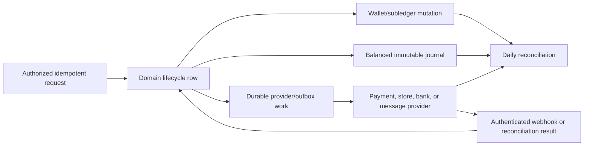

# Wallet, Membership, Billing, and Accounting

This chapter explains how KiloDrive treats money. It is written for engineers
who may be comfortable building CRUD features but have not yet worked on a
ledger-backed system. The essential rule is simple: a displayed wallet balance
is useful, but it is not sufficient accounting evidence. Every material money
movement also needs durable business records, immutable subledger entries, a
balanced accounting journal, and a way to reconcile KiloDrive with the external
provider that actually moved the funds.

## Status legend

The descriptions below deliberately distinguish three states:

- **Implemented** means the behavior is represented in the current source and
  schema.
- **Configurable** means an adapter or control exists, but it works only when an
  operator supplies approved provider configuration and enables it.
- **Policy or planned extension** means the architecture reserves a boundary;
  it must not be described as a live customer capability until release evidence
  proves it.

## Money representation

Durable amounts use signed 64-bit integer **minor units** plus an ISO 4217
currency code. For example, `1250` means 12.50 in a two-decimal currency, but
means 1,250 in a zero-decimal currency. The currency exponent is never inferred
from a dollar sign. Binary floating point is not used for charges, balances,
limits, journals, refunds, or settlement.

The transport contract therefore carries values such as `AmountMinor` and
`Currency`. UI clients convert only at the presentation boundary. User-entered
major-unit text is parsed once with exact decimal-string arithmetic and the ISO
minor-unit scale. An input with too many fractional digits is rejected rather
than rounded invisibly. Foreign exchange stores the source and target currency,
the reviewed rate snapshot, and both amounts; conversion must account for both
currencies' exponents.

## The four layers of financial evidence

It helps to think of a wallet operation as four related but different records:

1. **Domain record.** The transfer, top-up, ride, cashout, membership purchase,
   voucher, refund, or dispute and its lifecycle state.
2. **Wallet subledger.** User-facing credit/debit entries with a stable reference
   and balance-after value. These explain why a wallet changed.
3. **Double-entry journal.** An immutable accounting entry containing at least
   two lines whose debit total equals its credit total. These explain where
   value came from and where it went in accounting terms.
4. **Provider evidence.** A payment, webhook, payout, store transaction, or
   settlement identifier that can be compared with a statement outside
   KiloDrive.

The layers answer different questions. A support agent may use the subledger to
explain a balance. Finance uses journals to prepare reports. Reconciliation uses
provider evidence to prove that KiloDrive's books agree with the outside world.
Deleting one layer because another exists destroys that chain of evidence.

## Accounts and posting rules

The implemented posting rules distinguish wallet liability, held funds,
provider receivable or clearing, payout payable/clearing, membership revenue,
marketplace revenue, promotion expense, refund/reversal, and settlement
concepts. Account names in this public guide are conceptual; production codes
are governed by the accounting owner.

Every posting rule validates that:

- the line collection contains meaningful positive amounts;
- a line is not simultaneously a debit and a credit;
- the sum of debits equals the sum of credits; and
- the journal reference is stable and unique for the business event.

Posted journals are append-only. A correction uses a reversing or adjusting
journal with its own reviewed reason and reference. Operators do not edit a
posted amount to make a report look balanced.

## Wallet balances and concurrency

A wallet separates available balance from held balance. Available funds may be
spent; held funds are reserved for an accepted obligation such as delivery
escrow or a pending cashout. A hold is not a second charge. It is a controlled
movement from spendable value into a reserved state.

Financial commands use a short transaction and acquire the relevant wallet rows
in deterministic order. For a transfer, both sender and receiver are validated
and locked before either balance changes. Deterministic ordering prevents two
opposite transfers from deadlocking each other unnecessarily. Optimistic version
checks or conditional updates protect commands that cannot use the same locking
strategy.

The command validates account status, country feature gates, currency,
available balance, KYC/AML restrictions, block relationships, velocity/plan
limits, destination eligibility, and the exact requested state again inside the
transaction. A mobile check is helpful UX, but it is never the authority.

## Idempotency and unknown outcomes

Network clients retry. Users double-tap. Proxies time out after a server has
committed. Without idempotency, each of those normal events can move money
twice.

Protected mutations carry an idempotency key. The server scopes a claim to the
tenant, user, operation, and request hash. A completed replay receives the saved
result; a different payload using the same key is rejected; a request already
being processed receives a stable conflict response. The domain also uses unique
references so a middleware error cannot create a second journal.

Provider POST retries need an additional rule. A timeout after capture is an
**unknown outcome**, not a failed payment. The adapter first queries or waits for
the provider's idempotent result before attempting another mutation.

## Typical lifecycle examples

### Wallet transfer

The sender and recipient must be active, allowed to send/receive, and use a
compatible currency. The transaction decreases one wallet, increases the other,
adds paired subledger entries, records a human trace number, posts a balanced
journal, and stages notifications/receipt work in the outbox. Email, SMS, push,
or PDF generation never holds the HTTP request or database transaction open.

### Top-up and voucher

A card/provider top-up begins as a pending payment. Only verified provider
evidence finalizes the wallet credit. Voucher codes are stored as protected
digests rather than plaintext lookup values and enforce attempt/velocity limits.
Issuance, purchase, redemption, refund, expiry, and revocation use different
references and posting rules.

### Ride and delivery escrow

For wallet-paid work, acceptance can reserve the customer amount. Completion
releases the hold and credits the driver's net entitlement; eligible
cancellation releases it back to the customer. Cash transactions still create
a payment record and any platform receivable required by the active operating
model. Route or trip state must not advance independently of its financial
transition.

### Cashout

A request requires a verified payout method and snapshots an encrypted provider
token or payout instruction. Masked last-four display text is not sufficient to
execute or fraud-match a payout. Requesting a cashout holds the amount. Approval
moves it into payable state, provider settlement clears it, rejection or a safe
reversal releases the hold. A payout method cannot be removed while an active
cashout depends on it.

### Membership

Riders do not require rider subscription plans. Driver and rental organization
memberships operate in the membership/no-commission model. A subscription
preserves plan foreign key, audience, purchased term, actual billed price source,
service period, renewal/grace state, provider transaction, entitlement, payment,
and journal reference.

Apple and Google purchases are validated server-side. Google acknowledgement is
durable outbox work, so `acknowledgement_pending` can be represented without
pretending the entitlement did not commit. Product, base plan, offer, account
type, currency, term, and environment must all match the internal mapping.
Upgrade/downgrade proration uses the customer's actual paid service period, not
only a catalogue default.

## Webhooks, provider adapters, and outbox

Provider callbacks are anonymous only at the HTTP authentication layer. They are
authenticated by the provider signature, timestamp, certificate, or signed
transaction rules. The handler locates the original payment, restores tenant
scope, claims the provider event idempotently, and applies only a legal state
transition.

Side effects are staged in the same transaction as the domain mutation through
an outbox. Workers process them after commit. This avoids two dangerous cases:
calling a provider and then rolling back locally, or committing locally and
returning failure because an email/provider call failed. Outbox handlers must be
idempotent because delivery is at least once.

Refund and dispute processing is entity-aware. A partial refund carries the
refunded amount; it does not automatically revoke an entire entitlement. A full
membership chargeback can change payment, entitlement, journal, notification,
and audit state as one governed transition.

## Reconciliation

Reconciliation does not merely compare a cached balance with the sum of wallet
transactions. The implemented daily process checks:

- every journal balances and has a unique reference;
- wallet available and held balances agree with active domain holds;
- cashout payable, clearing, completed, rejected, and reversed states agree;
- provider/store clearing totals agree with completed payments and reversals;
- membership payments use canonical payment-linked journal references;
- refunds and chargebacks do not exceed the original amount; and
- settlement exceptions are grouped by tenant, day, and currency.

Critical unexplained exceptions fail cashout closed. They do not disable the
entire API. Resolution posts governed corrections rather than deleting evidence.
See the [wallet reconciliation runbook](../runbooks/wallet-reconciliation.md).

## Controls and ownership

- Each country feature is gated by an approved money-movement model, not merely
  by a UI flag.
- KYC/AML controls can restrict sending, receiving, top-up, or cashout.
- Provider credentials and payout material use protected secret/key services.
- Audit and telemetry include safe references, state, latency, and correlation
  identifiers, never full instruments or provider secrets.
- Finance owns the chart/posting policy; engineering owns invariants and
  reproducibility; operations owns alert response; compliance owns country
  availability.

## Engineering change checklist

Before adding a new financial event, answer all of these:

1. What is the domain state machine and who may invoke each transition?
2. What wallets or holds change, and in what lock order?
3. What is the stable idempotency and journal reference?
4. Which accounts are debited and credited for every success and reversal path?
5. What provider outcome can be unknown, duplicated, late, or out of order?
6. How are partial refund, full refund, chargeback, cancellation, and retry handled?
7. Which outbox messages are committed atomically?
8. What does reconciliation expect after each state?
9. Which country, currency, plan, KYC, and limit gates apply?
10. Which property, crash-point, concurrency, and provider-fake tests prove it?

If any answer is missing, the feature is not financially complete even if the
happy-path screen appears to work.

The governing rationale is recorded in
[ADR 008: double-entry wallet accounting](../adr/008-double-entry-wallet-accounting.md).
