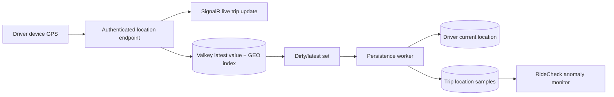

# Geospatial Processing, Routing, and Telemetry

## Why location work is harder than it looks

A latitude and longitude look like two numbers. In a transportation platform,
they represent several very different claims:

- “The phone reported this position.”
- “The driver is probably near this pickup.”
- “The vehicle travelled on this road.”
- “The route crossed this toll plaza.”
- “The trip left its planned corridor.”

Those claims require different evidence. A raw GPS point is useful for a moving
map, but it is not enough to levy a toll or settle a disputed route. KiloDrive
uses a layered model: fast ephemeral telemetry for live decisions, durable
country-local samples for evidence, road-network services for routing and map
matching, and reviewed reference data for pricing.

## Coordinate conventions

KiloDrive APIs and domain objects normally name coordinates as
`(latitude, longitude)`. Many geospatial formats reverse that order:

- Well-Known Text represents a point as `POINT(longitude latitude)`.
- OSRM path coordinates are `longitude,latitude`.
- GeoJSON coordinates are `[longitude, latitude]`.

That reversal is a frequent and expensive bug. Jamaica's values may still look
plausible when swapped, but they point to another part of the world.

Database spatial points use SRID 4326 and explicit longitude/latitude axis
ordering. SQL constructors specify that order rather than relying on a server
default. Keep scalar latitude and longitude columns when they are useful for
debugging or compatibility, but treat the SRID-tagged point as the spatial query
value.

### Validation at entry

Every location boundary should reject:

- latitude outside `-90..90`;
- longitude outside `-180..180`;
- `NaN`, infinity, and missing values;
- impossible accuracy/speed/heading metadata; and
- samples whose timestamp is unreasonably old or ahead of trusted server time.

The server timestamps receipt separately from the device's sample time. Never
let a client-supplied timestamp decide retention, eligibility, or ordering by
itself.

## Location lifecycle



The high-frequency path keeps the most recent sample per driver. The persistence
worker batches that latest value into MySQL at a bounded interval. If the driver
has an assigned, arrived, or in-progress trip, the worker also creates a
deduplicated `TripLocationSample` containing coordinates and available accuracy,
speed, and heading. RideCheck evaluates the active trip sample before the cell
transaction commits.

This is not a complete raw GPS archive. Batching deliberately trades some
granularity for bounded database write volume. The required sampling rate must
be chosen from safety, replay, privacy, cost, and device-battery needs.

## Valkey for current location

In production, KiloDrive uses TLS-protected Valkey/Redis-compatible storage for:

- a short-lived serialized latest sample per driver;
- a tenant-scoped GEO index used to find nearby driver candidates; and
- a dirty-member set that tells the persistence worker which latest values have
  changed.

The individual location entry has a TTL. Matching also checks the durable
driver profile's last-location time, online state, and assignment state. This
defence matters because a GEO member can outlive the mobile process that wrote
it, and a boolean online flag can remain set after a crash.

KiloDrive has an in-process latest-value buffer when Valkey is not configured.
That fallback exists for local development and focused tests. It is not safe for
production scale-out: another API node cannot see the value, a restart loses it,
and SignalR/matching decisions can diverge.

### Why GEO is only the first pass

A radius query answers “which indexed points are nearby?” It does not answer
“which drivers are eligible?” The matching engine takes the bounded GEO result
and applies durable filters:

- same tenant/country;
- active driver profile and explicit online state;
- fresh persisted telemetry;
- no active assigned/arrived/in-progress trip;
- compatible, active, non-archived vehicle and required capabilities;
- block relationships and trust/compliance requirements; and
- membership and usage limits in the relevant workflow.

It then prunes by straight-line distance before asking a road-network matrix for
the smaller set of ETA/distance values. This keeps expensive provider work
bounded.

When Valkey is unavailable, the implementation can use a coarse MySQL
latitude/longitude bounding box and an indexed freshness query. That is a
degraded candidate path, not a claim that a square bounding box equals a road
distance circle.

## Durable MySQL telemetry

Country cells own `TripLocationSamples` because trip replay, route safety, and
dispute evidence belong with the trip. The useful access patterns are:

- unique trip plus sample time, preventing one sample from being persisted
  twice;
- tenant plus sample time for retention and operational reporting; and
- driver profile plus current-location time for online eligibility.

Retention is policy-driven and bounded. Deleting old replay samples does not
delete financial or trip lifecycle records. A legal hold or safety case may
require preserving an evidence bundle under a separate governed policy.

Do not write every GPS update synchronously in the request transaction. At high
driver counts, that turns harmless map animation into database contention. Also
do not rely solely on Valkey if the feature promises trip replay or durable
safety evidence.

## Routing and provider boundaries

Mobile clients call KiloDrive's map proxy endpoints rather than carrying server
provider credentials. Implemented operations include autocomplete, place
details, geocoding, reverse geocoding, routes, alternatives, distance/duration,
traffic matrices, and route matching where configured.

Provider calls are bounded and instrumented separately from local processing.
That distinction answers an important performance question:

```text
quote p95 = provider time + database time + local fare time + serialization
```

If the provider consumes most of the budget, increasing an API timeout hides the
problem rather than fixing it. Short caches for autocomplete/place details and
safe route data reduce duplicate work; cache keys must include all inputs that
change the result.

## OSRM road-network services

KiloDrive can use an OSRM service backed by OpenStreetMap data for two different
jobs:

1. `/table` provides a bounded road-network distance/duration matrix after the
   candidate list has been pruned.
2. `/match` snaps a bounded GPS or route trace to the road graph.

The current map-matching adapter:

- is enabled only by reviewed configuration;
- requires at least two trace points;
- samples a long trace to a bounded maximum;
- sends invariant-culture `longitude,latitude` coordinates;
- requests a full encoded matched geometry;
- rejects non-success responses and low-confidence matches;
- records provider duration and sanitized status; and
- returns `null` on provider/unusable-match failure rather than inventing a
  confident road.

OSRM's standard profile does not include live traffic. For traffic-sensitive ETA
ranking, the routing service may use a configured traffic-aware provider as a
fallback. Do not label OSRM duration as live traffic unless the deployed profile
actually provides it.

See [ADR 004](../adr/004-osrm-map-matching.md) for the tradeoff.

## Route deviation and RideCheck

For an in-progress trip with RideCheck enabled, KiloDrive compares fresh,
acceptable-accuracy samples with the planned route. It does not create an alert
from one noisy point. The policy requires a configurable sustained deviation
across multiple samples and a minimum duration, rejects samples whose accuracy
is too poor, uses a cooldown to avoid duplicate incidents, and has a separate
threshold for detecting that the vehicle rejoined the route.

The response workflow is durable:

1. An anomaly creates a versioned safety event and audit record.
2. A notification and realtime event are staged through the outbox.
3. The rider can explicitly allow the route change or request emergency help.
4. The response uses expected-version concurrency so two taps or devices cannot
   overwrite each other.
5. Emergency selection escalates to a safety case and alerts authorized
   operators.
6. Rejoining the route updates the excursion and can resolve an unanswered
   alert.

### Current spatial rollout status

The code contains a guarded `RouteSpatialStore` that materializes decoded route
points and queries nearest distance in MySQL using `POINT` values with SRID 4326,
`MBRContains`, and `ST_Distance_Sphere`. It also contains a guarded toll-plaza
spatial query with the same bounding-box-first approach.

Those services are designed for a rolling deployment: when the optional spatial
projection tables/functions are unavailable, they return a controlled fallback
signal. Route anomaly detection can use the proven decoded-polyline path;
tolling still requires map-matched evidence and must not fall back to a broad,
unsnapped corridor.

At the reviewed baseline for this public repository, the optional spatial
projection tables are not part of the canonical EF/schema contract. Treat full
database-spatial materialization as a **guarded rollout capability**, not as a
universal production guarantee. Before enabling it in a cell, add reviewed
idempotent schema, indexes, fingerprints, clone tests, telemetry, and rollback.

### H3 status

Uber H3 is a useful way to partition the globe into hierarchical hexagonal
cells, especially for heat maps, regional demand aggregation, and coarse
candidate fan-out. KiloDrive does **not** currently use H3 as an authoritative
implemented index in the reviewed codebase. Valkey GEO and MySQL/road-network
paths are the current architecture.

If H3 is introduced later, define:

- the H3 library and resolution per use case;
- how polar/edge cells and neighbouring rings are handled;
- versioning/backfill of stored cell IDs;
- why it is a prefilter rather than proof of road traversal;
- privacy controls against long-lived movement profiles; and
- comparison tests against the existing candidate and route datasets.

Do not describe H3 as map matching. A hex cell says “near this area,” not “on
this carriageway.”

## Toll-plaza detection

Toll calculation is where a loose distance corridor becomes financially
dangerous. A frontage road may run beside a tolled motorway. Charging because a
route vertex came within kilometres of a booth creates false positives.

KiloDrive's current approach is deliberately conservative:

1. Obtain the route and any relevant alternatives from the routing provider.
2. Decode and bound the route trace.
3. Send the trace to OSRM `/match` so it is snapped to the OpenStreetMap road
   graph.
4. Compare the matched road segments with reviewed toll-plaza coordinates using
   a small configured corridor.
5. Order detected plazas by traversal order.
6. Price the traversal from versioned, effective-dated country reference data:
   an approved plaza breakdown or adjacent entry/exit matrix.
7. Return itemized plaza charges, distance cost when requested, and a total that
   reconciles exactly.
8. If route matching or reviewed pricing is unavailable, report an unverified or
   unpriced result; do not guess a charge.

Stops, diversions, re-entry, alternative routes, return journeys, vehicle class,
and historical pricing periods all affect the result. Provider geometry is
evidence of movement; the approved country rate catalogue is authority for the
price.

### Bounding boxes before distance functions

`ST_Distance_Sphere` is more precise than a rectangular comparison but is more
expensive across a large table. The spatial query first calculates a
latitude/longitude box padded for the search distance and uses `MBRContains` to
reduce candidates. It then applies `ST_Distance_Sphere` to the small set.

Longitude degrees get physically narrower away from the equator, so padding is
adjusted by latitude. Near the poles, the code must clamp the divisor rather
than divide by a cosine near zero.

The pattern is:

```text
validated inputs
    -> bounding-box/index prefilter
    -> precise distance
    -> road/traversal ordering
    -> reviewed price lookup
```

## GPS noise and false positives

### Accuracy is part of the sample

A coordinate reported with 150-metre accuracy is not evidence of a 75-metre
route deviation. Preserve accuracy metadata and exclude weak samples from a
safety decision.

### One sample is not a route

Urban canyons, tunnels, power-saving modes, and network-derived fixes can jump.
Require consecutive samples and elapsed time for anomalies. Conversely, do not
smooth so aggressively that a real deviation is hidden.

### Frontage roads need road identity

Haversine distance to a polyline cannot reliably distinguish parallel roads.
Map matching, small road-aware corridors, traversal direction, and reviewed
plaza order reduce the ambiguity. A low-confidence match should fail closed for
charging.

### Stale last-known locations need age limits

Showing a cached coordinate immediately can improve perceived startup, but it
must carry an age/accuracy rule. Matching and fare calculation should not act on
an old point as if it were fresh. The UI can render it as a provisional location
while a fresh request runs.

## Performance and capacity practices

- Keep one latest Valkey sample per driver rather than an unbounded list.
- Apply TTLs and remove/fence stale online state.
- Bound GEO results before database enrichment.
- Bound matrix candidates and OSRM match points.
- Avoid decoding the same route on every telemetry sample; materialize or cache
  only under a reviewed invalidation policy.
- Batch MySQL persistence and make sample writes idempotent.
- Put spatial bounding-box predicates before precise distance functions.
- Measure provider, database, matching, serialization, and end-to-end time
  separately.
- Alert on sustained warm-cache latency, not a single cold or provider spike.
- Keep payload cardinality out of metric labels; correlation IDs belong in
  traces/logs, not metric dimensions.

## Privacy and safety practices

- Collect background location only for a visible, permitted driver/trip purpose.
- Explain when background telemetry is active and expire online state when the
  platform can no longer supply it.
- Do not log coordinates in general request logs.
- Scope live location channels to trip participants and expire them at closure.
- Retain durable samples according to jurisdiction, safety, and legal-hold
  policy.
- Redact route and address data from generic diagnostics.
- Never expose a public driver's historical movement path.
- Treat location access as authorization plus purpose, not just possession of a
  trip ID.

## Troubleshooting by symptom

| Symptom | Common cause | Safe investigation |
| --- | --- | --- |
| Driver is online but receives no nearby rides | Telemetry stale, GEO entry missing, incompatible vehicle, active assignment, block, or compliance gate | Compare sanitized freshness/eligibility reason codes; do not force-add a GEO member |
| Candidate ETA is unrealistic | OSRM non-traffic duration, provider degradation, coordinate reversal, or fallback straight-line estimate | Inspect provider/operation status and coordinate validation |
| RideCheck repeatedly alerts | Poor GPS accuracy, threshold mismatch, route geometry quality, or rejoin hysteresis | Reproduce with synthetic traces and preserved accuracy; do not inspect a real user's raw route casually |
| Toll total is zero on a known toll route | Low-confidence/no OSRM match, missing plaza traversal, or incomplete effective rate matrix | Check map-match status and reviewed reference coverage independently |
| Frontage-road trip is charged | Unsnapped corridor or overly broad plaza tolerance | Stop affected pricing path and require road-matched proof |
| Driver marker jumps backward | Out-of-order sample accepted | Compare sample timestamp/version and reject stale updates |
| MySQL write load spikes | Per-ping persistence or an unbounded worker batch | Restore latest-value batching and inspect queue/flush telemetry |

## Test strategy

Use synthetic coordinates and reviewed public route fixtures. Cover:

- coordinate bounds and longitude/latitude reversal;
- stale, future, inaccurate, duplicated, and out-of-order samples;
- Valkey loss and process restart;
- two API nodes observing the same current location;
- GEO prefilter plus durable eligibility rejection;
- OSRM success, low confidence, timeout, malformed JSON, and no match;
- parallel frontage roads and close-but-not-crossed plazas;
- multi-plaza, exit/re-entry, stop/diversion, return, and historical-rate routes;
- sustained deviation, single-point noise, route rejoin, rider allow, emergency
  escalation, and duplicate response; and
- retention and legal-hold behavior without production customer traces.

## Related reading

- [Valkey geospatial-state ADR](../adr/003-valkey-geospatial-state.md)
- [OSRM map-matching ADR](../adr/004-osrm-map-matching.md)
- [Country-cell sharding ADR](../adr/001-country-cell-sharding.md)
- [Data ownership](../database/data-ownership.md)
- [System context](system-context.md)
