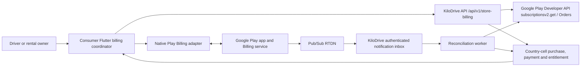

# Google Play Billing native adapter and RTDN

- **Owner:** Mobile platform and membership engineering
- **Last verified:** 2026-10-05
- **Environment:** Source review of product commit [`8bfe08881bce51535d1165552f2d5be8e05fc872`](https://github.com/KiloDriveApp/KiloDrive/commit/8bfe08881bce51535d1165552f2d5be8e05fc872); no signed-device or provider event executed for this chapter
- **Evidence:** The product checkout also had uncommitted edits to `store_billing.dart`, `native_store_billing_adapter.dart`, membership presentation and `StoreBillingFeature.cs` during review. Those edits are not part of the pinned commit and are not release evidence. Historical [Google certification report](https://github.com/KiloDriveApp/KiloDrive/blob/8bfe08881bce51535d1165552f2d5be8e05fc872/docs/reports/google-play-subscription-certification-2026-09-19.md) retains its own date/build.

This chapter expands the [native-adapter overview](native-adapters-and-store-billing.md) without replacing its cross-platform rules. The [store-entitlement runbook](../runbooks/store-entitlement-reconciliation.md) owns shared Apple/Google decisions; the [Google-specific recovery runbook](../runbooks/google-play-billing-recovery.md) supplies operational branches. Product IDs and available country mappings belong to the API catalog, not to this hand-maintained page.

## Context and authority



| Boundary | Evidence it owns | It cannot authorize |
| --- | --- | --- |
| Play Billing adapter | Availability, product/base-plan/offer rows, localized price, purchase update, pending/acknowledged observation and purchase token | KiloDrive membership, account ownership, charge amount or safe repurchase |
| Flutter coordinator | Scoped operation/quote journal, original operation identity, API verification request, checking/recovery UI | A paid entitlement from a local `purchased` event |
| API prepared operation | Reviewed quote, account/tenant/country/billing-account profile and operation fence before Play launch | Proof that a sheet appeared or that no charge occurred |
| `subscriptionsv2.get` | Current provider subscription state, product/base plan/offer, token linkage, external account identifiers, expiry and acknowledgement state | A KiloDrive financial charge without exact order/amount/period evidence |
| RTDN | Authenticated, durable reason to re-query provider state | Entitlement transition from notification fields alone |
| Country-cell projection | One authoritative current membership and durable payment/ledger/receipt history | Changing provider state |

The Flutter interface and plugin owner are [`native_store_billing_adapter.dart`](https://github.com/KiloDriveApp/KiloDrive/blob/8bfe08881bce51535d1165552f2d5be8e05fc872/src/client/mobile/lib/core/platform_adapters/native_store_billing_adapter.dart); the coordinator and protected journal are [`store_billing.dart`](https://github.com/KiloDriveApp/KiloDrive/blob/8bfe08881bce51535d1165552f2d5be8e05fc872/src/client/mobile/lib/core/store_billing.dart). The API exposes product discovery, quote, Google-only prepare, verify, restore and operation status via [`StoreBillingController`](https://github.com/KiloDriveApp/KiloDrive/blob/8bfe08881bce51535d1165552f2d5be8e05fc872/src/server/KiloDrive.Api/Controllers/StoreBillingController.cs). Canonical first-party paths are `/api/v1/store-billing/...`; the controller's `api/...` selector is versioned by the API route convention.

## Checkout and callback sequence

```mermaid
sequenceDiagram
  participant App as Flutter coordinator
  participant API as KiloDrive API
  participant Play as Play Billing
  participant Dev as Play Developer API
  App->>API: GET products; POST quote
  API-->>App: exact mapping, reviewed quote/transition
  App->>API: POST prepare (stable operation ID, same idempotency key)
  API-->>App: durable owner/profile and pending operation
  App->>App: persist scoped protected journal
  App->>Play: launch exact product, base plan/offer and obfuscated account/profile
  Play-->>App: pending / purchased / cancelled / error update
  App->>API: POST verify (original operation and token; never public-log token)
  API->>Dev: subscriptionsv2.get; exact order lookup when accounting
  Dev-->>API: current subscription and external account identifiers
  API->>API: bind owner, token family, plan and period; commit once
  API-->>App: entitlement or recoverable checking state
  API->>Dev: durable acknowledgement work if required
  App->>Play: finish local purchase after server commit
```

`prepare` is not a cosmetic spinner: [`StorePurchasePreparation`](https://github.com/KiloDriveApp/KiloDrive/blob/8bfe08881bce51535d1165552f2d5be8e05fc872/src/server/KiloDrive.Api/Features/Membership/StorePurchasePreparation.cs) persists the reviewed quote, stable profile and account scope, and refuses a second unresolved operation for the same billing account. [`GooglePlayPreparedOwnership`](https://github.com/KiloDriveApp/KiloDrive/blob/8bfe08881bce51535d1165552f2d5be8e05fc872/src/server/KiloDrive.Api/Features/Membership/GooglePlayPreparedOwnership.cs) checks echoed obfuscated account/profile, exact quote product/base plan/offer, linked predecessor and immutable token reservation. A prepared row alone does not prove a Play charge or its absence. [`GooglePlayFirstTokenRecovery`](https://github.com/KiloDriveApp/KiloDrive/blob/8bfe08881bce51535d1165552f2d5be8e05fc872/src/server/KiloDrive.Api/Features/Membership/GooglePlayFirstTokenRecovery.cs) can attach RTDN-first evidence only when one exact prepared owner is proven across country cells; conflicting/no owner goes to review.

The adapter picks the exact returned Play `GooglePlayProductDetails` offer token and sends stable obfuscated identifiers. It inspects existing Play purchases before replacement and requires one provider purchase matching the server-reviewed predecessor token hash, product, account, purchased status and acknowledgement. Unknown/error/conflict blocks a new sheet. The server controls immediate versus deferred replacement. A deferred two-line Play snapshot cannot be collapsed to a target entitlement early; the generic parser rejects it for separate transition handling. Sources: [adapter](https://github.com/KiloDriveApp/KiloDrive/blob/8bfe08881bce51535d1165552f2d5be8e05fc872/src/client/mobile/lib/core/platform_adapters/native_store_billing_adapter.dart), [transition resolver](https://github.com/KiloDriveApp/KiloDrive/blob/8bfe08881bce51535d1165552f2d5be8e05fc872/src/server/KiloDrive.Api/Features/Membership/GoogleSubscriptionTransitionQuoteResolver.cs), [provider parser](https://github.com/KiloDriveApp/KiloDrive/blob/8bfe08881bce51535d1165552f2d5be8e05fc872/src/server/KiloDrive.Api/Features/Membership/GooglePlaySubscriptionEvidence.cs).

## State and recovery table

| Observation or provider state | Authoritative treatment | User-safe action |
| --- | --- | --- |
| Not started; exact native failure proves no new checkout | No new charge from that invocation; an older unfinished token remains independent | Retry only after existing purchase/operation check |
| Explicit sheet cancellation with no transaction | No new purchase; do not allege a charge | Return to catalog, retaining any older recovery case |
| Pending purchase | No entitlement and no acknowledgement until purchased; provider may omit start/expiry | Show pending/checking and retain owner fence |
| Active, grace, or cancelled with unexpired provider period | Verified access for the exact period; cancellation disables future renewal, grace still grants access | Show Current Plan/through date from API |
| Account hold (`billing_retry`), pause, expired or pending-cancelled | No newly minted paid access; reconcile effective dates and prior period | Explain state and link to Play management; do not invent access |
| Renewal | Re-query token, update exact period; charge ledger requires exact order, currency and amount evidence | Refresh Current Plan; keep accounting exception if order unavailable |
| Immediate upgrade | Prove linked old token and target, retire predecessor, one entitlement | Show new term after API commit |
| Deferred downgrade | Keep old plan through its verified expiry; target is pending, not active | Show current term and pending change separately |
| Refund, revoke, chargeback/void | Reconcile provider disposition, then compensating accounting and access transition | Restricted case if provider/ledger disagree |
| Provider timeout, response loss, process death | Outcome unknown; same protected operation and idempotency identity survive | Checking/recovery; never blind second purchase |

The parser maps Play `SUBSCRIPTION_STATE_*` to KiloDrive states and hashes tokens; the raw token is protected only where later provider lookup/acknowledgement requires it. [`GooglePlayTransactionVerifier`](https://github.com/KiloDriveApp/KiloDrive/blob/8bfe08881bce51535d1165552f2d5be8e05fc872/src/server/KiloDrive.Api/Features/Membership/GooglePlayTransactionVerifier.cs) uses `subscriptionsv2.get`; [`StorePurchaseAcknowledgementHandler`](https://github.com/KiloDriveApp/KiloDrive/blob/8bfe08881bce51535d1165552f2d5be8e05fc872/src/server/KiloDrive.Api/Features/Membership/StorePurchaseAcknowledgementHandler.cs) performs retriable acknowledgement after a verified purchase, independently of entitlement. Google says new purchases must be acknowledged within three days, while renewals do not require acknowledgement; see [Google subscription lifecycle](https://developer.android.com/google/play/billing/lifecycle/subscriptions).

## RTDN and notification loss

```mermaid
sequenceDiagram
  participant Play as Google Play / Pub/Sub
  participant Web as RTDN HTTP endpoint
  participant Inbox as Protected control inbox
  participant Worker as Recovery worker
  participant API as subscriptionsv2.get / country cell
  Play->>Web: OIDC-authenticated Pub/Sub envelope
  Web->>Web: validate audience, service-account email, package, one variant
  Web->>Inbox: unique message ID + hash + protected payload
  Inbox-->>Web: durable receipt
  Web-->>Play: 200 only after receipt; 503 on retryable failure
  Worker->>Inbox: lease bounded batch
  Worker->>API: provider re-query and scoped projection
  Worker->>Inbox: processed / retry_pending / manual_review
```

The [`notification controller`](https://github.com/KiloDriveApp/KiloDrive/blob/8bfe08881bce51535d1165552f2d5be8e05fc872/src/server/KiloDrive.Api/Controllers/StoreBillingNotificationsController.cs) authenticates Google OIDC audience and sender email; malformed/unauthorized messages are terminal, transient signature infrastructure or provider recovery returns retryable HTTP status. [`GoogleRtdnDispatcher`](https://github.com/KiloDriveApp/KiloDrive/blob/8bfe08881bce51535d1165552f2d5be8e05fc872/src/server/KiloDrive.Api/Features/Membership/GoogleRtdnDispatcher.cs) accepts exactly one recognized variant. [`GoogleStoreNotificationRecovery`](https://github.com/KiloDriveApp/KiloDrive/blob/8bfe08881bce51535d1165552f2d5be8e05fc872/src/server/KiloDrive.Api/Features/Membership/GoogleStoreNotificationRecovery.cs) persists encrypted payload before success, deduplicates by message ID and payload hash, and leases bounded replay. RTDN is an invalidation signal, never the entitlement command; Google likewise calls `subscriptionsv2.get` the source of truth ([lifecycle](https://developer.android.com/google/play/billing/lifecycle/subscriptions), [RTDN reference](https://developer.android.com/google/play/billing/rtdn-reference), [API method](https://developers.google.com/android-publisher/api-ref/rest/v3/purchases.subscriptionsv2/get)). Missing RTDN requires scheduled/provider-history or app-initiated reconciliation; silence is not proof of no purchase.

## Privacy, diagnostics and evidence status

Use operation ID, support code, product/base-plan/offer, storefront currency/price, mapping revision, provider state category, notification age and sanitized account-scope result. Do not place raw purchase tokens, encrypted token payloads, OIDC JWTs, service-account keys, personal identity or payment instrument data in a public ticket. A purchase token hash is an internal correlation key, not a public support reference. The API credential and product configuration example is [`appsettings.example.json`](https://github.com/KiloDriveApp/KiloDrive/blob/8bfe08881bce51535d1165552f2d5be8e05fc872/src/server/KiloDrive.Api/appsettings.example.json), not production configuration. Play's localized price is the displayed checkout price; API mapping/legal price evidence is separate. [Google Billing integration guidance](https://developer.android.com/google/play/billing/integrate) and [subscriptions guidance](https://developer.android.com/google/play/billing/subscriptions) govern platform behavior.

| Evidence level | Reviewed evidence | Status for this source review |
| --- | --- | --- |
| Source and deterministic tests | [`native_store_billing_adapter_contract_test.dart`](https://github.com/KiloDriveApp/KiloDrive/blob/8bfe08881bce51535d1165552f2d5be8e05fc872/src/client/mobile/test/native_store_billing_adapter_contract_test.dart), [`store_billing_operation_recovery_test.dart`](https://github.com/KiloDriveApp/KiloDrive/blob/8bfe08881bce51535d1165552f2d5be8e05fc872/src/client/mobile/test/store_billing_operation_recovery_test.dart), [`GooglePlaySubscriptionsV2Tests.cs`](https://github.com/KiloDriveApp/KiloDrive/blob/8bfe08881bce51535d1165552f2d5be8e05fc872/tests/KiloDrive.Tests/Api/GooglePlaySubscriptionsV2Tests.cs), [`GoogleRtdnFirstTokenSafetyTests.cs`](https://github.com/KiloDriveApp/KiloDrive/blob/8bfe08881bce51535d1165552f2d5be8e05fc872/tests/KiloDrive.Tests/Api/GoogleRtdnFirstTokenSafetyTests.cs) and billing lifecycle tests | Implemented/tested in source; not re-executed here |
| Licensed Play signed-device purchase | Historical report recorded no live lifecycle purchase in its environment; no current device/provider run here | Untested for current candidate |
| RTDN, renewal, pause, hold, refund/revoke, replacement on current signed artifact | No candidate-specific provider timeline attached to this review | Untested/blocked pending licensed device, Play Console access and provider event evidence |

Do not promote a build-167 observation, a mock provider result or this source review into current signed-build certification. Record exact artifact digest, Play install track, tester, storefront, provider timestamps, API operation and entitlement/ledger references before calling any row passed.
