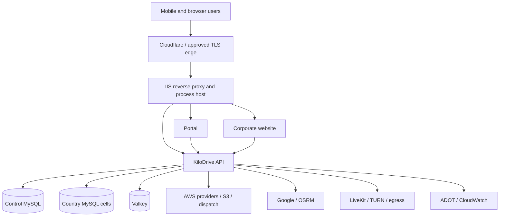

# Hosting and deployment topology

KiloDrive is a modular application deployed as several independently publishable
processes. The current production hosting pattern uses IIS for the ASP.NET Core
API, Portal, and Website, with Cloudflare or another approved TLS edge in front.
MySQL country cells, Valkey, object storage, dispatch infrastructure,
observability, maps, and voice are separate dependencies.

This public document describes roles and failure boundaries. It intentionally
omits hostnames, account IDs, IPs, resource identifiers, exact ports, instance
sizes, security groups, and filesystem paths.

## Logical topology

The Portal and Website call the API; they do not become alternate database
clients. This keeps tenant, authorization, audit, and contract behavior in one
backend boundary.

## Stateless API nodes—with explicit exceptions

An API node should be disposable. Durable state lives in MySQL/S3; distributed
ephemeral state lives in Valkey. Before horizontal scale-out, verify:

- SignalR uses a Valkey backplane;
- passkey ceremonies and other single-use security state are distributed;
- Data Protection key rings are persistent and shared appropriately;
- JWT signing material/current public rollover set is consistent;
- every node resolves the same country directory and schema contract;
- local disk is not the only copy of an upload or report;
- background workers have safe singleton/lease semantics; and
- health checks identify each node/version without exposing secrets.

Calling a service stateless while it stores WebAuthn challenges in process memory
or Data Protection keys ephemerally creates intermittent failures behind a load
balancer.

## IIS process hosting lessons

IIS provides process supervision and request hosting, but app-pool identity and
filesystem ACLs matter. Protected JWT key and Data Protection directories should
be readable only by the intended app pool and administrators; unrelated apps
must not inherit access.

Configuration deployment preserves protected values. Avoid tools that parse and
re-serialize production JSON simply to change one setting; escaping, comments,
formatting, or unrelated values can be damaged. Use a reviewed, structure-aware,
minimal edit and validate against code requirements before restart.

Application startup validates security configuration and schema fingerprints.
A process that refuses to start on drift is doing its job. Do not disable the
contract check to make the health endpoint green; align reviewed SQL or deploy
the matching binary/configuration.

## Country-cell routing

The control database identifies the user's authorized home/selected country and
the provisioned country connection. A request scope resolves exactly one cell.
Background workers create an isolated scope per cell/tenant. Cross-cell outbox
discovery is a documented exception; domain transactions stay local.

A country is not activated merely by adding it to a dropdown. Its shard must be
provisioned, schema-fingerprint aligned, reference/rule data seeded, health
checked, and explicitly marked active.

## Release artifacts

Build API, Portal, Website, Flutter APK/AAB, and iOS artifacts from a reviewed
commit. Keep build outputs isolated from dependency caches. Record version,
commit, SHA-256, OpenAPI hash, schema fingerprints, test evidence, and store
permission/entitlement diffs.

Android build numbers increment for every released APK/AAB and both required ARM
ABIs are included according to supported devices. iOS archives verify signing,
entitlements, minimum OS, privacy purpose strings, and forbidden private
selectors in executable Mach-O images.

## Safe deployment sequence

1. Identify the deployed binary version/commit; a database version does not prove
   which API binary is running.
2. Produce immutable release artifacts and hashes from a clean checkout.
3. Back up affected state and verify rollback artifacts.
4. Apply reviewed idempotent SQL to disposable clones.
5. Prove empty bootstrap and metadata fingerprints match model expectations.
6. Align control and every provisioned country cell.
7. Deploy binaries without overwriting secrets or key rings.
8. Recycle/start one process and verify liveness, readiness, schema contract,
   JWKS, headers, OpenAPI, outbox, Valkey, and provider requirements.
9. Run production-safe smoke tests with dedicated fixtures and cleanup.
10. Watch telemetry through a legitimate traffic window before declaring done.

For incompatible schema changes, use expand-and-contract: first add compatible
columns/tables, deploy code that can handle both, migrate data, then remove old
shape only after zero-reference verification. Avoid coordinating a destructive
schema change and binary swap as a single hope-based moment.

## Rollback

A binary rollback is safe only if the database remains compatible. Before
deployment, document which previous artifact can run against the expanded
schema. Roll back configuration independently where possible. Do not restore a
whole database to undo a code deployment; that discards legitimate user work.

If a schema guard blocks startup, keep the old healthy binary serving while the
new mismatch is diagnosed. If the new schema is already in use, prefer a forward
fix or compatible rollback rather than destructive column removal.

## Scaling signals

Scale out/upgrade after observing sustained customer-visible bottlenecks:

- API CPU/thread pool and p95/p99 excluding provider time;
- MySQL waits, locks, query plans, and pool saturation;
- Valkey latency, memory/eviction, connections, and pub/sub throughput;
- SQS/outbox oldest age and worker utilization;
- SignalR connection count and reconnect delay;
- LiveKit bandwidth, packet loss, TURN percentage, and egress concurrency;
- OSRM route/map-match latency and host resources; and
- provider quota and latency.

Adding API nodes cannot fix a saturated MySQL instance or external provider. It
can also make a missing SignalR backplane and process-local cache bugs visible.

## Environment and secret configuration

The current applications use one primary application settings file each, while
secrets remain outside public source control. Prefer workload identity, protected
machine files, environment secret injection, or an approved secret manager.
Never publish a real settings file in a public architecture repository.

Every setting needs an owner, safe default, validation rule, health signal,
rollback, and documentation. “Optional” must specify whether the feature fails
closed, falls back, or hides itself.

## Disaster and dependency boundaries

Plan and exercise independently for:

- API process/node loss;
- control database unavailable versus one country cell unavailable;
- Valkey loss;
- object storage/scanner loss;
- EventBridge/SQS outage;
- map provider/OSRM loss;
- messaging/payment/provider timeout;
- LiveKit/TURN/egress loss; and
- observability collector loss.

The response should preserve committed truth, prevent unsafe money/security
operations, and communicate degraded state honestly.
