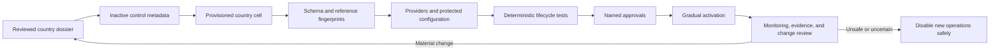

# Jurisdictional Compliance Architecture

## Purpose and assurance boundary

KiloDrive operates across countries whose transport, privacy, financial,
consumer, communications, tax, safety, and accessibility obligations differ.
The platform therefore treats a country as more than a value in a dropdown. A
country is an operational and legal boundary with its own data cell, rules,
providers, evidence, owners, and activation decision.

This architecture **supports** compliance work. It does not certify that a
country launch is lawful, replace qualified local counsel, or guarantee that a
deployment remains compliant after a law, provider term, or business practice
changes. Code can enforce an approved rule; it cannot decide what the approved
rule should be.

Public documentation also cannot prove that a private production environment is
correctly configured. Statements such as “implemented” describe reviewed source
capability. Operators need restricted evidence before saying a capability is
active in a particular country.

## Status language used in this chapter

| Status | Meaning here |
| --- | --- |
| **Implemented** | The control is represented in reviewed application code or canonical MySQL scripts and has focused verification. |
| **Implemented/incremental** | A working boundary exists, but some rule families or older flows still need migration to the same model. |
| **Configurable** | The adapter or behavior exists but requires approved country configuration, infrastructure, provider access, or credentials. |
| **Operational policy** | A named human or governed process must make and evidence the decision; code cannot supply the legal judgment. |
| **Planned** | A direction under consideration, not a shipped or active control. |

The main status boundaries are:

| Capability | Status | Important qualification |
| --- | --- | --- |
| Global identity control plane and country data cells | **Implemented** | A correctly routed request still depends on valid identity, country membership, tenant, and role evidence. |
| Country directory, shard provisioning, schema fingerprints, and activation gates | **Implemented** | Activation also needs legal, financial, privacy, safety, provider, and operational approval. |
| Database-driven country validation and reference data | **Implemented/incremental** | Rules already modeled are enforceable; this is not a universal statutory rules engine. |
| Effective-dated prices and rule revisions | **Implemented/incremental** | Historical prices and selected rule families are versioned; every new mutable legal rule must explicitly adopt the pattern. |
| Transport-document and vehicle eligibility workflow | **Implemented/configurable** | Required evidence and review/provider process differ by country. |
| Privacy request orchestration across cells | **Implemented plus operational policy** | The workflow coordinates execution; retention, lawful basis, exceptions, and response obligations require approved policy. |
| Wallet accounting and financial restrictions | **Implemented plus operational policy** | Enabling a money action requires a country-approved operating model and regulated partners where applicable. |
| Messaging, voice, and recording adapters | **Configurable** | Sender approval, consent, retention, and country/provider availability must be proven before enablement. |
| Automatic monitoring of every legal or regulatory change | **Planned** | Named owners monitor authoritative sources today; automation may assist but cannot silently change production rules. |

## Compliance is a governed lifecycle, not a boolean

The platform does not contain a trustworthy `IsCompliant = true` switch. A
country becomes operable only after several independent facts agree:

Each stage has an owner, input evidence, stop conditions, and rollback. Showing
a country during signup before this chain is complete creates a misleading and
potentially unsafe promise.

## Governance and decision rights

**Status: Operational policy.** Authorization code cannot approve a transport
licence regime, choose a lawful basis, determine whether KiloDrive is handling
regulated funds, or interpret a new consumer rule. Those decisions belong to
qualified owners.

A country dossier should name at least:

| Owner | Decision responsibility |
| --- | --- |
| Country/product owner | Business scope, launch sequence, supported services, and customer communication |
| Local legal and regulatory owner | Transport, consumer, privacy, communications, employment/contractor, competition, and marketplace obligations |
| Privacy owner or data-protection role | Purpose, lawful basis, rights workflow, retention, processors, transfers, and breach handling |
| Financial/compliance owner | Money-flow classification, regulated partners, KYC/AML tiers, limits, tax, reconciliation, refund, dispute, and reporting obligations |
| Safety owner | Emergency guidance, escalation, evidence, responder workflow, and service restrictions |
| Security owner | Threat review, access control, key/secret handling, incident response, and assurance evidence |
| Database/platform owner | Cell provisioning, schema contract, backups, restore, routing, and activation enforcement |
| Provider owner | Country availability, sender/origination approval, quotas, terms, canaries, outage behavior, and rollback |
| Localization/accessibility reviewer | Language, legal terminology, formats, assistive-technology behavior, and critical-screen evidence |
| Support/operations owner | Support hours, escalation, privacy/ticket handling, runbook exercise, and customer remediation |

No single engineer should be able to declare a country legally ready merely
because its schema is healthy. Approval records should identify scope, version,
review date, approver role, conditions, expiry or next review, and the restricted
evidence location. Public documents describe the process without publishing
personal names, internal ticket links, account identifiers, or defensive
details.

## Official legal-source register (non-exhaustive)

**Status: Operational reference, not legal advice or activation approval.** The
links below are starting points from official government or regulator sources
for the reviewed public documentation baseline. They are not a complete list of
laws, regulations, commencement orders, amendments, codes, regulator guidance,
licensing rules, tax rules, consumer requirements, or local transport
obligations that may apply to KiloDrive, its partners, drivers, rental
organizations, or users.

| Jurisdiction | Official orientation source | How to use it |
| --- | --- | --- |
| Jamaica | Ministry of Justice, [Data Protection Act, 2020](https://laws.moj.gov.jm/legislation/aop/2/7_2020-The%20Data%20Protection%20Act.pdf) | Confirm the current Act, commencement/amendments, regulator material, transport rules, and KiloDrive's actual role with Jamaican counsel before relying on a requirement. |
| Cayman Islands | Cayman Islands Government [legislation portal](https://legislation.gov.ky/cms/) and [Data Protection Act (2021 Revision)](https://legislation.gov.ky/cms/images/LEGISLATION/PRINCIPAL/2017/2017-0033/2017-0033_2021%20Revision.pdf) | Use the portal's current and point-in-time legislation functions; do not assume the linked revision remains the latest operative text. |
| Barbados | Office of the Attorney General, [Data Protection Act, 2019-29](https://oag.gov.bb/attachments/Data%20Protection%20Act%2C%202019-29.pdf) | Check commencement, amendments, regulator guidance, sector rules, and the approved country dossier rather than treating the original Act PDF as the whole obligation set. |
| Trinidad and Tobago | Parliament, [Data Protection Act, 2011](https://www.ttparliament.org/publication/the-data-protection-act-2011/) | Verify current commencement and applicability, amendments, regulator guidance, and relevant transport/consumer/communications requirements. |
| Bermuda | Government of Bermuda, [Personal Information Protection Act 2016](https://www.gov.bm/sites/default/files/Personal-Information-Protection-Act-2016.pdf) | Confirm current commencement, amendments, Privacy Commissioner guidance, and sector-specific obligations before activation or a material feature change. |
| Canada | Office of the Privacy Commissioner of Canada, [PIPEDA compliance help](https://www.priv.gc.ca/en/privacy-topics/privacy-laws-in-canada/the-personal-information-protection-and-electronic-documents-act-pipeda/pipeda-compliance-help/) | Determine federal applicability and then assess provincial/territorial privacy, transport, consumer, employment, accessibility, tax, and payments requirements. |
| United States | Federal Trade Commission, [Privacy and Security guidance](https://www.ftc.gov/business-guidance/privacy-security) | Treat FTC material as one federal starting point; assess other federal law plus state and local privacy, transport-network, consumer, accessibility, communications, tax, insurance, and payments rules. |

For Canada and the United States especially, privacy and transportation duties
can vary by province, territory, state, municipality, service type, and the role
played by KiloDrive or a partner. A country-level entry is therefore not enough
on its own. The restricted compliance register must identify the exact source,
jurisdictional level, version or access date, commencement/effective date,
applicability analysis, counsel or responsible reviewer, resulting control,
evidence, and next review.

Before activation and after every material change, the responsible owner must
re-open and verify each cited source in that restricted register. Broken links,
new consolidations, or an unchanged page do not prove that the legal position is
unchanged. Secondary summaries can help discovery, but activation decisions
must trace to authoritative text and approved professional interpretation.

## Control plane and country-cell ownership

**Status: Implemented.** `kilodrive_control` owns the global identity and the
directory needed to decide which country cells a user may enter. A country cell
owns the local operational and financial graph.

The control plane owns:

- credentials, sessions, passkeys, social links, 2FA, and global account state;
- supported-country and provisioned-shard directory records;
- country/tenant/role memberships and System Administrator grants;
- global support and privacy/deletion orchestration with country checkpoints;
- universal reference catalogues where one global copy is appropriate; and
- global security evidence for control-plane actions.

Each country cell owns:

- local user projections, driver/rider/rental profiles, and local permissions;
- licences, vehicles, assignments, transport evidence, and compliance state;
- rides, bids, trips, deliveries, rentals, communications, and safety evidence;
- wallets, payments, holds, transfers, cashouts, memberships, journals, tax and
  settlement evidence;
- country banks, insurers, fare/toll data, provider attempts, notifications,
  local audit, and durable outbox work; and
- country-local retention metadata, anonymization, disputes, and feature-specific
  hold state where implemented.

This split limits cross-country data mixing and keeps a country's financial
transaction inside one local database transaction. It also creates an eventual
consistency boundary. Cross-store registration, privacy, and global compliance
changes therefore use durable checkpoints or outbox/saga steps. They do not
pretend that control and every country cell share one ACID transaction.

An ordinary user's signed home-country membership takes precedence over a
client-supplied country header. A global System Administrator can select an
active country workspace under the role's broad authority; tenant-scoped work
still needs explicit acting-tenant proof. The reviewed source does not yet model
individual per-country grants for global administrators. Country selection
changes routing and scope; it must not be described as least-privilege country
delegation until such grants exist.

Logical country cells do not, by themselves, prove data residency. Physical
regions, backups, replicas, object storage, telemetry, processors, and cross-
border transfers are deployment and contract evidence.

## Country dossier and versioned rules

**Status: Implemented/incremental plus operational policy.** A country dossier
turns reviewed obligations into data, configuration, procedures, and evidence.
At minimum it records:

- ISO country/currency codes, currency exponent, IANA timezone, supported
  languages, local date/number formats, and measurement units;
- phone normalization and display, emergency numbers, and address expectations;
- driver-licence format, required fields, validity/renewal rules, and accepted
  evidence;
- vehicle plate format, categories, registration, insurance, fitness/inspection,
  accessibility, age/condition, and commercial-use requirements;
- required driver, vehicle, rental, and organization verification steps;
- bidding, duty, telemetry freshness, trust, route, toll, fare, and service rules;
- wallet, membership, store, payout, refund, tax, receipt, KYC/AML, and limits;
- privacy purposes, retention, deletion, legal hold, recording, and support
  handling;
- provider availability, sender/origination approval, template rules, quotas,
  fallback, and maintenance controls; and
- legal text, consumer disclosures, accessibility review, ownership, and next
  review date.

The reviewed implementation has one deliberate exception to country-derived
vehicle evidence: driver fitness/inspection is currently required
unconditionally by onboarding, vehicle validation, readiness, and primary-
vehicle selection. Operators must not configure or advertise a country waiver
that the server does not implement. Making fitness conditional is a future
versioned rule change requiring matching API, client, seed, and test evidence.

Rules that can change must not be overwritten without history. Use a stable rule
identifier plus a revision, effective-from time, optional effective-to time,
source/approval reference, and status. A transaction snapshots the rule values
that explain its result where later change would otherwise rewrite history.

For example, a toll estimate needs the rate period used at calculation time; a
membership purchase needs its plan, term, price, currency, and disclosures; and
a trip needs accepted vehicle/compliance evidence. “Read today's row later” is
not adequate evidence for yesterday's decision.

Not every country field is currently managed by one general rule engine. New
rule families should join the effective-dated pattern deliberately. Until they
do, their status is incremental and activation evidence must identify the
remaining operational control.

In particular, supported-country licence, plate, timezone, and similar fields
are mutable current rows rather than a complete effective-dated legal-rule
engine. United States and Canadian country-level patterns are broad placeholders
for interfaces that ultimately need state/province rules. A database seed is
not regulator verification, and at least one legacy driver-document path still
uses generic licence normalization rather than the full country rule.

## Provisioning, fingerprints, and activation gates

**Status: Implemented technical gate, with broader operational approval
required.** Provisioning and activation are separate actions. A cell can exist
for testing while the country remains unavailable for signup and new
marketplace operations.

The application-enforced gate verifies that the shard is provisioned, the
schema fingerprint is fresh and valid, and bounded validation metadata is safe.
The complete launch procedure additionally verifies:

1. inactive control metadata exists with reviewed country and routing values;
2. the shard directory points to the intended provisioned cell;
3. canonical MySQL scripts apply successfully to an empty disposable server;
4. alignment is idempotent on a second run;
5. normalized table, column, index, and foreign-key fingerprints match the
   application contract;
6. required reference/rule data exists and contains no encoding corruption;
7. startup/readiness checks detect drift rather than trusting a version label;
8. API, mobile, Portal, Website, worker, and admin-country routing tests pass;
9. backup, restore, monitoring, alert, and rollback paths are exercised; and
10. named business, legal, safety, privacy, financial, provider, and operations
    owners approve the same dossier revision.

Item 10 and the non-schema checks are governed evidence, not approval fields
enforced by the country directory. Canonical source seeds also do not prove a
live deployment: the reviewed bootstrap marks Jamaica active/provisioned, while
other country activation is separate operational work. Public documentation
must not infer production availability from a country row or script alone.

Changing an expected fingerprint to silence readiness is not alignment.
Similarly, copying a neighboring country's banks, licence pattern, emergency
number, tax rule, or retention schedule is not a valid seed strategy. Unknown
country facts remain blockers.

Activation should be gradual and observable. A country can permit internal
fixtures before public signup, or calculators before regulated money movement.
Feature-specific gates are narrower than country activation and need their own
evidence.

## Transport eligibility and evidence

**Status: Implemented/incremental; review and external checks are configurable
or operational.** Driver eligibility is a server decision made from the active
country rule revision and current evidence. Mobile labels and form formatters
help the user, but a modified client cannot approve a licence or vehicle.

The country policy defines:

- required licence number structure and supporting fields such as original
  issue date, control number, expiry, class, and issuing authority;
- whether a driver's licence is the identity evidence required to drive;
- background-check requirement, accepted source, validity period, deferment,
  lock deadline, and reviewer/provider process;
- plate normalization and display guidance;
- vehicle category, make/model/year/condition and primary assignment rules;
- registration, insurance, fitness/inspection, ownership/permission, and image
  evidence requirements;
- insurer/broker and branch/reference catalogues where applicable;
- expiry warning, periodic reverification, rejection, suspension, and appeal or
  resubmission paths; and
- which evidence change forces immediate offline status or revokes bidding.

Approval records retain document type, state, review time, reviewer role, safe
notes, rule/compliance revision, and private object reference. Document bytes
remain private and quarantined until a trusted scan result permits review.
Rejected or expired required evidence must not remain cosmetically “verified.”

Ride acceptance revalidates online state, fresh location, duty, assignment,
membership, trust, licence, selected vehicle, and required compliance inside the
locked transition. The trip snapshots the accepted vehicle and compliance
version so later vehicle edits do not alter historical safety evidence.

External background, licence, insurer, or registry checks are **configurable**
only after the provider, lawful purpose, data-sharing terms, error behavior, and
manual fallback are approved. A provider timeout is not an approval.

## Safety and emergency obligations

**Status: Implemented/configurable plus operational policy.** The API resolves
country-specific emergency guidance from an authenticated, authorized country
context. It does not assume that a global administrator has a local user row.

Country safety policy covers:

- the correct emergency number and limitations of KiloDrive support;
- RideCheck/route-deviation thresholds, GPS uncertainty, alert cooldown, rider
  acknowledgment, route-change allowance, and escalation;
- live sharing, trusted contacts, emergency contact-channel expiry, and revocation;
- crash, assault, route deviation, lost child, account compromise, false alarm,
  and unavailable-network procedures;
- safety-case severity, owner, response SLA, evidence bundle, acknowledgment,
  escalation channel, legal hold, and closure reason; and
- when rides, bidding, calls, or another feature fail closed or degrade.

Map matching and a corridor are safety signals, not proof of wrongdoing. GPS
noise, tunnels, parallel roads, diversions, and provider failure require
uncertainty handling and human-readable prompts. Emergency UI must never imply
that KiloDrive replaces public emergency services.

Safety launch approval is **operational policy**. Provider availability,
high-priority push, voice, and mobile background behavior are **configurable**
and require physical-device exercises. A planned automation cannot be used as
the only responder until ownership, paging, fallback, and tabletop evidence are
proven.

## Privacy, data rights, retention, and legal hold

**Status: Implemented orchestration plus jurisdiction-specific operational
policy.** Privacy begins with a data map: purpose, data subject, controller or
processor role, authority, owner, location, recipients, sensitivity, retention,
rights, and deletion shape.

KiloDrive minimizes by boundary:

- credentials and global security state remain in the control plane;
- precise live location is short-lived in Valkey and only selected trip/safety
  breadcrumbs become durable in the country cell;
- identity and vehicle documents remain in private object storage with
  authorization, quarantine, no-store delivery, and audit;
- communications and provider attempts store only the content or safe metadata
  required by the approved purpose; and
- telemetry excludes tokens, contacts, message bodies, document content,
  precise routes, presigned URLs, and raw payloads.

A global privacy/deletion request identifies applicable country memberships and
creates idempotent country execution checkpoints. Each cell performs its local
anonymize, delete, retain, or detach work according to the approved rule. The
control plane coordinates completion; it does not pull every country's trip and
financial graph into one global database.

Retention is defined by content class and event, not one universal number. The
schedule records why data is retained, when its clock starts, deletion or
anonymization behavior, backup/tombstone handling, and which approved holds or
disputes pause ordinary expiry. Immutable financial evidence may need direct
identifiers minimized rather than rows deleted.

A legal hold is authorized, scoped, time-bounded or reviewed, audited, and
released through a governed action. It must not become a permanent unchecked
flag. Country counsel/privacy owners decide rights, response periods, lawful
bases, transfer restrictions, mandatory retention, and notification duties.
Those decisions are not inferred from schema defaults.

Current deletion orchestration does not prove generic provider/object deletion
or a universal legal-hold engine. It anonymizes identities and deliberately
retains defined trip/financial history; storage-provider cleanup and the final
retain/delete basis remain operational or feature-specific work.

## Payments, KYC/AML, tax, and accounting

**Status: Implemented accounting boundaries, configurable providers, and
operational legal/financial approval.** Before a country enables top-up,
transfer, wallet payment, cashout, voucher, membership, rental deposit, refund,
or store billing, it needs a money-movement matrix:

| Question | Required answer |
| --- | --- |
| Product action | What does the user believe is happening? |
| Legal/financial classification | Is KiloDrive, a bank, a store, or another regulated partner receiving, holding, transferring, or merely recording value? |
| Regulated party and provider | Which approved entity performs the regulated step and in which country/region? |
| KYC/AML tier | What evidence, screening, monitoring, and restrictions apply to each action and limit? |
| Currency and limit | What ISO currency/exponent, minimum, maximum, velocity, FX source, and rounding rule apply? |
| Ledger treatment | Which wallet transaction, hold, immutable journal, clearing account, reversal, and settlement references prove it? |
| Customer disclosure | What fee, renewal, refund, timing, risk, and dispute information must appear before commitment? |
| Reconciliation owner | Who investigates an unknown provider outcome or unexplained balance, and what fails closed? |
| Tax/reporting | Which party calculates, collects, invoices, retains, and reports required tax information? |

Country financial state remains in one cell and one local transaction. Money is
stored as integer minor units with explicit currency. A transfer locks accounts
in deterministic order; provider/webhook work is idempotent; unknown outcomes
are reconciled before retry; and corrections use reversing journal entries.

KYC/AML restrictions can independently prevent sending, receiving, topping up,
or cashing out. They are server-enforced and audited. A local PIN, app biometric,
membership badge, or client feature flag cannot satisfy a regulated proof.

Those account restrictions are not a general country legal-approval engine.
The reviewed source does not yet consume one enforceable country-by-country
money-movement matrix across every wallet feature. Legal classification,
regulated-party approval, tax treatment, and KYC tier therefore remain governed
launch inputs until explicitly modeled and tested.

The accounting design can demonstrate balance and provenance, but it does not
decide tax residence, licensing, safeguarding, money-transmission status, or
report format. Those are **operational policy** decisions encoded only after
review. Production cashout remains disabled when reconciliation contains
critical unexplained money.

## Messaging, consent, and communication preferences

**Status: Configurable provider capability plus implemented preference/audit
boundaries.** Each country records which transactional, security, operational,
support, and promotional messages are permitted through push, SMS, WhatsApp,
email, or voice.

The policy distinguishes:

- a necessary security or service message from optional marketing;
- consent or another approved authority, collection source, scope, and time;
- user preference and opt-out behavior by channel/category;
- quiet hours, language, sender identity, template approval, frequency, and
  country/provider restrictions;
- primary/fallback providers and which failure classes allow fallback;
- delivery, bounce, complaint, opt-out, and suppression handling; and
- retention of provider IDs and status without storing message bodies or full
  destinations in diagnostic telemetry.

Notification intent is committed to the local outbox and sent after the request
transaction. This prevents a slow provider from holding the UI open and keeps a
durable attempt history. It does not make provider acceptance equivalent to
human receipt.

Dedicated non-user canaries prove configured paths without messaging customers.
They store only provider ID, latency, sanitized status, and correlation ID.
Canaries are disabled or placed in maintenance until protected test destinations,
least-privilege credentials, alarms, and a confirmed human destination exist.

## Calls and recording

**Status: Configurable and consent-gated.** In-app calling may be available only
for eligible participants, trip states, plans, countries, devices, and networks.
The API issues a short-lived room/role-scoped token after rechecking the trip and
participant. LiveKit credentials do not ship in the app.

Recording is a separate country capability and defaults to unavailable unless
configured and approved. The policy specifies:

- whether recording is permitted and for which purpose;
- whose explicit consent is required and when it may be withdrawn;
- the visible and accessible recording indicator;
- what happens if one party declines or consent state becomes uncertain;
- recording, metadata, transcript (if any), access, disclosure, retention,
  deletion, legal hold, and dispute rules;
- private encrypted object output and least-privilege egress/retention roles;
  and
- reconciliation after egress timeout, incomplete output, or provider failure.

An “egress started” response does not prove that a valid recording exists.
Completion, object identity, duration, encryption, consent, jurisdiction,
retention, and deletion state must reconcile. Physical-device tests cover
foreground, background, killed launch, network handoff, decline, cancellation,
timeout, reconnect, orphan cleanup, visible state, and denied consent.

## Consumer, app-store, and accessibility obligations

**Status: Implemented presentation foundations plus operational review.** The
product must describe what it sells and avoid dark patterns. Country and store
review includes:

- fare, bid/counter-offer, payment method, cancellation, refund, membership,
  renewal, rental deposit, damage, late return, and dispute disclosures;
- subscription title, term, localized store price, automatic-renewal statement,
  restore/manage-subscription actions, privacy link, and applicable Terms/EULA;
- server verification of Apple/Google purchase evidence and exact product,
  base-plan/offer, term, currency, acknowledgment, revocation, grace, and refund
  state;
- privacy/data-safety labels that describe actual collection and tracking use;
- permissions requested only at a user-understood feature boundary, with honest
  fallback and Settings recovery;
- no unsupported background, VoIP, foreground-service, or tracking declaration;
- language and ICU-placeholder parity for supported locales; and
- readable screens, 48-by-48 logical-pixel targets, semantics/focus order,
  keyboard/system-inset safety, contrast, large text, narrow/landscape/tablet,
  screen-reader, and reduced-capability behavior.

Passing automated accessibility tests supports, but does not certify, legal
conformance. A qualified reviewer must assess the target country's obligations
and the actual signed binary/web deployment. Store approval is also not a legal
opinion and can change when platform rules change.

## Audit, evidence, and explainability

**Status: Implemented foundations plus operational retention/review.** Evidence
must answer who did what, under which authorized country/tenant, using which rule
or entity version, when, with what safe outcome, and through which correlation
chain.

Useful evidence includes:

- source build, OpenAPI artifact, schema contract, control/cell fingerprints,
  country dossier/rule revision, and activation state;
- actor global ID and friendly support ID, role/permission, acting country and
  tenant, action, target type, safe state transition, and local/UTC display;
- document/compliance state and reviewer role without document content;
- payment, journal, provider, outbox, idempotency, and reconciliation references;
- consent/preference/recording state, retention class, hold state, and privacy
  checkpoint outcome;
- correlation ID, provider ID, bounded latency/status, worker/queue evidence,
  and alert acknowledgment; and
- approval, exception, test, rollback, and periodic review records.

Audit is not a copy of every request. Logs and traces exclude credentials,
tokens, OTPs, full contacts, addresses, document bytes, chat/email bodies,
precise location, raw provider payloads, presigned URLs, and payment instructions.
Access to compliance evidence is itself authorized, audited, retained, and
reviewed.

Evidence from a successful test fixture should be reproducible and sanitized.
Do not use a real customer's journey merely because it is convenient, and do
not publish restricted production evidence in this repository.

## Change monitoring and impact assessment

**Status: Operational policy; comprehensive automatic legal monitoring is
planned.** Named owners monitor authoritative legislation/regulation, regulator
guidance, court decisions where relevant, provider terms, store rules, licence
schemes, tax instructions, emergency contacts, sanctions/risk guidance, and
security/privacy standards.

A material change opens an impact assessment that identifies:

1. affected countries, tenants, users, products, providers, data, and historical
   obligations;
2. the current dossier/rule version and source of the change;
3. required code, schema, reference, template, disclosure, store, contract,
   runbook, monitoring, support, and training updates;
4. whether new operations must pause before the effective date;
5. migration, grandfathering, notification, consent refresh, and data-treatment
   rules;
6. disposable-fixture, regression, restore, and rollback evidence; and
7. approvers, deployment window, monitoring period, and next review.

Automation may collect notices and flag potentially affected controls. It must
not interpret law, silently edit production rules, activate a country, or close
an assessment without responsible human review.

## Country launch, change, suspension, and retirement

**Status: Implemented technical gates plus operational decision process.** The
lifecycle is:

### Launch

1. Create inactive metadata and the reviewed dossier.
2. Provision the cell and reference/rule data with canonical MySQL scripts.
3. Prove empty bootstrap, idempotent alignment, fingerprints, routing, backups,
   restore, and monitoring.
4. Configure approved providers and country feature gates without live-user
   destinations in tests.
5. Run deterministic rider, driver, rental, admin, financial, privacy, safety,
   communications, and client fixtures.
6. Obtain named approvals and activate gradually with abort thresholds.

### Material change

Keep the current rule until the replacement's effective date unless safety or
law requires immediate action. Preserve historical snapshots. Test the new
revision on disposable fixtures, publish clear customer/admin behavior, and
retain rollback or forward-fix criteria.

### Suspension or disablement

Prevent new signup or affected new operations while preserving login, support,
privacy requests, safety access, required trip history, refunds, disputes,
settlement, and legal holds as policy requires. Drain or pause workers
deliberately. Do not redirect users to another country cell or delete evidence
to make a dashboard green.

### Retirement

Reconcile all money and provider obligations, complete or transfer active
services, notify affected parties, preserve the approved retention/hold set,
remove provider access and new traffic, and keep tombstone/restore behavior.
A retired country is not simply a deleted database.

## Deviations and exceptions

**Status: Operational policy.** An exception is a time-bounded, approved risk
decision, not an undocumented bypass. It records:

- country, tenant, feature, rule and evidence scope;
- why the approved design cannot currently be met;
- customer, safety, privacy, financial, security, legal, and operational impact;
- compensating controls and monitoring;
- owner, approvers, start, expiry, review cadence, and remediation plan;
- rollback/disable trigger; and
- verification that the exception did not broaden silently.

Exceptions must not permit cross-country data access, unbalanced accounting,
unscanned document release, invented regulatory data, unaudited administrator
access, hidden recording, or production secrets in source. If a control is
mandatory and no safe compensation exists, the feature or country remains off.

## Verification strategy

Compliance-supporting controls need positive, negative, boundary, race, failure,
and recovery evidence. The country certification matrix includes:

- ordinary-user and System Administrator country/tenant routing, including an
  admin with no local projection and an unauthorized workspace switch;
- inactive, unprovisioned, fingerprint-drifted, suspended, and reactivated
  country behavior;
- licence, plate, phone, address, document, expiry, reverification, background,
  vehicle, insurance, fitness, and eligibility cases using country-derived rules;
- currency exponents, timezone/DST, units, fares, toll periods, wallets,
  transfers, cashouts, membership/store terms, refunds, disputes, tax evidence,
  and reconciliation;
- privacy access/deletion/anonymization across zero, one, and several cells,
  including legal hold, provider timeout, object versions, and restore;
- emergency resolution, noisy GPS, route deviation, rider acknowledgment,
  escalation, and unavailable provider/network behavior;
- consent, preferences, opt-out, template language, provider fallback, canary,
  bounce/complaint, call consent, egress unknown outcome, retention, and deletion;
- Portal/Website/Mobile language, legal links, accessibility, permissions,
  country switching, cold/offline cache, and signed-store artifacts; and
- idempotency, duplicate/out-of-order messages, concurrent state changes,
  process crash, database reconnect, Valkey/provider loss, outbox recovery, and
  rollback.

Use dedicated non-user fixtures, protected credentials, bounded provider
destinations, and a `finally` cleanup/anonymization path. Retain sanitized
correlation evidence, not credentials or payloads. A test passing in one country
does not certify another country's rules.

## Common pitfalls

- **Treating a dropdown entry as launch approval.** Visibility is a user promise;
  keep inactive countries unselectable for new operations.
- **Copying the nearest country's settings.** Shared language or currency does
  not make transport, privacy, tax, emergency, or provider rules equivalent.
- **Using schema version as legal version.** Database compatibility and policy
  approval are separate evidence streams.
- **Overwriting rules without effective dates.** This makes historical prices,
  eligibility, consent, or disclosures impossible to explain.
- **Putting credentials in every cell.** Country projections must not become a
  second authentication system.
- **Making cross-cell money atomic by hope.** Financial settlement stays local;
  cross-store work uses durable orchestration.
- **Trusting the client.** Formatters, checkboxes, biometrics, and feature flags
  improve UX but do not authorize a regulated action.
- **Calling a provider timeout success or failure.** Reconcile unknown outcomes
  before retry, especially for payment, messaging, and recording.
- **Using customer data as a test fixture.** Synthetic evidence is safer and more
  reproducible.
- **Logging proof by logging payloads.** Correlation and safe state are useful;
  secrets, content, precise routes, and documents are not.
- **Assuming store approval equals compliance.** Store review, provider approval,
  technical readiness, and legal approval answer different questions.
- **Leaving an exception open forever.** Expiry, owner, monitoring, and removal
  are part of the exception.
- **Disabling everything during an exit.** Support, privacy, safety, refunds,
  disputes, settlement, and required records may need to remain available.

## Engineer's review checklist

Before shipping a country-sensitive change, answer:

1. Which country, tenant, actor, resource, and transaction own the state?
2. Which dossier/rule revision and effective time apply?
3. Is the behavior implemented, configurable, operational, incremental, or
   planned—and does the user-facing claim match that status?
4. Which server rule prevents a modified client from bypassing it?
5. What data is collected, why, where, for how long, and who may access it?
6. What consent, disclosure, right, hold, deletion, and audit behavior applies?
7. What money classification, currency, KYC/AML, tax, ledger, provider, and
   reconciliation rule applies?
8. What happens when a document expires, a provider times out, a worker crashes,
   a country is disabled, or two actions race?
9. Which tests and restricted evidence prove the exact binary, schema, rule,
   provider, and client behavior?
10. Who approved the change, when is it reviewed again, and how is it rolled
    back or safely disabled?

If any answer is unknown, the safe status is not “probably compliant.” It is
“not yet approved for that country or feature.”

## Related reading

- [Capability status and evidence](capability-status.md)
- [Rider and driver safety](rider-driver-safety.md)
- [Tenancy and country cells](tenancy-and-country-cells.md)
- [Data ownership, retention, and consistency](../database/data-ownership.md)
- [Privacy and data protection](../security/privacy-and-data-protection.md)
- [Wallet, membership, billing, and accounting](financial-systems.md)
- [Geospatial processing](geospatial.md)
- [Documents, media, and voice](documents-media-voice.md)
- [Country activation runbook](../runbooks/country-activation.md)
- [Privacy and deletion runbook](../runbooks/privacy-deletion.md)
- [Wallet reconciliation runbook](../runbooks/wallet-reconciliation.md)
