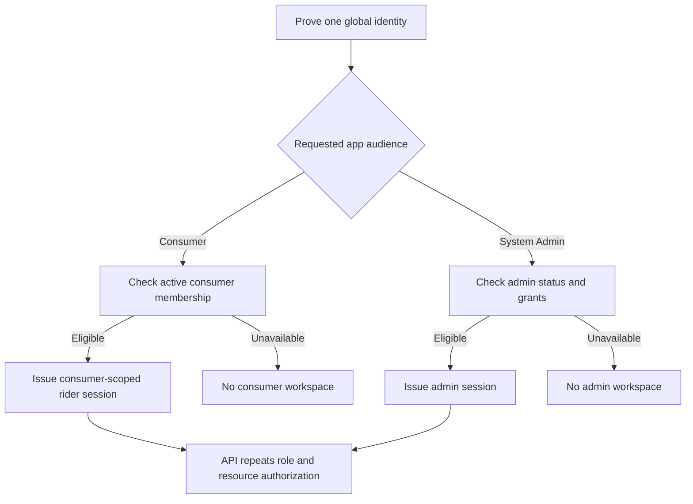

# Mobile sessions and installation lifecycle

The consumer and System Admin apps share KiloDrive's global identity authority
but use separate native applications, local storage and intended workspaces.
This chapter describes the public-safe trust model. It is not a device-fingerprint
recipe or a claim that all signed-device cases have been certified. See
[identity and access](../security/identity-and-access.md) for credential
ownership and [the two-app checkpoint](two-mobile-apps-and-security-2026-09-30.md)
for current source status.

## Four identifiers that must not be confused

| Identifier | What it represents | What it does not prove |
| --- | --- | --- |
| Global person | One control-plane account and its recovery, roles and security audit | Permission to operate every country or use every app workspace |
| Session family | Server-controlled login/refresh lineage and effective client role | Permanent possession of a device or authorization after revocation |
| Installation | One app-data lifecycle with a random secret and server-issued credential | A unique, permanent physical handset |
| Push token | A replaceable delivery address for one native app/channel | Current user ownership, active permission or actual receipt |

The app stores an installation secret using the platform's protected storage;
the server keeps a verifier and returns a credential for protected requests.
Device model, manufacturer, platform label and IP may help explain history,
but none is the durable identity. Reinstall, data reset and the two KiloDrive
apps can produce multiple installations on one handset. On platforms where
secure storage may survive reinstall, an ordinary app-data marker prevents
historical secure material from silently becoming the new installation.

## Login and dual-role resolution

Authentication first proves the global person. The API then resolves the
requested app audience and effective session role. An administrator may also
have an active rider membership under the same email:

The consumer app does not receive an administrator workspace merely because
the global identity has an admin role. Its request client removes acting-tenant
context, and the server checks the effective session role. The Admin app must
obtain an authorized country and tenant selection before loading operational
records. A remembered workspace or local preference cannot create a grant.

## Session and device state transitions

| Event | Client action | Server authority and expected result |
| --- | --- | --- |
| First install | Create installation-scoped random material, register, keep credential in app-private storage | Create a new installation record; metadata is descriptive only |
| Sign-in | Obtain session tokens, reconcile permitted workspace, bind current installation | Validate person, app audience, country/tenant eligibility and session family |
| Refresh | Serialize a single refresh flight; retain account and app scope | Rotate refresh within the server family; reject reuse or revoked family |
| App foreground | Recheck protected session/device state as needed, preserve route while transient checks run | Known ban or revoked session denies access; optional outage does not authorize a mutation |
| Switch account | Stop old realtime connections; clear account-bound caches, pending navigation and local notifications | Old family and token binding cannot be reused for the new person |
| Switch admin country/tenant | Invalidate old rows, requests, editors and pending actions | Every next read/mutation proves new scope independently |
| Rotate push token | Register current token for the signed-in app/session/installation | Retire or supersede stale binding; never infer user from token alone |
| Revoke session or restrict installation | Stop protected work and remove sensitive presentation state | Server denies further protected use under the revoked relationship |
| Logout | Request server revocation, then clear local tokens and private state even if the response is lost | Family/token binding becomes inactive; failed network cleanup is reconciled |
| Reinstall or data reset | Treat as a new installation and restore only server-authorized account state after login | Historical associations remain evidence, not current ownership |

The consumer app's optional local app lock is a screen-privacy control. With
lock enabled, a cold authenticated launch hides content immediately. The
background grace applies only to an app that was already visible. Biometric
success or the app PIN does not authorize a wallet, payout, identity or Admin
mutation. Those require the server's current session and any recent-auth or
action-bound second-factor proof.

## Protected request decision

A protected request may carry an installation credential, session token and
provider-verified app identity. The API resolves them independently. A claimed
platform, app name or build is not a substitute for provider verification;
neither a hidden menu nor a local device-status cache is an access policy. The
server checks installation restrictions and the session family's binding before
the domain handler examines role, tenant, country and target ownership.

The public browser and native audiences require different admission behavior.
They must remain explicit in policy and tests rather than inferred from a
user-agent string. This document does not publish a bypass recipe or assert that
every admission path is fully certified. The current source evidence and
remaining review are tracked in the restricted implementation ledger.

## Notification and deep-link implications

One push token can rotate independently of account or installation. The server
may accept delivery work while a user logs out, switches account, revokes a
session, changes country or disables OS notification permission. A worker
rechecks the binding before an exact-recipient send. Consumer and Admin app
channels are distinct. A notification tap is untrusted navigation input: the
app loads no private detail until the current user, session, workspace, route
and target grant are checked again.

Device management presents installation records and their historical account
associations for investigation. A user may have several installations, and
several people may have used one physical phone over time. This does not
license one account's current session to see another account's private data.

## Verification matrix

Use non-user fixtures and the exact signed candidate for the real-device part:

| Scenario | Required observation |
| --- | --- |
| Admin identity with and without rider membership | Consumer session contains only authorized consumer workspaces; Admin app has separately authorized scope |
| Consumer and Admin installed together | Independent app data, tokens, push routing, links and logout behavior |
| Reinstall or app-data reset | New installation does not inherit a historical credential or recipient binding |
| Token rotation, account switch and logout | Old recipient loses navigation and delivery eligibility |
| Session revocation or installation restriction | Existing screen cannot continue protected work after authoritative denial |
| Network loss during validation | No false approval of a money/security action; bounded read-only safety context where policy permits |
| Deep link from an old push | Current account and target authorization checked before content opens |
| Process death with pending mutation | Original operation identity and scope survive securely or action remains blocked for review |

Host tests verify policies and parsers; they do not prove native secure-storage
behavior, App Check, OS notifications or the signed iOS/Android lifecycle. Do
not put real installation secrets, tokens, IPs or device identifiers in this
public repository. Continue with the [notification lifecycle](notification-delivery-lifecycle.md)
and [mobile security verification](../quality/mobile-security-verification.md).
