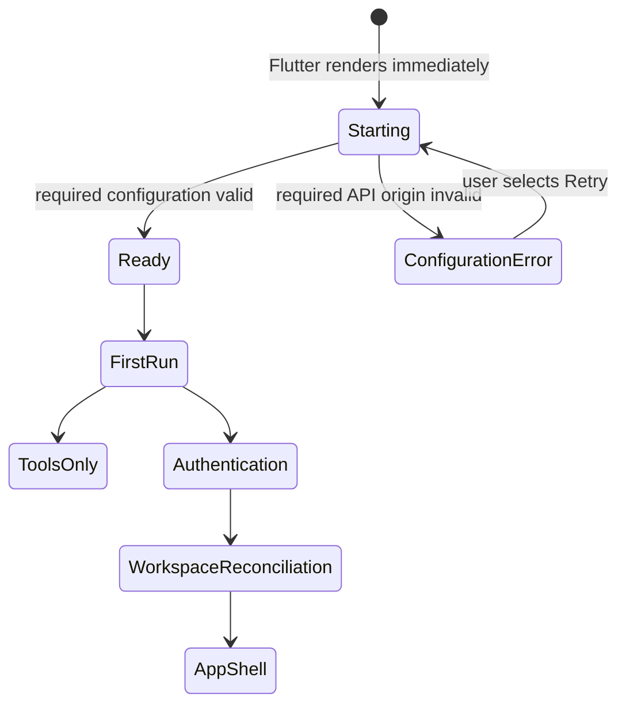

# Mobile Architecture

KiloDrive's mobile client is a Flutter application for Android and iOS. The same
binary can expose rider, driver, rental organization, tools-only, and authorized
System Administrator workspaces. This chapter explains the boundaries that keep
that breadth manageable and the release controls needed when Dart code depends
on native SDKs.

## Verified technology baseline

The current source targets Flutter 3.41.7 and Dart 3.11.5. The application uses
Material 3, Riverpod 3, Dio, Firebase services, Google Maps, platform secure
storage, local authentication, social sign-in, Play/App Store billing, and
LiveKit/WebRTC. Exact resolved versions are recorded in the private product
lockfile; this public guide intentionally contains no provider credentials.

Package presence does not prove that a feature is enabled. Firebase, maps,
social identity, store billing, push, and voice require signed native
configuration and approved server-side settings. Google Maps is the implemented
mobile rendering engine. A map abstraction makes another engine possible, but
Mapbox or Apple Maps rendering is not claimed as a shipped runtime option.

## Startup: render first, initialize safely

The app calls `runApp` immediately with a deterministic bootstrap state. It does
not wait for storage, Firebase, device information, connectivity, or a network
request before Flutter can paint. Optional plugin initialization begins after
the first frame and each operation has its own timeout.



A missing optional provider produces a bounded degraded capability, not an
infinite splash. Invalid required API configuration is different: the app shows
a localized, retryable configuration error. Tests use never-completing fakes to
prove the splash resolves.

The background Firebase message entry point is top-level and registered before
the widget tree. It cannot depend on a `BuildContext` or an in-memory provider
that will not exist in a killed process.

## Authentication and workspace reconciliation

Tokens are stored in platform secure storage. Access tokens are short-lived;
refresh is serialized so concurrent 401 responses do not rotate the same token
multiple times. A failed refresh emits a typed session-expired event. The event
atomically clears tokens and identity metadata, disconnects SignalR/voice,
evicts account-bound caches, and routes to login.

Logout first requests server refresh-token revocation and then performs local
cleanup even if the network response cannot be completed. Offline cleanup must
not leave another user's role, tenant, name, or workspace preference on the
device.

The last workspace is only a preference. After password, OTP, social login,
refresh, or secure-state restore, the app derives authorized workspaces from the
authenticated API claims/profile. A single-role driver cannot accidentally
render the rider shell because an old device preference says `customer`.
Multi-role users see only authorized choices, and a System Administrator selects
an authorized country workspace before administrative data loads.

The APK/IPA is an untrusted client. Changing Dart code, replaying an HTTP call,
or modifying a local role cannot grant server permission. The API revalidates
role, tenant, country, plan, compliance, wallet, and state-transition rules.

## Driver onboarding: resumable but not bypassable

New drivers move through one server-backed, twelve-page journey. The mobile app
renders immutable view models and saves the current page; it does not keep an
untyped JSON checklist or infer completion from one local flag.

| Page | Purpose | Blocking rule |
| ---: | --- | --- |
| 1 | Identity, profile photo, driver-licence details and licence document | Required |
| 2 | Proof of address and background/police evidence | May be deferred for up to 21 days; overdue evidence locks operations |
| 3 | Membership introduction and Free/Silver/Gold choice | A deliberate choice is required; paid membership is not required |
| 4 | Verified email and phone review | Both contacts must be present and verified |
| 5 | Language, currency display, distance unit, text/accessibility and optional 2FA preferences | Required confirmation; preferences do not change ledger currency |
| 6 | Vehicle make, model, year, condition and images | An existing complete verified vehicle satisfies it |
| 7 | Registration details, expiry and document | Required |
| 8 | Insurance details, expiry and document | Required |
| 9 | Fitness/inspection details, expiry and document | Required for every driver at the current implementation baseline |
| 10 | Optional reviewed Uber, Lyft or inDrive rating screenshots | Skippable; imported evidence remains separately labelled |
| 11 | Hourly-hire rate, distance unit, currency view and driver business preferences | Required confirmation; reviewed default hourly rate is USD 6.00 |
| 12 | Terms, Privacy and manual links plus explicit legal acceptance | Required to complete; cancel-and-delete follows the separate governed deletion flow |

Each page offers Back, Next, Save for later and Logout; the restricted settings
action exposes only basic preferences and cannot escape into the ordinary app
shell. Progress is server-derived. Saving after a completed journey is a safe
no-op, and completion is monotonic: a future checklist or document change may
make the driver operationally ineligible, but it must not send an already-
completed driver back to “add a vehicle.” Ongoing compliance and onboarding
history are different facts.

The API remains the enforcement boundary. Completion stages an outbox event for
administrator and driver notification, while operational bidding still requires
current licence, vehicle, document, membership, assignment, online and telemetry
eligibility. A client cannot unlock bidding by skipping screens or editing
local preferences.

Vehicle fitness is not country-conditional in the reviewed implementation:
onboarding, vehicle validation, readiness, and primary-vehicle selection all
require current fitness evidence. A country setting cannot waive that gate
today. Introducing country-conditional fitness later requires one versioned
server rule, matching client guidance, and positive/negative readiness tests;
documentation alone must never imply that behavior exists.

## Feature-first layering

New and migrated functionality lives under `features/<feature>/`. A mature
slice normally has these responsibilities:

```text
features/<feature>/
  data/          concrete API repository, cache adapters, DTO mapping
  domain/        immutable application models and repository interfaces
  presentation/ AsyncNotifier/view state and focused widgets
  <feature>.dart public barrel exported to consumers
```

Concrete `data/` implementations are private to their feature. Screens import
the feature barrel, not another feature's API repository. The repository owns
transport cancellation, caching, DTO conversion, and diagnostics. The notifier
owns user intent and presentation state. Widgets render state and dispatch
intent; they do not coordinate several raw HTTP calls.

Some older screens remain in the top-level `screens/` directory while migration
continues. Compatibility exports preserve routes during that work. Their
presence should be documented as migration debt, not proof that the boundary is
unnecessary.

## Riverpod state model

Feature controllers use auto-disposed asynchronous notifiers and immutable view
models. Watching a narrow selector keeps an unrelated dashboard card from
rebuilding when another card refreshes.

An asynchronous screen distinguishes:

- initial loading: shared shimmer appropriate to the content shape;
- successful empty: illustrated empty state and relevant next action;
- whole-screen failure: shared tonal error state with Retry;
- refresh failure: previously successful data plus a compact partial-error
  banner; and
- mutation state: the affected action is disabled without hiding the rest of
  the screen.

Optional endpoint failure cannot erase required core data. A membership screen,
for example, can retain plan/entitlement data while store availability displays
its own recoverable error.

## Request cancellation, generations, and caches

Dio `CancelToken`s cancel autocomplete, route, and other superseded reads when
the provider supports cancellation. When cancellation cannot stop a response,
the notifier attaches a monotonically increasing request generation and ignores
a response from an older generation. Disposal also invalidates the generation.

Type-ahead is debounced. Place details are cached briefly and keyed by provider
identity plus locale/country context. Image bytes use a bounded account-aware
LRU with requested decode dimensions based on logical size and device pixel
ratio. Logout and avatar revision changes evict relevant entries.

Caches have explicit TTLs and are never an authority for authorization,
financial balance, driver eligibility, or document approval.

## Realtime and offline behavior

SignalR events merge by a server-persisted entity version, not device wall-clock
time. An older event cannot overwrite a newer state. Polling remains a recovery
path rather than the primary real-time experience.

Only operations designed for replay enter an offline queue. Queue entries bind
to the account and tenant, retain the original idempotency key, have a TTL, and
are removed on logout. Wallet, payout, account-security, or other step-up
operations are not authorized by a local PIN or a stale offline decision.

Connectivity is advisory: a network indicator may say online while an API or
provider is unreachable. Repositories classify timeout, cancellation, 401
refresh, forbidden, successful empty, validation, conflict, rate limit, and
server failure into stable view outcomes.

## Navigation and shell ownership

Named route construction goes through the application routing layer so
transitions, deep links, and authorization checks remain consistent. Shell tabs
are body widgets owned by the shared app shell. Pushed detail/edit screens own a
scaffold. Phones use a navigation drawer; wider layouts can use a rail.

Deep links are treated as untrusted input. The app validates route shape,
authentication, workspace, and entity access before opening a destination.
External links use an allow-listed URI and a checked launcher with a localized
fallback.

## UI, localization, and accessibility

Colors, typography, shapes, and semantic statuses come from the theme. Content
loading uses shimmer rather than indefinite progress indicators. Controls have
at least a 48 by 48 logical-pixel interactive surface and a useful semantics
label, selected state, and focus order.

The app composes its preference scale with the platform text scaler instead of
replacing accessibility settings. Layout certification covers 320-pixel phones,
tablet portrait/landscape, split-screen, 1.3x and 2.0x system text, light, dark,
high contrast, open keyboard, three-button navigation, and gesture navigation.
Safe areas and `viewInsets` keep primary actions above the keyboard and system
navigation areas.

English, Spanish, French, Japanese, Simplified Chinese, and Traditional Chinese
ARB resources retain exact key and ICU-placeholder parity. The generic Chinese
resource is the Simplified fallback, not a separate language choice. Money uses
the active currency context and ISO-aware formatter. Server UTC timestamps go
through the nullable UTC parser and localized display helpers; malformed input
shows an unavailable marker rather than the current time.

## Location and maps

Location selection returns a last-known fix immediately only when age and
accuracy meet policy, requests a fresh balanced-accuracy fix in parallel,
updates coordinates first, and reverse-geocodes asynchronously. Nearby
reverse-geocode results are cached briefly. The UI shows an explicit locating or
retry state and can display coordinates when geocoding is unavailable.

Foreground/background driver telemetry follows platform permissions and store
policy. An online indicator is not a promise of infinite background execution.
The server expires stale telemetry and driver availability. Active-trip safety
and background location need visible, user-understood behavior and matching
store declarations.

## Native security and permission boundary

Permission prompts occur only when a user invokes a feature that needs them.
KiloDrive does not use a dismissible custom pre-prompt that steers the Apple
system choice. A denied permission produces feature-specific recovery guidance;
it never causes a startup loop.

Release manifests are inspected after merging because transitive native SDKs
can introduce permissions. Android gates reject advertising identifiers and
unapproved foreground-service permissions. iOS declares remote notifications
but does not use background audio or legacy VoIP keep-alive merely to preserve a
process.

The optional diagnostic proxy is compile-time gated. A production build rejects
it. A signed diagnostic build displays a persistent warning and blocks sensitive
wallet/security flows.

## Testing pyramid

1. **Every change:** pure models, formatters, repositories, providers, and widget
   tests with fakes.
2. **Merge:** semantics-driven emulator smoke for tools-only, rider, driver, and
   rental workspaces; no credentials in screenshots or artifacts.
3. **Nightly/release:** real-device permissions, background location, push,
   biometrics, offline queue, SignalR reconnect, store billing, and calls.
4. **Visual matrix:** pairwise screen harness for dimensions, text scale, theme,
   keyboard, navigation mode, touch target, semantics order, and overflow.

Race tests cover refresh versus mutation, dispose versus response, realtime
versus refresh, logout versus queued work, and session expiry during navigation.

## Native dependency release discipline

Release Dart code is built with the reviewed obfuscation and split-debug-info
controls. Obfuscation reduces casual recovery of symbols; it is not
authorization, encryption, or a place to hide a secret. Split debug symbols are
retained in protected release evidence and linked to the exact artifact hash so
crashes remain diagnosable.

CI scans AOT snapshots, native binaries, archive metadata and packaged resources
for developer workstation paths, source roots, debug service markers and other
release-only privacy regressions. It also checks that an IPA archive contains
the expected executable symbols rather than treating an empty scan as success.
Endpoints and feature concepts may remain discoverable in a client; the server
still enforces every permission and resource boundary.

Native upgrades are performed in isolated batches:

1. LiveKit/WebRTC;
2. social authentication and local authentication; then
3. Riverpod/state-management changes.

Each batch runs format, fatal analysis, tests, Android manifest/ABI/16 KB checks,
arm32+arm64 APK/AAB builds, iOS archive/entitlement/private-selector scans,
background/killed call tests, and store-permission diffs. Unrelated major
upgrades are not combined because a failure must have a small, attributable
change set.

See [Flutter package inventory](../third-party/flutter-packages.md) and the
[mobile release runbook](../runbooks/mobile-release.md) for the executable gates.
The feature ownership decision is recorded in
[ADR 010: Flutter feature repositories](../adr/010-flutter-feature-repositories.md).
