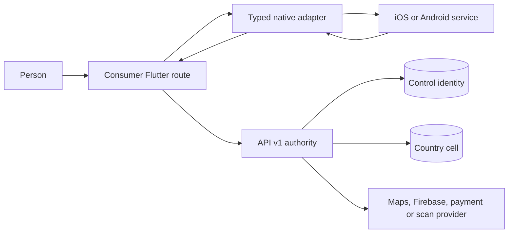
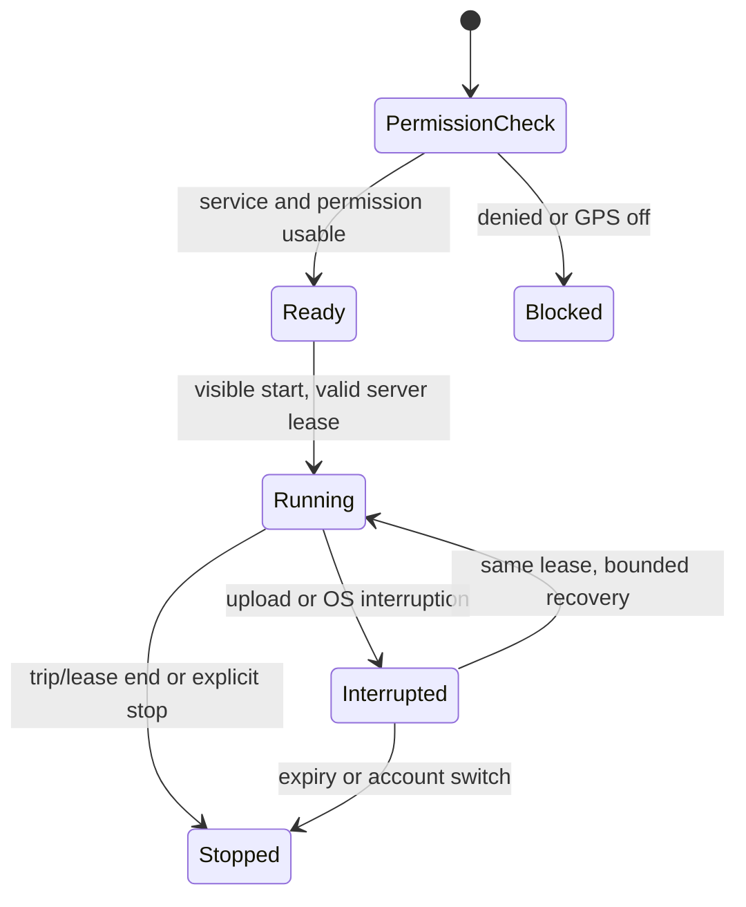

# Consumer native OS integrations

**2026-10-06 amendment:** Current source and retained evidence are described
in [build 196](release-1.0.0-196.md). Fresh-install preparation and trip state
composition are committed there; the original inspection below preserves its
date. Physical iOS and final paired-device verification remain separate from
host tests, source review and Android installation/launch checks.

**Owner:** Mobile platform, with Identity, Trips, Maps and Upload API owners.
**Last verified:** 2026-10-05 source review. **Environment:** Local modified
product checkout; no signed-device/provider exercise. **Evidence:** committed product
[`8bfe0888`](https://github.com/KiloDriveApp/KiloDrive/tree/8bfe08881bce51535d1165552f2d5be8e05fc872),
consumer `1.0.0+192`, System Admin `0.1.0+32`. There are uncommitted product
changes, including native location files; observations here are not a claim
about a deployed binary. Historical signed-build reports stay historical.

This chapter covers OS boundaries outside [store billing](native-adapters-and-store-billing.md),
[notification delivery](notification-delivery-lifecycle.md), and
[private media/voice content](documents-media-voice.md). The
[session chapter](mobile-session-and-device-lifecycle.md) owns installation
and identity. The [operator runbook](../runbooks/native-device-integrations.md)
handles failures without exposing device secrets or private locations.

## Context and authority



The OS proves that a picker returned a file, a location sensor returned a fix,
or a link was opened. It does not prove document approval, trip state, payment
capture, current account ownership or a valid tenant. The API checks those
conditions again. The consumer and System Admin packages have separate native
application IDs and protected stores; the Admin app does not inherit these
consumer routes merely because it shares an API or Firebase project. See the
[two-app source checkpoint](two-mobile-apps-and-security-2026-09-30.md), whose
build numbers are deliberately historical.

| Boundary | OS/Flutter observation | Server authority | Scope and persistence |
| --- | --- | --- | --- |
| App integrity | Firebase App Check token from App Attest or Play Integrity | Signed token validation plus session/device and endpoint policy | App ID, environment and installation; proof is not identity |
| Camera/gallery/file/crop | Selection, local path, cancellation or error | Upload validation, quarantine, scan and later review | Current account/tenant/document type; local path is ephemeral |
| Location | Permission, GPS service, fix age/accuracy, native tracking status | Trip/queue lease, driver ownership, accepted sample and state | Exact user/trip or queue lease; native bounded retry queue |
| Maps | SDK rendering and gesture result; proxy place/route response | API Maps proxy and business route checks | Screen/country and request; map tiles are presentation |
| Links and export | URI callback or destination picked | Current auth/scope and entity/payment status | Callback generation and recipient; exported bytes leave app control |
| Social login | Provider credential or explicit cancellation | API provider proof, pending-link/recent-auth ceremony | Provider subject, current registration intent/account |

The client should prepare the operation, verify the current workspace, invoke
the native surface, interpret a typed observation, reconcile with the API, then
show a result. A callback arriving after account switch, route disposal or
process restart is a hint to re-read current authority, never a command to
repeat a financial or trip mutation.

## Device integrity and protected storage

The [attestation adapter](https://github.com/KiloDriveApp/KiloDrive/blob/8bfe08881bce51535d1165552f2d5be8e05fc872/src/client/mobile/lib/core/platform_adapters/attestation_adapter.dart)
uses Firebase App Check; release Android selects Play Integrity and release
iOS App Attest. It distinguishes debug proof, unsupported host, timeout and
availability, and coalesces native token requests so a timed-out first-install
call is not immediately duplicated. The [API App Check middleware](https://github.com/KiloDriveApp/KiloDrive/blob/8bfe08881bce51535d1165552f2d5be8e05fc872/src/server/KiloDrive.Api/Security/AppCheck/AppCheckProtection.cs)
verifies token signatures and app identity. Signing, provisioning, provider
registration, network access and API policy still determine whether a specific
signed artifact succeeds. A transient provider outage is not a device ban;
an authoritative revocation is not fixed by clearing app storage.

The [secure credential adapter](https://github.com/KiloDriveApp/KiloDrive/blob/8bfe08881bce51535d1165552f2d5be8e05fc872/src/client/mobile/lib/core/platform_adapters/secure_credential_adapter.dart)
uses Keychain/Keystore-backed plugin storage and a user/tenant/country/role
namespace. Native writes remain serialized even after caller timeout because
the operation may later commit. The iOS first-install
[preparation channel](https://github.com/KiloDriveApp/KiloDrive/blob/8bfe08881bce51535d1165552f2d5be8e05fc872/src/client/mobile/lib/core/bootstrap/installation_preparation.dart)
reconciles a reinstall marker. Corrupt or unavailable protected state must be
handled as unknown and held for supported recovery; do not delete a financial
journal to clear a warning. Biometric/PIN unlock protects the local display,
not API security or money authority.

## Media capture and review

```mermaid
sequenceDiagram
    participant U as User
    participant F as Flutter route
    participant P as Picker or cropper
    participant A as Upload API
    participant S as Scanner/reviewer
    U->>F: Choose document class and source
    F->>P: Open camera, gallery, file or cropper
    alt user cancels
        P-->>F: cancelled value; retain mounted route
    else selection
        P-->>F: temporary path and name
        F->>F: Recheck mounted route and account scope
        F->>A: Upload bounded bytes and metadata
        A->>S: Quarantine and scan
        S-->>A: Available, rejected or still pending
        A-->>F: Authoritative status
    end
```

The [capture adapter](https://github.com/KiloDriveApp/KiloDrive/blob/8bfe08881bce51535d1165552f2d5be8e05fc872/src/client/mobile/lib/core/uploads/document_capture_adapter.dart)
wraps image picker, file picker and cropper. It returns `selected`,
`cancelled`, `unavailable` or `failed`; native Back/cancel is not a Flutter
route pop. Cropping limits dimensions and quality, but the API still validates
declared type, magic bytes, size, ownership and scan state. Paths and filenames
are private and must not enter diagnostics. The [Android manifest](https://github.com/KiloDriveApp/KiloDrive/blob/8bfe08881bce51535d1165552f2d5be8e05fc872/src/client/mobile/android/app/src/main/AndroidManifest.xml)
removes broad inherited media-read permissions; the [iOS plist](https://github.com/KiloDriveApp/KiloDrive/blob/8bfe08881bce51535d1165552f2d5be8e05fc872/src/client/mobile/ios/Runner/Info.plist)
declares camera/photo purpose strings. A configured entitlement or passing
mock cannot establish that activity/scene restoration preserves every route.

| Capture state | Allowed next action | Recovery |
| --- | --- | --- |
| Not started or cancelled | Keep form and selected document type | User may re-open picker; no upload inferred |
| Selection returned | Recheck route and account before reading path | Discard stale callback on switch/disposal |
| Upload pending/unknown | Query server status with original operation | Do not submit duplicate evidence blindly |
| Quarantined | Show scan pending, not approved | Bounded scan replay by operator |
| Approved/rejected | Render server decision and review note | New upload follows review policy |

## Location and Maps

The [foreground adapter](https://github.com/KiloDriveApp/KiloDrive/blob/8bfe08881bce51535d1165552f2d5be8e05fc872/src/client/mobile/lib/core/location/foreground_location_adapter.dart)
uses Geolocator for service/permission checks, current and last-known fixes,
streaming, and Settings handoff. A fix is usable only when coordinates,
accuracy and timestamp pass explicit age bounds; a future or stale fix is not
silently relabelled live. Approximate permission can produce a fix but may not
meet a high-accuracy trip rule. GPS-off, denied permission, sensor timeout,
offline upload and rejected server sample are separate statuses.

For accepted trips or a queue lease, the
[background adapter](https://github.com/KiloDriveApp/KiloDrive/blob/8bfe08881bce51535d1165552f2d5be8e05fc872/src/client/mobile/lib/core/location/background_location_adapter.dart)
bridges to [native session control](https://github.com/KiloDriveApp/KiloDrive/blob/8bfe08881bce51535d1165552f2d5be8e05fc872/src/client/mobile/lib/core/location/active_trip_location_service.dart).
Native tracking can start only while the app is visible with a current
server-authorized token and exact trip/lease identity. Android declares a
location foreground service; iOS declares location background mode. The native
implementation, battery policy, screen-off behavior and iOS suspension require
signed-device tests on the exact candidate. A native `observation` is scoped
to trip and user and returns status, not coordinates or credentials. Stop on
trip end, unassignment, explicit user stop, logout or lease expiry; a failed
upload does not extend the server lease.



Maps use the `google_maps_flutter` renderer while place search, geocoding and
route computation go through `/api/v1/maps/*` to the API proxy. A blank map
can be native API-key/signature/territory configuration, tile/network failure,
or a missing widget; it is not proof that the server Maps proxy failed. The
server can return `maps_not_configured` when its key is absent. Gestures and
markers are presentation; chosen coordinates and route changes still pass
business validation. External navigation handoff may fail or return late;
the trip remains authoritative on the API, not in the navigation app.

## Links, social callbacks, exports and accessibility

The [deep-link lifecycle adapter](https://github.com/KiloDriveApp/KiloDrive/blob/8bfe08881bce51535d1165552f2d5be8e05fc872/src/client/mobile/lib/core/platform_adapters/deep_link_lifecycle_adapter.dart)
uses App Links and typed intents. It rejects malformed, expired, wrong-account
and inappropriate Admin routes before queueing navigation. A push route or
PayPal return is a hint to fetch the current entity/payment state; it cannot
commit a purchase, unlock a screen or replay a mutation. Android intent
filters and iOS associated domains/URL types depend on host and signing
configuration. An external legal reader opens through the
[link launcher](https://github.com/KiloDriveApp/KiloDrive/blob/8bfe08881bce51535d1165552f2d5be8e05fc872/src/client/mobile/lib/core/external_link_launcher.dart),
which accepts only HTTP(S), telephone or mail schemes and gives an unavailable
state when no app handles the link.

The [social adapter](https://github.com/KiloDriveApp/KiloDrive/blob/8bfe08881bce51535d1165552f2d5be8e05fc872/src/client/mobile/lib/core/social_auth.dart)
uses Google, Facebook and Apple plugins. Native cancel/provider failure must
return to the current registration intent without creating a different user.
The API `/api/v1/auth/social` verifies provider material; an email collision
uses a protected pending-link and recent-auth ceremony, not automatic merging.
Apple's one-time presentation name may be kept briefly in secure storage;
tokens, authorization codes and relay email are excluded from that store.
Account switch fences delayed provider callbacks.

The [export adapter](https://github.com/KiloDriveApp/KiloDrive/blob/8bfe08881bce51535d1165552f2d5be8e05fc872/src/client/mobile/lib/core/platform_adapters/export_save_adapter.dart)
rechecks scope before and after the OS save dialog. The second check cannot
undo bytes already written to a user-selected destination; operators must
treat exported files as outside the app's private storage. Password-manager
autofill and keyboard behavior are OS facilities, not identity proof. The app's
accessibility text scaling/contrast boundary is described in
[mobile architecture](mobile.md); test keyboard return, large text, VoiceOver
and TalkBack on a signed device rather than inferring them from widgets.
RTC microphone and audio-focus interruption belong to the
[voice chapter](documents-media-voice.md) and
[notification/call chapter](notification-delivery-lifecycle.md).

## Verification and evidence gaps

Host adapter/contract tests include
[`platform_secure_credential_outcome_test.dart`](https://github.com/KiloDriveApp/KiloDrive/blob/8bfe08881bce51535d1165552f2d5be8e05fc872/src/client/mobile/test/platform_secure_credential_outcome_test.dart),
[`native_location_observation_test.dart`](https://github.com/KiloDriveApp/KiloDrive/blob/8bfe08881bce51535d1165552f2d5be8e05fc872/src/client/mobile/test/native_location_observation_test.dart)
and [`deep_links_test.dart`](https://github.com/KiloDriveApp/KiloDrive/blob/8bfe08881bce51535d1165552f2d5be8e05fc872/src/client/mobile/test/deep_links_test.dart).
These prove modeled outcomes, not App Attest/Play Integrity admission, actual
camera permissions, activity restoration, map signing restrictions, background
GPS or physical accessibility. Exact signed IPA/AAB, tester account, OS,
provider environment and device lifecycle evidence must be recorded separately
before any row is called passed. Current status for those cases: **untested or
blocked pending exact-artifact evidence**, not certified.
