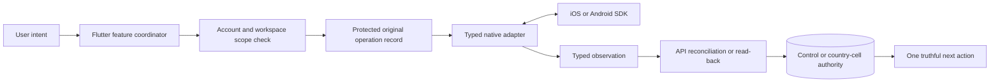
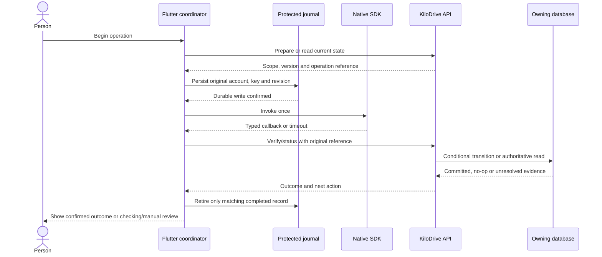

# Native platform boundary handbook

- **Owner:** Mobile platform architecture; membership, identity, communications and trip owners review their respective flows
- **Last verified:** 2026-10-05
- **Environment:** Local product source at `8bfe08881bce51535d1165552f2d5be8e05fc872` with uncommitted changes; documentation review, not a signed-device exercise
- **Evidence:** [Source snapshot](native-source-snapshot.json), [adapter inventory](native-adapter-inventory.json) and [certification matrix](../quality/native-platform-certification-matrix.md)

**2026-10-08 amendment:** [Build 198](release-1.0.0-198.md) is the current
committed source checkpoint. [Generated version facts](source-versions.generated.md)
record consumer `1.0.0+198`, Admin `0.1.0+33` and schema `2026.10.08.2`.
Historical file anchors and the original inspection below retain their dates.
The scenario register remains a test plan; the [current baseline](../current-baseline.md)
separately records executed results.

This is the entry point for the iOS and Android adapter handbook. A native SDK
can tell the app that a sheet was presented, a file was selected, a GPS fix
arrived, or a notification was accepted by a provider. It cannot grant a
KiloDrive membership, approve identity, move wallet value, or advance a trip.
Those decisions belong to the authenticated API and its owning database.

| Journey | Owning explanation | Recovery procedure |
| --- | --- | --- |
| Apple subscriptions | [StoreKit and store billing](native-adapters-and-store-billing.md) | [Store entitlement reconciliation](../runbooks/store-entitlement-reconciliation.md) |
| Google subscriptions and RTDN | [Play Billing adapter](google-play-billing-native-adapter.md) | [Play Billing recovery](../runbooks/google-play-billing-recovery.md) |
| Push, sound and incoming calls | [Notification lifecycle](notification-delivery-lifecycle.md) and [media/voice](documents-media-voice.md) | [Notification canaries](../runbooks/notification-canaries.md) and [LiveKit voice](../runbooks/livekit-voice.md) |
| Installation, attestation and protected state | [Mobile session and device lifecycle](mobile-session-and-device-lifecycle.md) | [Native-device integrations](../runbooks/native-device-integrations.md) |
| Camera, location, Maps, links and OS services | [Native OS integrations](native-os-integrations.md) | [Native-device integrations](../runbooks/native-device-integrations.md) |

The [inventory](native-adapter-inventory.json) names each grouped native
capability, source interface/implementation, callback, API owner, scope,
permission, recovery record, diagnostic, tests and certification status. The
[matrix](../quality/native-platform-certification-matrix.md) deliberately leaves
current signed-artifact scenarios **untested** until evidence is attached.
The original 2026-10-05 checkout was dirty: its pinned commit alone did not
reproduce every observation. The build-196 amendment records the subsequent
committed recovery changes without relabeling old test evidence.

## One operation, two kinds of truth

The journal write is required **before** a value-changing native invocation
when loss of the response could hide a charge. A native callback can be late,
duplicated or associated with a different account. Flutter therefore checks
the original account, tenant, country, role, installation, operation ID,
idempotency key, entity revision and callback generation before accepting it.
The API checks the current session and resource again; a local check never
substitutes for server authorization.

Not every adapter needs a server-side `prepare`: opening a file picker is not
a financial command. The invariant is that the **owner of truth** decides the
effect after the native observation. Where an Apple sheet fails before a
transaction identifier exists, a prepared local/server record alone cannot
prove that Apple did not charge; the new-purchase action stays fenced until
exact provider evidence or a restricted manual review resolves it.

## Outcome vocabulary and safe transitions

| State | Evidence | Visible action | Re-entry rule |
| --- | --- | --- | --- |
| Not started | No native invocation began | Start, if current policy permits | A new operation may be created |
| Explicitly cancelled | Native API confirmed user cancellation before a charge or mutation | Return to prior task | A new operation is allowed only when no unresolved provider evidence exists |
| Pending | Provider or OS says work has not reached a terminal result | View status or manage with provider | Keep original operation and bounded reconciliation |
| Committed | API has authoritative, owner-bound provider/domain proof | Show receipt or current state | Replay is a no-op; retire only matching journal |
| Failed, not completed | Authoritative no-effect proof or validated precondition rejection | Correct input or safe new action | Do not call a timeout a failure |
| Outcome unknown | Response or callback lost after possible side effect | Checking outcome with support reference | No blind duplicate; query original operation |
| Manual review | Provider/account evidence conflicts or cannot be obtained safely | Contact restricted support with reference | Preserve evidence and fence new mutation |

The typed result contract is implemented in
[`platform_adapter_contract.dart`](https://github.com/KiloDriveApp/KiloDrive/blob/8bfe08881bce51535d1165552f2d5be8e05fc872/src/client/mobile/lib/core/platform_adapters/platform_adapter_contract.dart):
availability, permission, lifecycle, certainty, retryability, next action,
state revision, correlation and sanitized telemetry are separate fields.
`NativeOperationLane` serializes protected native writes until the underlying
operation settles; timing out the caller does not make a later delete safe.
Both files are source evidence, not signed-device certification.

## Authority, scope and cached observations

| Observation | Safe use | Authority it cannot replace |
| --- | --- | --- |
| Store product and localized price | Present the storefront offer; compare to reviewed mapping | Subscription entitlement, charge/ledger or account binding |
| GPS fix and route drawing | Show bounded location confidence and navigation context | Physical arrival, trip transition or fare/settlement truth |
| Push, SignalR or call event | Invalidate and re-read a scoped projection | Domain commit, delivery-to-human proof or payment command |
| Picker/cropper result | Stage a private upload | Scan outcome, document validity or identity approval |
| Keychain/Keystore and biometric unlock | Protect local pixels and original recovery references | Recent server authentication, 2FA or admin authorization |
| Last-good read model | Keep a screen useful during refresh | Money, readiness, identity or trip mutation authorization |

An account switch, logout, tenant/country switch, app restart, process death,
reinstall or delayed callback invalidates the old UI generation. Protected
records must either retain the original scope and reconcile under the correct
account or fail closed with a support route. No component may “repair” a stuck
purchase by deleting its journal, finishing every StoreKit transaction,
creating a new idempotency key or granting entitlement from a push.

## Platform and privacy limits

iOS background execution, APNs, CallKit, StoreKit and Keychain behavior differ
from Android foreground services, FCM channels, Play Billing and Keystore.
Force-quit, Focus/Do Not Disturb, permission changes, carrier connectivity and
store account state can prevent a native callback or audible alert. The app
must distinguish provider acceptance from actual OS presentation and give a
bounded in-app recovery path where one is possible. See the linked chapters
for the platform-specific restrictions.

Telemetry contains support code, operation category, duration, lifecycle and
sanitized correlation only. Do not place purchase tokens, receipts, JWS,
documents, raw GPS, message bodies, private links or installation secrets in
this public handbook or client diagnostics.

## Verification rule

Host tests verify parsers, state transitions and callback fences; emulator
tests verify a narrower OS path; provider sandbox tests verify that provider's
test environment; only an exact signed artifact on a physical device can
support the corresponding device row. A prior build's screenshot never becomes
evidence for source build `1.0.0+192` or Admin `0.1.0+32`.

Use the [certification matrix](../quality/native-platform-certification-matrix.md)
and retain a build hash, OS/device, app role/account fixture, provider
environment, scenario, UTC observation and restricted evidence link per row.
For platform semantics consult primary [Apple StoreKit](https://developer.apple.com/documentation/storekit/transaction),
[App Store Server API](https://developer.apple.com/documentation/appstoreserverapi),
[Play subscriptions](https://developer.android.com/google/play/billing/subscriptions)
and [Firebase Flutter message lifecycle](https://firebase.google.com/docs/cloud-messaging/flutter/receive-messages)
documentation; source implementation and current product policy still decide
what KiloDrive actually does.
