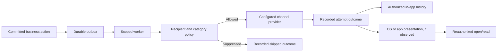

# Notifications: authority, delivery and recipient isolation

A KiloDrive notification is not the business event that caused it. A completed
trip, account change or payment is owned by its domain transaction; a
notification is a durable attempt to tell an eligible recipient about that
state. The consumer app and separate System Admin app have different audiences
and native app channels. This chapter describes source-level behavior and
evidence needed to make a delivery claim, without exposing private message
content or provider configuration.

## The five moments of a message

| Moment | Authoritative evidence | What may be shown |
| --- | --- | --- |
| Business state committed | Owning identity or country-cell transaction | The domain result, independent of messaging |
| Delivery work staged | Outbox/notification record with intended recipient and template | Queued, with a safe reference |
| Provider attempt completed | Attempt record and sanitized provider outcome | Accepted, rejected, failed, retrying or skipped |
| OS/app presented | Platform-specific device observation where available | Presented only when actually observed; provider acceptance is insufficient |
| Person opened/read | Authenticated inbox or target action | Read only after current recipient and scope reauthorization |

Workers may retry at-least-once delivery. The domain event and each attempt
therefore need stable correlation and deduplication; “exactly once to the
person” is not a defensible provider guarantee. A suppressed push is an
explicit `Skipped` outcome, not a successful send. A missing or failed provider
initialization remains a retryable failure when policy requires delivery.

## Consumer notification policy

Consumer categories include ride/trip, delivery, wallet and promotions.
Promotions default off; account/security communication follows its mandatory
policy rather than a marketing toggle. The backend applies the preference when
dispatching, because a local switch cannot govern an already queued send.
The in-app notification history is useful even if OS permission is denied.

Push, SMS and email are channel adapters. Push uses a registered native token;
SMS and email resolve approved wording from a shared template catalog with
reviewed tenant overrides. Templates and recipient data are not assembled by
arbitrary screen code. A provider failure is recorded and retried according to
the outbox policy. A payment or account mutation is not rolled back because a
notification provider is temporarily unavailable.

Private chat text, document facts and sensitive account details should not be
placed in a generic OS-rendered preview. A foreground presentation can load
safe detail only for the currently authenticated recipient. Background and
terminated states have different platform behavior and require signed-device
testing on each supported OS; a foreground Dart callback is not proof of
killed-app behavior.

## Administrator alerts and sends

The System Admin app has an opt-in private alert inbox distinct from consumer
notification history. An alert's push is a generic hint. Opening a case or
person record requires a fresh session, selected country/tenant, event type,
route and target permission check. An old push cannot grant access after a
capability is removed. Read and archive actions have their own durable result
and must retain a stable operation identity after an interrupted response.

An administrator's guarded compose/send flow requires the relevant grant and
proof. It can queue a notification and inspect its delivery history, but the
client must not report “received” simply because a provider accepted it. The
full batch-to-provider graph and administrator alert email delivery remain
incremental in the current mobile migration.

Exact-installation notification is narrower than ordinary account messaging.
The source checks for one current user, session family, installation, active
token generation, verified app channel, permission and deployment-approved
presenter. The operator chooses an approved fixed template and records a
purpose; arbitrary private text is not sent. Queueing creates an audited
operation. The dispatch worker rechecks eligibility so a logout, rotation or
restriction between queue and send does not use an obsolete binding. The
reviewed presenter is platform/state-specific; unsupported states are
unavailable rather than redirected to an OS preview that cannot verify the
recipient. This is source design, not proof of production delivery.

## Token and account lifecycle

| Change | Expected delivery behavior |
| --- | --- |
| First permitted registration | Bind token to the signed-in account, app channel, installation and active session as required |
| Token rotation | New generation supersedes the old; pending exact sends re-evaluate eligibility |
| Permission denied | Do not claim push presentation; retain authorized in-app history where applicable |
| Logout or workspace exit | Deactivate the relevant binding and clear local routes/notifications where the OS permits |
| Account switch | Old-account notification cannot open content in the new account |
| Session revocation or installation restriction | Protected detail and targeted delivery fail current checks |
| App reinstall | New installation must not inherit old recipient eligibility |
| Provider timeout or duplicate callback | Record/reconcile one intended attempt; do not create a second business action |

The delivery history should carry safe operation, template, channel, attempt,
status, time and correlation fields. It should not store rendered private bodies,
raw destinations, push tokens, receipts or full provider payloads in general
telemetry. A user-facing audit description explains who requested a send and
what class of notification was attempted without revealing the content.

## What to test before claiming delivery

Unit and component tests cover category policy, template fallback, dedupe,
redaction and worker outcome mapping. API tests cover authorized/denied reads,
recipient rebind, tenant/country isolation and stale token rejection. Provider
tests cover acceptance, rejection, timeout, duplicate and retry. Signed-device
tests cover foreground, background, terminated launch, account switch,
permission denial, Focus/Doze where relevant, and notification-tap
reauthorization. The exact artifact, OS, app channel, provider environment and
sanitized operation reference must be recorded together.

See [realtime and events](realtime-and-events.md),
[mobile sessions and installations](mobile-session-and-device-lifecycle.md),
[notification canaries](../runbooks/notification-canaries.md), and
[testing and verification](../quality/testing-and-verification.md). A green
widget test or an accepted FCM response alone does not close the device matrix.
