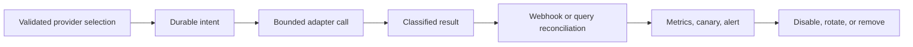

# Plugins, Providers, and Extension Points

## What “plugin” means here

KiloDrive does not load arbitrary executable modules in production. Extension is
compile-time code behind dependency-injected interfaces, validated configuration,
country/tenant controls, and provider adapters. This is less dynamic than a
general plugin host and much easier to secure, test, and support.

An adapter may be **verified** (implemented and tested), **configurable**
(implemented but needing credentials, country approval, and rollout), or
**planned** (the seam exists but the provider does not). Documentation preserves
those distinctions.

This vocabulary prevents a common documentation mistake: drawing a box around a
possible provider and later reading the diagram as deployment evidence. An
interface proves only that code can be substituted. Production readiness also
requires credentials, account approval, jurisdiction, quotas, network
reachability, monitoring, a canary, an owner, and a recovery procedure.

## Implemented boundaries

| Capability | Boundary | Verified/configurable examples |
| --- | --- | --- |
| Payments | gateway and verifier | Stripe, PayPal, bank transfer; simulator is non-production |
| Store billing | signed transaction verifier | Google Play and Apple server validation |
| Notifications | channel/provider adapter | FCM/APNs, AWS/Twilio SMS/WhatsApp, SES |
| Maps | route/geocode/matrix/map match | Google Maps and OSRM-compatible services |
| Voice | token/room/egress/retention | LiveKit, TURN, private S3 output |
| Uploads | object storage and scan | S3 and ClamAV-compatible scanning |
| Cache/realtime | cache, telemetry, backplane | Valkey/Redis protocol |
| Dispatch bus | publisher/consumer + SQL recovery | EventBridge and SQS |
| Reports | builder and renderer | ClosedXML and QuestPDF |
| Observability | trace/metric/log exporter | OpenTelemetry/OTLP and CloudWatch paths |
| Edge/challenge | proxy and human challenge | Cloudflare-compatible headers and Turnstile |

Mapbox, Apple Maps rendering, Valhalla, alternate processors, and managed CDR are
possible future adapters, not claims of current production support.

## Adapter contract

Every provider answers:

1. What validated non-secret configuration selects it?
2. Can workload identity replace static credentials, and who rotates access?
3. What bounded timeout applies?
4. Is retry safe; what idempotency and unknown-result reconciliation exist?
5. Which signatures, products, base plans, currency, amount, and issuer claims
   are verified?
6. What minimum data is sent, retained, and redacted?
7. Which outbox record durably precedes the call?
8. What readiness signal, protected canary, metric, and alert exist?
9. Is fallback equivalent and country-approved, or should it fail closed?
10. How does an operator replay, reconcile, disable, rotate, and roll back?

Provider SDK types stop at the adapter. Application handlers exchange KiloDrive
DTOs/results so an SDK upgrade does not leak through controllers or mobile.

### Result and error model

Adapters do not return an unstructured provider exception to the feature. They
classify outcomes into a small application vocabulary:

- accepted, with a safe provider reference;
- rejected permanently, with a stable internal reason;
- transient failure, eligible for bounded backoff;
- rate limited, with safe retry guidance where supplied;
- unknown outcome, requiring provider lookup/reconciliation; or
- disabled/not configured, an operational state rather than a crash.

The full raw response may contain personal data or credentials and is not copied
to logs, audit, ProblemDetails, or an outbox error column. Adapters extract only
the evidence the lifecycle and operator need.

### Lifecycle, not just interface shape

An extension point includes its whole lifecycle:

If an interface has no idempotency model, webhook authenticity rule, canary, or
disable path, it is an incomplete integration seam.

## Configuration and feature flags

Dependency injection selects only known adapter names; configuration never
supplies a runtime assembly/type path. Startup rejects a selected production
adapter with missing critical settings while allowing unused optional providers
to remain absent.

A feature flag controls exposure, not authorization. Role, plan, country, KYC,
and lifecycle checks remain server-enforced when a client is stale or modified.

Configuration is bound into typed options and validated for the selected
environment. Secret values come from a protected source or workload identity;
examples use placeholders. A provider switch is explicit and audited. The API
does not silently fall back to a simulator, logging provider, or unrelated
country route in production.

Fallback is a product/compliance decision, not a catch block. Primary and backup
providers must agree on message purpose, consent, sender identity, template,
data processing, destination country, idempotency, and status semantics. If
equivalence is not proven, the safe behavior is a visible temporary failure.

## Provider calls and durable work

Mutations commit provider intent to the outbox with domain state. A worker calls
the adapter after commit using a fresh tenant scope and safe correlation data.
Outcomes are succeeded, rejected, transiently failed, or unknown. Unknown is not
retried blindly: reconcile by stable provider reference/idempotency key first.

Webhooks are expected to duplicate and arrive out of order. Receivers validate
authenticity, recover scope from durable records, and apply conditional
idempotent transitions.

The HTTP request cancellation token ends at commit. After commit, durable work
uses worker lifetime and its own timeout. Otherwise a caller disconnect can
cancel the only realtime/provider notification even though the business change
already succeeded.

## Canary and telemetry policy

Canaries use dedicated non-user destinations and least-privilege identities.
They store only provider ID, latency, sanitized status, and correlation ID. They
never persist contact destinations, room tokens, bodies, payloads, or secrets.
Maintenance/disable controls stop intentional absence becoming alert noise.

A probe is not enabled with a real rider's phone or an engineer's mailbox. It
uses a dedicated non-user destination and a narrowly scoped credential. Canary
history records only the integration name, safe provider identifier, duration,
sanitized outcome, and correlation identifier.

## Map portability

Routing, geocoding, map matching, and map rendering are separate. The API has
provider-facing route/geocode and OSRM-compatible seams. Flutter isolates map
controller operations, but the verified renderer remains Google Maps today. A
new renderer needs a real adapter, parity tests, attribution, degraded behavior,
privacy review, and regional cost evaluation.

## Compatibility and removal

Adapter changes preserve application DTOs unless a versioned contract changes.
Rollout uses canary/dark comparison and a quick disable. Removal requires zero
active references, no pending provider work, retention of required references,
package/permission cleanup, updated SBOM/notices/privacy declarations, and a
rollback package that no longer depends on the removed SDK.

## Adding a provider safely

1. Write the application capability and failure semantics before selecting an
   SDK.
2. Review security, privacy, license, maintenance, permission, and regional
   availability.
3. Implement behind an existing boundary or record an ADR for a new boundary.
4. Add deterministic fakes for success, rejection, throttling, timeout, unknown
   outcome, duplicate webhook, and out-of-order webhook.
5. Commit domain intent/outbox state before the call and make execution
   idempotent.
6. Add typed configuration validation, least-privilege access, secret rotation,
   redaction, health, bounded metrics, and a protected canary.
7. Test in a sandbox and then a controlled non-user production destination.
8. Roll out by country/tenant with a disable switch and observed limits.
9. Regenerate SBOM/notices and diff native permissions or entitlements.
10. Document owner, quota, alert, fallback, rollback, and recovery exercise.

## Contract testing

Each adapter shares a behavior suite so providers cannot reinterpret core
semantics. All message providers, for example, reject an empty destination,
respect cancellation before a call, redact exceptions, return a safe reference,
and never claim production success for a logging fallback. Payment adapters add
amount/currency/account binding, duplicate webhook, unknown outcome, partial
refund, and chargeback cases. Map adapters add waypoint order, units, route
absence, malformed geometry, and provider timeout.

SDK-specific tests then cover signatures, request translation, status mapping,
and sandbox responses. A provider can pass its SDK tests and still fail the
common contract; it is not interchangeable until both pass.

## Review checklist

- Is it implemented or only planned?
- Are direct/transitive packages and licenses inventoried?
- Could exceptions, payloads, or secrets cross the boundary?
- Could retry duplicate money, entitlements, bookings, or messages?
- Are timeout, cancellation, fallback, and unknown outcomes tested?
- Is telemetry bounded and free of PII?
- Does a protected canary exercise the minimum useful operation?
- Can operators disable, reconcile, replay, rotate, and recover it?
- Does documentation say verified, configurable, or planned truthfully?
- Was the exact artifact checked for new native code, permissions, entitlements,
  and notices?
