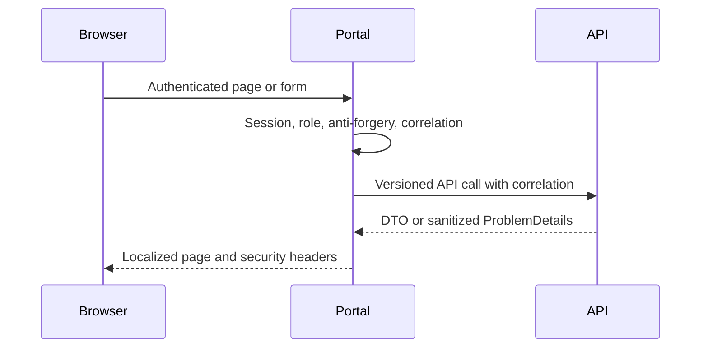

# Portal and Corporate Website Architecture

## Two server-rendered browser applications

KiloDrive has two .NET 9 browser applications with different boundaries:

- the **Portal** is an authenticated ASP.NET Core MVC client for users and
  administrators;
- the **Corporate Website** is an ASP.NET Core Razor Pages public site for
  content, calculators, support entry points, and legal information.

Neither application owns domain tables or receives MySQL credentials. Both call
the versioned API, which remains the authorization and business-rule authority.
Hiding an action in HTML helps usability; it is never security.

The split is deliberate. The Portal has authenticated sessions, privileged
forms, and operational data. The Website is optimized for public content,
discoverability, calculators, and a small anonymous attack surface. Combining
them would make every public page share the Portal's cookies, middleware,
deployment cadence, and administrative dependencies. Keeping them separate
reduces blast radius without duplicating domain logic in either application.

## Portal request flow

GET actions load current values; a distinct POST action validates and mutates.
Every browser mutation uses anti-forgery validation in addition to API
authorization. Redirect, validation, forbidden, not-found, and error pages retain
the same correlation and header policy as successful pages.

System administration is organized into dashboard, users, drivers, riders,
vehicles, verification, finance, support, settings, reports, content, email
tracking, and audit. Large detail pages use independent tabs/states. Lists use
stable ordering, paging, search, and explicit country workspace scope. A global
administrator without a local projection can still select an authorized country.

The portal API client forwards a validated correlation ID and translates stable
API errors into field/page errors. It never displays raw provider responses,
exceptions, or JSON dumps in place of a detail UI.

### Sessions and step-up boundaries

The Portal session is not a second identity system. Sign-in establishes a
server-side browser session backed by the API's authenticated identity; expiry,
revocation, role, tenant, and country rules still come from the API. Refresh or
session failure clears the local browser session rather than leaving a shell in
which every API call fails.

Sensitive operations—password/contact change, 2FA/passkey changes, payout,
cashout approval, security administration, or another policy-defined
boundary—require recent proof. A valid browser cookie does not silently satisfy
step-up. Anti-forgery protects the browser request from CSRF; it does not replace
authorization or step-up.

### System Administrator country workspaces

A System Administrator starts with global identity but must select an authorized
country workspace before country records load. The selected country and acting
tenant are validated on every API request and cannot be supplied by a normal
user. Switching workspace invalidates country-scoped page state and cached
lookups. Counts, searches, tabs, exports, and mutations always display their
active scope so an operator does not mistake one country's data for another.

Administrative pages favor a master/detail shape: ordered pageable lists,
dedicated entity pages rather than raw JSON dialogs, independent tabs for
related subdomains, field-specific validation, and explicit destructive
confirmation. A safe support/correlation reference accompanies failures.

## Corporate website flow

The website renders public pages on the server. Published content is loaded from
the API per tenant and language. Localized routes, canonical links, `hreflang`,
metadata, Open Graph tags, accessibility structure, legal links, and support
paths are part of the output.

Calculators call the same API used by mobile rather than copying toll, fare, loan,
or currency rules into Razor. Mobile is the experience baseline and the API is
the calculation authority. Missing reference/provider data produces a bounded,
human-readable degraded state rather than an invented answer.

The Website does not scrape or duplicate mobile state. A toll rate, membership
benefit, country plate rule, or fare formula belongs in database-driven
reference/configuration and the API. Website and mobile may present that
contract differently, but parity tests send the same fixture input through both
experiences and compare the material result.

Content management is explicit. Administrators edit a safe versioned page model
per tenant and language. Published content is trusted administrative HTML, not
arbitrary visitor input. Draft/publish state, last editor, revision, legal
review, and rollback need evidence. A CMS must not become a route for script,
iframe, tracking-pixel, or credential injection.

Anonymous tenant selection is a sensitive edge boundary. Public requests use an
approved host/header mechanism, rate limits, validation, and, where configured,
Turnstile or app attestation. A route is not safe merely because it is anonymous.

## Browser security model

Both applications apply HTTPS/HSTS where appropriate, `nosniff`, frame
protection, a strict referrer policy, a constrained CSP, secure cookie settings,
CSRF defenses, output encoding, validated URLs, and payload-free logging.

The portal uses per-response nonces for the limited scripts/styles that need
them. Portal/corporate policy must not add broad `unsafe-inline` just to make a
widget work. Swagger has its own documented policy. Every third-party script,
font, frame, or media source needs both CSP and privacy review.

A recurring trap is a UI library that applies inline style at runtime. The page
may pass local testing with a relaxed policy and then fail selectively in
production. The response is to remove or replace the behavior, use a reviewed
nonce/static class where appropriate, and add a browser-console assertion.
Copying `unsafe-inline` into Portal or Website policy turns a visible bug into a
silent reduction in protection.

Security headers and the correlation identifier are reapplied after exception
middleware clears a partial response. Error pages are tested as strictly as 200
responses. Cookies are secure, HTTP-only, appropriately same-site, narrowly
scoped, and excluded from logs.

## Localization and accessibility

Portal resources provide English, Spanish, and French. Public content supports
localized API variants with English fallback. Tests make missing translations
visible rather than silently rendering an internal key.

Views use semantic headings, associated labels, keyboard focus order, usable
targets, sufficient contrast, and responsive navigation. Validation names the
specific field and preserves safe input. Wide tables have a compact/card form on
narrow screens rather than an inaccessible horizontal layout.

Dates arrive as UTC and render in the operator's selected/device timezone.
Money arrives as integer minor units plus row currency and uses the ISO exponent;
Razor never interpolates `AmountMinor` as though it were a major decimal. API
numeric enums use one tolerant name mapper so users see “Approved,” not `2`.
An unknown enum displays a safe unknown label and records contract drift rather
than guessing.

## Failure and partial-state design

Pages distinguish:

1. initial load;
2. successful empty data;
3. whole-page failure with retry/support correlation;
4. partial-card failure while successful data remains; and
5. expired authentication, which clears session state and returns safely to
   sign-in.

The portal does not automatically retry a mutation. Repeat submission uses the
same idempotency key when required by the API.

Partial failure is especially important on administrative detail pages. If
profile data loads but the audit tab times out, the profile remains visible and
only audit shows a retryable error. A page-wide “Could not load” should mean the
core identity or authorization context is unavailable—not that an optional
badge failed.

## Testing strategy

Three layers catch different defects:

1. controller/client tests validate correlation forwarding, API error mapping,
   anti-forgery, session expiry, and safe redirects;
2. rendered integration tests validate HTML, headers, localization, enum/money/
   time formatting, validation, and role/country menus; and
3. Playwright/browser tests exercise critical routes, modals, tabs, keyboard
   paths, and CSP/console assertions with deterministic fixture accounts.

The public Website matrix includes anonymous tenant resolution, calculators,
content fallback, legal/support links, challenge degraded behavior, 320-pixel
responsive rendering, keyboard navigation, and no-JavaScript essentials. Portal
fixtures cover least-privilege roles as well as System Administrator; testing
only the most powerful account hides menu and IDOR defects.

## Deployment and verification

Releases use isolated output folders; configuration, logs, uploads, and
data-protection keys are not overwritten. Gates verify the expected API contract,
startup, login/logout, correlation, role menus, GET rendering, anti-forgery POST,
CSP/headers on success and failure, localized critical pages/calculators, clean
artifacts, and rollback to the previous immutable package.

See [Portal and Website Release](../runbooks/portal-website-release.md).

Configuration is deployed outside the immutable application package. A publish
must not overwrite Data Protection keys, logs, uploads, or operator-owned
configuration. Before traffic switches, the release checks the expected API
binary/contract rather than inferring compatibility from a database version.
Rollback restores the previous immutable package and compatible configuration;
it does not rebuild “the same” commit on the incident host.

## Contributor checklist

1. Is the page public, user, tenant-admin, or system-admin scoped?
2. Which tenant/country workspace does it act on?
3. Does GET only read and POST mutate with anti-forgery?
4. Is every API call versioned, correlated, timed out, and cancellable?
5. Are enum, money, and UTC values formatted through shared helpers?
6. Are loading, empty, partial-error, full-error, and expired-session states clear?
7. Does it work without unsafe inline code or raw JSON?
8. Do role, rendered, Playwright, console, CSP, and authorization tests cover it?
9. Can a failed optional tab recover without blanking successful data?
10. Does deployment preserve keys/configuration and have a tested rollback?
