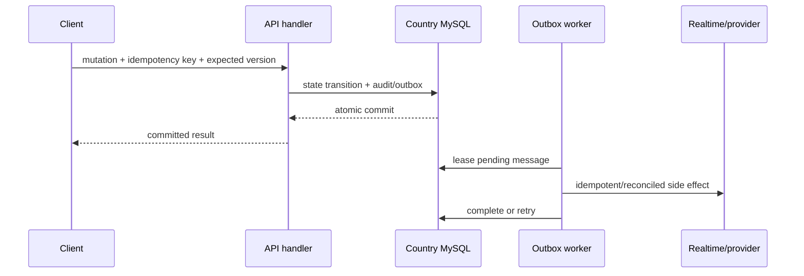

# Realtime delivery and asynchronous events

Users experience KiloDrive as a live system: a rider changes a fare, a driver
sees it, the driver counters, and the rider accepts. Underneath, no single
WebSocket frame is allowed to decide the truth. Realtime makes committed state
arrive quickly; MySQL, entity versions, and durable events make it correct.

## Three layers with different jobs

| Layer | Job | Durability |
| --- | --- | --- |
| Domain transaction | Validate and commit the authoritative state transition | Durable in one country cell |
| Outbox/broker | Preserve and distribute the fact that work should happen | Durable, at least once |
| SignalR/push | Tell connected or background clients quickly | Best effort; clients resync |

Combining these jobs creates brittle systems. If a handler sends SignalR before
commit, clients can render a ride that later rolls back. If it waits for push
after commit, a provider timeout can produce a false HTTP failure. If SignalR is
the only event record, an API restart loses the update.

## SignalR topology

Each API node hosts the realtime hub. A Valkey/Redis backplane carries group
messages between nodes. Before adding another API node, the backplane and its
pub/sub ACL must be tested; otherwise rider and driver may connect to different
nodes and never see each other's updates.

Hub authorization checks the authenticated identity and the specific domain
relationship. Ordinary API bearer tokens are not hub credentials. The client
obtains a short-lived hub token (currently 60 seconds at issuance) scoped to a
`discovery` or `trip` purpose and bound to user, role, tenant, country, token
version, and participant role. A trip participant can join that trip's groups;
a valid login or discovery token cannot join arbitrary trip groups.

Broad driver discovery fan-out carries only a refresh hint. Account-scoped
groups carry the actual offer/bid details after authorization. This reduces the
damage of a group-subscription defect and prevents rider information from being
broadcast as a general presence feed.

WebSocket negotiation may place `access_token` in a query string. KiloDrive
redacts it from reverse proxy logs, Serilog request data, OpenTelemetry URL tags,
and exception messages. This needs tests because fixing one logger still leaves
three other leak paths.

## Client convergence

The client keeps the latest server entity version. When a realtime event arrives:

1. Reject an event whose persisted entity version is older than the local one.
2. Merge a newer event into repository/AsyncNotifier state.
3. If the version gap or payload is insufficient, fetch authoritative state.
4. On reconnect or app resume, perform a bounded resync.
5. Use polling only as a recovery path, with cancellation and backoff.

Versions must be persisted monotonic values. Wall-clock ticks from multiple
servers can move backward or collide and cause Flutter to discard a legitimate
update.

Explicit visibility heartbeats count a driver who actually has one ride card
visible. A feed refresh is not a viewer signal; marking every returned ride as
viewed inflated counts and produced misleading rider UX.

## Domain outbox

The command writes the domain change and outbox record in the same MySQL
transaction. The worker claims messages with a lease, resolves the tenant/cell,
dispatches a registered handler, records retry state, and eventually archives
completed messages after the configured retention period.

Handler registration is a release contract. We encountered permanently failed
`trip.status_changed` rows because no handler was registered. A build/test gate
should enumerate produced message types and prove a handler or intentional
terminal policy exists for each.

### Lifecycle webhook publication

The country-cell save boundary stages allow-listed webhook dispatch for ride,
bid, trip, rental booking/inspection/extension/damage/dispute, membership/store,
and safety lifecycle changes in the same transaction as domain state. Support is
a control-plane aggregate, so it stages an idempotent control relay that later
inserts the same event identity into the owning cell outbox. A client disconnect
after commit cannot cancel either intent.

Webhook envelopes expose opaque aggregate identity, state, monotonic version,
UTC occurrence time, and the minimum approved money/reference fields. They omit
names, addresses, coordinates, chat/support text, document references, and
provider secrets. Source coverage proves publication code and focused tests; it
does not prove a subscriber endpoint, network, signature configuration, or
delivery certification in a deployment.

## Request cancellation after commit

The HTTP request token signals that the client stopped waiting; it does not undo
the transaction. Using it for post-commit SignalR or provider work means a rider
pressing Back or losing connectivity can leave driver screens stale. Durable
work uses an outbox or a service-lifetime token after commit. The client remains
on a cancellation screen until authoritative cancellation succeeds or a durable
offline command is queued.

## EventBridge and SQS acceleration

High-volume ride dispatch can publish a compact event to EventBridge and route it
to SQS. The consumer invokes the same matching handler as SQL recovery. The
broker provides burst absorption and independent worker scaling; SQL preserves
the dispatch intent if publish fails or the process dies after commit.

At-least-once delivery means the broker and SQL recovery may both see an event.
Stable event IDs, entity versions, and idempotent handler effects make duplicate
delivery safe. SQS deletion is the acknowledgement boundary.

## Ordering and state machines

Never rely on arrival order. A fare change can cross a bid withdrawal on the
network. The server applies conditional transitions inside a transaction:

- a lower fare does not silently rewrite a driver's previous acceptance;
- stale bids expire or require driver reconfirmation;
- bid counts represent actionable bids, not lifetime attempts;
- acceptance rechecks driver, vehicle, compliance, duty, trust, online, and
  assignment state;
- completed/cancelled trips close chat and call channels; and
- every lifecycle mutation publishes a dedicated durable event.

The event says what happened (`ride.cancelled`, `bid.changed`, `trip.completed`),
not what UI trick should occur (“treat fare_updated as removal”). Stable semantics
make portal, mobile, analytics, and future consumers agree.

Route changes follow the same rule. A participant requests a versioned route
alteration; the other affected participant accepts or rejects that specific
proposal. The transaction snapshots the previous/new route context, updates the
trip only on the allowed transition, writes audit/timeline evidence, and emits a
dedicated durable route-changed event. A notification or map animation cannot
silently rewrite the destination.

An audible notification is attention delivery, not a lifecycle transition.
Pre-trip offer, acceptance, arrival, chat, route-change, and safety interactions
use category-appropriate sound only when user/platform policy permits it. The
corresponding in-screen inbox/card remains authoritative after notification
loss, duplication, or suppression.

## Background drivers

An “online” flag without fresh telemetry is unsafe. Mobile platforms constrain
background work, so KiloDrive must either operate an approved, visible background
location service for active bidding or expire the driver online state when
heartbeats become stale. Pretending an old location is live risks bad matching
and safety decisions.

Background permissions and foreground-service declarations must match visible
user functionality and store policy. They are not a keep-alive shortcut.

The bidding hall therefore has an explicit readiness gate: permission, device
location state, fresh permitted telemetry, server online lease, active
assignment, and eligibility are checked independently. A missing optional feed
enrichment cannot force the driver offline, but stale/missing telemetry cannot
be presented as offer-ready.

Active-trip telemetry gaps are stateful safety observations with a real
creation time and freshness context. An absent timestamp renders as unavailable;
it must never fall through to a language/runtime minimum date. Recovery or a
fresh sample resolves the displayed freshness state without deleting the
historical safety evidence.

## Failure behavior

| Failure | Expected behavior |
| --- | --- |
| One SignalR frame is lost | client resync/poll converges from durable state |
| Valkey pub/sub denied | cross-node realtime degrades; domain state remains available |
| EventBridge denied | SQL recovery keeps dispatch intent pending |
| SQS redelivers | idempotent consumer produces one logical result |
| Provider times out | record unknown/retry state and reconcile |
| Handler missing | fail visibly, alert, deploy handler; do not delete evidence |
| Client disconnects after commit | return/resync to committed result on retry |

## Test strategy

A deterministic two-client suite exercises create → fare change → bid → withdraw
→ replacement → reject/accept → chat → arrive → start → complete/cancel. Repeat
with lost responses, duplicate taps, SignalR disconnect, API-node switch,
background/resume, and out-of-order events. Assert both clients converge to the
same server version and no side effect duplicates.

Add explicit route-alteration request/accept/reject, telemetry-gap/recovery,
notification suppression, API recycle, backplane loss, and process-death cases.
The assertions compare both clients, API response, country-cell rows, outbox,
audit/timeline evidence, vehicle snapshot, fare provenance, and final cleanup.

See [EventBridge/SQS](../aws/eventbridge-sqs.md), [Outbox recovery](../runbooks/outbox-recovery.md),
and [Realtime incident response](../runbooks/realtime-signalr.md).
