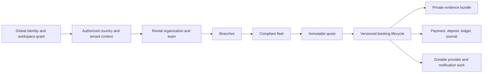
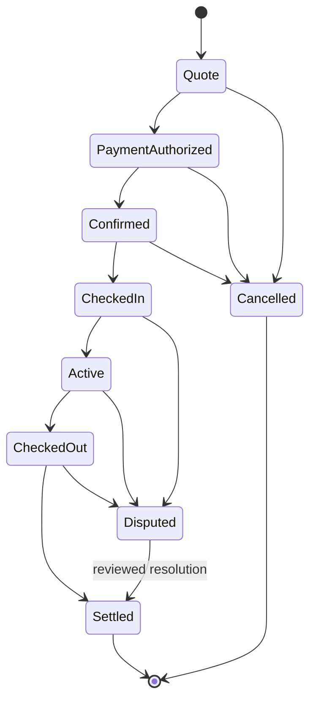

# Rental Marketplace Architecture

Rentals look simple on a catalogue screen: choose a vehicle, choose dates, and
pay. The difficult part begins after the button is pressed. The platform must
prevent two renters from receiving the same car, preserve the price and policy
that were offered, prove the vehicle's condition at both handovers, handle a
deposit without treating an authorization as revenue, and give an operator
enough evidence to resolve a disagreement fairly.

This chapter explains that system for engineers who know ordinary CRUD but are
new to marketplace lifecycles. The key idea is that a rental booking is not a
row whose `Status` may be edited freely. It is a versioned agreement that moves
through a controlled state machine while availability, payment, evidence,
accounting, notifications, and audit stay consistent.

## Capability status

The reviewed KiloDrive source contains the country-cell rental organization,
branch, team-permission, fleet, booking, transition, version, availability-day,
pricing/policy/evidence snapshot, payment-reference, and outbox foundations. It
also represents the canonical paid lifecycle described below and keeps older
request-to-book states for compatible clients.

Some operating details are **policy-dependent or incremental**: provider-grade
deposit capture/release, country-specific insurance and cancellation rules,
damage adjudication, late/no-show automation, maintenance feeds, and a fully
staffed dispute service must be enabled only when code, provider configuration,
country policy, tests, monitoring, and operational ownership all agree. An enum
or JSON field is not evidence that every country has activated the capability.

## The ownership boundary

A rental organization belongs to one tenant and one country cell. The same cell
owns its branches, team memberships, fleet, bookings, evidence metadata,
payments, wallet/accounting entries, audit, and outbox. This is intentional:
confirming a booking must not require a distributed transaction between global
identity and a country financial database.

The global control database still owns authentication, sessions, passkeys, 2FA,
and the user's country/workspace memberships. A country projection tells local
tables which user participated but never becomes another password authority.

Do not join across cells to make a booking. Resolve the authenticated identity
and authorized workspace first, then execute the complete local transition in
the selected cell.

## Organizations, teams, and permissions

An organization has an owner, legal/trading identity, country, currency,
timezone, contact details, status, membership, branches, and team. Organization
status is separate from a person's login status. Suspending a rental company
should stop new marketplace work without silently disabling every team member's
unrelated KiloDrive account.

### Roles are defaults; permissions are authority

The current role vocabulary includes Owner, Fleet Manager, Booking Agent,
Finance Officer, Vehicle Inspector, and Auditor. Roles help humans understand a
job. Authorization checks the permission bit set, including:

- manage team;
- manage branches;
- manage vehicles and vehicle images;
- manage bookings;
- view finance;
- manage payouts;
- perform inspections; and
- view audit.

Never write `if role == FleetManager` in a handler when the business rule is
“may manage vehicles.” A company may give a senior booking agent vehicle access
or keep finance and payout approval separate. Permission checks also include
active membership, organization identifier, tenant/country context, and entity
ownership. Knowing another organization's UUID must return the same coarse
not-found/forbidden behavior rather than disclose that it exists.

### Team invitation lifecycle

An invitation is an expiring, single-use grant proposal—not membership. Store a
digest of a high-entropy token, bind it to organization, intended contact,
role/permissions, inviter, expiry, and status, and consume it conditionally. An
accepted, revoked, or expired token cannot be replayed. Acceptance creates or
activates the membership only after the signed-in identity proves the intended
contact/account relationship.

Owner transfer and owner removal deserve a dedicated workflow. Generic team
deletion must never leave an active organization without a responsible owner.
High-risk changes are step-up protected and audit who changed which permissions,
from what safe prior value, and why.

### Separation of duties

Small businesses may give the owner all permissions, but the architecture does
not require that forever. Useful separation includes:

- an inspector records condition evidence but cannot release a deposit;
- a booking agent changes operational dates but cannot approve a payout;
- a finance officer sees money without editing vehicle compliance; and
- an auditor reads transitions and evidence metadata without mutating them.

System Administrators need explicit fine-grained support authority and selected
country workspace. “System Admin” is not a reason to bypass organization,
privacy, financial, or evidence audit.

## Fleet and compliance

A rental vehicle belongs to one organization and branch. Its operational state
progresses through Draft, Pending Review, Available, Reserved, Rented,
Maintenance, Suspended, or Archived. Those names are not cosmetic labels:

- **Draft/Pending Review** cannot be offered as compliant inventory.
- **Available** means the current time window, organization status, membership,
  documents, safety rules, and maintenance state permit quotation.
- **Reserved/Rented** prevents conflicting allocation.
- **Maintenance/Suspended** fails new availability and confirmation checks.
- **Archived** is a historical soft-delete state, not permission to erase old
  bookings or evidence.

The live vehicle record contains mutable catalogue facts such as branch,
description, rate, images, and availability. A confirmed booking snapshots the
facts material to that agreement: vehicle identity, plate/category, organization
and branch, compliance version, insurance, included distance, fuel/mileage
rules, rates, deposit, pickup/return terms, and relevant policies. Editing the
vehicle tomorrow must not rewrite yesterday's contract or receipt.

### Compliance and safety gate

Before quote visibility and again inside confirmation/check-in, verify the
country-required registration, insurance, fitness/inspection, ownership or
management authority, image/evidence requirements, recall/maintenance state,
and membership limits. Expiry or rejection takes the vehicle out of eligibility
immediately for new rentals. Existing bookings enter a governed exception flow;
they are not silently left active or automatically cancelled without customer
and operator handling.

A maintenance window reserves time just like a booking. Otherwise an oil change
scheduled after a quote can collide with a rental confirmation. Safety-critical
maintenance, recall, accident, or document rejection overrides catalogue
availability and alerts the assigned operator.

## The canonical booking lifecycle

The paid marketplace path is:

KiloDrive also retains a request-to-book compatibility path—Requested to
Approved or Declined, then Confirmed—which converges on the governed handover
lifecycle. New code must not use compatibility states to skip payment,
availability, evidence, or version checks.

Terminology varies in the rental industry, so UI copy must explain actions. In
this lifecycle, **CheckedIn** records the pickup inspection and handover to the
renter; **Active** means the renter currently has the vehicle; **CheckedOut**
records the return inspection and handback. Never rely on the enum word alone in
training or support screens.

### Quote

A quote is a priced, time-bounded offer for one vehicle and rental interval. It
records currency and integer minor-unit components: base rental, add-ons, tax or
regulated fee where applicable, platform charge where applicable, security
deposit, included distance, excess-distance rate, and total. The quote also
snapshots cancellation, no-show, late-return, fuel, mileage, insurance, age/
license, geographic-use, and evidence policies with their versions.

The server computes the authoritative total. The client may preview it but does
not submit a trusted total. A quote has expiry, version, and stable identifier so
authorization cannot attach to a price that changed in place.

### PaymentAuthorized

Authorization proves the approved payment instrument can reserve the exact
quoted currency and amount. It is not automatically a settled charge, deposit
capture, provider payout, or accounting revenue. Store the internal payment ID,
provider reference/token, amount, currency, state, environment, idempotency key,
and authorization expiry. Raw card or bank credentials do not belong in the
booking.

If the provider times out, the outcome is unknown. Query/reconcile the provider
using its stable reference before trying another authorization. Returning an
error and immediately retrying can create two holds on the renter's account.

### Confirmed

Confirmation is the inventory claim. In one country-cell transaction it:

1. locks or conditionally claims the booking version;
2. revalidates renter, organization, membership, vehicle compliance, maintenance,
   insurance, authorization expiry, quote, and policies;
3. claims every occupied availability day for the vehicle;
4. changes the vehicle/booking allocation state;
5. appends the immutable transition and audit evidence; and
6. stages notifications and provider follow-up in the outbox.

One unique vehicle/date key is a strong last-line concurrency guard. An
application “availability check” performed before the transaction is useful UX
but cannot prevent two simultaneous confirmations.

### CheckedIn and Active

Pickup captures identity/license eligibility required by country policy,
responsible team member, exact handover time, start odometer, fuel/charge level,
existing damage, accessories, keys, location/branch, and signed/photo evidence.
Only clean, authorized evidence moves from quarantine into the private evidence
bundle.

Active begins only after required pickup evidence and handover acknowledgment
exist. The transition makes customer/operator responsibilities and emergency or
breakdown channels visible. It must not be inferred merely because pickup time
passed.

### CheckedOut

Return captures end odometer, fuel/charge level, time, branch/location,
condition, new damage claims, missing items, late duration, and evidence. The
system calculates—not the operator's phone—distance, fuel, late, extension, and
approved add-on differences using the snapshotted rules.

The renter sees a provisional return statement and any dispute window. An
operator cannot type an arbitrary deposit capture without a reason, evidence,
permission, bounded rule, and financial transition.

### Settled or Disputed

Settlement finalizes permitted charges, releases unused authorization/deposit,
posts the organization's entitlement and platform/tax treatment, closes
availability, creates the receipt, and stages payout/notifications. A disputed
booking freezes contested settlement components while preserving uncontested
ones according to country/provider policy.

Dispute records include category, claimant, amount, evidence references,
timeline, owner, SLA, communication, provisional decision, appeal/review where
required, final reason, and financial resolution. Closing a support ticket is
not the same as settling a dispute.

## Immutable snapshots and transition evidence

Every successful transition appends a record containing booking, from/to state,
actor, UTC occurrence time, claimed version, pricing snapshot, policy snapshot,
evidence manifest, safe payment reference, amount/currency where relevant, and
correlation/audit link. Existing transition rows are not rewritten.

Snapshots need a schema/version. Storing arbitrary JSON without a version and
typed validation merely postpones a contract problem. Material searchable or
financial fields also use typed columns; JSON carries the complete historical
explanation, not the only queryable truth.

At minimum, a confirmed-booking snapshot explains:

- who the contracting organization and renter were;
- which vehicle/compliance version was promised;
- pickup and return instants plus the local timezone/civil representation;
- every price component, currency, minor-unit exponent, and tax/fee treatment;
- authorization, deposit, cancellation, refund, and payout rules;
- mileage, fuel/charge, late, extension, no-show, maintenance, and insurance
  rules;
- terms/privacy/policy versions accepted; and
- required evidence and retention class.

## Deposit and payment design

Rental price and security deposit are separate economic concepts even when one
provider authorization covers both. Track at least:

- rental amount authorized/captured/refunded;
- deposit authorized, captured for an approved claim, and released;
- disputed amount;
- organization payable and settled payout; and
- platform/tax/processor treatment required by the country model.

Do not record a provider authorization as completed revenue simply because the
provider returned success. Authorization, capture, settlement, refund, and
chargeback are distinct states. An expired authorization before pickup blocks or
renews through a customer-visible flow; it does not let a booking proceed
unfunded.

Deposit capture is limited to the substantiated claim and policy ceiling. A
partial claim captures only that amount and releases the rest. Duplicate or
out-of-order provider callbacks are idempotent. A chargeback or refund updates
payment, deposit, entitlement, journal, notification, and dispute/audit state in
one governed local transition.

## Pricing, mileage, fuel, and insurance

### Mileage

Store start/end odometer in one canonical unit, the source/display unit, included
distance, and excess rate. Reject a lower end reading unless an audited rollover
or correction workflow explains it. Large implausible differences trigger review
rather than an automatic charge.

### Fuel or battery charge

Record start/end percentage or the approved country/provider measure with photo
or inspection evidence. The snapshotted policy defines tolerance and charge
calculation. An operator cannot change the global fuel policy after return to
increase this booking's charge.

### Insurance

Snapshot insurer/policy identity through safe references, coverage period,
eligible driver/renter conditions, geographic limits, exclusions, excess/
deductible, assistance process, and policy version. Sensitive policy documents
remain private and access-audited. Insurance eligibility is rechecked at
confirmation and handover; a catalogue badge is not enough.

## Cancellation, no-show, late return, and extension

These are explicit transitions or sub-lifecycles, not free-form notes.

### Cancellation

The rule depends on cancelling party, current state, time to pickup, provider
outcome, and snapshotted policy. The transaction calculates fee/refund, releases
availability, records reason and actor, and stages provider refund plus notices.
After an authorization, cancellation must reconcile/release it durably.

### No-show

A no-show requires a defined grace deadline, attempted-contact evidence, branch
availability, and authorized actor. It can trigger a policy fee and release
inventory, but must not be inferred from a worker running late. The renter has a
clear dispute path.

### Late return

Late status uses the booking timezone and an exact grace policy. It checks the
next reservation and raises operational priority when another renter is at risk.
Charges use bounded snapshotted rules and evidence. Safety recovery and customer
contact are more important than repeatedly charging a card.

### Extension

An extension is a new mini-quote: confirm future availability and maintenance,
reprice the additional period, obtain customer acceptance and any extra payment
authorization, then conditionally advance booking version and availability-day
claims. Changing `ReturnAtUtc` directly can double-book the next customer.

## Evidence and document handling

Pickup, return, damage, insurance, and identity documents are private. Uploads
use opaque object keys, size and magic-byte checks, quarantine, fail-closed
malware scanning, safe image re-encoding where appropriate, and short-lived
authorized download. No public bucket or durable public URL is used.

An evidence manifest records content hash, class, booking/transition, uploader,
capture time, scan state, safe media metadata, retention/hold class, and revision.
It does not put names, plates, license numbers, or contact details in object keys
or logs. Replacing a photo creates a new revision; it does not overwrite what a
party relied on during handover.

Access follows purpose and least privilege. The renter sees their agreement and
permitted evidence, the organization sees operational evidence, a dispute
reviewer receives scoped access, and ordinary support roles do not automatically
download identity documents. Every view/download is audited.

## Accounting, ledger, and payout

The booking row is not the ledger. Material financial events write the domain
transition, user/organization subledger, balanced accounting journal, payment or
payout evidence, and outbox in one short cell transaction. Stable references
prevent duplicate posting.

Typical posting moments include authorization evidence, rental capture, deposit
hold/capture/release, cancellation fee/refund, excess mileage/fuel/damage charge,
organization payable, platform/tax recognition, payout, chargeback, and dispute
adjustment. Exact chart-of-account mapping belongs to the approved country
accounting model.

Posted journals are immutable. A correction uses a reversing or adjusting entry
linked to the original. Daily reconciliation checks provider authorizations and
captures, booking/deposit states, held funds, payable/clearing, payouts, refunds,
chargebacks, and journals by currency.

## Idempotency and concurrency

Every mutation carries a stable idempotency key and expected booking version.
The server scopes the key to actor, tenant, operation, and payload hash. An
identical completed retry replays the outcome; a different payload on the same
key is rejected.

Concurrency is defended at several layers:

- conditional booking-version transitions;
- row locks or deterministic conditional updates around allocation and money;
- unique vehicle/day availability claims;
- unique provider event and journal references;
- provider idempotency keys; and
- immutable transition sequence/version.

The API revalidates everything important inside the locked transaction.
Availability shown five seconds earlier, a payment authorization cached by the
client, or a permission checked before awaiting another call may no longer be
true.

## Outbox and asynchronous work

The committing transaction stages events such as booking changed, customer or
organization notification, provider capture/release, receipt generation,
calendar update, maintenance conflict, dispute escalation, and payout work.
Workers claim messages idempotently with fresh tenant scope.

Realtime delivery is an accelerator, not durability. If SignalR fails, push and
bounded refresh recover the committed version. Provider calls after commit use
worker lifetime and bounded timeouts—not the original HTTP cancellation token.
Permanent outbox failure alerts with type, safe entity reference, age, attempts,
and correlation ID; it never stores the booking payload or personal evidence in
an alert.

## Privacy, security, and audit

Rental data combines identity, location, license eligibility, financial data,
vehicle condition, photos, and potentially allegations of damage. Apply data
minimization, field-level/object-store protection, purpose-based authorization,
retention, legal hold, and deletion/anonymization policy per class.

General telemetry includes operation, lifecycle state, latency, safe provider
reference, result code, and correlation ID. It excludes names, contacts, exact
addresses, document numbers, raw routes, photo/object URLs, payment tokens,
evidence payloads, and free-form dispute text.

Audit records organization/team changes, vehicle/compliance changes, quote and
booking transitions, evidence upload/view, financial action, refund/capture,
policy override, System Admin access, dispute decision, and deletion/hold action.
Audit itself is append-only evidence, not a substitute for the booking
transition or accounting journal.

## Failure and recovery

| Symptom | Likely boundary | Safe first response |
| --- | --- | --- |
| Two customers appear confirmed | availability/version invariant | Stop new allocation for the vehicle, preserve both records, inspect transaction and unique-claim evidence |
| Authorization timed out | provider unknown outcome | Reconcile by idempotency/provider reference before retrying |
| Confirmed but customer sees Quote | realtime delivery/revision merge | Read durable booking version, replay/reconcile delivery, do not re-confirm |
| Vehicle stuck Reserved | missing terminal/release transition or outbox | Inspect booking transitions and availability days; repair through a governed lifecycle action |
| Deposit not released | provider/outbox/reconciliation | Prevent duplicate release, reconcile provider state, resume idempotent work |
| Evidence cannot be opened | quarantine/authorization/object storage | Preserve evidence, distinguish pending scan from provider outage, never make object public |
| Return conflicts with next booking | late/extension/availability | Escalate operations, contact affected parties, prevent silent date edits |
| Settlement does not balance | posting/reconciliation | Pause affected payout, preserve evidence, post reviewed correction only after root cause |

Recovery does not mean editing status, availability, and balance independently
until the UI looks right. Use a lifecycle command or purpose-built recovery
operation that checks expected version, repairs all affected records, writes
audit/journal/outbox evidence, and is safe to retry.

## Observability and operating signals

Useful bounded metrics include quote-to-authorization and authorization-to-
confirmation conversion, provider authorization latency/outcome, availability
conflicts, bookings by lifecycle state and age, approaching pickup/return,
overdue/late count, evidence scan age/failure, disputed amount and SLA age,
deposit release lag, outbox lag/failure, payout/reconciliation exception, and
vehicle utilization/maintenance conflict.

Do not label metrics by renter, organization, vehicle, booking, branch, plate, or
provider payload. Detailed investigation uses authorized queries with a safe
support ID and correlation trail.

## Testing strategy

### Fast tests

- complete allowed/forbidden state-transition matrix;
- permission matrix for every role and individual permission;
- exact minor-unit pricing across zero-, two-, and three-decimal currencies;
- cancellation, no-show, late, mileage, fuel, extension, deposit, partial
  capture/release, refund, and dispute calculations;
- immutable snapshot serialization/version round trip; and
- idempotency payload-match and stale-version behavior.

### MySQL and provider integration tests

- two renters concurrently confirm the same vehicle/day; exactly one wins;
- an extension races a new quote/confirmation for the next interval;
- maintenance/suspension or compliance expiry races confirmation/check-in;
- crash points before and after booking, availability, payment, journal,
  transition, and outbox writes prove atomicity;
- provider timeout after authorization, duplicate/out-of-order webhook, partial
  refund, chargeback, capture/release, and payout reversal;
- evidence clean, infected, timeout, rejected, retry, and unauthorized access;
  and
- UTC/local timezone, DST boundary, overnight interval, and date-only
  availability behavior.

### End-to-end fixture

A deterministic non-user fixture creates a verified owner, organization,
branches, team members with distinct permissions, compliant fleet, membership,
payout method, renter, provider fakes, and private evidence. It exercises
organization/team/fleet CRUD and Quote through settlement/dispute, then cleans or
anonymizes every fixture in a `finally` block. Retained artifacts contain only
safe correlation and assertion evidence.

The success suite does not begin on a partly built schema or hand-edited
production account. Fixture readiness asserts organization, permission,
vehicle, membership, payment, evidence, and availability prerequisites first.

## Hard-learned pitfalls

### “Available” checked only before payment

Two users can pay after seeing the same availability. Recheck and claim the
vehicle interval atomically at confirmation; provider authorization alone does
not reserve inventory.

### Mutable catalogue used as historical contract

Changing rate, included mileage, insurance, or cancellation policy rewrites the
meaning of an old booking. Snapshot every material term with a version.

### Deposit treated as ordinary revenue

Authorization and held security are not earned revenue. Track authorization,
capture, release, settlement, refund, and chargeback separately.

### Free-form evidence JSON with no schema

It is easy to write and impossible to validate years later. Version the evidence
manifest, type material fields, hash content, and preserve revisions.

### Role names used as authorization

A renamed or customized role suddenly grants too much or too little. Check the
required permission plus active organization membership and ownership.

### Extension implemented as a date edit

The next renter or maintenance window is overwritten. Extension is a new quote,
availability claim, customer acceptance, and authorization transition.

### Notification success confused with booking success

A failed push does not roll back a confirmed booking, and a successful push does
not prove confirmation. Durable state/version is authoritative; outbox delivery
recovers independently.

### Operator repair by direct SQL

Changing one row leaves availability, payment, ledger, journal, evidence,
outbox, and audit inconsistent. Recovery uses a reviewed idempotent lifecycle
operation and reconciliation proof.

## Review checklist for a rental change

Before merging, answer:

1. Which organization permission and country/tenant proof authorize it?
2. Which booking states may enter and leave this operation?
3. What expected version, locks, and unique constraints resolve races?
4. Which pricing, policy, compliance, vehicle, and evidence facts are snapshotted?
5. What happens to availability, authorization, deposit, ledger, journal, and
   payout?
6. Which provider outcomes may duplicate, arrive late, or remain unknown?
7. Which outbox events and customer/operator notices are committed?
8. What personal/evidence data is stored, shown, logged, retained, and deleted?
9. How does an operator disable, reconcile, resume, or reverse the change?
10. Which unit, concurrency, crash-point, provider, authorization, and
    end-to-end tests prove the unhappy paths?

Related reading: [financial systems](financial-systems.md),
[tenancy and country cells](tenancy-and-country-cells.md),
[documents, media, and voice](documents-media-voice.md), and
[private object storage ADR](../adr/006-private-object-storage.md).
