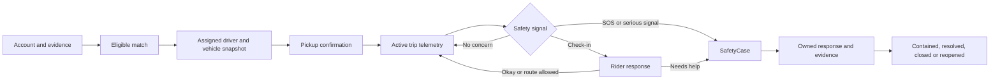
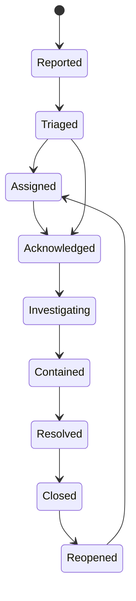

# Rider and Driver Safety Architecture

## Why this chapter exists

Transportation safety is not one red button. It is a chain of decisions made
before a rider and driver meet, while a trip is moving, when a device loses
connectivity, and after someone reports a concern. A strong emergency screen
cannot compensate for assigning an ineligible driver. A verified driver badge
cannot prove that the person who arrived is driving the vehicle shown in the
app. A route-deviation alert is harmful if noisy GPS produces so many false
alarms that riders stop trusting it.

This chapter gives junior and mid-level engineers a practical mental model for
that chain. It explains both sides of the marketplace, because a safe design
must protect riders **and** drivers. It also keeps product claims honest: source
code can prove that a control exists, but it cannot prove that a provider,
country policy, support team, or device permission is active in production.

KiloDrive is not an emergency service. When someone faces immediate danger, the
app should help them reach the correct local emergency authority without making
that call depend on an API response, telemetry upload, or case-creation request.

## Status language used here

Every material capability in this chapter separates source maturity from
deployment state using the [product and operational doctrine](../governance/product-and-operational-doctrine.md).
Operational policy remains a separate people/procedure/evidence control.

These labels describe the public source baseline reviewed on 2026-08-30. They
are not a live production dashboard. Deployment claims require the evidence
described in [Capability Status and Evidence](capability-status.md).

## The shortest useful mental model

Think of trip safety as six overlapping layers:

1. **Prevent a bad match.** Verify eligibility, apply trust preferences and
   blocks, and avoid exposing unnecessary personal information.
2. **Confirm the meeting.** Show the assigned people and vehicle, recheck
   compliance, and require a pickup confirmation before the trip starts.
3. **Keep a private connection.** Limit chat, voice, and trip sharing to the
   people and time window that need them.
4. **Notice concerning change.** Evaluate fresh telemetry for sustained route
   deviation and prolonged stops without treating one noisy GPS point as proof.
5. **Help a person act.** Make “I am okay,” “allow this route,” support, trusted
   contacts, and emergency calling understandable and reachable.
6. **Respond and learn.** Turn serious reports into an owned SafetyCase with an
   SLA, evidence, acknowledgement, escalation, and closure reason.

The arrows describe responsibility, not certainty. Location can be stale, a
verified account can be compromised, and a provider notification can fail. Each
layer therefore needs an authoritative state, a degraded mode, and a recovery
path.

## Threat model: what can harm a rider?

Threat modeling starts with people and outcomes, not libraries. The table below
is deliberately concrete.

| Rider threat | Example | Primary controls | Residual risk |
| --- | --- | --- | --- |
| Impersonated or ineligible driver | A different person or expired vehicle arrives | eligibility revalidation, trust evidence, assigned vehicle snapshot, pre-trip display/confirmation | documents can be forged; a legitimate account can be shared or stolen |
| Wrong vehicle | Plate, make, or color differs from the assignment | immutable assignment snapshot and visible comparison | poor lighting, plate theft, or outdated image can confuse the rider |
| Unsafe route change | Driver leaves the expected route without a clear reason | fresh telemetry, sustained-deviation logic, rider prompt, audit and escalation | traffic, road closures, GPS noise, and map-data gaps produce legitimate deviations |
| Prolonged or unusual stop | Vehicle remains stationary away from expected pickup/drop-off | time/movement window, check-in, SafetyEvent and follow-up | congestion or personal stops can be benign |
| Harassment or unwanted contact | Participant continues contact after the trip | participant authorization, trip-limited chat/calls, expiry, block controls | direct GSM calls can reveal a real phone number without a relay service |
| Stalking through live sharing | A share link is guessed, forwarded, or retained | opaque hashed handle, expiration, revocation, bounded/coarsened moving location, anomaly limits | an authorized recipient can still reshare what they see, and current static route fields need further minimization |
| Account takeover | Attacker creates rides, changes contacts, or reads trip history | server sessions, refresh revocation, 2FA/passkeys, step-up, audit | compromised email/phone/device can defeat one factor |
| Payment coercion or fare dispute | Rider is pressured into an off-platform payment | immutable fare/payment snapshot, receipts, support and accounting evidence | cash remains harder to prove than wallet/provider settlement |
| Delayed help | app is backgrounded, offline, or notification delivery fails | visible emergency action, realtime plus polling/outbox, local emergency number behavior | no mobile application can guarantee radio coverage or emergency response |

## Threat model: what can harm a driver?

Drivers face a different set of risks. A safety design that treats every driver
as a potential threat and every rider as harmless is incomplete.

| Driver threat | Example | Primary controls | Residual risk |
| --- | --- | --- | --- |
| Unsafe or deceptive pickup | Rider places pin in an inaccessible or dangerous location | route/pickup display, pre-bid inquiry, reject/ignore/cancel paths | the standalone geofence helper is not an enforced start control, and a valid-looking address can still be unsafe in context |
| Rider impersonation | A different person attempts to enter the vehicle | trip participant context and pickup confirmation | rider identity verification may be country-configurable or unavailable |
| Robbery or assault setup | Fake trip draws driver to an isolated area | account/risk signals, trip trace, support/safety actions, block/report paths | new accounts and cash trips provide less financial identity evidence |
| Payment or wallet fraud | stolen account, reversed top-up, fake proof of payment | server-side wallet/provider verification, holds, fraud controls, immutable ledger | cash collection and external social engineering remain risks |
| Harassment after the trip | rider keeps calling, messaging, or re-matching | trip-limited communications and bilateral block enforcement | direct phone exposure weakens expiry controls |
| False complaint | rider makes a dishonest safety allegation | immutable timeline, vehicle snapshot, chat/call metadata, authorized replay and evidence custody | telemetry is incomplete and must not be treated as a perfect witness |
| Excessive duty | driver accepts work after unsafe hours or a stale duty window remains open | duty-window policy, stale-session handling and acceptance revalidation | device loss/connectivity can leave ambiguous state unless closed conservatively |
| Discrimination or arbitrary exclusion | safety tooling is misused to deny riders | coarse, auditable policies and appeals; do not expose protected attributes to matching | proxy variables and human decisions can still introduce bias |

## Safety ownership across system boundaries

Safety data follows the same control/country split as the rest of KiloDrive:

- **Implemented:** the global control plane owns authentication, account status,
  session security, and country memberships.
- **Implemented:** the country cell owns rides, trips, assignments, vehicle and
  driver evidence, SafetyEvents, SafetyCases, trusted contacts, blocks, chat/call
  metadata, and trip location evidence.
- **Implemented/configurable:** Valkey holds expiring current driver location and
  realtime/backplane state; MySQL remains the durable operational authority.
- **Configurable:** maps, messaging, object storage, and LiveKit contribute
  external capabilities but do not decide whether a trip or case exists.
- **Operational policy:** trained support/safety responders own human decisions,
  emergency escalation, evidence access, and closure review.

Never move a safety case to a global database simply to make an admin query
easier. Country rules, evidence, retention, and trip relationships remain local.
Cross-country administration needs an explicit authorized workspace, not an
unscoped join.

## Before matching: identity, evidence, and trust

### Driver eligibility is a live decision

**Implemented.** A driver being registered once is not enough. Availability and
acceptance paths evaluate current account/profile status, online state, fresh
location, active assignments, duty policy, membership allowance, driver
compliance, a single active assigned vehicle, vehicle/category capability,
currency, rider trust preference, and bilateral blocks.

Acceptance repeats these checks inside the locked assignment transaction. That
matters because eligibility can change after the bid: a document can expire, a
vehicle can change, a driver can go offline, or another ride can be assigned.
The bid is evidence that the driver was eligible at bid time; it is not a
permanent permission to assign them.

**Implemented.** The trust model can consider identity, proof of address, police
record/background evidence, vehicle registration and insurance, rating count,
and preferred-driver status. The rider's selected trust requirement is persisted
on the request and rechecked at acceptance.

**Configurable.** Which evidence is legally appropriate, mandatory, and current
depends on country rules. A document called “background check” does not have the
same meaning or lawful basis everywhere.

### Rider assurance is not symmetrical by default

**Configurable.** Rider identity verification can be controlled by country and
product policy. The server must remain authoritative when enabled; hiding an
upload screen in Flutter does not disable an API requirement, and showing the
screen does not prove approval.

**Planned.** A mature bilateral pre-trip confirmation should show the driver a
privacy-preserving rider assurance summary—such as confirmed contact, account
age band, completed-trip band, and pickup confirmation—without exposing full
identity documents or protected attributes. This must be designed with legal and
bias review before it affects matching.

### Trust badges are summaries, not evidence

**Implemented/incremental.** Driver and vehicle status can be summarized for the
rider, while the server retains the underlying evidence and expiry state. A
badge should answer a narrow question such as “insurance currently confirmed,”
not claim “this person is safe.”

**Operational policy.** Badge wording, evidence sources, review permissions,
appeal paths, and periodic reverification need named owners. When required
evidence is rejected or expires, the operational projection should revoke
eligibility promptly and produce an auditable reason.

## Matching, blocking, and relationship boundaries

### Matching must fail closed on safety eligibility

**Implemented.** Driver query, bid, and acceptance paths apply eligibility and
block checks. A driver who is offline, stale, assigned elsewhere, noncompliant,
incompatible with the requested vehicle/features, outside duty policy, or below
the requested trust level should not be assigned.

The response to a rider should remain coarse—“driver no longer available”—rather
than reveal which private document expired or whether another user blocked them.
Coarse errors reduce account probing and retaliation.

### Blocks are bilateral for interaction

**Implemented.** Rider/driver blocks are enforced in matching-related paths,
chat, calls, favorites, and wallet-recipient relationships where the relationship
would otherwise continue. A participant can block the other party after a shared
trip; a rider can also identify a driver through a constrained safety identifier
flow. Stored display values are masked and lookups are rate-limited.

A block must not delete trip, financial, safety, or dispute evidence. It prevents
future interaction; it does not rewrite history.

**Operational policy.** Unblocking, administrator override, appeals, and abuse
review are security boundaries. They require authorization, step-up where
appropriate, and audit. An administrator should not learn who blocked whom
without a support or safety purpose.

### Matching data should be minimal

**Implemented/incremental.** Before assignment, each side receives only the
details needed to evaluate the trip or offer. Exact personal contact details are
not a matching primitive. Full trip participants receive more context only after
the assignment state is authoritative.

**Planned.** Risk-aware pickup controls can add location reputation, repeated
fraud patterns, or high-risk-area warnings. They must avoid redlining, protected
attribute proxies, and opaque automatic denial. Safety review and appeal are
part of the design, not later polish.

## Assisted-rider boundary

**Source maturity:** backend foundation implemented, Flutter partial.
**Deployment state:** disabled by default and uncertified by country.

An assistance profile is opt-in and describes practical trip needs, not a
diagnosis. The backend protects an optional caregiver contact, records driver
capability attestation, snapshots minimum operational detail, and can check the
active driver/vehicle during discovery, bidding, and acceptance. A rider must
never be assigned a disability by inference, and a driver sees no medical
record.

That foundation is not yet an end-to-end safety product. The driver offer and
assigned-trip UI do not present the snapshot, the caregiver notification
preference has no dispatcher, mobile entry points and existing rides do not all
fail closed on policy/kill-switch state, and Portal parity is absent. Country
activation therefore requires those fixes plus two-device accessibility,
minimum-disclosure/expiry, driver training and consent, caregiver delivery,
fairness, privacy, legal, and field evidence.

## Pre-trip confirmation: verify the meeting, not just the account

### Assigned vehicle snapshot

**Implemented.** Acceptance snapshots the selected vehicle, category,
make/model/year/color, plate, capability flags, verification and insurance state,
document status/expiry summary, and compliance version/hash onto the trip. Later
vehicle edits do not silently rewrite what the rider was assigned.

That snapshot serves three jobs:

1. the rider can compare the arriving vehicle with the assignment;
2. start/completion/support can reason about the correct historical vehicle; and
3. an investigation is not corrupted when the driver changes primary vehicles.

Do not put full insurance policy numbers or private document URLs in the snapshot
or rider UI.

### Driver and vehicle recheck at trip start

**Implemented.** The start transition rechecks driver identity/compliance and the
assigned vehicle's registration, fitness, and insurance. This is independent of
the earlier acceptance check because evidence can change while the driver travels
to pickup.

**Implemented.** The driver marks arrival before starting. Pickup confirmation
is off by default for the rider unless a country rule requires it; when the
rider enables it, start also requires the valid rider proof according to policy.
This reduces accidental/wrong pickup without forcing a PIN into every market or
trip.

The source contains a tested pickup-distance/geofence helper, but the reviewed
start transition does not currently enforce it. Therefore documentation and UI
must not call geofence presence the ordinary start proof. Wiring a location gate
would require freshness/accuracy, legitimate inaccessible-pickup exceptions,
audited override, two-device tests, and country policy before the claim changes.

The proof is not a deterministic value derived from the trip. The server issues
a random, short-lived, single-use six-digit PIN and an optional signed opaque QR
form. It stores only purpose-, trip-, and participant-bound protected digests,
limits failed attempts, rejects cross-trip/replay/expired proofs, and cancels or
consumes the challenge with the trip lifecycle. An emergency administrator
override requires recent authorization, a reason, and audit evidence; the proof
itself never enters the audit record.

### What the user should see

**Implemented/incremental.** The trip UI can show participant and vehicle
details, assignment state, and safety actions.

**Planned.** The ideal pre-trip screen should require a deliberate confirmation
when a material mismatch exists:

- rider sees driver photo/name, vehicle image, make/model/color, plate, and
  current narrow trust badges;
- driver sees a privacy-preserving rider/pickup confirmation, party-size and
  accessibility notes, not sensitive identity documents;
- both see an obvious “This is not my driver/rider/vehicle” safety action; and
- proceeding records the snapshot/version shown, without forcing the user to
  disclose why they feel unsafe.

The screen must remain usable under large text, screen readers, low light, and a
weak network. Safety information that overflows off a small screen is not a
safety control.

## Trip-limited and masked communications

### Chat

**Implemented.** Trip chat authorizes the rider and assigned driver, enforces
blocks, stores messages durably, publishes realtime hints, and falls back to
reconciliation polling/notifications. Client message IDs and idempotency protect
against duplicate sends after a lost response. Closed trips no longer permit new
chat.

Chat should display participant role and local time while keeping server UTC as
the stored authority. Logs and telemetry record message ID/status/latency, not
the message body.

Important pre-trip messages and state changes can request an audible
notification under the user's category preferences and the operating system's
policy. Sound only attracts attention. The committed message, unread state, and
in-screen conversation remain authoritative when push is delayed, duplicated,
or suppressed.

### In-app voice

**Implemented/configurable.** In-app calling is restricted to active trip
participants, uses a trip/call-scoped room and short-lived token, respects blocks,
records safe call lifecycle metadata, and closes active rooms when the trip or
call ends. Actual operation depends on LiveKit/TURN, push, mobile permissions,
network reachability, and plan entitlement.

**Configurable and consent-gated.** Call recording requires visible participant
state, explicit consent, jurisdiction and retention policy, private encrypted
egress storage, least-privilege access, deletion/hold handling, and a call audit.
The presence of an egress adapter does not mean recording is legally or
operationally active.

### GSM fallback and number masking

**Implemented/configurable.** Where product policy permits, the app can offer a
normal GSM call as a fallback. A free driver may have GSM without in-app voice,
while paid entitlement can expose the in-app option.

**Planned/configurable provider integration.** True phone-number masking requires
a platform-mediated relay or proxy number. Launching the device dialer with the
other party's real number is **not masked communication** and cannot be remotely
expired after trip closure. Product copy and privacy disclosures must state the
difference. Until a relay exists, minimize display/caching of the number and
prefer in-app communication.

### Channel lifetime

**Implemented.** Chat and call authorization follows the trip lifecycle rather
than a permanent rider/driver relationship. Completion or cancellation closes
new communication, while retained metadata remains available only to authorized
support/safety investigation.

### Supervised family travel

**Implemented/incremental and country/legal-gated.** Family management does not
silently grant a guardian access to the private rider-driver chat. Supervised
travel models requester, traveler, payer, guardian/supervisor, and driver as
separate roles. Consent-scoped tracking and notifications expire with the trip,
and a distinct supervised conversation carries only the messages its named
participants are allowed to see.

Teen/dependent operation requires more than a family-member row: country age
rules, guardian authority and consent evidence, pickup/drop-off handover,
trust/time/payment restrictions, revocation, retention, escalation, and
safeguarding review. Until those controls and three-client tests are approved
for a country, the source foundations must not be marketed as a generally
available teen ride product.

**Operational policy.** Any support exception that reopens communication needs a
bounded purpose, expiry, actor, and audit. It must not silently bypass a block.

## Live sharing and trusted contacts

### Trusted contacts

**Implemented/incremental.** A user can maintain a bounded list of trusted
contacts and record whether a contact may receive live trip information.
Contacts are tenant/country scoped and can be archived. APIs validate
ownership; clients should show field-specific errors rather than raw
authorization/status failures.

The reviewed implementation does **not** automatically deliver a trip share to
that contact. Sharing still uses the operating-system share sheet, and the
`CanReceiveLiveTrip` preference is not yet consumed by a sender. Contact phone
values are stored and shown directly in this workflow; they are not a masked
relay address. Product language must not promise automatic or redacted trusted-
contact delivery until that boundary is implemented and tested.

**Implemented/incremental.** The current trusted-contact flow validates a bounded
phone shape, but country-driven normalization and validation still need parity
with every supported country's phone rules. Do not describe the current rule as
international phone validation, and do not “fix” it by accepting arbitrary text.

Storing a contact is not permission to message or track them indefinitely.
Consent text, allowed channels, and retention remain an operational/privacy
decision.

### Expiring trip-share access

**Implemented/configurable.** Trip sharing uses an opaque high-entropy token or a
hashed short handle, expiration, explicit revocation, access counting/anomaly
signals, bounded update intervals, a privacy TTL, and coarsened location. The
public share does not expose a raw trip or user identifier as its credential.

The current public share is still **bearer access**: anyone who possesses the
unexpired token or short handle can use it until revocation/expiry. Hashing the
stored lookup value protects a database copy; it does not authenticate the
recipient who opens a forwarded link. That is why output minimization,
coarsening, short TTLs, revocation, rate limits, and user education are required.

**Implemented/incremental.** Public output is narrower than the participant
view. Recent breadcrumb and last-driver coordinates are bounded and coarsened,
and old breadcrumb samples fall outside the privacy window. The current public
contract still returns pickup/drop-off coordinates and addresses plus the route
polyline. Those fields are not made safe merely because the moving location is
coarsened; country privacy review and further minimization remain required.

### Sharing tradeoffs

Live sharing helps a trusted person notice that a trip has stopped or changed
course. It also creates a stalking risk. Therefore:

- links expire and can be revoked;
- moving breadcrumbs are coarsened and time-bounded, while static route fields
  are separately minimized and reviewed;
- access is rate-limited and anomalous volume is observable;
- the UI explains who can see the link and for how long; and
- trip closure invalidates further sharing according to policy.

**Planned.** Stronger recipient verification and one-time contact invitations
may reduce forwarded-link risk. They also add friction when someone needs to
share quickly, so the design needs usability and safety research.

## RideCheck: signals, not verdicts

RideCheck is the umbrella for trip anomaly detection and human check-in. It
should never be described as proof that a crash, crime, or malicious route
change occurred.

### Route deviation

An explicit destination/route alteration is not inferred from GPS. One
participant proposes the new destination; the affected participant accepts or
rejects the versioned proposal. Only acceptance updates the trip and produces
the dedicated durable event, timeline/audit evidence, route/fare recomputation,
and client reconciliation. A route alteration never dismisses a RideCheck
signal automatically; safety and commercial consent remain separate records.

**Implemented/configurable.** During an in-progress trip, fresh driver samples
can be compared with the planned route. The monitor uses a sustained sample
window, minimum duration, accuracy filtering, configured deviation threshold,
cooldown, event retention, and optional spatial/map-matching support. An open
event has its own monotonic version so clients can reject stale updates.

**Implemented.** When the deviation is credible, the system persists a
SafetyEvent and durable follow-up, sends a versioned realtime hint, and lets the
rider explicitly choose “route allowed/I am okay” or request emergency help.
The response and acknowledgement time become part of the event record.

One GPS sample outside a polyline is not enough. Tunnels, multipath error, road
closures, inaccurate route geometry, and frontage roads all create false
positives. OSRM map matching and spatial data can improve confidence, but an
unavailable matcher should result in lower confidence—not a fabricated answer.
The reviewed automated evidence is policy-level and synthetic; production
activation still requires noisy-GPS, network-loss, and physical-device traces.

### Prolonged or unexpected stop

**Implemented/configurable.** The route monitor can detect little movement over
a configured time window and create an unexpected-stop event. The same caveat
applies: traffic queues, pickup delays, charging/fuel, accessibility needs, and
police controls can be legitimate.

This is server-side inference from available trip samples, not a guarantee that
every prolonged stop will be detected. Background permission, device scheduling,
connectivity, sample freshness, and deployment configuration determine whether
the monitor receives enough evidence.

A telemetry-gap event carries a real observed-at timestamp, freshness threshold,
and recovery state. Missing or malformed time displays as unavailable. A
runtime minimum date such as year 1 must never appear as a plausible safety
incident date.

A good rider prompt asks a neutral question. It should not accuse the driver or
suggest an emergency before the user has enough context.

### Crash or collision suspicion

**Implemented as a safety event type and escalation path.** A collision-suspected
event can be recorded and treated as serious without waiting for ordinary
consent.

**Planned.** Automatic sensor-based crash detection is not a reviewed shipped
capability in this baseline. A mature design would combine device motion,
location/speed change, operating-system vehicle signals where available, and a
human check-in. It needs device calibration, false-positive testing, background
permission/store review, battery analysis, and a clear statement that detection
is not guaranteed.

### Rider and driver acknowledgement

**Implemented/incremental.** Route-deviation events can record rider and driver
acknowledgement, route rejoin, alert count, escalation, resolution, and retention.

**Planned.** Both participants should receive role-appropriate check-ins for
prolonged stops or collision suspicion. A rider should not have to explain a
sensitive answer to the driver, and the driver should have a safe hands-free or
minimal-tap response.

## SOS and emergency behavior

### The safety shield

**Implemented.** An always-visible safety entry point on an active trip can load
the country-specific emergency number and open the platform dialer. The UI also
offers safety context and case/event actions as appropriate.

The emergency call must win over telemetry. If recording the rider's choice
fails, the app should still open the dialer and report the diagnostic separately.
Never make the phone call wait for an email, push, audit, or API acknowledgement.

### Country context

**Implemented/configurable.** The emergency-number query resolves country from
the authenticated user's validated country context or an authorized system-admin
workspace. It does not assume every global administrator has a local country
`Users` projection.

**Operational policy.** Country emergency data needs a named owner, reviewed
source, effective date, and periodic exercise. The fallback number is not a
substitute for approved local data.

The reviewed number map and mobile fallback are application-maintained rather
than a complete database-driven emergency directory. KiloDrive surfaces local
guidance and opens the platform dialer; it does not prove that an emergency
authority was contacted or dispatched.

### Silent escalation

**Implemented as event metadata/configurable behavior.** SafetyEvents can mark a
silent escalation path for cases where obvious UI feedback could increase risk.

**Operational policy.** Silent behavior is sensitive. It needs country/legal
approval, clear responder ownership, accessibility review, and exercises. The
app must never imply that police were dispatched unless a real, approved
integration and operating team can prove it.

## SafetyCase: turning a signal into owned work

A SafetyEvent records something that happened or was detected. A SafetyCase
organizes human response. Keeping them separate prevents every low-confidence GPS
anomaly from becoming a full investigation while still allowing serious events
to be escalated.

### Implemented case model

**Implemented.** A SafetyCase carries:

- a human-readable reference and opaque ID;
- optional trip link and reporting user;
- severity and current state;
- assigned owner and responder acknowledgement;
- SLA due time derived from severity policy;
- escalation channel;
- evidence manifest/bundle;
- last transition, resolution/closure time, and closure reason; and
- tenant/country audit events for creation and transitions.

The state machine is explicit:

The exceptional `Triaged → Acknowledged` path supports a responder taking an
unassigned case deliberately. Every transition is conditional; a client cannot
jump from Reported to Closed.

**Important current gap:** manual case creation can accept a trip identifier
without first proving that the reporter participates in that trip. Until the
service enforces and tests that relationship, the case state machine is
implemented but complete participant authorization is not. Administrators must
not treat possession of a trip identifier as authority.

### Severity and SLA

**Implemented/configurable policy.** Severity levels are Low, Moderate, High,
and Critical. The current service maps them to increasingly short acknowledgement
deadlines. Exact production paging targets, staffing, and legal obligations stay
in restricted operations material.

Severity should be based on potential human harm and urgency, not customer value,
driver membership, public visibility, or who complains loudest.

| Severity idea | Example classification question | Operational response principle |
| --- | --- | --- |
| Low | Is this a non-urgent concern with no current danger? | queue with a visible owner and due time |
| Moderate | Could delay increase harm or evidence loss? | prompt triage and assignment |
| High | Is there credible serious harm, stalking, assault, or active account misuse? | immediate responder acknowledgement and containment |
| Critical | Is life safety or widespread active harm plausible? | page the incident chain and prioritize emergency action |

**Operational policy.** The final classification guide, paging rota, and local
emergency/legal contacts require periodic tabletop exercises. Code cannot staff
an SLA.

The existence of the SafetyCase tables, transitions, and due time does not prove
that a responder is staffed, trained, reachable, or contractually committed in a
particular country. Production may claim staffed response only after schedules,
alert delivery, acknowledgement evidence, escalation contacts, and exercises are
approved and monitored.

### Ownership and acknowledgement

**Implemented.** Cases can be assigned to an owner; an authorized responder
acknowledges, recording identity and UTC time. Ownership is not the same as
viewing a dashboard. A case without an accountable person is still unowned.

**Operational policy.** Alerts should escalate when a case is unassigned,
unacknowledged near its SLA, overdue, repeatedly reopened, or missing required
evidence. Paging must contain only the case reference, severity, sanitized status,
and approved link into the authenticated system.

No reviewed automatic SLA-breach pager proves this policy today. In addition,
route-deviation operator targeting can depend on country-cell administrator
projections, so a global administrator without a local projection may not
receive that alert. Deployment evidence must prove a real destination and
acknowledgement path before the UI says a safety team was notified.

### Containment, resolution, and closure

Containment stops immediate harm: for example, disable an account, revoke
sessions, stop matching, preserve evidence, or block communications. Resolution
means the investigated issue has an outcome. Closure records why no more active
work remains.

**Implemented.** Closing requires a reason, and a closed case can be reopened
through the defined transition. Audit records the actor and note.

**Operational policy.** Closure review should confirm participant communication,
appeal/referral, evidence retention, account restrictions, refunds or financial
actions, and preventive follow-up. “User did not reply” is not enough for a
critical case unless the approved escalation procedure was exhausted.

### Evidence bundle maturity

**Implemented as a model only.** SafetyCase evidence entities and an evidence-
bundle field exist, but the reviewed source does not yet provide a complete
supported ingestion, listing, viewing, authorization, and retention lifecycle.
The bundle is syntax-checked as JSON rather than validated as a typed custody
contract.

**Planned.** Build a versioned manifest of evidence IDs, classifications,
hashes, capture source, timestamps, custody transitions, authorization, and
retention/hold policy. Clients must never submit an arbitrary storage key and
thereby attach another user's document.

## Foreground, background, killed, and offline behavior

Mobile operating systems decide when an app may execute. Product wording must
not imply continuous monitoring when the OS, permission, battery policy, or
network can suspend it.

| App/device state | Expected safety behavior | Status and limitation |
| --- | --- | --- |
| Foreground active trip | show trip status, safety shield, RideCheck prompt, chat/call/share actions | **Implemented/incremental**; provider/configuration still matters |
| Background with permitted location | continue bounded active-trip telemetry and receive high-priority safety hints | **Configurable** by OS permission, store policy, device, and deployment |
| Background without permitted location | expire freshness, show degraded state on return, do not invent route certainty | **Implemented policy/incremental client behavior** |
| App killed | push may reopen the relevant screen; server processes already committed telemetry/events | **Configurable**; delivery is not guaranteed by FCM/APNs or the OS |
| Network lost | preserve local visible trip context; emergency dialer should remain usable; queue only safe idempotent actions | **Incremental**; not every safety mutation has a guaranteed offline queue |
| Server/realtime unavailable | reconnect and reconcile authoritative state through bounded polling | **Implemented/incremental**; MySQL/outbox remain truth |
| Location stale | driver becomes ineligible for proximity/acceptance and route confidence degrades | **Implemented server enforcement** |

### A crucial design rule

Do not keep a driver “online forever” because background telemetry is a selling
point. Online is a lease supported by fresh location and eligibility. If the OS
stops heartbeats, expire the lease clearly and tell the driver how to return.

Likewise, do not treat a missing sample as “the vehicle stopped.” Missing data,
stationary data, and a killed app are different states.

### Offline actions

Only actions with a stable idempotency key and safe retry semantics should enter
an offline queue. An emergency phone call is a platform action and must not be
queued behind an API call. A safety report created offline should show “pending
submission” until the server returns a case reference; it must not falsely say
“help is on the way.”

## Evidence, privacy, retention, and legal hold

Safety evidence is sensitive because it can reveal where someone lives, works,
travels, whom they met, and what they said. More data is not automatically more
safety.

### Data minimization by class

| Evidence class | Why it may be needed | Privacy boundary |
| --- | --- | --- |
| Assignment snapshot | prove the assigned driver/vehicle/trust state | no full policy/document secrets |
| Trip timeline | reconstruct lifecycle and acknowledgements | participant/support access only |
| Location breadcrumbs | route replay, deviation, crash/support investigation | sampled, purpose-bound, time-limited, audited access |
| Chat/call metadata | prove participants, timing, delivery and lifecycle | bodies/audio require stricter authorization and policy |
| Documents/photos | compliance or submitted incident evidence | quarantined, private, signed delivery, no public cache |
| SafetyCase audit | prove ownership, transitions, decisions and closure | safe metadata; do not duplicate the underlying payload |
| Public trip share | inform a chosen recipient during an active window | bearer access; moving location is coarsened/bounded, while static route fields need separate minimization; access expires and can be revoked |

### Retention and legal hold

**Configurable/operational policy.** SafetyEvents carry a retention boundary, and
private objects/cases need content- and country-specific retention. Active legal
hold, serious safety investigation, fraud/dispute, or regulator requirements may
pause ordinary deletion.

A hold does not mean every employee may view the evidence forever. It changes
deletion eligibility while least privilege, audit, encryption, and purpose
limits remain.

The reviewed source records SafetyEvent retention metadata but does not include
a general safety-event purge/archive worker or a universal safety-evidence legal-
hold engine. Voice recordings have a narrower hold workflow. Until equivalent
execution exists for other safety evidence, expiry and hold are operational
requirements rather than verified automatic enforcement.

### Deletion and backup recovery

**Implemented/incremental.** Account deletion is centrally orchestrated while
country cells apply local anonymization/deletion checkpoints. Financial, safety,
fraud, dispute, tax, and legal records may be retained or anonymized under an
approved basis rather than erased.

Backups are not edited ad hoc. A restored environment must reapply deletion
tombstones and holds before serving users. See the
[privacy and deletion runbook](../runbooks/privacy-deletion.md).

### Evidence access

**Implemented/incremental.** Trip replay and safety administration are
authorized and audited. Private downloads use signed, short-lived delivery and
quarantine rules.

**Operational policy.** Every evidence view/export should require a case/support
purpose, record actor/time/reason, and avoid bulk download by default. Screenshots
in ordinary tickets or chat are not a chain of custody.

## Driver-specific safety and fraud protections

### Unsafe pickup

**Implemented/incremental.** The driver can inspect route/pickup context, ask for
information in the pre-bid conversation, ignore/reject an offer, and use defined
cancellation/safety paths. The optional protected rider PIN/QR reduces
wrong-rider starts. The reviewed trip-start handler does not yet enforce the
standalone pickup-geofence helper.

**Planned.** Add a dedicated “pickup feels unsafe” action before arrival/start.
It should cancel or reroute without requiring the driver to type while moving,
preserve a coarse risk reason, notify the rider safely, avoid automatic penalties
until reviewed, and allow operations to identify repeated malicious locations.

### Unsafe rider or harassment

**Implemented.** After a trip relationship, drivers can block the rider; matching,
chat/call, favorites, and related interaction honor the block. Drivers can create
safety/support cases and retain trip evidence without continuing contact.

**Planned.** A privacy-preserving rider assurance panel and a fast post-trip
harassment report can reduce ambiguity. It must not expose identity documents or
encourage profiling by protected attributes.

### Payment and account fraud

**Implemented in financial boundaries.** Wallet operations, holds, idempotency,
provider verification, account restrictions, and immutable journals reduce
payment fraud. Assignment and communication still use the authenticated trip
relationship rather than accepting a screenshot as payment or identity proof.

**Operational policy.** Drivers should be trained never to trust an off-platform
payment screenshot, OTP request, “support agent” call, or request to share a
passcode. Fraud support needs a fast account-containment path that does not erase
trip/safety evidence.

### Duty and fatigue

**Implemented/incremental.** Driver duty windows and acceptance policy can limit
new assignments. The current decision path can account for a stale open window,
but the reviewed read-only query does not durably persist that reconciled
closure, and focused killed-app duty-window regression evidence is incomplete.
Killed apps, lost connectivity, or a failed offline transition therefore still
need a durable reconciliation path and a user-visible next-eligible time.

**Operational policy.** Country limits, break rules, overrides, and appeals need
legal and safety ownership. An administrator override is exceptional, reasoned,
time-bounded, and audited.

## Post-trip support and continuing safety

Trip completion closes ordinary chat/call authorization, but it does not close
the user's ability to seek help.

**Implemented/incremental:**

- trip history and detail preserve participant, assignment, route/timeline,
  payment, chat/call metadata, and safety context subject to authorization;
- users can review, block, open/reply to support tickets, and create safety cases;
- system administrators can investigate trip details and audited replay under
  permission controls; and
- serious case evidence remains separate from ordinary notification payloads.

**Operational policy:**

- support distinguishes service complaint, payment dispute, harassment, and
  immediate safety incident;
- high/critical safety cases bypass ordinary ticket queues;
- responders protect both participants from retaliation and unnecessary contact;
- refunds, account restrictions, law-enforcement requests, and insurer contact
  follow approved separate procedures; and
- closure includes the user-facing outcome that can lawfully be shared.

**Planned.** A unified post-trip safety flow should let a user report a category,
choose urgent help, block the participant, preserve relevant evidence, and follow
case progress without navigating several unrelated screens.

## Observability without surveillance

Safety operations need visibility, but metrics should describe system behavior,
not publish people's journeys.

### Bounded metrics

**Implemented/incremental.** Useful low-cardinality metrics include:

- fresh/stale active-trip telemetry counts;
- route-monitor evaluations, suppressed low-confidence samples, deviations,
  unexpected stops, rejoined routes, and false-alarm/allowed responses;
- time from SafetyEvent creation to notification and acknowledgement;
- SafetyCase counts by severity/state, unowned/overdue count, acknowledgement and
  closure latency;
- trip-share creation/revocation/expiry and anomaly counts;
- push/realtime delivery status and reconciliation recovery;
- emergency-number lookup failures by country code; and
- evidence scan/quarantine/access failures.

Do not use trip ID, user ID, precise coordinates, phone, plate, case narrative,
message body, or evidence path as a metric label.

### Traces and logs

Attach a validated correlation ID and safe entity surrogate. Record operation,
country/tenant, state transition, result code, latency, and provider ID/status.
Redaction must remove tokens, share handles, query credentials, payloads, contact
details, and coordinates from request telemetry and exception text.

### Alerts

Alert on action, not noise: critical/unacknowledged cases, sustained safety-event
delivery failure, stale telemetry affecting active trips, case SLA breach,
trip-share abuse signals, and evidence-access anomalies. Every alert needs an
owner, runbook, maintenance control, and verified human destination.

## Testing strategy

Safety tests should combine pure algorithms, API authorization/state machines,
two-client behavior, devices, and people.

### Fast deterministic tests

Test:

- trust-level evaluation and evidence expiry;
- matching/bid/acceptance revalidation under concurrent assignment, block,
  compliance expiry, stale telemetry, and vehicle switch;
- assignment snapshot immutability;
- pickup PIN/QR and start-state transitions, plus separate geofence-helper tests
  until start-time enforcement is explicitly implemented;
- route-deviation sampling, accuracy rejection, cooldown, rejoin, and repeated
  alert versions;
- prolonged-stop windows and movement tolerance;
- SafetyCase allowed/forbidden transitions, severity/SLA calculation,
  acknowledgement, closure reason, and reopen;
- chat/call/share participant authorization, expiry, revocation, and blocks;
- share-token hashing, rate limiting, coordinate coarsening, interval bounds, and
  privacy TTL; and
- evidence authorization, quarantine, retention, and hold rules.

Use synthetic coordinates and public landmarks. Never put a real user's home,
route, phone, or evidence in a fixture.

### Two-client integration tests

Run a rider and driver through create → bid → accept → vehicle/participant
confirmation → arrive → start → telemetry → chat/call/share → route anomaly →
rider response/SOS → complete/cancel. Inject lost responses, duplicate requests,
SignalR disconnect, queue delay, stale event versions, provider failure, and
reconnect. Verify both screens converge on the same durable state.

### Device tests

Nightly or pre-release real-device coverage should include foreground,
background, killed launch, permission denial/revocation, poor network, airplane
mode, GPS disabled, inaccurate GPS, network handoff, low battery mode, emergency
dialer return, push tap, call lifecycle, and safe-area/accessibility layouts.

An emulator can validate logic and layout. It cannot certify mobile radio,
background scheduling, real GPS noise, emergency dialing behavior, or microphone
permission on every device.

### Tabletop exercises

**Operational policy.** Exercise at least these scenarios:

1. **Crash:** location stops abruptly, one device is offline, no participant
   responds.
2. **Assault report:** rider requests emergency help during a route deviation;
   driver disputes the report.
3. **Route deviation:** a road closure causes a legitimate detour and repeated
   noisy alerts.
4. **Lost child or vulnerable passenger:** reporting party is not the booked
   rider and disclosure needs care.
5. **Account compromise:** attacker has a valid session and changes contact
   details before creating a trip.
6. **False alarm:** sensor/user mistake creates a critical case while emergency
   resources must not be misrepresented.

For each exercise, record detection, owner, acknowledgement, decisions,
communications, evidence, privacy boundaries, recovery, closure reason, and
changes to code/training/runbooks. A tabletop that only proves the happy path is
a demonstration, not an exercise.

## Failure and degraded-mode principles

When a safety dependency fails:

- preserve the authoritative trip/case state;
- show the user what is unavailable in plain language;
- keep emergency calling independent where the device permits it;
- reduce confidence rather than inventing location or map-match certainty;
- expire stale online/location/share access;
- use the durable outbox for committed notifications and follow-up;
- reconcile after realtime recovery; and
- page a human when the automated path cannot meet the case SLA.

Do not relax participant authorization, evidence privacy, block enforcement, or
location freshness to make a screen turn green.

## Common pitfalls and the lesson behind each

### “Verified once” becomes “trusted forever”

Documents expire, vehicles change, and accounts are compromised. Recheck at bid,
acceptance, and start; snapshot what was accepted; revoke promptly on expiry.

### One GPS point becomes an accusation

Raw distance from a planned polyline ignores accuracy, duration, map geometry,
and road conditions. Require sustained credible samples and neutral prompts.

### A notification is treated as the event

Push and SignalR can be delayed or lost. Persist the SafetyEvent/SafetyCase first,
send durable follow-up through the outbox, and let clients reconcile.

### A real phone number is described as “masked”

In-app calls hide contact details; a normal GSM dialer does not unless a relay
provider mediates it. Product copy must say which path the user selected.

### Live sharing becomes permanent tracking

Opaque handles still leak when forwarded. Expire, revoke, coarsen, bound, and
observe access; do not expose raw IDs or a permanent breadcrumb history.

### Safety data is copied into logs “for debugging”

Coordinates, messages, plates, documents, and narratives create a second,
uncontrolled evidence store. Log safe metadata and investigate through audited
case access.

### “SOS sent” is displayed before the server confirms

An offline queue is not a responder. Distinguish “dialer opened,” “report pending,”
“case created,” and “responder acknowledged.”

### Driver safety is reduced to driver compliance

Verified drivers can still face unsafe pickups, rider fraud, assault, harassment,
and false reports. Give drivers equivalent reporting, block, evidence, and
support paths.

### Case closure is used to clean a dashboard

Closed is an audited outcome with a reason, not a way to reduce an overdue count.
Reopening must preserve the history and reassign an owner.

### Background location is promised as continuous

Operating systems can suspend or kill the app. Test real devices, expose stale
state, and never claim guaranteed monitoring.

### Emergency automation overpromises

KiloDrive can present a local number, open a dialer, record a request, and alert
its own responders. It must not claim that police, ambulance, or another agency
was dispatched without a verified integration and acknowledgement.

## Engineering review checklist

Before shipping a safety-related change, ask:

- Which rider and driver threat does it reduce?
- What authoritative state is committed, and in which country cell?
- Which claims are Implemented, Configurable, Operational policy, or Planned?
- Does the server enforce the boundary, or only the UI?
- What happens if eligibility changes between query, bid, acceptance, and start?
- What happens foreground, background, killed, offline, and after reconnect?
- Can one participant learn contact, block, evidence, or location data they do
  not need?
- Are realtime and push hints backed by durable state and reconciliation?
- Is every retry idempotent and every event version monotonic?
- What does the user see when confidence is low or a dependency fails?
- Can emergency action proceed without waiting for telemetry or notification?
- Who owns the case, SLA, escalation, retention, hold, and closure?
- Are logs, metrics, screenshots, and test fixtures free of PII and secrets?
- Has the behavior been tested with both rider and driver, not just one screen?

## Related reading

- [System context](system-context.md)
- [Jurisdictional compliance](jurisdictional-compliance.md)
- [Tenancy and country cells](tenancy-and-country-cells.md)
- [Realtime and events](realtime-and-events.md)
- [Geospatial processing](geospatial.md)
- [Documents, media, and voice](documents-media-voice.md)
- [Mobile architecture](mobile.md)
- [Application security](../security/application-security.md)
- [Privacy and data protection](../security/privacy-and-data-protection.md)
- [Dispatching recovery runbook](../runbooks/dispatching.md)
- [Geospatial degradation runbook](../runbooks/geospatial-degradation.md)
- [Security incident runbook](../runbooks/security-incident.md)
