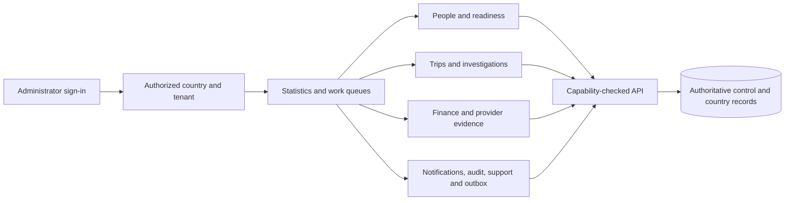

# System Admin mobile app

The KiloDrive System Admin app is a separate Android and iOS Flutter client for
authorized operators. It is the mobile presentation layer for administration;
the API remains the authority for identity, permissions, country and tenant
scope, financial state, safety decisions and audit. The consumer app carries
ordinary rider, driver and rental journeys and no operative System Admin
workspace. A person who is both an administrator and a rider can use separate,
appropriately scoped sessions in the two apps under one global identity.

The [public Google Play listing](https://play.google.com/store/apps/details?id=com.kilodrive.app)
belongs to the consumer app. It is not a distribution link for the restricted
System Admin app. Public support, legal and product resources are collected in
[official product links](../public-product-links.md).

This chapter describes the **2026-09-30 local source checkpoint**. The separate
app exists and several workspaces are implemented, but the migration is not
complete. Source tests, an API route, a rendered screen and a signed-device
operator journey are different evidence levels. Nothing here claims a
production rollout or approval for private distribution. See the
[two-app checkpoint](two-mobile-apps-and-security-2026-09-30.md) for the shared
consumer/admin boundary and [System Administration](system-administration.md)
for the wider control-plane rules.

## What an operator experiences

An administrator signs in, selects a country and an authorized marketplace
workspace, and sees a statistics-led home screen. The app then shows only the
destinations permitted by the current server capability set. A bottom menu
keeps the main work areas close at hand; a drawer reaches the broader catalog.
The structure is familiar to consumer-app users, with related theme,
typography, dark mode, contrast and text-size behavior, but preferences and
credentials remain app-local. The administrator can change a preferred IANA
time zone for general operational timestamps. A person's audit history still
uses the affected person's time zone where that is the governing context.

The app is a work surface, not a mirrored database browser. An item should tell
the operator what happened, whose case it is, how current the information is,
what permission is required, and what safe next action is available. Initial
loading, an actual empty result, a denied capability, a partial failure and a
failed refresh have distinct presentations. Refresh should preserve useful
last-good data without treating it as current authority. A country or tenant
switch invalidates the old workspace's rows, open editors and late responses.

## Workspace map

The following are source-level descriptions, not blanket availability claims.
An individual destination may be read-only, require a separate action grant, or
remain unavailable until its contract and recovery path are reviewed.

| Area | Present purpose | Important boundary |
| --- | --- | --- |
| Home and My Work | Country-scoped statistics, freshness, work needing attention, and links to supported queues | An unavailable metric is not silently displayed as zero. |
| People | Search, inspect and act on an individual account through a dossier | Each section and mutation has its own capability and subject-scope check. |
| Driver and vehicle review | Inspect readiness evidence and take reviewed verification decisions | Uploaded evidence, current eligibility and final approval are separate facts. |
| Trips and rides | Investigate route, participants, timeline, retained replay and communication evidence | A trip participant's private material is opened only through a permitted investigation. |
| Finance | Inspect wallets, transactions, payments, top-ups, cashouts, disputes and exceptions | Ledger records and provider outcomes are authoritative; a screen cannot invent a settlement. |
| Notifications and alerts | Review deliveries, compose permitted sends, and receive opted-in administrator alerts | Provider acceptance is not proof of device receipt or a person's reading. |
| Support and safety | Triage cases with owner, status, deadline and permitted lifecycle action | Sensitive attachments and external communication need their own guarded workflows. |
| Audit and logs | Search scoped history, inspect readable event detail and export one event to PDF | Raw payloads, unrelated tenants and restricted security evidence are not a general browsing surface. |
| Outbox and operational recovery | Inspect queued/failed side effects and perform guarded retry or dismissal | Retrying a worker item does not repeat the original business mutation. |
| Governance and reference data | Review releases, features, country settings, content and approved reference records | A read-only view does not imply the mobile app can publish or alter policy. |

### People as a task-oriented dossier

The People listing leads to a user dossier with eight accessible tab pages:

1. **User details** summarizes identity and contact fields, registration and
   last-seen times, current plan, balance and readiness. Amounts use the
   account currency; times use the affected user's time zone. The visible User
   ID is not repeated under a second “Record ID” label.
2. **User security** separates security actions, sessions and installations.
   Disable/enable, account lock, secure password-reset initiation and session
   revocation are distinct actions. The app does not display, generate or edit a
   plaintext password. Consequential actions require the applicable capability,
   confirmation and server-side audit.
3. **Vehicles** presents registered vehicles, document and verification state,
   with a path to the reviewed compliance workflow where permitted. A stored
   vehicle is not necessarily assigned or eligible for a trip.
4. **Financials** groups transactions, plan history/current term, top-ups and
   payouts. Each record should carry its status, currency, amount, time and
   reference, with access to detail under its own permission. Reviewed plan
   grants and expiry extension appear only for authorized roles.
5. **Readiness** brings identity and other required documents together with
   review notes, outstanding requirements and the approval path. It must make
   the resulting trip eligibility explicit rather than infer approval from a
   single uploaded file.
6. **Rides** groups trips, rentals and deliveries and opens available full
   records. Lack of retained evidence is stated rather than fabricated.
7. **User activity** groups audit trails, trip chat/call logs and support
   tickets. Audit entries use readable descriptions and affected-user-local
   timestamps. Detail and PDF export preserve the context needed to understand
   a single event without showing a raw JSON page.
8. **Actions** offers reviewed identity/contact/status corrections, secure
   reset initiation and membership actions. The server checks conflicts,
   authorization and current state before committing and auditing any change.

Tabs and subtabs retain navigation context when a detail screen closes. The
lists load and page independently so an unavailable optional section does not
erase a person's basic details. Some dossier actions and detail destinations
still require further migration and signed-device verification; this list
describes the intended and locally implemented structure, not universal parity.

### Investigations and financial decisions

Trip investigation combines the current lifecycle, participant relationship,
route/timeline, retained replay, financial context, support links and permitted
communication evidence. Calls and chat are evidence with privacy and retention
limits, not general employee browsing. Certain state changes use a reviewed
revision and a stable operation identity, and the UI returns to an authoritative
read after acting. Archived lifecycle actions are not all migrated.

Finance screens keep amounts in integer minor units and show the currency with
the formatted value. A pending bank transfer, cashout review, payout completion
and dispute resolution are separate decisions. If a response is interrupted,
the app retains the original operation key and any original revision, checks the
server's operation result and refreshes the record. “Outcome unknown” must not
turn into a second blind payment or approval. A human-readable result explains
confirmed success, rejection, conflict, still-processing or manual review.
Provider-managed settlement cannot be relabelled complete by a local tap.

## Security and privacy model

The app does not gain trust from its package name, navigation tree or a header
claiming it is an admin client. The API validates the global account and
session, current grants, selected country, acting tenant, target record and
action-specific proof on every request. Administrative navigation uses the same
capability vocabulary as the server for usability, while direct-route denial
and cross-scope checks remain server responsibilities. A global administrator
can lack an operational country projection; that exception does not confer
unrestricted access to every country record.

Recent authentication establishes renewed control of the signed-in identity;
action-bound two-factor step-up proves a protected action. Neither is supplied
by the device's biometric prompt or the app's local lock PIN. A password reset
uses the established expiring recovery ceremony, never a password chosen or
displayed by an administrator. Session revocation, account status changes,
document decisions and financial actions carry audit evidence. An old result
arriving after logout or workspace change cannot populate the new workspace.

An app installation is not a physical device identity. The admin app retains a
random installation secret in its own secure storage and obtains a server-issued
credential. A reinstall, data reset or second KiloDrive app on one handset may
have a different installation. Model, manufacturer, IP address and a claimed
installation ID help investigation but do not prove possession or ownership.
App Check can verify a registered application identity where configured; the
server also checks session and installation relationships. A known revoked or
restricted installation remains blocked. Device views show scoped installation
history, associated accounts and reviewed restrictions, not an infallible
hardware inventory.

Sensitive documents, location traces, contact information, call evidence and
financial details are loaded only for a permitted task. The client should avoid
retaining restricted bytes across logout, scope change or viewer expiry.
Diagnostics use support/correlation references and sanitized failure categories
instead of secrets, receipts, private message bodies or raw provider payloads.
The public architecture intentionally omits internal hostnames, credentials,
defensive thresholds and operational access procedures.

## Notifications, adapters and recovery

Administrator alerts are a separate opt-in inbox and push channel from
consumer notifications. An alert push carries a generic hint. Tapping it
requires a fresh session, country/tenant and target authorization check before
detail is loaded. Push tokens follow app-channel, installation, session and
permission state; logout and workspace exit deactivate an admin binding. A
stale or rotated token must not become a route into another person's case.

Notification sends are staged durably and dispatched by workers through
provider adapters. Each attempt has its own status. Provider acceptance is only
one stage; device display and human read are separate observations. The
reviewed exact-installation path requires one current user/session/installation
and app-channel binding plus approved, fixed text. It is deployment-gated to a
safe foreground presentation path; an unsupported platform state is shown as
unavailable instead of silently falling back to a potentially unsafe OS alert.

The app also uses typed boundaries for device credentials, Firebase messaging,
secure storage, native permissions and process lifecycle. These adapters
translate platform outcomes without deciding admin permission or business
state. For mutations, a frozen payload, original idempotency key and original
record revision survive response loss where the operation requires them. A
local pending-operation journal is account/workspace-bound. It preserves only
the data needed for safe reconciliation and never stores passwords or step-up
proofs. The status endpoint and fresh scoped record, not a timeout, determine
whether it is safe to clear or retry the original request.

## Accessibility and operational clarity

The admin app follows the consumer design language for recognizable controls
while remaining a separate product. Phones use a compact navigation pattern;
wider layouts can show more context without losing task order. Text scaling,
contrast, focus order, semantic labels and confirmation language matter most
when the action affects an account or money. A translated label must preserve
the meaning of the status and warning; localization coverage is incremental
and is checked per released workflow. Unknown enum values or unavailable
facts appear neutrally and disable unsafe actions rather than showing a raw
number or guessing a successful state.

## Current limits and evidence needed

The System Admin migration is substantial but unfinished. Restricted document
viewing and decisions, parts of account governance, broader trip/delivery and
financial actions, campaigns, provider operations and some support channels
still need contracts, UI, recovery and permission evidence. The operation
inventory is a worklist, not proof that every route is usable. Some source
screens and API tests pass while no signed-device exercise exists for the exact
workflow. The private iOS/Android release process, independent app identity,
notification isolation, process-death recovery, limited-admin denials and
paired installation with the consumer app all need evidence tied to a specific
signed candidate before a general release claim.

Use the source repository's `src/client/system_admin/MIGRATION_PARITY.md` and
dated operation-evidence ledger for per-workflow status; regenerate them before
using counts because the People work has continued since the last ledger. For
the operator-level map, continue with [workflow contracts](admin-workflow-contracts.md)
and [critical journeys](../diagrams/admin-critical-journeys.md). For the trust
boundaries, continue with [Identity and access](../security/identity-and-access.md),
[Realtime and events](realtime-and-events.md),
[Financial systems](financial-systems.md), and
[Capability status](capability-status.md).
