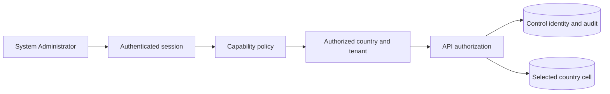

# System Administration Architecture

## Purpose and status

KiloDrive System Administration is an operations control plane, not a collection
of unrestricted CRUD screens. It helps authorized people resolve country-scoped
work while preserving identity, tenant, financial, safety, privacy, and evidence
boundaries.

- **Reviewed baseline:** mobile `1.0.0+82`, schema contract `2026.08.30.1`
- **Source status:** implemented incrementally across API, Flutter, and Portal
- **Runtime status:** capability-, country-, role-, and feature-policy-dependent
- **Not claimed:** complete mobile/Portal parity, universal country activation,
  or certification of every provider and operational lifecycle

The control plane keeps entity browsing for investigation, but ordinary work is
organized around outcomes: verify an applicant, contain a safety issue,
reconcile money, recover an outbox item, resolve a case, or restore a provider.

## Trust boundaries

A System Administrator is a global control identity. Unlike an ordinary rider,
driver, or rental-team member, that identity may legitimately have no local user
projection in a country cell. This is the reviewed source exception to the
normal active-cell-membership rule; a deployment claim still requires its
authorization tests and policy evidence.

That exception does not provide unlimited data access. Before a country record
loads, the operator selects an authorized country workspace and, where needed,
an acting tenant. The API validates the global identity, status, role, token
version, capability, selected country, and tenant on every request. A hidden UI
button or a client-supplied country header cannot grant access.

Workspace switching clears country-scoped selections, editors, caches, and
pending mutations. A list from Jamaica cannot remain selected after changing to
Canada. Global views state that they are global instead of silently inheriting
the last country.

## Capability-driven navigation

Portal and Flutter are migrating to one shared capability vocabulary. Each
registered navigation entry declares:

- route and user-facing label;
- required capability;
- global, country, or tenant scope;
- recent-authentication or 2FA step-up requirement; and
- supported surface or an explicit secure handoff reason.

Each migrated permitted destination appears once. Forbidden destinations are omitted,
but direct route authorization still runs because hiding a menu is not security.
Unknown permission bits are reported through sanitized diagnostics and never
rendered as a raw numeric mask. Narrow layouts use named capability chips or an
accessible “N permissions” summary.

Operations that are intentionally desktop-only remain labelled as such with a
reviewed rationale and a secure handoff. They must not appear to be broken
mobile buttons. Permission-aware parity tests require every registered
capability to be available, explicitly desktop-only, disabled by policy, or
retired.

## Authentication, recent authentication, and step-up

The three proofs are deliberately separate:

| Proof | What it proves | Scope and lifetime |
| --- | --- | --- |
| Authenticated session | The API recognizes the current identity/session | Short-lived access token plus server-controlled session/refresh state |
| Recent authentication | The same user recently controlled a supported login method | Current `auth_time` within ten minutes, or one generic single-use proof bound to user and tenant |
| 2FA step-up | An enrolled second factor approved one protected action | Single-use, action/user/tenant-bound, and short-lived |

The local mobile app lock—biometric or KiloDrive's four-digit app PIN—satisfies
none of these server proofs. Selected System Administrator account/security and
system-setting changes require 2FA enrollment and action-bound step-up. Other
endpoints follow their named policy; the client does not infer one blanket rule.

An administrative security mutation follows this pattern:

1. load the target and current version inside the authorized scope;
2. explain effect, dependencies, and recovery;
3. acquire recent authentication and/or action-bound step-up;
4. submit the expected version and idempotency key when applicable;
5. commit the authoritative mutation and audit together where the boundary
   permits;
6. publish notification/realtime/webhook side effects durably after commit; and
7. reload the authoritative state without exposing a raw provider response.

## Operational work queues

The dashboard is a triage surface. Queue items carry owner, country, tenant,
severity, age, service-level agreement (SLA) or deadline, next action, required proof, entity reference,
and a safe correlation reference. Reviewed queues include:

- pending driver/rider/vehicle/document verification;
- safety cases and SLA breaches;
- ledger/reconciliation mismatches and cashout approvals;
- provider failure and canary evidence gaps;
- outbox lag, failed work, retry, and archive state;
- scheduled-ride guarantee/replacement risk;
- rental dispute, damage, return, and settlement work; and
- support cases awaiting assignment, review, information, escalation, or
  closure.

Each migrated queue contract requires counts and lists to use the same country,
tenant, retention, and eligibility predicate. For example, an outbox archived
count and its paged archive query must share workspace and retention filters. If
retention hides a legacy archived item, the summary says it is
unavailable under policy instead of claiming the archive is empty. A queue item
is not resolved merely because it disappeared from a client cache.

Entity directories remain secondary navigation for research and controlled
maintenance. They do not replace owner/SLA/next-action accountability.

## Typed view state and non-disruptive refresh

Each migrated administrative feature owns typed immutable view state. Core and optional
cards load independently:

- shimmer is used only for an initial content fetch;
- a successful zero-row response produces an explicit empty state;
- a whole-screen service failure produces a retryable error state and sanitized
  correlation evidence;
- an optional tab/card failure leaves successful core data visible;
- a refresh failure retains last-good data, last-sync time, and a partial-error
  banner; and
- a workspace switch invalidates all incompatible state before the new request.

In migrated investigation workspaces, background refresh fetches deltas and
displays “N new events.” It does not
replace the list with shimmer, reorder the item under investigation, clear
selection, move focus, or reset scroll. Visual merging pauses while an editor or
confirmation is open. Server versions, not wall-clock guesses, decide whether an
incoming entity is newer.

## Investigation workspaces

### Trips

The trip workspace presents typed, independently failing sections:

1. Overview
2. Participants
3. Vehicle
4. Route and Stops
5. Replay
6. Bids
7. Chat
8. Calls and Recordings
9. Timeline
10. Payment and Receipt
11. Safety
12. Audit

It displays participant and vehicle names, human-readable enum values,
ISO-aware money, validated distance provenance, and the administrator's selected
IANA timezone. No replay, no chat, and no call are successful empty states. A
missing optional recording or map must not erase the trip overview.

The presenter allow-lists safe metadata. Raw payload JSON, storage paths, access
tokens, presigned URLs, and internal database identifiers never become a
debugging shortcut in the UI. Unknown contract values render “Unknown or
unavailable,” disable unsafe actions, and emit a sanitized diagnostic.

### Audit and activity

Audit search is bounded, indexed, paged, and authorized. Reviewed filters include
owner first/last name, verified email/phone, action, outcome, IP address, and
normalized device fields. Wildcards are explicitly escaped; arbitrary SQL-like
patterns are not passed through.

Results show localized action/outcome, owner full name and type, administrator-
local timestamp, and IP/device only when permitted. UTC remains the stored truth.
Details present allow-listed structured metadata and a copyable correlation ID,
not raw JSON or internal audit/user/entity UUIDs.

### Users, drivers, riders, and vehicles

Profile, verification, membership, documents, vehicles, trips, sessions, and
activity are separate tab bodies with independent state. Membership choices are
filtered by active audience and country; the API repeats that check
transactionally. Grant denial preserves the current entitlement and records an
audit event.

Vehicle details have explicit profile, images, documents, trips, approval,
fitness, registration, and insurance sections. Document type/status values use
the shared exhaustive presenter, including safe future-value handling.

## Restricted documents and quarantine

The restricted identity/compliance viewer never uses a generic share/open action. A
capable System Administrator completes the required step-up and receives a
short-lived viewer session. Every byte request revalidates:

- current administrator session and token version;
- capability and selected country/tenant;
- document ownership and linked subject;
- current quarantine/scan disposition; and
- viewer-session expiry.

The viewer shows type, human-readable status, upload date, review notes, and
audited actions. It never renders object keys, storage paths, user UUIDs, or raw
URLs. OS sharing is disabled for restricted content classes. Screenshot
protection is best effort rather than DRM. Temporary bytes are cleared on close,
logout, session revocation, account switch, and process recovery.

A pending/rejected/quarantined document produces a specific safe state—not a
generic “409 client error.” An administrator cannot mark an upload clean merely
to make the viewer work.

## Administrator account security workspace

The dedicated workspace supports list/search, invitation, capability assignment,
lock/unlock, active-session revocation, 2FA status/enforcement, recovery
administration, and per-administrator audit history. It uses non-user fixtures
for safe login tests. It never prints password, recovery code, refresh token,
passkey secret, TOTP secret, or provider token.

Security actions require expected version and the endpoint's recent-auth/2FA
policy. A lock or session revocation updates authoritative control identity and
token version so an existing client cannot continue merely because its local UI
has not refreshed.

## Finance and membership operations

Money fields always carry ISO currency and integer minor units. Editors format
existing minor values as locale-aware major input, apply the shared money
formatter, parse exactly once, and preview the exact minor-unit result. Limits
use bounded integer formatters. A JPY-like zero-decimal currency and a
three-decimal currency must round-trip without mutation.

Wallet adjustments, membership grants, voucher issuance, refunds, cashouts, and
reconciliation use canonical domain commands, idempotency, journals, audit, and
expected versions. An administrator does not repair balances through direct row
edits. Cross-audience plan IDs fail with stable validation while preserving the
current entitlement.

Store-product status distinguishes source configuration from certified native
store evidence. Administrators may inspect mapping, acknowledgement, grace,
refund, and revocation state, but the UI must not call a plan purchasable until
the exact country/platform product, base plan/offer, term, currency, minor-unit
price, and localized native-store price agree.

## Support and safety operations

Support uses published contract version `1` and localized codes:

`Received → Reviewing → Waiting for information → Resolved`.

Legacy Open/Answered/Closed values map deterministically; Answered depends on
the latest sender chronology. A requester can reopen a resolved case during the
published fourteen-day window. Later work becomes a linked follow-up. Overdue
ordinary support enters the SLA queue; immediate danger uses the separately
authorized safety/emergency path.

SafetyCase has its own severity, owner, SLA, escalation, acknowledgement,
evidence, and closure reason. Noisy GPS, an unread message, or a support label is
never an automatic finding against a rider or driver.

## Outbox and provider operations

Outbox screens show payload-free summary, typed status, age, attempts, next
attempt, last safe error class, archive/retention state, and correlation. Retry
uses the original message identity and remains idempotent. Clearing a row is a
retention-governed archive/delete operation, not a way to make a dashboard green.

Provider diagnostics show normalized provider, latency, sanitized status,
correlation, consecutive failures, and certification evidence. Destination,
body, OTP, token, credential, and media never appear. Provider acceptance is not
delivery. FCM/APNs device receipts and AWS WhatsApp delivery/inbound correlation
have dedicated evidence paths; other providers remain uncertified until their
required authenticated evidence producers and non-user destinations exist.

At this baseline canary maintenance is deployment configuration reported by the
administrator UI, not an in-app mutation. A future runtime control would require
its own capability, recent-auth/step-up, reason, expiry, audit, and rollback.

## Configuration and reference data

Countries, vehicle makes, models, years, banks, and branches load in independent
paged/filterable workspaces. One reusable editor per entity type replaces a form
per row. Country rules are database-driven and versioned; activating a schema
does not automatically approve country product operation.

CSP management uses a parsed directive model, allow-listed sources,
security/syntax validation, diff/preview, staged activation, independent
approval, a no-redirect synthetic probe, history, and rollback to a previously
activated probe-passed version. Raw production CSP text is not a casual editor.

The operator sequence, activation evidence, and rollback conditions are defined
in the [CSP change runbook](../runbooks/csp-policy-change.md).

## Evidence, privacy, and retention

Administrative evidence records actor, role/capability, workspace, operation,
target safe reference, expected/resulting version, outcome, UTC timestamp, and
correlation. Sensitive content remains in its governed domain store. General
logs and screenshots omit credentials, contact details, document data, exact
location, payment instructions, message bodies, and raw payloads.

Migrated exports render the user/country or administrator-selected timezone as a labelled
display companion while retaining UTC truth internally. They use ISO-aware money
and human enum names. An exported internal numeric mask or raw JSON is a defect.

## Failure modes we design for

- A user loses capability while a detail page is open.
- A System Administrator switches country with pending requests.
- Recent authentication expires before mutation.
- A 2FA proof is replayed or used for the wrong action.
- One optional trip/document/provider tab fails while core data succeeds.
- Realtime disconnects during a committed operation.
- Auto-refresh races with an editor or pagination.
- An outbox retry runs after the client reports a timeout.
- A new enum or permission bit reaches an older client.
- Retention hides an archived record counted by an older predicate.
- A restricted document changes scan state between metadata and byte open.

Each migrated recovery path must converge through an authoritative reload, a
stable safe error code, durable event and audit evidence, or an explicit
read-only unavailable state. The UI
never invents success, emptiness, permission, or certification.

## Verification matrix

Use deterministic non-user fixtures and test:

- full, limited, and no-capability System Administrator roles;
- global identity with no local projection and authorized country switching;
- direct-route denial, insecure direct object reference (IDOR) attempts across
  tenant/country boundaries, stale token version, and
  revoked session;
- recent-session, recent-proof, missing/expired/reused proof, enrolled/missing
  2FA, and wrong-action step-up;
- work-queue count/list consistency, paging, concurrent resolution, retention,
  and workspace switching;
- trip variants: completed, cancelled, no chat/call/replay, telemetry gap, and
  partial API failure;
- restricted documents: 401, 403, 404, quarantine conflict, expired viewer,
  cross-scope access, logout, and process death;
- audit wildcard escaping, owner/contact/device search, timezone/DST, future
  enum, and raw-ID/payload absence;
- finance zero/two/three-decimal round trips, audience denial, idempotency,
  concurrency, and reconciliation;
- support reply/assignment/wait/resolution/reopen/escalation lifecycle;
- provider/outbox success, timeout, failure threshold, retry, archive,
  maintenance, and leak scanning; and
- 320-pixel/2.0× text, keyboard, focus, semantics, and delta-refresh behavior in
  each supported locale.

Production-safe fixtures are tagged with a run ID and constrained by a generated
mutation allowlist. Cleanup runs in `finally`: close/cancel active work, force
drivers offline, anonymize mutable fixture data, reconcile money/holds/journals,
and retain only sanitized correlations and immutable evidence required by law or
accounting policy.

## Known gaps and honest wording

| Area | Current wording | Evidence needed before stronger wording |
| --- | --- | --- |
| Mobile/Portal parity | Implemented incrementally; some capable operations have an explicit surface or handoff | Registry parity and authenticated render/workflow tests for every capability |
| Provider operations | Canary framework/configuration exists; certification is provider-specific | Dedicated destinations, delivery/inbound producers, forced failure, recovery, and leak proof |
| Country operation | Schema and feature-policy gates exist | Complete country launch dossier and positive lifecycle/provider/legal evidence |
| Supervised teen travel | API/Flutter foundations are country/legal-gated; Portal enrollment/chat is not enabled | Legal approval, Portal parity, consent/age boundary, and three-device certification |
| Large legacy admin views | Typed slices and independent states are incremental | Remaining dynamic maps/direct clients removed with dependency, rebuild, race, and frame tests |
| Runtime canary maintenance | Deployment configuration reported in diagnostics | Authorized mutation API/UI with step-up, audit, expiry, rollback, and tests |

## Related reading

- [Product and operational doctrine](../governance/product-and-operational-doctrine.md)
- [Portal and corporate website](portal-and-website.md)
- [Capability status and evidence](capability-status.md)
- [Identity and access](../security/identity-and-access.md)
- [Tenancy and country cells](tenancy-and-country-cells.md)
- [Rider and driver safety](rider-driver-safety.md)
- [Financial systems](financial-systems.md)
- [Support and dispute runbook](../runbooks/support-dispute-cases.md)
- [Notification canaries](../runbooks/notification-canaries.md)
- [Schema alignment](../runbooks/schema-alignment.md)
