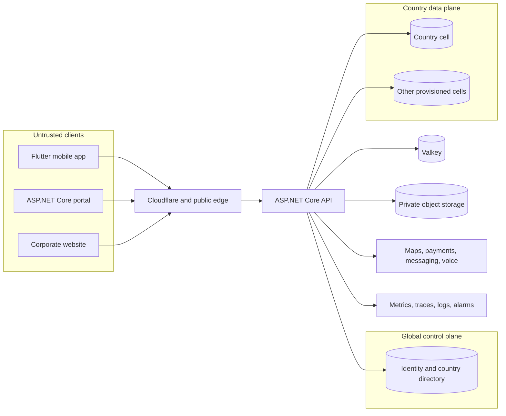

# System Context

## Why this document exists

KiloDrive is not just a mobile application connected to a database. It is a
marketplace, a realtime dispatch system, a document-verification system, and a
financial ledger operating across several countries. A change that looks local
in the Flutter app can affect identity routing, driver eligibility, money,
notifications, and safety evidence on the server.

This chapter gives engineers a dependable mental model before they work on a
specific feature. It intentionally stays public-safe: it explains boundaries
and responsibilities without publishing credentials, internal addresses,
customer data, or defensive thresholds.

## The shortest useful mental model

Think of KiloDrive as three cooperating planes:

1. **The global control plane** answers “Who is this person, how may they
   authenticate, and which country workspaces may they enter?”
2. **A country data plane** answers “What rides, vehicles, wallets, rentals,
   documents, and local business records belong to this marketplace?”
3. **The realtime and provider plane** helps the system react quickly and talk
   to the outside world, but it does not replace the authoritative databases.

This separation is deliberate. A temporary push-notification outage should not
undo a completed wallet transfer. A country-cell outage should not corrupt
global authentication. A stale cache should not become proof that a driver is
eligible to accept a trip.

The boxes show trust boundaries, not a promise that every component runs on a
separate machine. Deployment topology can change without changing who owns the
data.

## People and systems at the boundary

| Actor or system | What it needs | Important boundary |
| --- | --- | --- |
| Rider | Quote, negotiate, select a driver, pay, communicate, review, and use safety tools | May see only their own requests, trips, wallet, and authorized shared data |
| Driver | Complete onboarding, manage vehicles, bid, navigate, communicate, and receive earnings | Being signed in is not the same as being eligible or online |
| Rental organization | Manage team permissions, fleet, bookings, evidence, payments, and disputes | Organization membership and permission checks are distinct from an ordinary user role |
| Tenant administrator | Operate one authorized marketplace | Tenant context must come from verified claims, never a client-controlled identifier alone |
| System administrator | Select and operate an authorized country/tenant workspace | Cross-tenant action requires explicit acting context and audit evidence |
| Public visitor | Read corporate content and use approved calculators | Anonymous routes have narrow input, routing, and rate-limit rules |
| External provider | Maps, messaging, payments, voice, malware scanning, or storage | Provider responses are untrusted input and failures are expected |

## Runtime components and their jobs

### Flutter mobile app

The mobile app presents rider, driver, rental, tools-only, and System Admin
workspaces. It is an untrusted client even when distributed through an official
store. APK or IPA code can be inspected or modified, so the server repeats all
authorization, eligibility, state-transition, and financial checks.

The app uses repositories and Riverpod state for network-backed features,
SignalR for low-latency changes, FCM/APNs for background notification, and
polling or refresh as a recovery path. Optimistic UI makes the experience feel
fast; the API response remains authoritative.

### Portal

The ASP.NET Core MVC portal provides browser workflows for users and
administrators. A server-rendered page is not inherently more trusted than the
mobile app: every portal action still calls the API and is subject to
authorization, anti-forgery protection, correlation, and tenant/country scope.

### Corporate website

The public website serves marketing content, legal pages, calculators, and
carefully scoped public experiences. Most content is database-driven through
approved API routes. Public does not mean unlimited; validation, rate limiting,
content security policy, and tenant routing still apply.

### ASP.NET Core API

The .NET API is the policy enforcement point. Controllers stay thin; handlers
and services own business rules. It performs authentication, tenant and country
resolution, validation, idempotency, conditional state changes, ledger writes,
audit staging, outbox staging, and provider orchestration.

The API is intentionally one deployable project organized by feature folders.
This keeps transactions and cross-feature workflows understandable while the
team is still small. The feature boundaries matter more than the number of
assemblies. A future service split should follow measured scaling or ownership
needs, not fashion.

### MySQL control database

`kilodrive_control` owns global identity and platform directory data: password
and session state, refresh and recovery state, MFA/passkeys/social identities,
country memberships, global security audit, System Admin permission grants,
country/shard registration, global support and deletion orchestration, global
verification/compliance coordination, and selected universal catalogues.

It does **not** participate in ride settlement or wallet balance mutations.
That prohibition is one of KiloDrive's most important consistency rules.

### MySQL country cells

A country cell such as `kilodrive_jm` owns that country's local marketplace:
tenant configuration, credential-free user projections, driver profiles,
vehicles, ride requests, bids, trips, deliveries, rentals, wallets, payments,
accounting journals, local audit, notifications, safety records, and outbox
messages.

Keeping the complete financial and operational graph together lets one MySQL
transaction preserve the invariants that matter: funds held once, debits equal
credits, one bid accepted, and one trip created.

### Valkey

Valkey provides distributed, short-lived state: current driver coordinates,
geospatial candidate lookup, SignalR scale-out, cache entries, and short leases
used by realtime workflows. It improves latency and multi-node behavior, but it
is not the system of record. Location samples needed for trip replay or safety
are persisted asynchronously to MySQL.

### Private object storage

Documents, evidence, and media are stored outside the web root in private object
storage. Uploads are size-limited, signature-checked, scanned, and, for raster
images, re-encoded before they become available. Database rows store ownership,
content class, scan status, and object references. Downloads require an
authorized application route or short-lived signed access appropriate to the
content class.

### External providers

Provider adapters isolate maps, messaging, push, payments, voice, malware
scanning, and telemetry. Provider calls have timeouts. Mutating provider calls
are not blindly retried unless a stable idempotency key and unknown-result
reconciliation make that retry safe.

## A ride lifecycle, end to end

Following one ride is the easiest way to see the architecture work as a whole.

1. The rider authenticates against the control plane. The signed access token
   contains identity, role, tenant, token version, and home-country claims.
2. Country and tenant middleware resolve one authorized country cell and one
   tenant before feature code runs.
3. The rider requests a fare quote. Route/provider work is measured separately
   from local fare calculation so a slow map provider is visible.
4. Ride creation validates the same route inputs used by the quote, claims an
   idempotency key, and writes the request and durable outbox work in the country
   cell.
5. Matching uses fresh location candidates from Valkey when available, then
   rechecks durable eligibility such as online state, active assignments,
   vehicle capability, blocks, and compliance in MySQL.
6. Drivers receive realtime or background alerts. A realtime event is an
   acceleration path, not the only record of the event.
7. Bid changes use conditional state/version rules. On acceptance, the API
   revalidates the driver and snapshots the chosen vehicle and compliance state
   onto the trip.
8. During the trip, location enters the realtime path, while bounded persistence
   produces replay and safety evidence. Route-deviation logic can create a
   RideCheck alert and durable safety event.
9. Completion updates domain state and financial records in one country-cell
   transaction. Wallet subledger activity and immutable accounting journals
   must agree.
10. Notifications, webhooks, reports, and other side effects leave through the
    outbox after commit. Their failure cannot turn a committed trip back into an
    uncommitted one.

That last point is worth repeating: **never tell a caller that a committed
business operation failed merely because a later notification failed**. It is a
classic source of duplicates when the caller retries.

## Authoritative state versus acceleration state

| Question | Authority | Faster but non-authoritative aid |
| --- | --- | --- |
| Is a refresh token valid? | Control database | None |
| May this identity enter a country workspace? | Active control-plane membership and signed claims | Client's last selected workspace |
| Is this wallet balance spendable? | Country-cell wallet and ledger rows | Cached dashboard balance |
| Where was the driver most recently? | Valkey for live display; persisted MySQL samples for durable evidence | Process-local latest-value buffer in development |
| Who should receive a ride alert? | Country-cell eligibility plus current telemetry | Valkey GEO candidate set |
| Was a notification sent? | Notification/outbox/provider-attempt records | A SignalR acknowledgement |
| Is a document safe to view? | Stored scan and authorization metadata | A thumbnail shown earlier |

When debugging, first decide which kind of state you are looking at. Many
production incidents become confusing because a developer treats a cache,
notification, or screen state as if it were the business record.

## Trust boundaries

### Client to edge

Inputs may be malformed, replayed, scripted, or intentionally hostile. The edge
adds denial-of-service and common-probe protection, but application validation
and authorization remain mandatory.

### Edge to API

Forwarded client-IP headers are trusted only when the request came through the
configured proxy boundary. Otherwise, an attacker could forge the address used
for rate limits and audit records.

### API to databases

The API uses a control context for global identity and a cell context for local
operations. Opening both does not create a distributed transaction. Cross-store
work therefore uses durable sagas/outboxes, inactive checkpoints, idempotent
projection, and reconciliation.

### API to providers

Provider status codes, callbacks, and webhook payloads require validation and,
where applicable, signature verification. A `200 OK` from a provider is not by
itself proof of settlement. Provider identifiers are stored for reconciliation;
secrets and message bodies are excluded from logs.

## Availability and degradation

KiloDrive distinguishes dependencies by consequence:

- **Fail closed:** identity verification, tenant/country authorization, schema
  compatibility, wallet invariants, document scanning, and critical compliance
  checks.
- **Retry durably:** notifications, webhooks, dispatch fan-out, report delivery,
  and provider acknowledgement that can occur after a business commit.
- **Degrade with an honest UI:** optional provider data, an empty cache, or a
  realtime interruption when authoritative polling remains available.
- **Development-only fallback:** process memory can replace distributed cache
  for local development, but that is not a production scale-out strategy.

A degraded mode must be both safe and visible. Returning stale or invented data
to keep a screen green is not resilience.

## Scaling shape

The architecture scales along independent pressure lines:

- API nodes can scale horizontally once SignalR and distributed state use
  Valkey rather than process memory.
- Country cells contain local query and write load, and a busy country can be
  scaled without moving every other market.
- Dispatch fan-out can use an external event bus and queues while the SQL outbox
  remains the durability and recovery record.
- Expensive route, matrix, report, and provider work is bounded, cached where
  safe, measured by stage, and kept out of short business transactions.
- Static and private objects scale through object storage rather than IIS local
  disk.

Do not add nodes before shared state is ready. A second API node with
process-local passkey ceremonies, in-memory SignalR state, or local-only caches
can be less reliable than one node.

## Invariants every engineer should know

1. Authentication secrets live in the control plane, never in country user
   projections.
2. One financial transaction belongs to exactly one country cell.
3. Every tenant-owned entity is filtered by the resolved tenant unless a
   narrowly reviewed, explicitly scoped administrative path proves otherwise.
4. A mobile or browser role is a presentation hint, not authorization proof.
5. Money is an integer number of ISO currency minor units, never a floating
   point value.
6. UTC is stored; localization happens at the presentation boundary.
7. A durable business commit precedes external side effects.
8. Idempotency protects retried mutations; entity versions protect stale
   decisions. They solve different problems and are often both required.
9. Realtime delivery may be lost. Durable state and recovery reads must still
   converge.
10. No identifier, even an unguessable one, replaces an ownership check.

## Hard-learned pitfalls

### “The push arrived, so the ride must exist”

Push is a delivery hint. Devices can receive late messages, duplicate messages,
or no message. Always fetch or merge the versioned authoritative entity.

### Doing provider work inside a transaction

A map, email, payment, or voice provider can pause for seconds. Holding database
locks while waiting causes queueing, deadlocks, and cascading latency. Commit
the local decision, stage durable work, then call the provider from the owning
workflow.

### Treating an online boolean as fresh presence

An app can be killed without sending “offline.” Matching therefore requires
fresh permitted location telemetry as well as the online state. An expiry worker
clears stale presence; the client must make background limitations honest.

### Letting headers switch an authenticated user

Country and tenant headers are useful before authentication and for explicit
System Admin workspace selection. They must not override an ordinary user's
signed claims.

### Hiding schema drift with a version string

Two databases can both say `2026.x` while differing in a column type or index.
KiloDrive fingerprints normalized tables, columns, indexes, and foreign keys and
checks the recorded metadata against the compiled EF relational model.

### Logging the thing that broke

Dumping request payloads is tempting during an incident, but those payloads may
contain tokens, phone numbers, documents, chat, or payment data. Use operation
names, result codes, provider IDs, durations, and correlation IDs instead.

## How to follow one production-safe request

When diagnosing a request, use this order:

1. Start with the caller-visible correlation ID.
2. Confirm the deployed binary/version independently of the database version.
3. Confirm the resolved country and tenant without printing claims or contact
   data.
4. Inspect the business record and its version in the owning database.
5. Inspect idempotency and outbox state.
6. Inspect sanitized provider-attempt or realtime delivery metadata.
7. Check readiness, queue lag, database waits, cache health, and provider
   duration.
8. Reproduce with a dedicated fixture; do not experiment on a real user's
   record.

## Where to go next

- [Tenancy and country cells](tenancy-and-country-cells.md)
- [Entity identification](entity-identification.md)
- [Geospatial processing](geospatial.md)
- [Database architecture](../database/README.md)
- [Data ownership](../database/data-ownership.md)
- [Schema lifecycle](../database/schema-lifecycle.md)
- [Country-cell sharding ADR](../adr/001-country-cell-sharding.md)
