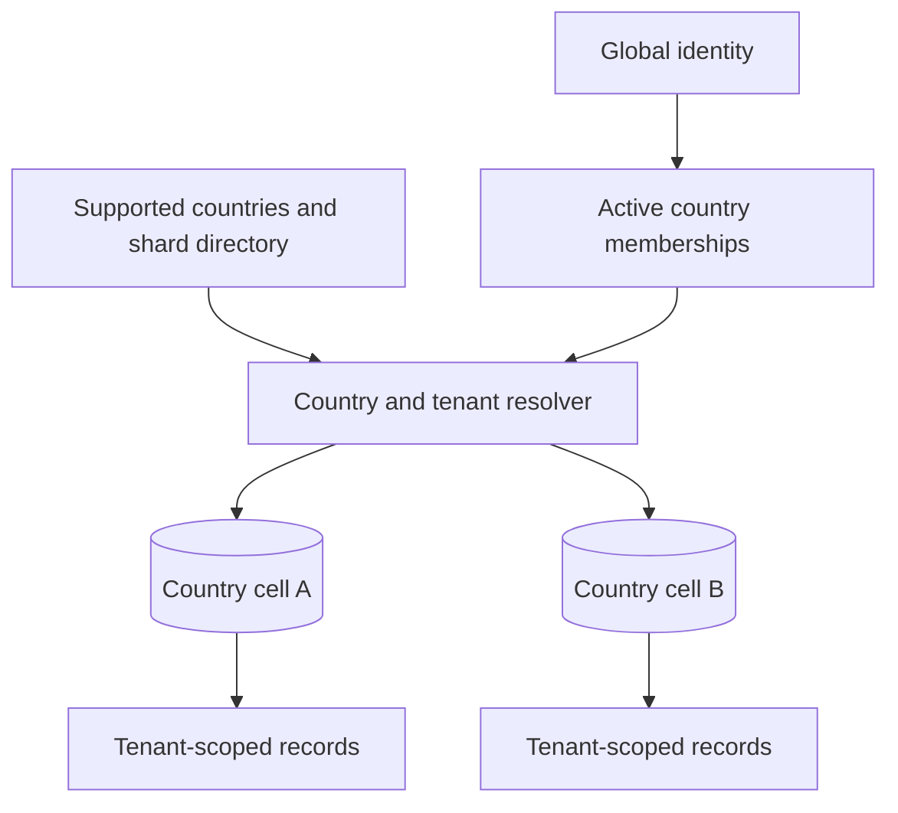
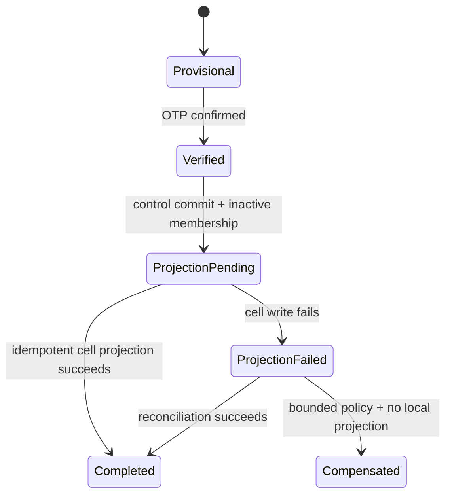

# Tenancy and Country Cells

## Start with the vocabulary

KiloDrive uses several scopes that are easy to mix up:

- A **global identity** is one human or administrative account in the control
  plane.
- A **country** is a legal and operational jurisdiction identified by an ISO
  country code.
- A **country cell** is the MySQL data plane that owns that country's rides,
  wallets, rentals, and other local records.
- A **tenant** is a marketplace boundary inside a cell. Tenant data is isolated
  with a tenant identifier and query filters.
- A **workspace** is a user-facing mode that the authenticated identity is
  authorized to enter, such as Rider, Driver, Rental Organization, or System
  Admin for a selected country.

These are related, but they are not interchangeable. In particular, a role shown
by the app does not prove country or tenant authorization.

## Why global identity and country-local operations are separate

A transportation marketplace has two very different kinds of data:

1. Credentials and security state must follow the person consistently. Password
   resets, refresh-token revocation, passkeys, and security audit cannot depend
   on whichever country cell happens to be healthy.
2. Trips, payments, local regulations, verification evidence, and retention are
   governed by the country in which the operation occurs. Their transaction
   graphs should stay together.

KiloDrive therefore keeps identity in `kilodrive_control` and operational state
in cells such as `kilodrive_jm`. The design contains failure and makes local
money transactions possible without a distributed commit protocol.



## Ownership in practical terms

### The control plane owns

- global users and authentication credentials;
- refresh, password-reset, verification, recovery, MFA, passkey, and social
  identity state;
- token version and account-security state;
- active `UserCellMemberships`, including country, tenant, role, and primary
  workspace;
- supported-country rules and provisioned-shard directory records;
- global System Admin permissions and security audit;
- global support/deletion orchestration and country execution checkpoints;
- global identity verification/compliance coordination;
- global push-token ownership and selected platform-wide catalogues; and
- universal vehicle make/model/year data and other explicitly global content.

### A country cell owns

- the tenant marketplace configuration;
- a credential-free user projection for local foreign keys and display;
- driver profiles, licences, vehicles, assignments, and local documents;
- ride requests, bids, inquiries, trips, chat, location samples, and reviews;
- deliveries, escrow, and delivery settlement;
- rental organizations, team permissions, fleet, bookings, evidence, and
  settlement;
- wallets, payments, transfers, cashouts, store purchases, and immutable
  accounting journals;
- membership plans as applied to local accounts and usage limits;
- local audit, notifications, safety cases, and outbox work; and
- country-specific banks, branches, fare settings, and reference data.

The word “projection” matters. A country `Users` row is not a second login
account. It deliberately omits password, MFA secret, session, and recovery
authority. Authentication code must use the control identity context.

## How a normal authenticated request is routed

The routing decision occurs before a feature handler uses the country database.

1. Authentication validates the access token signature and expiry, then
   revalidates the global control identity's active status, role, and token
   version. Signed claims are necessary but are not the final authority after
   an account is locked, revoked, moved, or changed.
2. The cell resolver selects the configured country connection. For an ordinary
   user, the signed home-country claim wins; a request header cannot switch it.
3. Tenant middleware resolves the tenant slug and confirms it matches both the
   signed tenant identifier and an active control-plane cell membership for the
   exact tenant, country, role, and user. The sole no-local-projection exception
   is a globally authorized System Administrator using the explicit workspace
   path.
4. The scoped `TenantContext` is populated.
5. EF Core global query filters constrain every `TenantEntity` to that tenant.
6. The feature handler applies ownership, role, state, and business checks that
   are more specific than tenancy.

The filter reads the scoped context at query time. This is important because the
EF context can be constructed before middleware finishes resolving the tenant.

### Why the filter is not enough

Suppose two riders belong to the same tenant. A query filter allows rows for the
tenant, but it does not prove Rider A owns Rider B's payout method. The handler
must still include `UserId == currentUserId` or an equivalent relationship in
the query.

Tenant filtering prevents cross-tenant leakage; ownership authorization prevents
same-tenant IDOR. Both are required.

Claim drift fails closed. A token minted before role removal, token-version
change, account lock, or cell-membership revocation cannot keep operating merely
because its signature is valid. Tests cover wrong country, wrong tenant, stale
role/token version, inactive membership, ordinary-user header switching, and the
intentional System Administrator exception.

## System Admin workspace selection

A global System Admin may not have a local `Users` projection in every country.
That is intentional. After strong authentication and any required step-up, the
admin selects an authorized country workspace and tenant. The request carries an
explicit country selection and acting-tenant proof; middleware validates the
System Admin role, resolves the target records inside that cell, marks the
context as acting, and writes both local and global audit evidence.

Ordinary users cannot use those headers to change country or tenant. A header is
input, not authority.

When adding an admin endpoint, ask all four questions:

1. Which country connection will be selected?
2. Which tenant is the admin acting for?
3. Which permission, beyond the broad role, allows this action?
4. Where will the cross-tenant action be audited?

If any answer is “the controller probably handles it,” the boundary is not ready.

## Anonymous routing is a narrower exception

Registration, login, and selected public routes may need country or tenant input
before a signed identity exists. KiloDrive accepts narrowly validated routing
metadata for those flows. It does not make anonymous headers trustworthy; it
limits what those routes can do, validates the country against the control
directory, rate-limits the operation, and creates no active identity until
ownership is proven.

Branded-domain or signed bootstrap routing is a stronger long-term boundary than
a raw public tenant header. New anonymous features should not copy routing logic
without a security review.

## Registration is a saga, not a cross-database transaction

MySQL cannot atomically commit one transaction across an independently managed
control database and country cell in the way KiloDrive needs. Pretending it can
creates the worst kind of account bug: a person can authenticate globally while
their local wallet or profile does not exist.

The implemented registration flow uses a durable checkpoint:

1. An expiring provisional registration holds the requested country, role, and
   contact challenge before an account exists.
2. OTP confirmation proves control of the email address or phone number.
3. The control transaction creates or resolves the global identity, creates a
   registration-saga record, and creates an **inactive** cell membership.
4. The service idempotently creates the credential-free local user and required
   role projection. The reconciliation path also ensures the wallet and, for a
   rental signup, the organization-owner membership.
5. Only after the local projection succeeds does the control membership become
   active and the saga become complete.
6. If the cell write fails, the identity remains non-routable to that cell. A
   leased reconciliation worker retries with bounded backoff.
7. A repeatedly failed, old projection may be compensated only after proving no
   local user exists. It is never blindly deleted.



This design prefers a recoverable “setup is still being reconciled” response to
an active but broken account.

### A subtle implementation lesson

“Idempotent” means every retry can observe partial progress safely. It does not
mean catching duplicate-key exceptions and hoping for the best. Projection code
checks for the local user, driver profile, wallet, rental organization, and
membership separately. Adding a new mandatory onboarding aggregate requires
updating both the initial projection path and the reconciliation path, followed
by a partial-failure test.

## The non-negotiable money rule

**A settlement transaction never crosses control and cell databases.**

For example, accepting a wallet-funded delivery may need to:

- lock a wallet row;
- move available funds into held balance;
- write a wallet transaction;
- create an escrow reference;
- write a balanced accounting journal; and
- stage an outbox event.

Those writes belong in one country cell and one local transaction. The control
plane may later receive an entitlement or audit projection, but it is not a
participant in the debit/credit commit.

If a proposed feature requires debiting Jamaica and crediting another cell in
one request, stop. It needs a regulated cross-border product and a clearing
workflow with explicit payable/receivable accounts, not a clever EF transaction.

## Country provisioning and activation

Software support, provisioned infrastructure, signup availability, and legal
commercial launch are four different states.

KiloDrive's code has connection aliases for Jamaica, Cayman Islands, Barbados,
Trinidad and Tobago, Bermuda, the United States, and Canada. That is not a claim
that every product is commercially active in every jurisdiction.

A country should become selectable only when all of the following are true:

1. the country exists in the control directory with reviewed currency,
   timezone, licence, plate, and operational rules;
2. its database and protected connection are provisioned;
3. the canonical country schema has been applied;
4. `CountryShards` records the connection as provisioned;
5. the compiled cell fingerprint matches the actual metadata and recorded
   schema contract;
6. country reference data, tenant configuration, banks, providers, backups,
   dashboards, and alerts are ready;
7. finance, privacy, retention, support, and regulatory operating models are
   approved; and
8. smoke, recovery, and country-switch tests pass before `SupportedCountries`
   is activated.

The activation script joins the supported-country directory to the provisioned
shard record. That is useful, but it is only one gate in the operational
checklist.

## Failover without split brain

A cell failover is not merely changing a connection string. Two writable copies
of the same country create duplicate accepted bids, diverging wallet balances,
and irreconcilable accounting.

A safe failover sequence is:

1. declare one incident owner and freeze automated activation changes;
2. prove the old writer is fenced or unavailable;
3. verify replica recovery point and transaction consistency;
4. promote exactly one writer;
5. update the protected connection/routing directory;
6. force a fresh schema fingerprint and readiness check;
7. resume workers in a controlled order;
8. check idempotency, outbox lag, wallet reconciliation, and duplicate active
   assignments; and
9. reopen traffic gradually while watching error and saturation metrics.

Never keep both cells writable “for safety.” That is split brain, not redundancy.

## Query filters and their sharp edges

The cell context applies a query filter to every entity derived from
`TenantEntity`. Vehicles add an archived-record condition as well. This removes
a great deal of repetitive code, but it introduces several traps.

### `IgnoreQueryFilters()` is a privileged operation

It removes *all* filters on that entity, including tenant and soft-delete
filters. Approved uses include a background worker that first proves the tenant,
an audited historical lookup, or cross-tenant outbox discovery. The call site
must add explicit scope predicates and explain why bypass is safe.

Bad:

```csharp
var item = await db.Documents.IgnoreQueryFilters()
    .SingleAsync(x => x.Id == id);
```

Safer shape:

```csharp
var item = await db.Documents.IgnoreQueryFilters()
    .SingleOrDefaultAsync(x => x.Id == id && x.TenantId == provenTenantId);
```

The second query still needs role/ownership checks; it merely restores tenant
scope explicitly.

### Background workers need a tenant context too

A worker that creates one service scope and loops over many tenants can leak the
first resolved tenant into later work. KiloDrive workers create isolated scopes
and establish one tenant/country context per unit of work. Cross-tenant discovery
is narrow; processing returns to a scoped context.

### Tests can accidentally hide missing context

An in-memory test that never sets `TenantContext` often returns an empty list,
which can look like success. Integration fixtures should create two tenants and
prove that each query sees only its own rows. Include one explicit
cross-tenant/IDOR attempt.

## Common failure modes and how to reason about them

| Symptom | Likely boundary problem | First safe check |
| --- | --- | --- |
| Login succeeds but workspace is unavailable | Membership inactive, projection saga pending, or stale client mode | Inspect control membership and saga status, not a cell password field |
| Ordinary user can select another country header | Signed-country precedence was bypassed | Verify resolver and middleware tests before feature code |
| Admin page is blank in one country | Wrong cell/tenant acting context or no local projection | Confirm selected country, acting tenant, permission, and endpoint correlation ID |
| Same user exists globally but has no wallet | Registration projection partially completed | Let the reconciliation workflow create the missing aggregate idempotently |
| Cashout reconciliation differs between cells | Money or journal was written outside the owning cell | Stop cashout and trace the transaction reference within that cell |
| A background job sees another tenant's rows | Filter bypass without explicit scope | Audit `IgnoreQueryFilters()` and worker scope lifetime |
| Country marked active but API fails startup | Shard provisioned before schema contract aligned | Run the reviewed schema lifecycle; do not disable validation |

## Review checklist for a new feature

- Which database is authoritative for every new entity?
- Is any secret being copied to a cell projection?
- Can all money mutations finish inside one cell transaction?
- Which tenant and ownership predicates appear in each query?
- Does a System Admin action require explicit workspace and fine-grained
  permission?
- If two stores are involved, where is the durable saga/checkpoint and how is
  retry idempotent?
- What happens if the cell write succeeds and the control update fails?
- How are stale leases recovered after process death?
- Does deletion need a global checkpoint and cell-local anonymization step?
- Do tests include two tenants, two users in one tenant, a missing projection,
  and a retry after partial failure?

## Related reading

- [Country-cell sharding ADR](../adr/001-country-cell-sharding.md)
- [Database architecture](../database/README.md)
- [Data ownership and consistency](../database/data-ownership.md)
- [Schema lifecycle](../database/schema-lifecycle.md)
- [Entity identification](entity-identification.md)
- [System context](system-context.md)
