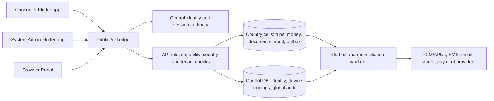

# Two mobile apps, one authoritative API: source checkpoint

- **Reviewed:** 2026-09-30 against the local KiloDrive source checkout
- **Source versions:** consumer `1.0.0+159`; System Admin `0.1.0+4`; schema contract `2026.09.30.2`
- **State:** architecture of a changing working tree, not a signed release, deployment, store approval, or parity certification

KiloDrive now has two Flutter packages: `src/client/mobile` for riders, drivers,
renters and other consumer journeys, and `src/client/system_admin` for System
Administrator operations. Both call the canonical `/api/v1` API. The API, global
identity database and country cells remain the authorities; neither app can
grant itself a role, move money, approve documents or select another tenant by
altering a local menu. The separate package lets privileged routes, tokens,
Firebase app identity, push channel, secure storage and release evidence have
their own boundary. It does not by itself prove that an old consumer binary in
the field can no longer call a legacy endpoint. Server authorization and any
legacy-client cutoff must be reviewed separately.

## App ownership and account roles

The consumer package no longer ships operative System Admin screens, routes or
mutations. Its low-level HTTP session interceptor strips `X-Acting-Tenant` from
consumer requests. A source-boundary verifier checks both packages. Text such
as “an administrator will review your document” remains useful consumer
guidance; it is not an administrative control. The System Admin app owns the
administrative workspace selector and can send an explicit acting-tenant scope
only after the API has established a SystemAdmin identity and authorized
country/tenant grant. Navigation capability gates improve presentation; the
server repeats authorization on every read and mutation.

One global person can have the SystemAdmin role and an active rider membership
under the same email. The consumer login resolves a separate consumer-scoped
session and presents only rider/renter workspaces when the local membership is
valid; it must not pass an admin role claim into the consumer shell. The admin
session exposes only the System Admin workspace. A SystemAdmin identity without
a consumer membership does not gain a rider workspace merely by using the
consumer binary. Central identity owns both session families and revocation.
Country `Users` rows remain credential-free operational projections.

The System Admin app uses its own Android/iOS application identity,
`com.kilodrive.sysadmin`, and separately registered Firebase app entries in the
shared Firebase project. Sharing the project does not mean sharing a native
application identity or allowing admin pushes into the consumer channel. The
consumer application ID is `com.kilodrive.app`. App Check, session binding and
server-side role/scope checks are independent of the caller's claimed
`X-KiloDrive-App` header. App signing, App Attest/Play Integrity and private
distribution require artifact-bound verification.

## What the separate System Admin app currently covers

The [dedicated System Admin mobile chapter](system-admin-mobile-app.md) gives a
fuller public-safe account of the operator experience, workspaces and safeguards.

The home screen presents server statistics and work requiring attention. A
four-destination bottom bar and drawer expose permitted workspaces; theme,
contrast and text scaling follow the consumer design language while retaining
separate local preferences. Country/tenant changes fence stale responses,
selection, cached data and pending actions.

The People area has searchable listings and an eight-tab dossier: User details,
User security, Vehicles, Financials, Readiness, Rides, User activity and Actions.
Its subtabs cover sessions/devices, transactions/plans/top-ups/payouts,
identity/other documents and approval, trips/rentals/deliveries, and audit/chat/
call/support records. Data comes from scoped, paged API contracts. User dates
use the affected user's IANA time zone; amounts carry their currency; an audit
record is rendered in readable fields instead of exposing raw JSON. Authorized
actions include reviewed account/contact corrections, secure password-recovery
initiation, session revocation, membership grant/extension and vehicle review.
Consequential actions use confirmation, permission checks, audit and recovery;
the UI never edits a plaintext password. Some detail destinations, role/plan
operations and restricted document decisions are still absent.

Other implemented or incremental areas include trip investigation and retained
call/replay evidence; outbox history and guarded recovery; cashout and bank
transfer review; payment, wallet, dispute and fraud investigation; alerts and
notification delivery history; audit history/detail and single-record PDF;
support queues; device ban history and guarded actions; release, campaign,
feature, tenant, reference-data and content oversight. These are not claims of
complete archived-admin workflow parity. The source migration inventory still
lists many unmigrated mutations and unreviewed operations, especially restricted
documents, broader rides/deliveries, security governance, fraud and campaigns.
An API route or menu item alone is not a certified operator workflow.

## Consumer product surface and presentation

The consumer app continues first-run registration, rider/driver/rental journeys,
onboarding and readiness, trips and deliveries, vehicles and maintenance,
wallets and payouts, membership, safety, support, reports and account settings.
Registration carries one immutable intent through password/social signup and
review. Root restoration gives an existing session or incomplete onboarding
journey priority over first-run selection. Provider identity collision starts an
explicit protected link ceremony; equal email addresses are not linked
automatically. Account deletion distinguishes app access from store
subscription cancellation and reports Apple identity-grant revocation state.

Financial input and display use minor-unit values and currency-aware
formatting. Grouping separators appear while typing; the user does not need to
enter commas. The user may choose separator, date and time presentation without
changing ledger currency, stored UTC timestamps or country policy. UTC parsing
is centralized; invalid timestamps render unavailable rather than “now”. The
six supported languages retain localization-key parity. Small-screen,
large-text, tablet and high-contrast behavior requires rendered and signed
device evidence, not just a formatter test.

## Typed native adapters and failure semantics

Flutter features call typed adapters for StoreKit/Play Billing, location and
background tracking, document capture, secure credentials and attestation,
push/audio/calls, deep links/lifecycle, offline signals, export/save and review
flows. An adapter translates an OS or SDK event into availability, permission,
lifecycle, certainty, retryability and a sanitized diagnostic. It does **not**
own an account, entitlement, fare, document approval or trip transition. The
consumer source defines `PlatformAdapterResult` and `PlatformAdapterDiagnostic`
for this boundary. An unknown native result is distinct from explicit user
cancellation, a confirmed no-op and a server-committed operation.

The normal sequence is prepare an account-scoped operation; check current
session and country; invoke the native API once; classify its result; ask the
authoritative API for state; then offer one safe action. A callback arriving
after logout, workspace change or screen disposal is ignored for the new
session. Financial and state-changing requests retain their idempotency key,
frozen payload and original entity revision after response loss. The API's
idempotency claim and status/read-back path decide whether the original command
committed; a new key must not turn uncertainty into a second mutation.

For subscriptions, native product discovery and purchase events are evidence.
The API verifies provider state and binds it to the person, country, billing
account, product/term and entitlement before recording a membership and
acknowledging or finishing the transaction. StoreKit cancellation must not be
presented as a charge. An interrupted restore or purchase keeps a recovery
journal and support reference. Google RTDN and Apple server notifications
prompt reconciliation, rather than directly granting access. The current
Google first-token, app-closed RTDN path fails closed because the provider echo
does not yet identify one prepared operation and exact first charge. Signed
StoreKit/Play purchase, replacement, renewal, refund and acknowledgement
matrices remain release evidence gaps.

## Identity, account security and device trust

`kilodrive_control` owns password hashes, refresh-token families, email/phone
verification, reset and recovery, TOTP, passkeys, social links, role grants and
global security audit. Country cells own local business records. API access
tokens use asymmetric signing and a `kid`; refresh rotates within a server
family, and reuse revokes the family. A recent-authentication proof and an
action-bound two-factor step-up answer different questions. Local biometric or
four-digit app-PIN unlock protects pixels only; it is never server proof for a
wallet, payout or account-security mutation. Cold launch locks immediately
when app lock is enabled; the background grace applies only to an already
visible session.

The device security model names an **installation**, not a physical handset.
Each installation has a random local secret and a server-issued device
credential; the server stores a verifier and associates it with the current
session family. A reinstall or app-data reset can create another installation
on the same phone. Manufacturer, model, platform, IP address and a claimed
installation ID are descriptive or investigative signals, not ownership proof
or immutable hardware identity. A ban/revocation is checked on protected
requests. App Check verifies an application identity where configured, but
claimed app/build/platform headers cannot replace that proof. Known bans fail
closed; a transient verification outage may leave only bounded read-only
safety context, without authorizing a financial action. The documented
anonymous, unattested browser-versus-native admission gap remains open.

The System Admin app also provisions an installation credential in its own
secure-storage namespace. Keychain/keystore survival across reinstall is
handled with an app-data marker, so old secure material cannot silently become
a new installation. Admin device management shows installation history and
associated users, not a guaranteed physical-device inventory.

## Notification authority and recipient isolation

An API handler commits the relevant business state and stages an outbox item.
Workers dispatch later through channel interfaces and configured FCM, SMS and
email providers. One tenant-aware template catalog supplies SMS/email wording;
reviewed tenant overrides are auditable. Every attempt and final disposition is
recorded. A provider accepting a push means the provider accepted it, not that
the OS displayed it or the user read it. Consumer notification preferences
govern ride, delivery, wallet and promotion categories; account/security
messages follow their separate mandatory policy. Promotions default off.

Both apps register push tokens under their signed-in identity and app channel.
Token rotation, logout, account switch, session revocation, installation ban,
country scope and notification permission affect eligibility. Consumer and
admin alerts are separate streams. The admin inbox is capability-scoped and
opt-in; a push is a generic hint that reopens a currently authorized record,
not a container for private case text. Tap handling checks the current account,
workspace, route and permission again. A stale token or old account must not
expose a previous recipient's message.

An administrator can request a notification to one selected installation only
through reviewed templates and an eligibility check. The server requires one
current user/session-family/installation/token-generation/verified-app binding,
stages an immutable audited operation, and rechecks before dispatch. This
source path is deployment-gated to an Android foreground presenter that verifies
the binding before displaying a local notification. iOS and background Android
are not silently replaced with an OS-rendered exact-device message. Admin alert
email and full signed-device push certification remain incomplete.

## Authorization, audit and release evidence

The API is the enforcement point for role, capability, current account,
country, acting tenant and row ownership. Cross-tenant administrative work
requires an explicit, audited acting context. Tenant-scoped tables use global
query filters; any bypass needs a reviewed proof of tenant boundaries. Monetary
values are integer minor units and durable ledger entries. Security and domain
audits record actor, affected party, action, result, correlation and time in
their owning database; user-facing audit descriptions should be readable and
individual records exportable without raw JSON exposure.

At this checkpoint the consumer/admin source-boundary verifier and both Flutter
analyzers passed. Recent local full Flutter runs passed, including the new
People work. The source checkout contained hundreds of uncommitted paths and
there was no signed artifact tied to that exact tree. The System Admin
operation ledger predates the latest People work and reports no signed-device
certification. Previous build-159 store screenshots and older admin signed
candidates do not certify today's source. Before release, reconcile the
operation matrix, pass the repository's final pre-push gate and relevant API/
schema tests, produce source-bound signed artifacts, and run real-device,
provider, country, permission-denial and unknown-outcome matrices. This
document does not assert production deployment or store approval.

## Source and related architecture

These pointers identify the implementation inspected for this checkpoint; they
are not immutable GitHub permalinks until the source work is committed:

- Consumer: `src/client/mobile/lib/core/api_session_interceptor.dart`,
  `lib/core/platform_adapters/`, `lib/features/device_security/`,
  `lib/core/store_billing.dart`, `lib/core/notifications/`.
- System Admin: `src/client/system_admin/MIGRATION_PARITY.md`,
  `lib/admin_api.dart`, `lib/features/people/`, `lib/features/alerts/`,
  `lib/features/devices/`.
- Server: `Features/Auth/AuthenticatedWorkspacesFeature.cs`,
  `Middleware/DeviceAccessMiddleware.cs`,
  `Services/Notifications/TargetedDeviceNotificationService.cs`,
  `Middleware/IdempotencyMiddleware.cs` under `src/server/KiloDrive.Api`.
- Evidence: `docs/release-evidence/consumer-critical-journeys-2026-09-29.md`,
  `docs/release-evidence/consumer-billing/2026-09-29-f23-f24-candidate-matrix.md`,
  `docs/release-evidence/system-admin-app-split/go-no-go-2026-09-29.md` in the
  source repository. For the architecture rules, continue with
  [Mobile](mobile.md), [System Administration](system-administration.md),
  [Identity and access](../security/identity-and-access.md),
  [Native adapters and store billing](native-adapters-and-store-billing.md),
  and [Capability status](capability-status.md).
