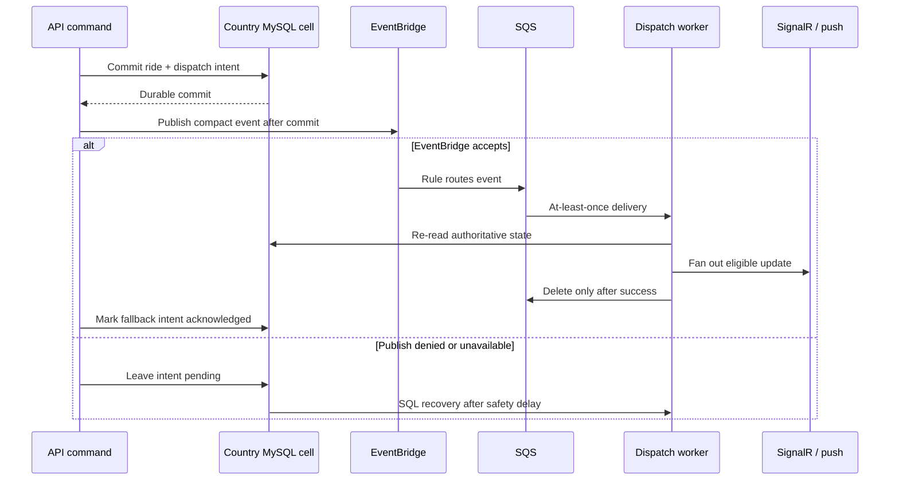

# EventBridge and SQS dispatch

Ride matching arrives in bursts. A popular pickup area can produce many eligible
driver notifications in a few seconds, while the database, push provider, and
realtime clients each run at different speeds. EventBridge and SQS provide a
shock absorber between the transaction that creates dispatch work and the worker
that performs it.

KiloDrive does **not** make the broker the only record of dispatch intent. A SQL
row is still written as part of the country-cell transaction. That choice costs
some complexity, but it gives us a durable recovery path when AWS publication,
permissions, or networking fail.

## Implementation status

The API implements an EventBridge publisher, an optional SQS consumer, bounded
configuration, operational metrics, and a database recovery age. Broker use is
configurable per deployment. The queue, rule, dead-letter queue, IAM policies,
and alarms must be provisioned and verified before enabling the consumer.

## End-to-end flow

The broker message is intentionally small. It identifies the event, tenant,
type, availability time, correlation ID, and the minimum payload needed to locate
authoritative state. Precise routes, phone numbers, and customer profiles do not
belong in EventBridge details.

## Delivery and ordering semantics

EventBridge-to-SQS delivery is at least once. A worker may receive the same event
after a visibility timeout, process restart, or lost delete response. Consumers
must therefore be idempotent.

Use these rules:

- Treat the stable event ID as the deduplication key.
- Re-read the domain row and validate its current state before acting.
- Compare a persisted monotonic entity version, not a wall-clock timestamp.
- Ignore an event superseded by a later lifecycle state.
- Delete the SQS message only after the handler completes successfully.
- Let transient failures become visible again; let the redrive policy move
  repeatedly failing messages to a dead-letter queue.
- Reconcile unknown provider outcomes before sending a second mutating request.

Do not promise global ordering. FIFO queues can help a carefully chosen message
group, but they do not make multiple databases, realtime connections, and mobile
devices globally ordered. Conditional domain transitions remain the correctness
boundary.

## Why SQL remains the recovery authority

Publishing inside the database transaction is impossible without distributed
transactions, and publishing before commit creates a worse race: a worker could
act on a ride that later rolls back. KiloDrive commits SQL first and publishes
afterward. If the process dies in that small gap, the pending SQL intent is still
there for recovery.

The recovery worker waits for a configured age before handling a pending
broker-eligible row. That delay reduces duplicate work while the normal broker
path is healthy. Both paths invoke the same domain handler; they must not grow
separate matching rules.

## IAM model

Use separate capability boundaries:

- The API publisher can call only the event publication action on the designated
  bus.
- The EventBridge rule may send only to the designated queue.
- The queue policy accepts only the intended rule/source.
- The consumer can receive, change visibility, and delete messages only on that
  queue.
- Operations can inspect and redrive the dead-letter queue through a separate,
  audited role.

Avoid wildcard resources simply because an SDK error says “not authorized.” A
valid credential can still lack resource permission. Check the caller identity,
region, bus selection, identity policy, resource policy, and explicit denies.

## Capacity and back-pressure

Watch these signals together:

| Signal | What it usually means |
| --- | --- |
| EventBridge failed-entry count | Request-level rejection or partial batch failure |
| Publisher exception count | IAM, network, region, endpoint, or credential problem |
| SQS oldest-message age | Consumer throughput is below arrival rate |
| Visible message count | Growing backlog |
| Not-visible count | Work is in flight or workers are stuck |
| Receive count per message | Handler repeatedly fails or visibility is too short |
| Dead-letter count | Poison message or persistent dependency failure |
| SQL fallback age | Broker path or acknowledgement is unhealthy |
| Worker heartbeat | The process may be stopped even if the queue is healthy |

Scale consumers on sustained age and processing saturation, not raw queue depth
alone. A short burst with low oldest age may be perfectly healthy. Keep the
visibility timeout longer than the normal handler duration and extend it only
when the worker can prove continued ownership.

## Failure examples and diagnosis

### `events:PutEvents` is denied

This is usually an IAM or resource-policy mismatch. Confirm the runtime identity
without printing credentials, then compare its permitted resource with the
configured bus and region. Keep SQL recovery enabled while correcting the narrow
policy. Verify with a non-user event and then watch both publish success and SQL
fallback drain.

### The queue grows but no worker errors appear

Check whether the consumer is enabled, pointed at the correct queue, and allowed
to receive/delete. Also inspect long polling, visibility timeout, worker
heartbeat, and tenant resolution. An empty application log is not evidence that
the worker is consuming.

### A message repeatedly returns

Do not delete it just to quiet an alarm. Find the handler and safe error code,
replay against a fixture, and determine whether the payload is invalid, the
handler is missing, or a dependency is down. A missing handler is a release
contract failure and needs code or a deliberate obsolete-message policy.

### Both broker and SQL paths run the event

At-least-once delivery makes this possible. The handler should make the second
execution a no-op through event claim, entity version, or an idempotent downstream
reference. If users receive duplicate alerts, fix that boundary; do not disable
the recovery ledger.

## Verification checklist

- Publish a synthetic, non-user event and observe it reach SQS.
- Confirm the consumer invokes the expected handler and deletes after success.
- Block publication in a test environment and prove SQL recovery executes after
  the configured delay.
- Deliver the same event twice and prove one logical result.
- Stop the consumer, observe age alarms, restart it, and watch controlled drain.
- Send a malformed/unsupported envelope and confirm safe handling without PII in
  logs.
- Exercise dead-letter redrive only after the root cause is fixed.

See [Outbox recovery](../runbooks/outbox-recovery.md) for incident steps and
[ADR 005](../adr/005-eventbridge-sqs-outbox.md) for the tradeoff record.
