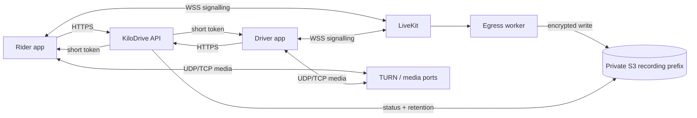

# LiveKit, TURN, and egress on AWS

In-app voice is a real-time media system, not an ordinary API call. The API may
issue a valid room token while users still hear silence because UDP is blocked,
TURN is unreachable, bandwidth is saturated, or a killed mobile app never
receives the ring. Operate the whole path.

## Implementation status

KiloDrive implements trip-participant authorization, paid-driver entitlement,
short-lived room tokens, durable call sessions, push ringing, consent-aware
recording orchestration, egress reconciliation, S3 retention metadata, safe audit
events, and provider canaries. LiveKit/TURN hosts, DNS, TLS, media firewall rules,
recording workers, IAM roles, and capacity depend on the deployment.

## Topology

Signalling, direct media, TURN-relayed media, and egress are distinct failure
domains. A single host may be acceptable at an early verified capacity, but it
is still a single failure and bandwidth boundary. Redis/Valkey-backed LiveKit
coordination is needed when scaling the media service according to its supported
topology; do not assume the API's general cache namespace is automatically the
right isolation or durability choice.

## Authorization and token design

The user asks the KiloDrive API to start or join a call for a specific trip. The
API checks:

- active authenticated global identity;
- rider/driver participation in the trip;
- trip lifecycle still allows contact;
- block and safety restrictions;
- driver membership entitlement for in-app calling; and
- an active call session and recording-consent state where applicable.

Only then does it issue a short-lived LiveKit token scoped to the room and
participant. LiveKit API secrets never ship in the mobile app. Room names use
opaque trip/call identifiers, not phone numbers or names.

KiloDrive's example configuration exposes a bounded token lifetime; deployments
should keep it short and reissue after reauthorization. Tokens must be removed
from proxy logs, request logs, telemetry URL attributes, and exception text.

## Call lifecycle

The durable call session records ringing, connecting, active, ended, and failure
states plus safe timestamps. It allows the API to reconcile two phones that may
disconnect or disagree. A ring is delivered through high-priority data push and
the platform call UI. The client cleans up orphaned rings at startup and reacts
to peer cancellation, decline, timeout, and trip closure.

Free-plan behavior is deliberately different: when policy permits, the platform
dialer offers GSM contact rather than granting an in-app room. The server, not a
modified client, enforces that entitlement.

## Recording and consent

Recording is off unless configured and permitted for the country. When enabled,
the application explains the policy and captures the required participant
consent. The UI keeps recording state visible. Both consent and jurisdiction are
stored as safe audit metadata.

Starting egress is an outbox operation. The handler first lists/reconciles any
existing egress for the call before creating another. This avoids duplicate
recordings after a timeout. Output goes to a private encrypted S3 prefix using a
write-limited role. A separate retention role handles expiry and legal hold.

Never describe an `egress started` response as proof of a complete recording.
Completion, object existence, duration, encryption, and retention metadata must
all reconcile.

## Networking

Public signalling uses valid TLS and WebSocket support. Media security groups and
host firewalls allow only the documented LiveKit/TURN ranges needed by the
deployment. TURN must be reachable from restrictive mobile and enterprise
networks; testing only on office Wi-Fi misses the hardest cases.

Keep administrative APIs private or tightly authenticated. Do not expose Redis,
Valkey, metrics, or egress control ports publicly. Monitor certificate expiry and
DNS changes before they become call failures.

## Capacity planning

Voice load is dominated by network, packet handling, and codec work rather than
ordinary HTTP request count. Measure:

- concurrent rooms and participants;
- ingress/egress bandwidth and packets per second;
- direct versus TURN-relayed percentage;
- CPU, memory, network drops, and file descriptors;
- join and reconnect time;
- packet loss, jitter, and round-trip time;
- egress concurrency, queue age, and upload throughput; and
- S3/KMS/provider throttling.

Do controlled ramps with synthetic accounts and representative networks. Reserve
headroom; a failover that moves more users through TURN can sharply increase
bandwidth. Publish capacity as a measured range with date, instance shape,
codec/bitrate, and test method—not as a timeless number.

## Failure map

| Symptom | Check first |
| --- | --- |
| API returns `voice_not_configured` | LiveKit URL/key/secret configuration and readiness |
| Ring arrives but join fails | call session, token expiry/scope, TLS and signalling |
| Users join but hear silence | permissions, audio route, UDP/TURN reachability |
| Works on Wi-Fi, fails on cellular | TURN and media firewall/NAT path |
| Call drops on app switch | platform background/VoIP integration and store permissions |
| Duplicate/partial recording | egress reconciliation and unknown-result retry |
| Recording unavailable | consent, country policy, egress configuration, S3/KMS access |
| Rising jitter/packet loss | host/network saturation or route quality |

## Release and recovery verification

- Exercise rider-to-driver and driver-to-rider calls.
- Test foreground, background, killed launch, lock screen, and permission denial.
- Test caller cancellation, decline, no answer, timeout, reconnect, and orphan
  cleanup.
- Move between Wi-Fi and cellular during an active call.
- Test direct and TURN-relayed media from more than one carrier/network.
- Prove a closed trip cannot request a token or send a new ring.
- Prove a free driver receives only the permitted GSM path.
- Record with consent, decline consent, stop mid-call, and recover an unknown
  egress result.
- Verify encrypted private output, retention, deletion, and legal hold.
- Search logs/traces for tokens, room secrets, contacts, and object URLs.

Operational steps are in the [LiveKit voice runbook](../runbooks/livekit-voice.md).
