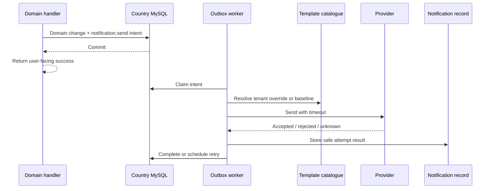

# Messaging and notifications on AWS

A notification is usually a side effect of a more important business event. A
driver's bid does not become valid because an SMS was delivered, and a wallet
transfer must not roll back because SES took too long to accept an email. This is
why KiloDrive separates **committing the event** from **attempting delivery**.

## Supported channels and provider routing

KiloDrive's notification abstraction can route:

- Android and iOS push through Firebase/APNs integration;
- SMS through AWS End User Messaging or an approved backup provider;
- WhatsApp through AWS Social Messaging or an approved backup;
- voice OTP through AWS End User Messaging Voice where the destination country
  and account have production approval;
- transactional email and report attachments through SES; and
- LiveKit token, room, and egress probes through the provider-canary framework.

The code supports these adapters, but country availability, sender registration,
WhatsApp template approval, SES production access, and voice access are external
approvals. “Configured in code” and “permitted to send” are different states.

## Durable notification flow

Every channel uses an approved template catalogue. Tenant overrides are audited,
and blank override fields fall back to the reviewed baseline. Email variables are
HTML escaped; SMS variables are rendered as plain text. Raw user content is never
silently treated as trusted HTML.

## Primary and backup providers

Failover is useful only when the failure is eligible for failover. A timeout,
temporary service error, or route outage may justify trying an approved backup
with the same stable notification intent. These outcomes do **not**:

- invalid destination format;
- user opt-out or consent restriction;
- blocked/unsupported destination country;
- unapproved WhatsApp template;
- policy or protect-configuration rejection; or
- a definitive permanent provider response.

Sending the same invalid request through a second provider creates cost and can
violate user preferences. A timeout is more subtle: the first provider may have
accepted the message. Reconcile through a provider ID or dedupe reference where
available before creating a duplicate.

## SMS and voice details

Normalize telephone numbers to E.164 at the product boundary. The leading `+`
is part of the international representation and should not be removed before
sending. Validate country rules separately from formatting.

AWS sender IDs are not universally supported, and a configured sender label does
not guarantee a handset will display it. Voice OTP production access can require
a documented use case, destination countries, volume estimate, opt-out/complaint
handling, and approved caller identity. Keep OTP wording configurable through the
reviewed template system while never logging the spoken code.

OTP requests should enqueue notification work without blocking the app until the
provider finishes. The API still needs to return a stable delivery state and a
coarse error. The challenge remains short-lived and attempt-limited regardless of
provider delay.

## WhatsApp details

WhatsApp templates and sender identities are governed outside the application.
Production sends normally use an approved template name and language. Package
names, app-signature hashes, Meta application settings, and phone-number IDs are
deployment data, not source constants.

Use AWS as the primary and an approved alternate as backup only when routing is
explicitly configured. Test both paths independently with a non-user destination.
Do not make a real user receive two messages during a failover test.

## SES email

The visible sender should be a verified, branded display name and address. SES
configuration sets may provide provider-level delivery telemetry. Application
email tracking must be privacy reviewed: an open pixel is not proof a human read
the email, and privacy clients can preload or block it.

Scheduled reports use raw MIME attachments. The worker builds the report, sends
it asynchronously, and records the provider outcome. Do not attach identity
documents or other private artifacts to ordinary email unless the content-class
delivery policy explicitly permits it.

## Safe observability

Persist and graph only:

- channel and provider;
- template key, if it contains no user data;
- attempt and sanitized status/reason code;
- provider-generated receipt ID where safe;
- latency and timestamp; and
- correlation ID.

Do not store or log the destination, rendered body, OTP, provider token,
authorization header, or raw response. Hashing a phone number does not
automatically make it harmless; low-entropy identifiers can still be enumerated.

## Common failure modes

| Symptom | Likely direction |
| --- | --- |
| No notification row | Domain handler may not have staged the outbox intent |
| Row pending and outbox age rising | Worker/handler/lease problem |
| Provider says not configured | Required setting, credential, or destination is absent |
| AWS access denied | IAM, region, resource, or account mismatch |
| AWS accepts but handset receives nothing | destination, opt-out, carrier, sender, template, or delivery status issue |
| Request succeeds but app hangs | Provider call is still on request path; move it behind the outbox |
| Duplicate message | unknown outcome retried without reconciliation or missing idempotency |
| Repeated `not_configured` warnings | canary was enabled before its dedicated destinations/providers were ready |

## Production-readiness checklist

- Provider account has production access for each destination country.
- Sender/origination identity and WhatsApp templates are approved.
- Dedicated non-user destinations exist outside application settings and Git.
- Runtime role has only the required send/status actions.
- Timeouts and backup eligibility are explicit.
- Outbox handlers and every template key are covered by contract tests.
- User notification preferences and security-message exceptions are enforced.
- Canary results and alerts contain no destinations or bodies.
- The [provider outage runbook](../runbooks/provider-outage.md) has been exercised.
