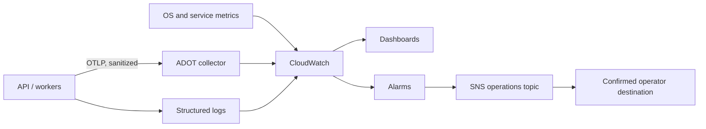

# AWS monitoring, ADOT, and alarms

Observability is not “save every log and search later.” KiloDrive handles
location, identity, financial, and communication data, so collecting too much is
both expensive and dangerous. We instrument named stages, keep dimensions
bounded, and retain only the context needed to answer: *what is slow or broken,
who owns it, and did recovery work?*

## Telemetry pipeline

The API uses OpenTelemetry instrumentation and can export OTLP over gRPC to an
AWS Distro for OpenTelemetry (ADOT) collector. The collector batches and exports
approved traces and metrics. Structured application logs and infrastructure
signals feed CloudWatch. Dashboards summarize the system; alarms notify an SNS
operations topic whose human or incident-management subscription must be
confirmed.

The collector is configurable. A disabled exporter must not prevent the API from
starting. An enabled exporter with an invalid endpoint should fail production
configuration validation rather than quietly sending nowhere.

## Four kinds of evidence

### Logs

Logs explain discrete events: a handler failed, a provider denied an action, or
a worker claimed a message. Use structured properties with stable names. Avoid
placing serialized request bodies in the message template.

### Traces

Traces connect request stages: HTTP middleware, handler, database, map provider,
serialization, and outbox publication. They are most useful when provider time
is separated from application time.

### Metrics

Metrics answer trends and saturation: latency histograms, error counts, queue
age, connection pool use, cache latency, worker heartbeat age, and reconciliation
exceptions. Keep labels bounded. A user ID, trip ID, URL with arbitrary query,
or correlation ID as a metric dimension creates unbounded cardinality.

### Audit records

Audit answers who performed a governed action and what category of entity
changed. It has different access and retention rules from telemetry. Do not use
application logs as the only audit trail, and do not copy whole audit metadata
into CloudWatch.

## Dashboard layers

Build dashboards from customer symptoms inward:

1. **Experience:** request success, p50/p95/p99, realtime delay, quote latency,
   notification lag, and call quality.
2. **Application:** route groups, handler stages, outbox age, worker heartbeat,
   SignalR connections, matching candidates, and cache hit rate.
3. **Data:** MySQL pool saturation, waits, deadlocks, query time, Valkey latency,
   eviction, and location freshness.
4. **Provider:** Maps, EventBridge, SQS, push, SMS, WhatsApp, SES, LiveKit, and
   scanning outcome/latency.
5. **Correctness:** schema fingerprint, wallet reconciliation, failed messages,
   dead letters, and recording lifecycle exceptions.
6. **Capacity:** CPU, memory, disk, network, thread pool, queue depth, media
   bandwidth, and provider quotas.

For report and toll paths, instrument query, provider route/geocode, matching,
render, and serialization as separate stages. A single “request took 2 seconds”
metric cannot tell an engineer what to fix.

## Warm and cold latency

Separate cold/provider-dependent work from warm-cache application latency. A
warm p95 budget should be evaluated over consecutive windows, not one slow
request. The current engineering target for selected warm quote paths is 500 ms
for two consecutive windows before alerting, but an operator should validate the
configured threshold against real, legitimate traffic before treating it as a
universal SLO.

Record Google/OSRM provider time independently. Raising an API timeout because a
provider is slow makes the queue longer; it does not make the provider faster.

## Alarm design

Every alarm needs:

- a customer or integrity impact statement;
- signal, period, evaluation windows, and missing-data policy;
- severity and owner;
- dashboard and runbook link;
- safe alert text;
- maintenance behavior; and
- a recovery/OK notification policy where useful.

Use consecutive windows to reduce noise. Missing data is breaching for a worker
heartbeat that must exist, but may be non-breaching for a provider with no
legitimate traffic if a scheduled canary covers it separately. Alarm on oldest
queue age as well as count; count alone cannot distinguish a harmless burst from
a stuck item.

## Redaction boundary

Never export:

- access/refresh/LiveKit tokens or `access_token` query values;
- OTPs, passkey data, cookies, authorization headers, or signing material;
- message bodies, email addresses, phone numbers, or canary destinations;
- document names/content, signed object URLs, bank/payout data, or card tokens;
- precise routes or raw GPS samples; or
- unhandled exception text without sanitization.

SignalR commonly transports its bearer token in the query string during WebSocket
negotiation. Reverse proxies, request logging, exception messages, and OTel URL
attributes must remove the whole sensitive parameter. Replacing only the token
value while leaving it in another attribute is not enough; test logs and traces.

## Deployment and verification

1. Install/configure the collector with a protected service identity.
2. Validate the OTLP endpoint locally and ensure TLS/network policy where the
   topology requires it.
3. Enable traces and metrics deliberately; avoid turning on every auto-
   instrumentation source at once.
4. Send a synthetic request with a known correlation ID.
5. Confirm trace stages, metrics, and safe logs arrive without PII.
6. Stop the collector and prove the API continues while exporter failures remain
   bounded.
7. Restore it and verify recovery without a memory/backlog spike.
8. Test each alarm and confirm the SNS destination is actually subscribed.

## Pitfalls we encountered

- Alarms existed before a human subscription was confirmed. Infrastructure was
  “green,” but nobody would have been paged.
- `TreatMissingData=breaching` on an optional provider created noise. The missing
  data policy must match the signal's meaning.
- Outbox lag looked like a provider incident when the real cause was a missing
  handler. Dashboards now pair age with failure type and worker heartbeat.
- Query strings threatened to expose realtime tokens. Redaction belongs at the
  application, proxy, and telemetry processor boundaries, backed by tests.
- High-cardinality identifiers made metrics costly and hard to aggregate.
  Correlation IDs belong in logs/traces, not metric dimensions.

Exact CloudWatch namespaces, dashboard URLs, topic identifiers, host dimensions,
and alert thresholds are restricted deployment details.
