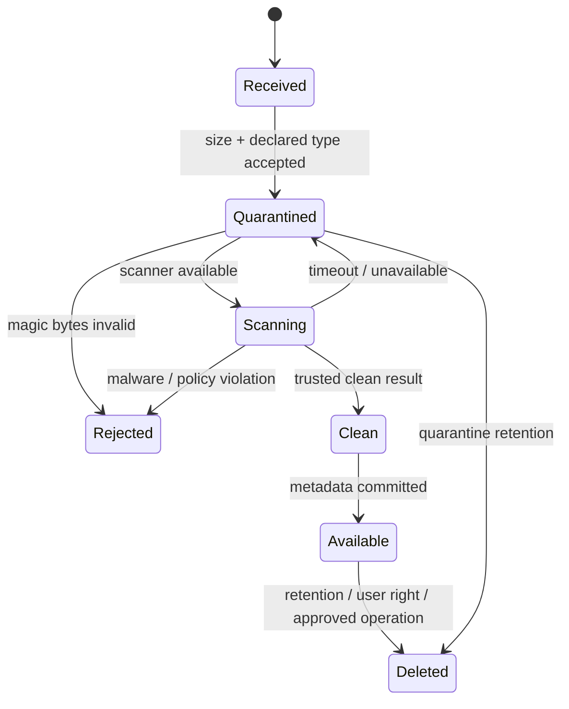

# Private storage, encryption, and quarantine

KiloDrive stores artifacts that vary widely in sensitivity: a generated report,
a vehicle photo, a driver's licence, a ticket attachment, and a consented call
recording are not interchangeable. The storage design begins with a content
class, then applies authorization, scanning, encryption, retention, and delivery
rules for that class.

## Implementation status

The API supports private S3-backed uploads, optional customer-managed KMS
encryption, magic-byte validation, a fail-closed ClamAV scanner, short-lived
authorized delivery, recording-specific prefixes/roles, and retention workers.
Bucket policies, keys, lifecycle rules, roles, scanner service, and legal hold
processes remain deployment responsibilities.

## Content classes

| Class | Examples | Default posture |
| --- | --- | --- |
| Identity evidence | driver's licence, verification image | private, attachment-only, tightly audited, no public cache |
| Vehicle evidence | registration, fitness, insurance | private, reviewer-authorized, expiry aware |
| Support evidence | ticket attachment | private to ticket parties and authorized staff |
| User media | avatar, vehicle image | original private; re-encoded bounded thumbnail for display |
| Reports | wallet or trip export | short-lived authorized delivery, retention by report policy |
| Voice recording | consented trip call audio | private encrypted prefix, jurisdiction and hold aware |
| Quarantine evidence | rejected/pending upload | isolated, scanner/operator only, short retention |

Avoid encoding a user's name, email, phone, plate, or document number in an
object key. Use opaque identifiers and keep descriptive metadata in the
authorized database record.

## Upload state machine

The scanner is not a courtesy check. In production, unavailable or timed-out
scanning keeps the object quarantined. A `NullUploadScanner` is appropriate only
for isolated tests, never as a production fallback.

## Layered validation

File extensions and client MIME types are hints, not evidence. A secure upload
path checks:

1. authenticated caller and ownership/role permission;
2. request and per-file size limits;
3. an allow-list of content classes and declared types;
4. magic bytes and structural parsing where feasible;
5. generated server-side key and isolated quarantine prefix;
6. malware/CDR result with timeout and authenticity checks;
7. safe re-encoding for displayed thumbnails; and
8. an audited state transition to available.

Archives, macros, active PDFs, SVG/script-capable formats, and polyglots require
content-specific treatment. Antivirus alone does not prove a document is safe to
render inline. Identity documents should normally download as an attachment with
strict response headers.

## S3 controls

- Enable account- and bucket-level block public access.
- Disable public ACL use; prefer bucket policy and IAM.
- Deny requests that do not use TLS.
- Require server-side encryption; use the approved KMS key for classes that need
  customer-managed encryption.
- Restrict workload roles by bucket, prefix, action, and encryption context.
- Keep egress write-only to its recording prefix where practical.
- Give deletion/retention a separate role from recording creation.
- Enable versioning only when policy needs recovery; versioning can otherwise
  retain data a user reasonably expected to be deleted.
- Configure lifecycle rules by content class, not one bucket-wide guess.
- Audit access without putting object contents or identifying names into logs.

S3 encryption and KMS authorization are related but separate. An IAM allow does
not override a KMS key-policy deny. Diagnose both before broadening permissions.

## Authorized delivery

The API rechecks the current user's ownership, tenant/country, role, document
state, and ticket/trip relationship on every delivery request. It may stream the
object or issue a very short-lived presigned URL. A URL is a bearer capability:
anyone who obtains it can use it until expiry. Never log it, place it in analytics,
or give it a long cache lifetime.

Thumbnails are newly encoded images at bounded dimensions. They should not copy
EXIF metadata, embedded profiles that are not needed, active content, or the
original object key. Cache keys include an authorization-safe revision, and
account-bound caches are wiped on logout.

## Voice recordings

LiveKit egress writes only after the application records policy eligibility and,
where required, explicit consent from both participants. The recording metadata
stores jurisdiction, consent timestamps, egress ID, state, retention deadline,
and legal-hold status. It does not put participant contact information in the
object name.

The retention worker should make deletion idempotent: a missing object after a
previous successful delete is not an incident. A legal hold prevents deletion
without making the object broadly visible.

## Backup, restore, and deletion tension

Backups are necessary, but they can undermine retention promises if nobody knows
how long deleted data survives. Document backup retention, restoration access,
and how deletion tombstones are reapplied after a restore. Test with synthetic
objects. Do not restore a production bucket simply to prove the procedure.

## Common mistakes

- **Serving from a web root:** bypasses authorization and makes scanning state
  irrelevant.
- **Trusting `.jpg`:** extensions are user input.
- **Publishing before scan completion:** creates a window where malware is
  accessible.
- **Failing open during scanner downtime:** converts an operational incident
  into a security incident.
- **Logging a presigned URL:** leaks a temporary credential into a longer-lived
  system.
- **Using one role for upload, read, and delete:** turns one compromise into full
  content access.
- **Assuming encryption solves authorization:** encryption at rest does not stop
  an overprivileged application from reading an object.
- **Deleting only the current version:** versioned storage may retain prior data.

## Verification checklist

- Upload clean, malware-test, wrong-magic, oversized, scanner-timeout, and retry
  fixtures in a non-production environment.
- Prove pending and rejected objects cannot be downloaded by owner or admin UI.
- Prove a clean object becomes available once and is tenant/owner protected.
- Inspect rendered thumbnails for removed metadata and bounded dimensions.
- Verify the runtime cannot list/read unrelated prefixes.
- Verify egress cannot read identity documents and retention cannot start calls.
- Exercise expiration, legal hold, repeated deletion, and restore/tombstone paths.
- Search logs/traces for object URLs, keys, contents, and user identifiers.

See [ADR 006](../adr/006-private-object-storage.md) and the
[upload quarantine runbook](../runbooks/upload-quarantine.md).
