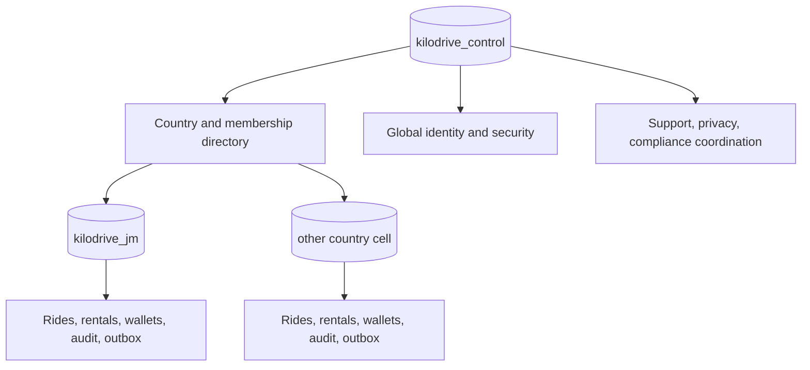

# Database Architecture

## What the database layer is responsible for

MySQL 8 is KiloDrive's durable system of record. It preserves the facts that
must survive a process restart, cache loss, delayed notification, or provider
outage: identity state, trip lifecycle, wallet balances, accounting journals,
document review status, safety evidence, and queued side effects.

The database layer is not only a collection of tables. It enforces ownership
boundaries, uniqueness, idempotency, state transitions, and financial
invariants. Application validation makes errors friendly; constraints keep
concurrent requests honest.

## Topology

KiloDrive uses one global control database and one complete operational database
per provisioned country.



The control database never joins into a country settlement transaction. A
country cell contains the full local financial and operational graph so one
transaction can preserve it.

See [Tenancy and country cells](../architecture/tenancy-and-country-cells.md)
for request routing and the registration saga.

## Why MySQL 8

KiloDrive needs mature transactions, row-level locking, foreign keys, unique
constraints, JSON support, spatial functions, well-understood backup tooling,
and an ecosystem that a small team can operate. MySQL 8 meets those needs and
works well with EF Core as a mapping/query layer.

This choice has tradeoffs:

- cross-cell analytics require a separate read/reporting approach rather than
  ad hoc joins;
- cross-database workflows need sagas/outboxes;
- spatial road identity still needs a map-matching engine; and
- engineers must understand indexes and transaction isolation instead of
  assuming the ORM will choose a safe shape.

## Schema source of truth

Database changes are deployed with reviewed, idempotent MySQL scripts. EF Core
supplies relational model metadata and runtime access; it does **not** deploy
migrations in KiloDrive.

The important sources are:

- the canonical empty-bootstrap schema;
- reviewed alignment/update scripts;
- country-cell seed/reference scripts;
- the EF relational model used by the binary; and
- normalized production `information_schema` metadata.

The schema lifecycle compares all of them. “The API compiled” and “the script
ran without error” are not parity proofs.

## Core modelling conventions

### Identifiers

New exposed and transactional entities use RFC 9562 UUIDv7. MySQL stores the
canonical text form as `char(36)` with an ASCII collation in the reviewed model.
Friendly support IDs are separate display values with unique indexes.

See [Entity identification](../architecture/entity-identification.md).

### Tenant ownership

Cell-owned entities derive from a tenant base type and carry `TenantId`.
`AppDbContext` applies a global tenant filter. Table indexes begin with tenant
when the access path is tenant-scoped.

A filter is defence in depth, not complete authorization. Same-tenant ownership
must still appear in queries.

### Money

Money is stored as signed 64-bit integer minor units plus an ISO 4217 currency
code. Examples:

| Human amount | Currency scale | Stored minor value |
| --- | ---: | ---: |
| JMD 1,600.00 | 2 | `160000` |
| JPY 1,600 | 0 | `1600` |
| A three-decimal currency 1.250 | 3 | `1250` |

Do not use `double` for money and do not assume every currency has two decimal
places. Parsing uses decimal-string arithmetic at input; formatting applies the
ISO scale at presentation.

Balances and operational wallet rows are paired with balanced, immutable
accounting journals. Corrections use reversal entries rather than edits.

### Time

Server timestamps are UTC, normally with microsecond-capable MySQL datetime
columns. Business periods that are genuinely local—such as a local calendar-day
usage limit—use the tenant's IANA timezone to derive boundaries, then query
stored UTC instants.

`DateOnly`-style effective dates are appropriate for a published rate period.
Do not store a local wall-clock string where an instant is required.

### Status and versions

Statuses are domain enums in application code and follow the API's established
wire representation. Mutable realtime entities carry a persisted version.
Conditional updates include expected state/version to prevent stale writes.

### JSON

JSON columns are used for bounded snapshots, provider metadata, and evidence
whose shape is versioned or naturally document-like. JSON is not a shortcut for
avoiding relational design.

Good JSON candidate:

- immutable pricing/policy snapshot captured at booking acceptance.

Poor JSON candidate:

- payout amount, currency, and status that must be indexed and reconciled.

Never place secrets or unnecessary PII in a JSON audit blob. JSON properties
are easier to forget during retention and redaction work.

### Deletion

Operational entities that remain referenced by trips, journals, or audit are
soft-deleted or archived. Financial journal rows are not deleted to “fix” a
balance. Identity deletion coordinates permitted anonymization across cells and
retains legally required financial facts without retaining unnecessary profile
data.

## Important aggregate boundaries

### Ride and trip

A ride request owns the proposed journey and bids. Acceptance revalidates the
driver, snapshots the assigned vehicle/compliance state, and creates a trip.
Timeline, chat, receipt, location, review, and safety rows refer to the local
trip. Concurrency prevents two bids from winning.

### Wallet and accounting

The wallet exposes operational available and held balances. Wallet transactions
explain changes to a user. Accounting journal entries and lines explain the same
economic event to the platform. A stable reference prevents duplicate posting.

### Delivery escrow

A wallet-funded delivery moves fare from available to held funds on acceptance,
then releases or refunds that hold on completion/cancellation. Held money is not
spendable or cashout-able.

### Rental booking

Rental booking transitions preserve quote/pricing/policy snapshots, payment
authorization, check-in/out evidence, settlement, and dispute history. State
transitions are append-oriented and versioned rather than rewriting history.

### Outbox

The country-cell transaction writes both the business state and outbox message.
The worker later sends realtime, notification, webhook, or dispatch side
effects. Retries are idempotent and completed rows can be archived after
retention.

## Index design: start from a query

An index is a materialized ordering, not a general “make it faster” switch.
Write the expected query first.

For example, a worker fetching ready outbox messages commonly filters by tenant,
status, and next-attempt time, then orders by due time. A useful index follows
that leading filter/order shape. An index on payload JSON would not help.

Review these patterns:

- equality columns before range/order columns;
- tenant at the front of tenant-scoped access paths;
- unique business references for idempotency;
- foreign-key indexes where joins/deletes need them;
- online/fresh-location indexes for dispatch;
- status plus created/due time for workers; and
- narrow projections for listing pages.

Avoid indexing every column. Each index increases write cost, storage, backup
size, and schema-change time.

### Row limiting must be deterministic

`Take`, `Skip`, or `LIMIT` without a stable `ORDER BY` produces unpredictable
pages. Add a tie-breaker such as UUIDv7 `Id` after the primary sort:

```text
ORDER BY CreatedAtUtc DESC, Id DESC
```

Be careful with `Distinct`: SQL may erase a prior ordering. Apply the final
ordering after de-duplication.

## Transactions and locking

Transactions stay short and contain database work only. Provider calls,
document scans, email, push, and map calls happen before a transaction when they
are merely inputs, or after commit through the outbox when they are side
effects.

Financial operations lock rows in a deterministic order. For a wallet transfer,
ordering locks by a stable account key prevents two opposite-direction
transfers from taking the same locks in reverse order and deadlocking.

At every mutation boundary, distinguish:

- **idempotency:** is this the same logical client attempt?
- **concurrency:** is the entity still in the expected state/version?
- **transactionality:** do all local writes commit or roll back together?

No one control substitutes for the other two.

## Database contexts

The API uses a dedicated control context and a country-cell context.

- `ControlDbContext` is authoritative for global identity and control-plane
  entities.
- `AppDbContext` maps the country operational model and applies tenant filters.
- Production identity abstractions resolve to the control context.
- Cell mappings may retain transitional types for model reuse, but credential
  tables are excluded from the required cell contract and must not become an
  authentication source.

When reviewing a handler that injects both contexts, assume a distributed
failure can occur between their saves. Require a documented saga or redesign the
operation to have one authority.

## Spatial data

Reviewed geospatial projection code uses MySQL 8 `POINT` values with SRID 4326,
a bounding-box prefilter, and `ST_Distance_Sphere`. The optional route/toll
spatial projection is guarded during rollout and is not yet part of the
canonical schema contract at this public baseline. The canonical source of
truth remains scalar/reference and trip data until that rollout is completed.

See [Geospatial processing](../architecture/geospatial.md) for map matching,
Valkey GEO, and the distinction between “near” and “traversed.”

## Readiness and fingerprints

The API derives a normalized manifest of required tables, columns, column
types/nullability, secondary indexes, and foreign keys from the EF relational
model. It hashes the sorted manifest with SHA-256 and compares:

1. the binary's expected model fingerprint;
2. the protected configured fingerprint;
3. actual `information_schema` objects; and
4. the `KiloDriveSchemaMetadata` version/fingerprint row.

Production startup fails on drift. Readiness also reports bounded mismatch
details for operators. The verifier cache includes server endpoint, port,
database, schema version, and expected fingerprint so a result from one server
cannot accidentally validate another with the same database name.

## A safe local workflow

1. Use an isolated MySQL 8 instance or disposable schema names.
2. Bootstrap the control and one country cell from empty.
3. Apply the same script a second time to prove idempotency.
4. Start the API with schema verification enabled.
5. Run metadata, contract, integration, and crash-point tests.
6. Destroy the disposable schemas when finished.

Never point a developer command at production by copying a connection string
into shell history. Production alignment uses protected configuration and the
reviewed deployment path.

## Hard-learned pitfalls

### Updating EF but not SQL

The app compiles, then production startup correctly refuses the old schema.
Every model change must update the canonical and alignment SQL in the same
change.

### Updating metadata without the actual object

Changing the recorded fingerprint to silence readiness is falsifying evidence.
The verifier compares actual metadata too; fix the table/column/index/foreign
key, then record the reviewed contract.

### Recreating data through direct “fixture” inserts

Direct inserts can omit journals, grants, compliance projections, or outbox
events. Production-safe fixtures should use supported admin/lifecycle APIs or a
purpose-built reviewed fixture utility that enforces the same invariants.

### Using empty-table status as permission to drop

An empty legacy table may still be referenced by code, a report, a rollback
binary, or a scheduled job. Prove zero references in source, compiled artifacts,
scripts, and production query telemetry before retirement.

### Assuming `decimal(65,30)` is the intended model

Provider or EF defaults can create unexpectedly wide decimal columns. Financial
scale and precision must be explicit and compared in the schema fingerprint.

### Repairing an immutable journal with `UPDATE`

Accounting history is corrected with a reversing and replacement entry. Editing
the old line destroys the evidence needed to explain the correction.

## New-table review checklist

- Which database and tenant own the row?
- Is UUIDv7 or a stable catalogue key appropriate?
- Which unique constraint enforces idempotency/business identity?
- Which foreign keys and delete behaviors preserve history?
- Are money values integer minor units with ISO currency?
- Are timestamps UTC and periods modelled deliberately?
- Does mutable realtime state need a version?
- What are the actual list, lookup, worker, and retention queries?
- Which indexes support those queries, and what is their write cost?
- Does JSON contain data that should be relational, searchable, or redacted?
- How will the row be archived, anonymized, or legally held?
- Is the change in canonical SQL, alignment SQL, EF metadata, fingerprints, and
  clone tests?

## Related reading

- [Data ownership, retention, and consistency](data-ownership.md)
- [Schema lifecycle](schema-lifecycle.md)
- [Country-cell sharding ADR](../adr/001-country-cell-sharding.md)
- [UUIDv7 ADR](../adr/002-uuidv7-identifiers.md)
- [Financial systems](../architecture/financial-systems.md)
