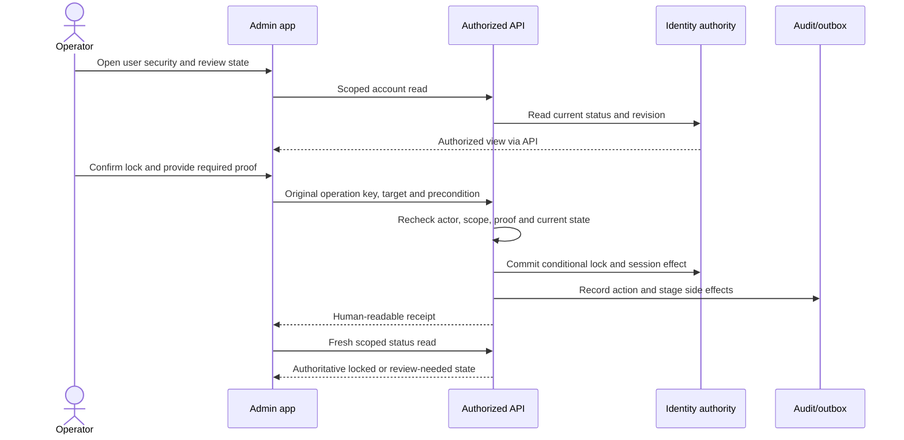
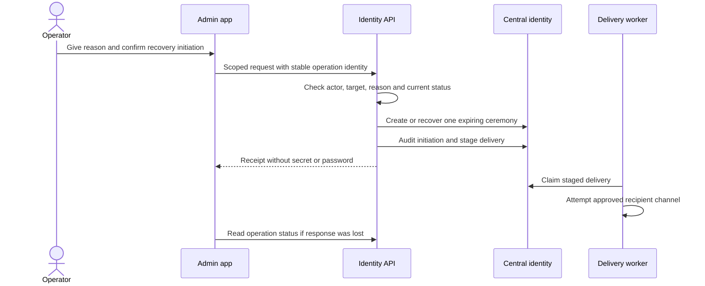
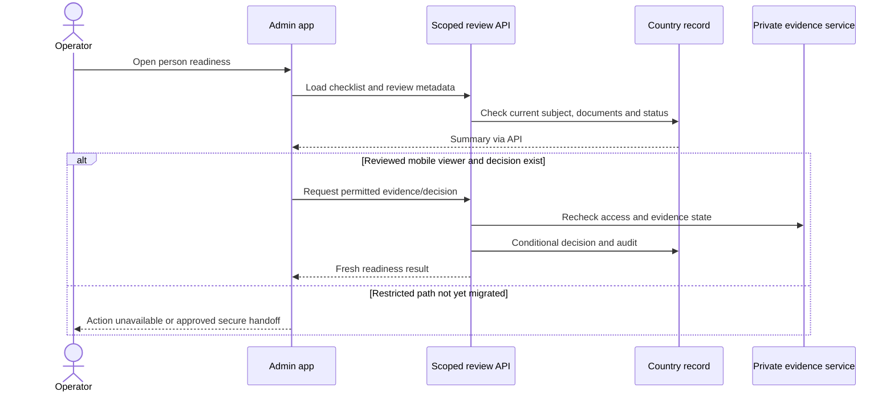
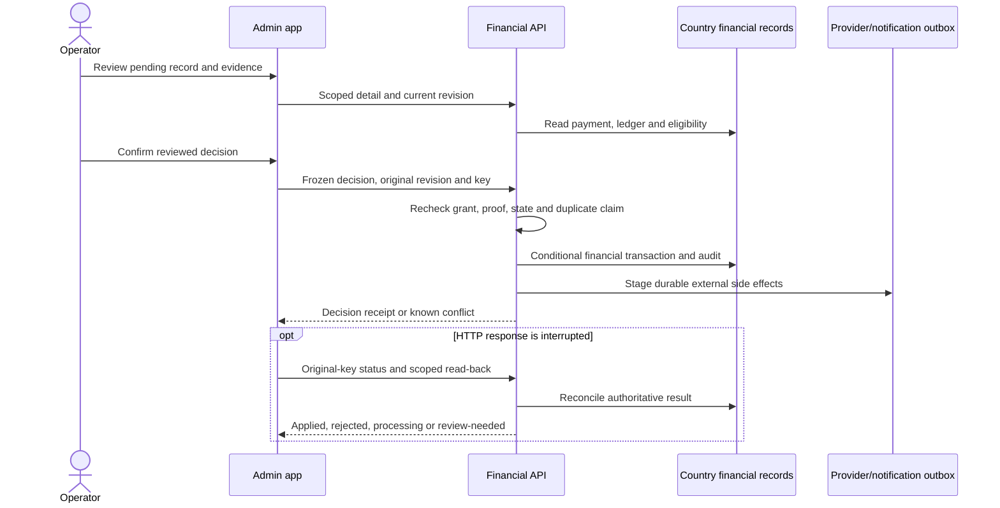
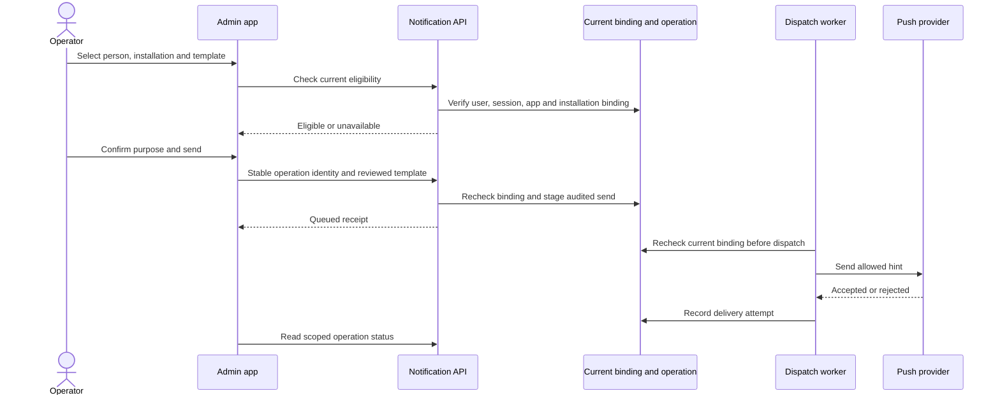
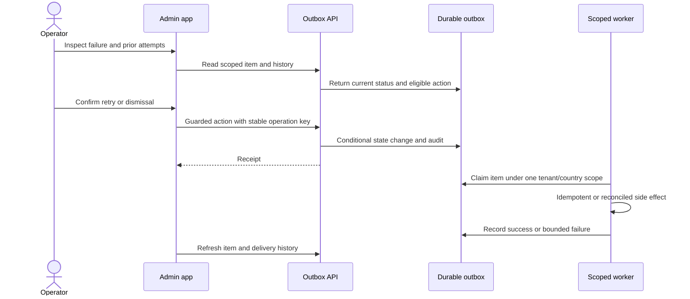

# System Admin critical journeys

These diagrams show trust and recovery boundaries, not private request formats
or a promise that every path is release-certified. The app is a presentation
client. The API validates the current actor, country, tenant, capability,
target and action proof; the owning database records durable state. `Receipt`
below means a scoped, human-readable result and support reference, never a raw
provider payload. See the [workflow map](../architecture/admin-workflow-contracts.md)
for current source status.

## Lock an account

The operator first reads the current account state. The confirmation explains
the consequence. The server owns the lock and session effects; a local badge
or disabled button is not proof that access was revoked.

If the response is lost, the app keeps the original operation identity and
checks status and account state. It must not send an unrelated second lock or
claim success from a local timeout. A conflicting account change calls for a
fresh review.

## Initiate password recovery

An administrator may start the established recovery ceremony for a permitted
account. They do not choose, receive or display a replacement password.

Delivery acceptance, recipient possession and completion of the reset are
different facts. An old or expired ceremony cannot be represented as a
completed account recovery.

## Review a person's documents and readiness

The current mobile app can show scoped review metadata and some vehicle/driver
decisions. Private identity-document viewing and some decisions remain
unavailable in the separate app. This diagram makes that boundary visible
instead of implying a generic approve button exists.

An upload, a scan result, an individual document approval and trip eligibility
are separate states. A withheld mobile decision remains withheld until its
permission, evidence, audit and recovery contract is reviewed.

## Decide a pending financial operation

Bank-transfer review and cashout decisions are distinct workflows. Both follow
the same response-loss rule: the key and original precondition belong to the
first attempt. The ledger or payment record, not the optimistic UI, decides
whether money moved.

The safe retry path may replay the *same* command with its original identity
only when the server contract proves that is appropriate. An unknown result
never authorizes a new financial mutation. Provider settlement and customer
notification have independent status after the transaction.

## Send an administrator notification

The reviewed exact-installation flow is conditional. A historical device-user
association or a visible row does not prove a current recipient. The text is
selected from approved templates rather than entered as arbitrary private
content.

“Queued,” “accepted by provider,” “shown on device” and “read by recipient”
must not collapse into one success label. A platform without a reviewed safe
presenter stays unavailable. Admin alerts and consumer notifications use
separate channels and authorization on tap.

## Recover an outbox item

An outbox retry repeats delivery of a committed side effect. It does not
re-execute the trip, payment or account command that originally created it.

If a retry response is lost, the app reads the same item and operation result.
Archive/retention policy may limit older history; an unavailable retained item
must not be misrepresented as a successful delivery.

## Review questions for every journey

For each actor role and selected country, test success, denied scope,
stale/revoked session, stale revision, duplicate key, interrupted response,
process restart, no-data state and a later independent read. Then test the
signed device and configured provider where the workflow depends on them. The
public diagrams omit private payloads, exact defensive rules and production
identifiers by design.
