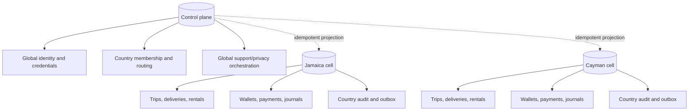

# Country-Cell Ownership

Solid lines show ownership inside a database. Dashed lines show durable
cross-database orchestration, not a distributed SQL transaction.

## The rule behind the diagram

Global identity answers “who can authenticate and which country memberships do
they hold?” A country cell answers “what happened in this marketplace?” This is
why a country `Users` row is a credential-free projection and why a wallet
settlement never spans the control database and a country database.

Cross-database work is a saga:

1. write a durable intent/checkpoint in the owning database;
2. publish an idempotent projection command;
3. create or update the target by stable identity/version;
4. record completion;
5. retry safely after timeout; and
6. reconcile stuck or conflicting checkpoints.

There is no transaction coordinator hiding behind the dashed arrow. If a
control write succeeds and a cell projection fails, operators need an explicit
pending state and repair path. Creating an active account before ownership is
proven, or inventing a local projection during authentication, creates orphaned
and split-brain records.

## How this contains failures

- A busy country can scale its cell without moving every other country's
  operational data.
- A country outage does not require duplicating password or passkey state into
  that cell.
- A financial transaction locks and commits entirely inside one country cell.
- Global deletion/support orchestration can track country checkpoints while
  trip and financial anonymization stays local.
- A System Admin selects an authorized country workspace explicitly; a header
  alone never grants that scope.

Read [Tenancy and country cells](../architecture/tenancy-and-country-cells.md).
