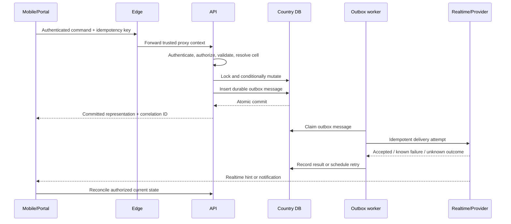

# Request and Side-Effect Lifecycle

The response can be lost after the commit. That is why the idempotency key,
outbox, and reconciliation query all exist.

## What each protection does

- **Authentication and authorization** prove who is acting and which country,
  tenant, and resource are in scope. An unguessable entity ID does not replace
  ownership checks.
- **Validation** rejects malformed or impossible input before the transaction.
- **The idempotency key** identifies one logical command across transport
  retries. Reusing the key with a different body is an error, not an update.
- **A conditional entity version/state** prevents a valid but stale decision,
  such as accepting a bid that was already withdrawn.
- **The database transaction** changes domain state and stages its side effects
  as one durable decision.
- **The outbox** remembers the promised work after the HTTP request and API
  process are gone.
- **Reconciliation** lets the client recover if a realtime message or HTTP
  response is lost.

## Failure walk-through

Suppose the database commits an accepted bid and the rider immediately loses
connectivity. The API must not undo the acceptance or report that it failed
merely because SignalR could not publish. The rider can repeat the command with
the same idempotency key and receive the stored result. The outbox worker can
publish independently, and both clients fetch the current trip after
reconnecting.

The dangerous implementation is to commit, await a provider using the HTTP
cancellation token, and return `500` when that later call fails. The caller is
then encouraged to repeat an operation that already succeeded.

## Debugging order

1. Locate the request by correlation ID.
2. Confirm country, tenant, actor, command, and idempotency outcome.
3. Inspect the authoritative entity and version.
4. Inspect the outbox claim/attempt, without printing its sensitive payload.
5. Inspect the provider or realtime result by safe provider ID.
6. Reconcile through the same authorized read the client uses.

Read [Follow a request](../tutorials/follow-a-request.md).
