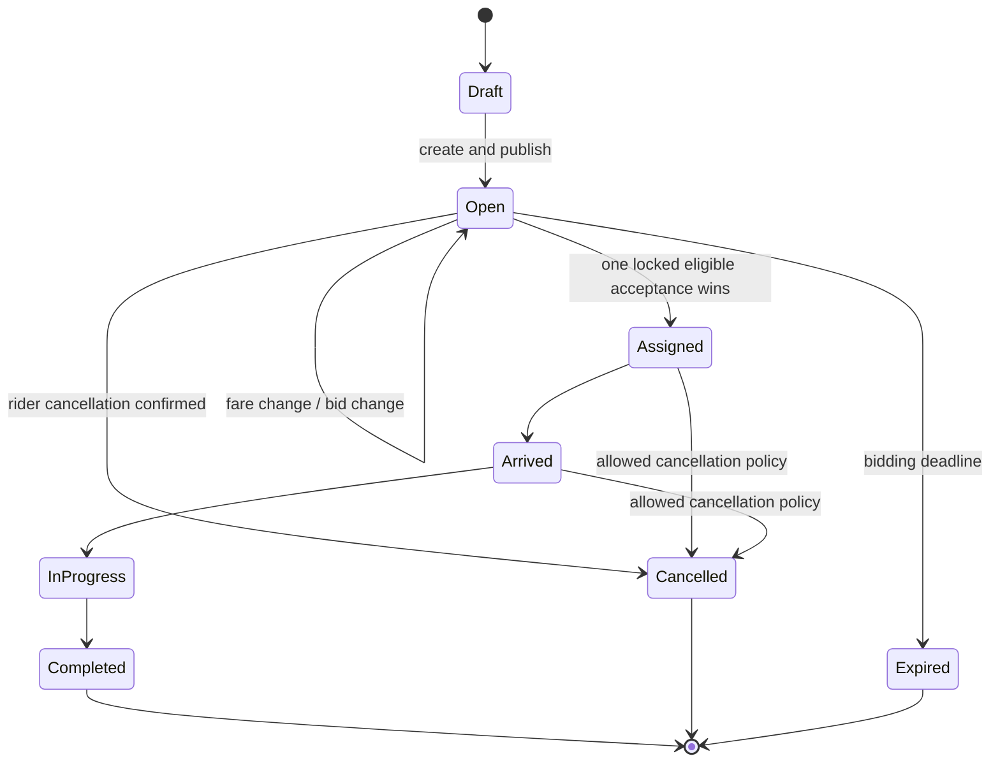

# Ride Bidding Lifecycle

Every arrow is a server-enforced conditional transition. A stale mobile screen
does not authorize an otherwise invalid transition.

## What is deliberately absent from the picture

The diagram does not show every bid, viewer heartbeat, notification, chat
message, or location sample. Those are related entities and delivery signals;
they do not redefine the ride's lifecycle. Keeping that distinction clear
prevents a notification from becoming accidental business authority.

An `Open` ride can contain several independently versioned bids. Withdrawal or
rejection makes a bid non-actionable and must update the actionable count. A
fare reduction does not silently rewrite a driver's previous acceptance to a
lower amount; it expires or requires reconfirmation according to policy.

The `Open -> Assigned` transition is the high-contention point. Inside one
short country-cell transaction, the API locks the request, proves it is still
open, revalidates driver online state and fresh telemetry, checks there is no
active assignment, verifies duty/compliance/trust/membership, verifies the
selected primary vehicle, and snapshots that vehicle and compliance version
onto the trip. Exactly one contender may win.

## Durable events versus screen updates

Each important transition stages a dedicated, versioned lifecycle event such
as created, fare changed, bid changed, assigned, cancelled, or completed. The
event is durable. SignalR and push are ways to deliver the news quickly. A
client merges only newer entity versions and performs an authorized recovery
read after reconnect.

## Useful race tests

- two drivers accept at the same time;
- rider cancels while a driver accepts;
- fare changes while a driver submits or confirms a bid;
- a bid is withdrawn while the rider taps accept;
- the HTTP response is lost after commit;
- SignalR fails but polling/reconnect converges;
- the driver loses compliance or gains another assignment after bidding; and
- expiry races with acceptance.

Read [Realtime and events](../architecture/realtime-and-events.md).
