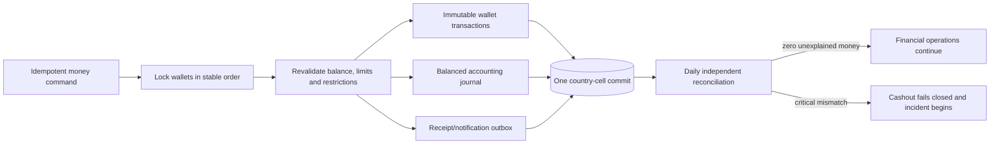

# Wallet and Accounting Flow

Read [Add a money movement](../tutorials/add-a-money-movement.md).

## Two records, two questions

The wallet subledger answers the customer-facing question: “Why did my
available or held balance change?” The general journal answers the accounting
question: “Which accounts were debited and credited, and do they balance?” Both
are immutable evidence of the same business event, linked by one canonical
reference.

For example, accepting a wallet-funded trip can move value from rider available
balance to held balance. Completion later releases the hold and records the
driver earning, platform liability or revenue according to the approved
operating model. Cancellation releases the same hold back to the rider. A retry
must find the original reference rather than create a second hold.

## Transaction rules

- Store money as signed integer minor units with an ISO currency; never use
  floating-point arithmetic.
- Lock affected wallets in deterministic identifier order to reduce deadlocks.
- Revalidate limits, KYC/AML restrictions, spendable balance, currency, and
  state after acquiring the locks.
- Insert subledger rows, balanced journal lines, domain status, and outbox work
  in one country-cell transaction.
- Enforce unique references in the database as the final duplicate barrier.
- Treat provider timeout after capture as an unknown result requiring
  reconciliation, not permission to charge again.
- Correct errors with reversing entries; never edit immutable history until it
  appears to balance.

## What reconciliation proves

Reconciliation independently rebuilds expected balances and clearing positions
from durable records. A successful command is not enough. The daily job checks
that debits equal credits, available plus held balances agree with the
subledger, provider settlement totals agree with payments, and cashout payable
and settled states use the correct canonical reference.

A critical unexplained mismatch blocks new cashout because paying out while the
ledger is uncertain can amplify the loss. That fail-closed control also means a
bad reconciliation query is operationally serious: it must understand both
approved and completed cashouts, renewals, refunds, reversals, and chargebacks.
