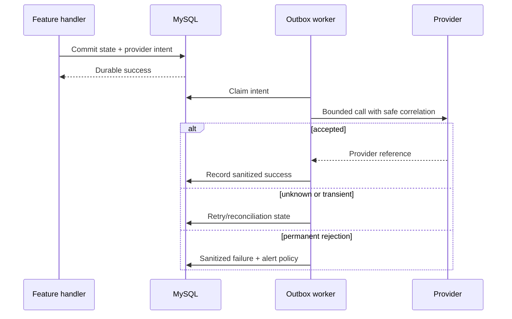

# External Provider Integrations

## Status vocabulary

- **Implemented** means an adapter exists in the reviewed source and has
  repository coverage.
- **Configurable** means it still needs protected credentials, provider approval,
  destinations, and deployment validation.
- **Planned** means only an extension point or operational proposal exists.

No public document should imply a configurable provider is live in every country.

Provider readiness is assessed per capability **and** per country. An account
may send one class of message in one destination while voice, sender identity,
WhatsApp templates, or another country remains in sandbox or pending approval.
“Credentials accepted” is not the same as “customer delivery works.”

## Catalogue

| Domain | Implemented/configurable provider boundary | Purpose |
| --- | --- | --- |
| Routes and places | Google Maps APIs | place search/details, geocode, route alternatives, matrix |
| Map matching/fallback | OSRM-compatible services | route matching, corridor/toll verification, matrix fallback |
| Push | Firebase Cloud Messaging/APNs delivery | alerts, lifecycle fallback, call ring data messages |
| SMS/voice OTP | AWS End User Messaging; Twilio alternatives | transactional codes and approved notices |
| WhatsApp | AWS Social Messaging primary option; Twilio backup | approved templates and OTP/notifications |
| Email | Amazon SES | transactional mail and scheduled attachments |
| Social identity | Google, Facebook, Apple | verified token exchange and explicit account linking |
| Store billing | Google Play and Apple server APIs | purchase validation, renewal, refund/revocation, acknowledgement |
| External payments | Stripe, PayPal, bank transfer | top-up/payment intent and authenticated webhooks |
| Realtime voice | LiveKit, TURN, Egress | scoped rooms, call state, optional consented recording |
| Object storage | Amazon S3 | private documents, receipts, recording objects |
| Upload safety | ClamAV-compatible scanner | quarantine until signed clean outcome |
| Dispatch | EventBridge and SQS | scalable dispatch publication/consumption with SQL recovery |
| Edge/challenge | Cloudflare-compatible proxy + Turnstile | client IP trust and abuse challenge |
| Telemetry | OpenTelemetry/OTLP and CloudWatch-compatible outputs | bounded traces, metrics, logs, dashboards, alarms |

## Integration maturity checklist

An integration progresses through these evidence stages:

1. **Code-ready:** adapter, typed configuration, deterministic fake, and unit
   contract tests exist.
2. **Sandbox-verified:** authentication, request translation, signature
   validation, and error mapping pass against a test environment.
3. **Production-configured:** protected identity, regional approval,
   sender/origination identity, quotas, network path, and feature gate exist.
4. **Operationally-ready:** dedicated canary, dashboard, alert, owner, disable
   control, rollback, and recovery exercise are proven.
5. **Country-enabled:** compliance, consent, templates, retention, disclosure,
   and cost are approved for that operating country.

Skipping from code-ready to country-enabled creates confusing incidents: the UI
offers a button and the SDK authenticates, but the provider rejects an
unapproved destination, template, spending limit, or caller identity.

## Common call pattern

Request handlers do not hold locks while calling providers. Retrying a mutating
provider operation requires a stable idempotency key and a way to query an
unknown result before sending again.

### Timeouts, cancellation, and retry

Every outbound call has a timeout chosen for its interaction: autocomplete is
short; report delivery or egress is asynchronous. GET/HEAD may use bounded
transient retry with jitter. POST/PUT/PATCH/DELETE retry only when the adapter
has stable provider idempotency and can reconcile an unknown outcome first.

Cancellation before local commit can stop unneeded work. After commit, a durable
worker owns completion; the original caller's disconnect cannot cancel the only
notification or provider mutation. Provider rate limits become classified state
with safe retry guidance, not a generic 500.

### Authentication and webhook trust

Outbound identities receive only the actions and resources the adapter needs.
Workload identity is preferred over static keys. When static credentials are
unavoidable, they live in protected configuration, have an owner and rotation
test, and never appear in examples or telemetry.

Inbound webhooks verify the documented signature or certificate, timestamp and
replay window, environment, and expected provider account before applying a
business event. Tenant/country scope is recovered from a durable internal
reference—not accepted from an untrusted callback field.

## Maps and geospatial

Mobile/browser clients call KiloDrive map endpoints so server credentials are not
embedded in app code. Google provider time is measured separately from database,
polyline, toll matching, and serialization time. Place details and stable
reference data use bounded caches.

OSRM-compatible map matching reduces false toll hits from parallel frontage roads
and validates travelled telemetry. Haversine remains a bounded fallback, not a
claim of exact road traversal. A provider outage returns explicit degraded
behavior; the API never silently changes a financially material route/toll result.

Route and place telemetry separates application work from provider latency:
cache lookup, provider call, route decoding/map matching, spatial toll query,
database, and serialization have independent spans. Location text, raw routes,
and exact coordinates are excluded from general metrics/logs. Quotas are
dashboarded because a fast integration that reaches its daily limit is still an
outage.

## Messaging and email

Notification intent is placed in the outbox. Tenant-aware templates generate
channel text; adapters receive only the minimum destination/content required.
The provider ID/reference, latency, sanitized status, and correlation ID are safe
operational evidence. Contact addresses, message bodies, OTPs, and tokens are not
general log fields.

SMS and WhatsApp provider selection is validated configuration, with fallback
only when the secondary provider is approved for that country/template. Voice
OTP has separate country production access and caller identity requirements.
SES raw email supports attachments such as scheduled reports; sending never
blocks an interactive request.

Delivery is a lifecycle rather than one Boolean. “Accepted by provider” means
the provider queued work, not that a handset received or a person read it.
Delivery receipts update status idempotently where supported. Email-open
tracking, when enabled and legally approved, is disclosed, uses an opaque
high-entropy reference, and never puts the recipient address in the pixel URL.

OTP templates never put the code in logs or provider-reference fields.
Challenge expiry and attempt limits remain server-side even when delivery is
late. A failed enqueue is visible to the caller or durable retry path; it is not
swallowed while the UI waits forever.

## Payments and store billing

Payment webhooks validate provider signatures and locate the durable payment
record before restoring tenant scope. Duplicate and out-of-order events are
normal. Conditional transitions and canonical journal references make them
idempotent.

Google/Apple validation checks product and applicable base plan/offer, account
binding, purchase state, currency/term mapping, and signed transaction/token.
Google acknowledgement is durable outbox work; entitlement can expose an
`acknowledgement_pending` state rather than returning a misleading purchase
failure after commit.

Stripe/PayPal unknown outcomes are reconciled by provider reference. Refund,
partial refund, revocation, dispute/chargeback, and reversal update payment,
entitlement/wallet, journal, notification, and audit atomically where local state
changes.

Store billing splits responsibilities. Native store UI supplies localized price
and runs the purchase ceremony. The API validates the signed transaction or
purchase token, product, base plan/offer, app/package, account binding,
environment, state, and mapping before entitlement. Catalogue country-FX
display is informative; it never replaces store price or server verification.

## LiveKit and storage

LiveKit tokens are short-lived and restricted to trip, participant role, and room.
The API controls room/call lifecycle; a client cannot mint broader permissions.
Recording requires explicit visible consent and jurisdiction/retention policy.
Egress writes encrypted private S3 objects through least-privilege identity.
Audit stores safe metadata, not tokens, media, or call content.

Identity documents and attachments remain quarantined/private until a clean scan
result. Public object URLs are not used for sensitive evidence. Signed access is
short-lived, authorized, audited, and content-disposition controlled.

Object keys are opaque and never contain email, phone, document number, or
passenger name. Upload validates declared type plus magic bytes and size, stores
to quarantine, and waits for a signed clean scan result before promotion.
Scanner timeout is not “clean.”

LiveKit reachability is tested beyond token issuance. A valid token cannot prove
UDP/TCP/TURN media, background/killed ringing, reconnect, egress, encrypted S3
delivery, consent state, or orphan cleanup. Those are separate controlled checks
using safe room/provider references.

## Canaries, alarms, and maintenance

Canaries are enabled only with dedicated non-user destinations and least-
privilege credentials. They store provider identifier, latency, sanitized state,
and correlation ID only. Consecutive failures alert an operator; a deliberate
maintenance/disabled state does not page as `not_configured` noise.

Each provider has an owner, quota/budget dashboard, health check, alert, disable
switch, rollback, and recovery test. Warm-cache application p95 is separated from
provider time so thresholds are tuned from legitimate traffic rather than hiding
latency by increasing timeouts.

Canaries do not run every minute merely because a scheduler can. Frequency
balances detection time, cost/quota, anti-abuse rules, and alert value. An
intentional disabled/maintenance state records a neutral result. Consecutive
real failures are more actionable than an endless warning that an unused
provider has no configuration.

## Provider-change review record

Every new provider or material SDK/API change records:

- capability, owner, approved countries, data classes, and legal basis;
- authentication, least-privilege policy, rotation, and network boundary;
- regions, quotas, cost, timeout, idempotency, retry, and unknown outcomes;
- request/response redaction and retention;
- webhook authenticity and replay protection;
- feature flag, migration/fallback, disable, and rollback;
- canary destination, health signal, alarms, and runbook; and
- package/license/SBOM plus mobile permission/entitlement/privacy changes.

## Privacy checklist

- Send only necessary data for the requested function.
- Keep precise location within approved routing/safety purposes and TTL.
- Never put query tokens, contacts, payloads, or object URLs in telemetry.
- Verify country availability, consent, templates, sender/caller identities, and
  opt-out/complaint handling.
- Update data maps, processor agreements, privacy labels, retention, and deletion
  workflows when a provider changes.
- Never test a canary with a real user's destination or production trip.
- Treat accepted, delivered, read, settled, and reconciled as different states.
