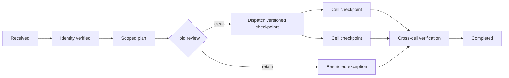

# Privacy and deletion orchestration runbook

- **Owner:** Privacy operations with control/country data owners
- **Status:** Operational privacy-case procedure
- **Last exercised:** Not yet recorded in this public repository
- **Related architecture:** [Privacy and data protection](../security/privacy-and-data-protection.md) and [tenancy and country cells](../architecture/tenancy-and-country-cells.md)

## Purpose and scope

Use this runbook to receive, verify, execute, and close a KiloDrive privacy or
account-deletion request across the global control database, country cells,
private object storage, caches, and approved external providers.

KiloDrive's sharded design makes deletion an orchestrated state machine, not one
SQL statement. The control service owns the global case and country checkpoints.
Each country cell owns its local trip, financial, safety, support, and operational
records. Some records must be irreversibly anonymized or retained under an
approved legal basis rather than deleted.

This runbook is not legal advice and does not invent retention periods. The
privacy/legal owner supplies the applicable country policy.

## Owners and roles

| Role | Responsibility |
| --- | --- |
| Privacy case owner | Owns identity proof, scope, deadlines, communications, and closure |
| Control-service operator | Manages the global case, membership inventory, and checkpoints |
| Country-cell operator | Executes the approved local plan idempotently |
| Security owner | Revokes access and investigates unauthorized or wrong-subject actions |
| Financial/legal owner | Decides retention/anonymization for journals, disputes, tax, and holds |
| Storage/provider owner | Executes private-object and supported provider deletion |
| Reviewer | Independently verifies subject, scope, exceptions, and completion |

The requester, case owner, and executor should not all be the same person for a
material or exceptional case.

## Data ownership model

| Location | Authoritative content | Deletion responsibility |
| --- | --- | --- |
| `kilodrive_control` | global identity, security state, cell memberships, global case/checkpoints | global coordinator |
| Country cell | operational projection, trips, deliveries, rentals, wallets, journals, payments, support/audit | that cell's executor |
| Private object storage | originals, thumbnails, receipts, evidence, consented recordings, quarantine | content-policy owner |
| Valkey/cache | sessions, presence, short-lived derived state | revoke/evict; never treated as final proof |
| External provider | message/payment/store/voice artifacts within provider policy | provider-specific verified request |
| Backups | protected historical recovery copies | expiry/tombstone reapplication policy |

The global coordinator must not reach into each cell and rewrite local financial
truth. It dispatches a versioned request; the cell applies its own approved plan
and records a checkpoint.

## Preconditions

- A supported global privacy/deletion service and human-readable case reference
  exist; legacy per-cell request tables are not used for new work.
- The requester can be authenticated with an appropriate step-up or separately
  verified authority.
- Country memberships and data locations can be enumerated from authoritative
  metadata.
- Country-specific retention, legal hold, dispute, fraud, safety, tax, and
  regulatory rules are approved and versioned.
- Cell and provider handlers are idempotent and use stable case/checkpoint keys.
- Object classes and derived artifacts are inventoried.
- Monitoring alerts on overdue, failed, or incomplete checkpoints without
  containing subject PII.

## Safety and stop conditions

Stop execution and escalate when:

- subject identity or representative authority is uncertain;
- two global identities could match the supplied contact information;
- the request scope or country memberships changed after the execution plan was
  approved;
- an unresolved legal hold, safety case, dispute, fraud investigation, or
  financial retention rule applies;
- a handler would delete immutable journal evidence rather than anonymize/link it
  according to policy;
- an object/provider result is unknown and cannot be reconciled;
- a checkpoint claims completion without a version/hash of the executed plan;
- an operator proposes deleting legacy tables before zero-reference proof; or
- the wrong subject, tenant, country, or case may have been affected.

Never paste customer data into incident chat. Never retain the deleted payload as
“proof of deletion.” Never mutate backups ad hoc. Never mark a global case
complete because most countries succeeded.

## Intake and identity verification

1. Create the case through the supported API. Assign an opaque internal ID and a
   short, human-readable support reference.
2. Authenticate the account and require recent step-up for self-service deletion.
   For an offline/legal request, use the approved identity/authority procedure.
3. Normalize but do not over-collect contact details. Raw email possession alone
   is not sufficient proof.
4. Record request type, requested scope, UTC receipt time, deadline/SLA, safe
   contact channel, country memberships, and policy version.
5. Check duplicates. Link a repeated request to the existing open case instead of
   running two deletion workflows.
6. Send acknowledgement through the outbox. The email/SMS contains only the safe
   case reference and next steps—not a data inventory.

## Scope and execution plan

Build a versioned plan before changing data:

- global identity and authentication state;
- each control-to-country membership;
- operational projections and profiles;
- trips, bids, chat/call metadata, safety and support records;
- wallets, journals, payments, memberships, vouchers, cashouts, disputes, and tax
  evidence;
- documents, thumbnails, receipts, recordings, quarantine, and multipart uploads;
- notifications, device tokens, sessions, passkeys, social links, and caches;
- external provider artifacts that support deletion; and
- backups and tombstone reapplication.

For each class, mark **delete**, **irreversibly anonymize**, **retain restricted**,
or **not present**, with legal basis, retention end, executor, and verification
method. Obtain case-owner/reviewer approval.

## Durable state machine

A practical case lifecycle is:

`Received → IdentityVerified → Scoped → HoldReview → Executing → AwaitingCells → Verification → Completed`

Terminal alternatives are `Rejected` and `Cancelled`. A legal hold is a visible
state/exception, not a silent pause.

Every transition records safe actor, UTC time, policy/plan version, reason code,
and correlation ID. State changes use conditional version checks so two operators
cannot overwrite one another.

## Execution procedure

### 1. Contain access

At the approved execution point, prevent new operations. Revoke refresh-token
families, active sessions, passkeys/social links as specified, device tokens, and
realtime channels. Evict account-bound caches. A local app PIN is not proof that
server access was revoked.

### 2. Dispatch country checkpoints

Publish one idempotent control-to-cell command per required country using the case
ID, plan version, subject global ID, and expected country membership—not raw
payload copies. The outbox provides durable retry and an audit trail.

Each cell conditionally claims the checkpoint, resolves the local projection,
applies the approved per-class plan, records safe counts/status and completion
version, and emits a result. Repeated delivery returns the same result.

### 3. Execute local anonymization/deletion

Delete replaceable personal fields and operational artifacts approved for
deletion. For retained journals, disputes, safety, or tax evidence, detach direct
identifiers or replace them with a restricted non-reversible subject reference as
policy permits. Do not break debit/credit balance or historical foreign-key
integrity by deleting one side of a transaction.

### 4. Delete private and derived objects

Process originals, thumbnails, re-encoded previews, receipts, recordings,
quarantine, failed scans, and multipart remnants according to content class.
Respect legal holds and object versions. Record provider/object request IDs and
sanitized status, never presigned URLs or object names containing PII.

### 5. Complete global identity action

Only after country and provider work reaches a verifiable state, remove or
irreversibly anonymize the global identity as planned. Preserve a minimal
tombstone sufficient to prevent accidental restoration/reuse and to reapply the
deletion after backup recovery.

## Diagnosis and failure handling

| Symptom | Likely cause | Safe action |
| --- | --- | --- |
| One country remains pending | worker/handler/schema/provider failure | inspect checkpoint and outbox by case ID; retry idempotently |
| Cell says subject not found | stale membership, already deleted, or wrong cell | verify control membership/history; record `not present` only with proof |
| Journal FK blocks deletion | retention/anonymization plan violates financial model | stop; revise plan with financial/legal owner |
| Object deletion unknown | provider timeout or version/hold conflict | reconcile by request/object reference before another attempt |
| Account can still refresh | token family/session not revoked | contain identity immediately; verify all channels/caches |
| Completed subject reappears after restore | tombstone/replay step missing | disable identity; reapply case plan; correct recovery procedure |
| Duplicate case starts execution | missing deduplication/conditional transition | pause newer case and link it to authoritative case |

Transient failures retry through the outbox with bounded backoff. Permanent
policy/data conflicts become assigned operator work with an SLA alert. Do not
convert an unknown outcome into success to meet the deadline.

## Cross-cell verification

Before completion, verify:

- no active credential, session, refresh family, passkey, social identity, device
  token, or realtime channel remains beyond the approved exception;
- every authoritative country membership has a terminal checkpoint for the exact
  plan version;
- no active operational profile, assignment, online state, pending bid, or rental
  team membership remains;
- financial/safety/legal records follow the approved anonymize/retain rule and
  remain internally consistent;
- originals and derived object classes are deleted or held with documented basis;
- supported provider deletion outcomes are confirmed or explicitly excepted;
- caches are evicted and backup tombstone replay is scheduled; and
- searches by old email, phone, friendly ID, and provider identifiers return no
  unauthorized active identity.

Verification queries return counts and safe hashes, not copies of data.

## Completion and communication

The case owner reviews checkpoints and exceptions, records the completion UTC
time, and sends a safe notice through the approved channel. The notice describes
the request outcome and categories retained under policy without exposing
internal security or other users' information.

Do not promise that immutable backups were edited immediately. Explain the
approved expiry and tombstone behavior accurately.

## Rollback and wrong-subject incident

Correct deletion is intentionally difficult or impossible to roll back. If the
wrong identity/scope is touched:

1. stop global/cell/provider workers for the affected case version;
2. prevent further account access or data disclosure;
3. preserve sanitized audit and checkpoint evidence;
4. notify the privacy and security incident owners;
5. determine whether a lawful, authorized restore is possible without reviving
   data that should remain deleted; and
6. communicate under the approved incident/breach process.

Never perform an undocumented restore or manually recreate the profile to hide
the error.

## Test matrix

- single-cell and multi-cell identities;
- duplicate submission and duplicate checkpoint delivery;
- concurrent cancel/execute and plan-version mismatch;
- legal hold, dispute, financial, tax, and safety retention;
- missing local projection and already-deleted subject;
- object/provider timeout, rejection, unknown outcome, and retry;
- token/session/cache/realtime revocation;
- backup restore followed by tombstone reapplication;
- re-registration with the same contact under approved policy;
- admin authorization and cross-tenant/country IDOR denial; and
- logs/alerts/evidence free of subject payload and PII.

## Legacy-table retirement

Retire old `SupportTickets` or deletion tables only after:

- code search finds no read/write/type/route/worker/report reference;
- information-schema checks find no FK, trigger, view, routine, or event reference;
- production row counts and migration reconciliation are reviewed;
- clone tests prove canonical bootstrap and upgraded databases without them;
- monitoring proves all new work uses the global service; and
- a separately reviewed, backed-up, idempotent retirement script is approved.

An empty table is not proof that it is unused.

## Evidence to retain

Retain case reference, policy/plan version, authorized actors, UTC state timeline,
country checkpoint statuses/hashes, safe affected counts, exception/legal basis,
provider IDs/statuses, token/cache revocation result, cross-cell verification,
completion communication, and reviewer approval.

Do not retain deleted content, passwords, tokens, contact details, message bodies,
document links, recordings, or raw provider payloads.

## Escalation

Escalate overdue cases, wrong-subject risk, cross-tenant/country exposure, missing
checkpoint durability, legal-hold conflict, unreconciled provider objects, failed
session revocation, or restored deleted data immediately. Privacy/legal and
security owners decide exceptions; an operator cannot waive them.

## Common pitfalls

- Deleting the control identity before discovering all country memberships.
- Treating financial deletion as `DELETE FROM` and breaking immutable ledgers.
- Forgetting thumbnails, quarantine, multipart uploads, or call-recording outputs.
- Logging the deleted payload as evidence.
- Marking completion while one country is “temporarily pending.”
- Mutating backups instead of using retention and tombstone replay.
- Releasing a reused phone/email before the previous identity is fully revoked.
- Dropping an empty legacy table without zero-reference proof.
