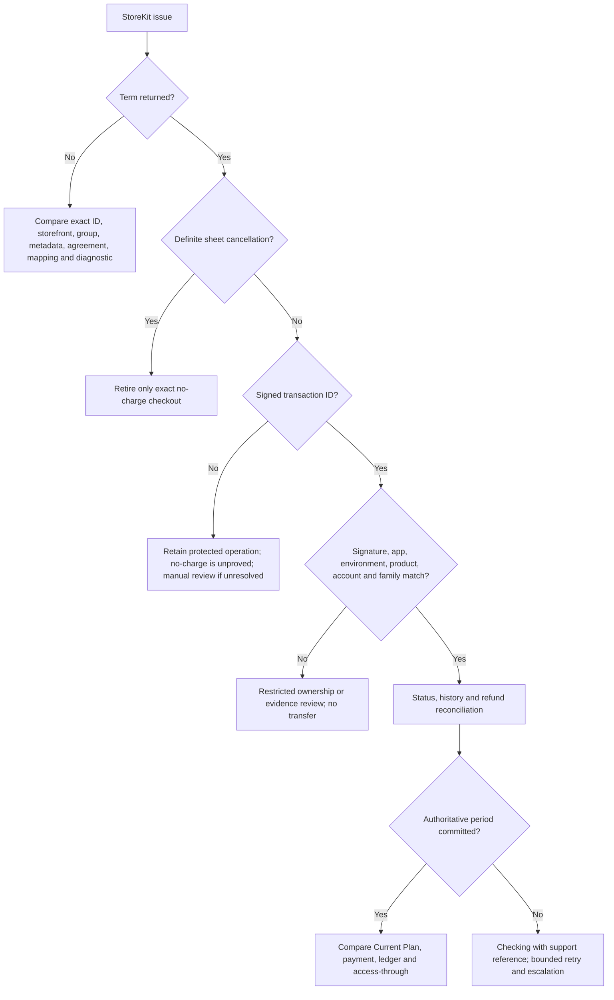

# Native-store entitlement reconciliation

- **Owner:** Membership and Store Billing Platform
- **Status:** Reviewed public procedure
- **Last verified:** 2026-10-05 source review
- **Environment:** Local modified product checkout; no new signed-store purchase or notification exercise
- **Evidence:** [Current source baseline](../current-baseline.md) and [native certification matrix](../quality/native-platform-certification-matrix.md)
- **Last exercised:** Historical build-167 licensed Play observations only; no current-build iOS exercise
- **Related architecture:** [Financial systems](../architecture/financial-systems.md) and [Native adapters and store billing](../architecture/native-adapters-and-store-billing.md)

## Trigger

**2026-10-06 amendment:** Use the committed
[build-196 checkpoint](../architecture/release-1.0.0-196.md) for the current
membership synchronization and unfinished-Apple-transaction branches. The
original native inspection below keeps its date; current source is consumer
`1.0.0+196`, Admin `0.1.0+33`, schema `2026.10.05.2`. Host checks and store
submission do not establish a complete signed-iPhone recovery exercise.

Use this runbook when a purchase remains pending, a renewal/cancellation/refund
is not reflected, provider notifications are stale, acknowledgement approaches
its deadline, product discovery omits a reviewed term, or account entitlement
and Apple/Google history disagree.

## Establish authority

1. Identify platform, environment, application account, product, operation and
   safe support reference without copying raw purchase tokens.
2. Read the current membership period, access-through date, pending change,
   lifecycle reason, local store-purchase evidence and revision.
3. Query authoritative provider history through the protected server adapter:
   Apple signed status/transaction/refund history or Google
   `subscriptionsv2.get`.
4. Treat App Store Notifications V2 and RTDN as invalidation signals. Confirm
   state from provider history before changing entitlement.
5. Verify product mapping, term, country/storefront availability and price
   evidence separately from lifecycle state.

## Recovery rules

- Reuse provider transaction identity and KiloDrive idempotency on duplicate or
  out-of-order events.
- A missing notification starts bounded history recovery; it does not prove
  cancellation or expiry.
- A deferred downgrade keeps current access until its effective date.
- A verified cancellation disables future renewal but normally preserves
  current paid access.
- Refund, revoke, chargeback and restoration follow explicit state-machine
  events and immutable audit.
- A stale or mismatched account binding opens restricted review and never grants
  access to the wrong KiloDrive account.
- A native sheet dismissal is cancellation unless authoritative evidence makes
  the result uncertain. Do not tell a user the store may have charged them
  merely because they cancelled.
- Expired membership is not an assigned Free plan. Current must show the actual
  active tier/term, or no active membership, without expired paid benefits.
- Renewed access and accounting proof are separate. Create a renewal charge only
  from the exact verified order, price/currency and service period; missing
  charge evidence cannot be replaced with a guessed payment or zero fee.

## Verification

### An unfinished Apple transaction blocks a new purchase

1. Identify the exact unfinished product and transaction through the protected
   native adapter; preserve original charged/possibly-charged recovery context.
2. Use the authenticated server review to verify signed evidence and current
   expiry. Do not use an old ownership rejection as permanent expiry evidence.
3. A verified `expired_finish_only` disposition permits finishing only that
   exact native queue item. It neither grants a plan nor transfers ownership,
   creates a payment, refunds money or cancels provider renewal.
4. A current owned period still needs entitlement confirmation; a current
   foreign-account period remains an ownership conflict. Unknown/unverified
   evidence keeps the journal and a clear support/reconciliation path.
5. After a terminal result, read the current membership revision and verify the
   visible plan. An older startup/status response cannot overwrite newer
   authoritative state, and an account change cannot display the former user's
   entitlement while the next read is pending.

Reinstalling KiloDrive rotates app installation/token state where appropriate;
it does not clear Apple purchase history. Clearing a sandbox tester's history
is a testing operation at the provider, not a production entitlement repair or
permission to assign a historical purchase to a new KiloDrive identity.

Confirm the provider status, product/term, current period, access-through date,
pending change, payment, membership lifecycle event, receipt, notification and
reconciliation case agree. Verify the app shows Current Plan after confirmed
success and a recoverable Checking state—without a second purchase button—when
the outcome is unresolved.

## Product-discovery failure

If StoreKit or Play Billing does not return a product, verify exact product ID,
subscription group/base plan, storefront/territory, price, metadata, agreement,
licensed tester and signed distribution channel. Do not synthesize a storefront
price or blame a missing product on currency conversion.

## Apple StoreKit decision path

**Owner:** Membership and Store Billing Platform. **Last source-verified:**
2026-10-05, product revision
[`8bfe08881bce51535d1165552f2d5be8e05fc872`](https://github.com/KiloDriveApp/KiloDrive/tree/8bfe08881bce51535d1165552f2d5be8e05fc872),
consumer source `1.0.0+192`. This review did not execute an iPhone or inspect
current App Store Connect settings. The product working tree contained
uncommitted billing edits; do not treat them as a signed-build result. See the
[Apple architecture and authority table](../architecture/native-adapters-and-store-billing.md#apple-storekit-2-and-subscriptions).

| Symptom | Detection and scoped diagnosis | Safe action / stop condition |
| --- | --- | --- |
| Term unavailable, especially quarterly | Capture each requested/returned ID, storefront country, discovery duration, StoreKit localized price/currency *if returned*, bundle/build, mapping revision and sanitized error. Check current App Store Connect territory, group, price, metadata, agreement and sandbox tester through an authorized operator. | Refresh discovery once within a bounded window; do not synthesize an API price as StoreKit price or invite a buy of another term merely to test availability. Escalate a persistent mismatch with the exact signed build and storefront. |
| Sheet did not open / duplicate unfinished transaction | Distinguish explicit pre-sheet product-fetch rejection, definite user cancellation, StoreKit unfinished transaction, timeout and unknown provider outcome. Inspect exact scoped operation, protected journal and transaction ID without copying JWS. | An exact no-operation result or definite cancellation may retire that checkout. An unfinished historical transaction is a separate non-charging Restore/recovery task. Missing KiloDrive row, empty Restore or timeout never proves no charge; retain the fence and escalate if unresolved. |
| Checking purchase / entitlement delayed | Match account, tenant, country, product, operation, transaction/original family, environment and provider status. Compare current period, pending change, access-through, payment and reconciliation issue. | Retry the **same** operation/idempotency and original revision where applicable; use server reconciliation. No new checkout while charge/outcome is unknown. If verification rejects a signed purchase, keep a charged-or-possibly-charged recovery case and support reference. |
| Account mismatch after reinstall, switch or reseed | Compare `appAccountToken` and original family against the current KiloDrive identity and stored purchase owner. Apple sandbox login or matching email is not ownership evidence. | Do not transfer historical entitlement or finish away unresolved evidence to unblock checkout. Route to restricted ownership review; never expose token/JWS to the user or public ticket. |
| Cancellation, grace, refund or revoke not reflected | Read signed renewal/status/refund evidence for the exact family; compare period and notification-inbox sequence. A transaction JWS alone does not establish renewal intent. | iOS Settings cancellation usually preserves verified paid-through access; grace/retry and refund/revoke have separate transitions. Stop on missing/mismatched family evidence, financial disagreement or stale revision. |

**Notification backlog or loss.** Inspect the durable Apple inbox by hashed
payload/event UUID, state, attempt count and sanitized failure code; inspect
the per-environment history cursor, lease, last success and lag in restricted
store-billing readiness. The [processor](https://github.com/KiloDriveApp/KiloDrive/blob/8bfe08881bce51535d1165552f2d5be8e05fc872/src/server/KiloDrive.Api/Features/Membership/StoreBillingNotifications.cs)
persists receipt before processing, de-duplicates by notification UUID, and
classifies unsupported shapes for manual review. The [controller](https://github.com/KiloDriveApp/KiloDrive/blob/8bfe08881bce51535d1165552f2d5be8e05fc872/src/server/KiloDrive.Api/Controllers/StoreBillingNotificationsController.cs)
maps some retryable failures to HTTP 503; inspect any code currently falling
through to HTTP 400 rather than assuming all temporary failures will retry.
Replay bounded history, then query current status/history before changing
access: Apple's [notification history](https://developer.apple.com/documentation/appstoreserverapi/notificationhistoryresponse)
is the event-time record, not current subscription state. Apple documents
[HTTP retry behavior](https://developer.apple.com/documentation/AppStoreServerNotifications/responding-to-app-store-server-notifications),
including no sandbox retry after a failed initial delivery. Escalate a stuck
lease, pagination failure, provider outage, invalid signature or account-family
conflict; do not mark an inbox item processed merely to green the dashboard.

**Recovery and evidence retention.** Preserve the protected checkout journal,
quote, operation/idempotency, exact original revision, sanitized support code,
correlation ID, signed artifact/build, storefront, environment, transaction
family *reference* and provider/server timestamps. Store raw signed payloads,
receipts, account tokens and financial records only in their restricted
systems; public tickets use redacted IDs and categories. Do not clear a
financial journal, force-finish every StoreKit transaction, mint a replacement
operation, disable verification or run a compensating ledger entry without
verified provider evidence and reviewed authority. Rollback is a controlled
membership/payment correction with audit and reconciliation, not deletion of
history. A current-build certification requires a licensed sandbox tester on
the exact signed IPA, product discovery and sheet evidence for all six driver
terms, plus purchase/cancel/Restore, process death, renewal, iOS Settings
cancellation, retry/grace, upgrade/downgrade and refund/revoke timelines. Mark
each unexecuted provider/device case *untested* or *blocked*, never passed.

## Abort and escalation

Stop automated repair for conflicting provider accounts, invalid signatures,
environment mismatch, dual entitlement, unknown product/term, missing price
evidence or financial mismatch. Preserve evidence and route to the restricted
membership exception queue.

## Historical handover and candidate-specific evidence

Use the [current baseline](../current-baseline.md) for source provenance and the
[build-168 handover](build168-operational-handover.md) for its historical
source and deployment checkpoint. Automated first-token context recovery and
pending-refund workflow tests cover controlled provider boundaries, not a
physical first-purchase kill or genuine provider refund. Historical Play
purchase/cancellation and RTDN observations remain attributed to their tested
build. A fresh post-fix renewal charge, iOS physical quarterly lifecycle and
Apple production notification activation still require their own observations.
