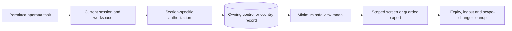

# System Admin data handling and disclosure boundaries

The separate System Admin app brings sensitive records into an operator's
hands. Its purpose is to complete a permitted task, not to create a second
unrestricted copy of identity, financial or trip data. This chapter is a
public-safe classification and handling guide. It names ownership and required
behavior without listing live records, private locations, access procedures or
exact retention rules. Jurisdiction, legal hold and the approved retention
schedule remain authoritative.

## Classification by task

| Data class | Typical task and authority | Mobile presentation | Export/retention owner |
| --- | --- | --- | --- |
| Global identity and contact | Verify or correct one account; control identity is authoritative | Minimum fields needed for the action, masked where full value is unnecessary | Identity/privacy owner; account lifecycle and applicable law |
| Sessions and installations | Investigate access, revoke a session or restrict an installation | Current state plus bounded history; physical-device ownership is never inferred from model/IP | Security operations; controlled security-audit schedule |
| Identity and eligibility documents | Review regulated readiness evidence; private object plus country metadata | Gated metadata first; restricted viewer only for a permitted review | Compliance/document owner; quarantine, expiry and hold policy |
| Vehicles and driver readiness | Decide whether a driver/vehicle may operate | Verification status, evidence freshness and outstanding requirements | Country compliance owner; historical decisions retained as policy requires |
| Trip and delivery records | Resolve safety, service or financial questions | Participants, status, route facts and relevant timestamps | Country operations; participant privacy and incident hold |
| Precise location and replay | Investigate a specific journey or safety event | Bounded, purpose-specific replay; uncertainty and sample quality remain visible | Safety/privacy owner; shortest lawful operational period |
| Chat, call metadata and recordings | Investigate a permitted case | Metadata before content; separate restricted content authorization | Communications/safety owner; consent and jurisdiction govern media |
| Wallet, payments, top-ups and payouts | Reconcile balances, decide a pending request or support a dispute | Integer minor units, ISO currency, status and safe reference; no raw provider credentials | Finance/accounting owner; immutable ledger and required retention |
| Support cases and attachments | Respond or escalate a customer request | Case timeline and necessary excerpts; attachments separately authorized | Support/privacy owner; purpose and closure policy |
| Notifications and alerts | Diagnose delivery or receive an admin work hint | Template/status and safe reference, not private message bodies in OS previews | Notification owner; attempt and inbox retention |
| Audit and administrative actions | Explain who acted on what and with which result | Human-readable detail and affected-user-local time; one-event PDF under permission | Control or country audit owner; integrity and legal hold |
| Diagnostics and telemetry | Find a defect without reconstructing private records | Sanitized code, latency, operation and support reference | Observability/security owner; restricted log access |

The table is a review checklist, not a statement that every mobile viewer or
export exists. The current migration intentionally withholds several restricted
document and communication actions. A route or API response does not create
permission to display or retain its contents.

## The data path for one dossier

1. The operator selects a current country and tenant workspace.
2. The API checks the actor's current grant and the specific person's
   relationship to that workspace. A broad directory capability does not
   authorize every dossier section.
3. Each tab asks for only the fields its task needs. Optional sections have
   separate loading, denied, empty and error states.
4. The app formats dates in the affected person's time zone and amounts in the
   record's currency. It does not substitute current time or a default currency
   when source data is missing.
5. A private detail or export rechecks authorization at open/download time;
   permission inferred during the list request may have expired.
6. Logout, account switch, tenant/country switch and viewer expiry evict
   incompatible bytes, pending routes and account-bound cached state.

## Local storage and screen lifecycle

Secure storage is for the app's own credentials and narrowly reviewed pending
operation metadata, not an offline mirror of dossiers. A pending mutation
journal may retain an encrypted, account/workspace-bound operation key,
precondition and frozen non-secret payload needed for reconciliation. It must
not retain passwords, one-time codes, step-up proofs, raw payment tokens,
document bytes or private messages. Plain preferences may hold appearance
choices; they do not confer authorization.

A refresh failure may keep a clearly labelled last-good summary, but the app
must recheck authority before a consequential action or restricted detail. A
late response from the former account or country is discarded. Backgrounding
and app-switcher presentation are part of a platform-specific privacy review;
one OS's behavior is not evidence for the other. Screenshots, accessibility
services and OS notifications require separate consideration when restricted
content is visible.

## Export, audit and human-readable evidence

An individual audit record may be exported as a full-detail PDF by an
authorized viewer. It should explain actor, affected person, action, result,
time zone, related safe references and relevant changes in ordinary language.
The export is scoped to one event, reauthorized, labelled for its sensitivity,
and tracked as a disclosure where policy requires. Raw JSON, secrets, provider
payloads and unrelated user records are not an acceptable substitute for a
human-readable report.

Bulk export, restricted-document download and communication evidence each need
their own policy. A user's right to see their own audit trail does not imply
permission to see administrator-only security evidence. Account deletion may
remove or anonymize mutable profile data while accounting, dispute or legal
records remain under an applicable retention obligation; a UI must not promise
instant erasure of records it cannot lawfully delete.

## Review and test obligations

For every screen and export, record: data owner; user-facing purpose; actor and
target authorization; fields displayed; cache and cleanup path; redaction;
retention/hold owner; audit of view/export; and denied, expired, partial and
account-switch tests. Verify a restricted view against another country/tenant,
an old direct link, a revoked session and process restoration. Inspect final
signed artifacts and telemetry for accidental private data, not only Dart
models.

Continue with [privacy and data protection](privacy-and-data-protection.md),
[documents, media and voice](../architecture/documents-media-voice.md),
[identity and access](identity-and-access.md), and
[mobile security verification](../quality/mobile-security-verification.md).
