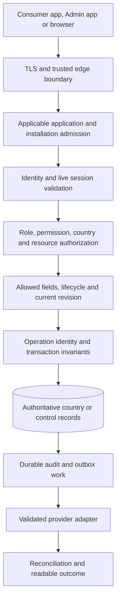

# KiloDrive security controls and assurance boundaries

KiloDrive protects accounts, documents, location, communications and money with
separate controls at the client, API, database and provider boundaries. A
successful login establishes identity. It does not establish device admission,
permission to access another person, driver readiness or authority to move money.
Each protected workflow must satisfy its own checks.

This chapter expands the [security posture](README.md) into practical controls,
failure behavior and verification responsibilities. The companion
[OWASP API Security Top 10 mapping](owasp-api-top-10-2023.md) organizes the same
architecture by threat category.

## Scope and strength of evidence

The source review uses commit
`1cd27c58f0fd9df6d974fab3718c3cb0b485f251`: consumer `1.0.0+172`, System Admin
`0.1.0+16`, schema `2026.10.03.1`. See the
[current baseline](../current-baseline.md) for provenance. This is a source and
documentation assessment. It does not claim a fresh production inspection,
penetration test, signed-device certification or independent security audit.

| Evidence term | Meaning in this chapter | What it does not establish |
| --- | --- | --- |
| Implemented | A corresponding mechanism exists in the reviewed source | Every route uses it correctly or a particular deployment enables it |
| Configurable | Code supports a policy with deployment-controlled behavior | The example/default value is the live value |
| Test defined | A named regression covers a bounded case in source | That test was run in this documentation pass or passed against production |
| Operational requirement | A deployment or operating responsibility | A completed configuration, exercise or provider approval |
| Verification outstanding | Additional evidence is needed for a stronger claim | Automatically a confirmed exploitable production defect |

The evidence index at the end identifies representative implementation and test
files without publishing private source, infrastructure coordinates, secret
values, fraud thresholds or customer records.

## Controls along a request

This is a conceptual decision flow, not a literal middleware ordering diagram.
Provider callbacks, anonymous content, registration bootstrap and browser
front ends have distinct entry policies. Their exceptions must be explicit;
adding an exception for one path must not exempt unrelated protected routes.

## Authentication: prove identity and preserve it safely

### One identity authority

The control database owns credentials, contact verification, social identities,
passkeys, refresh families, security state and country memberships. Country-cell
user rows are credential-free operational projections. They support local trips,
wallets and foreign keys without creating another password or session authority.
An account restriction must therefore be evaluated against the authoritative
identity, not an old country projection or a cached mobile profile.

Password verification uses the reviewed Argon2id profile, with an explicit
PBKDF2 profile for deployments requiring the separately documented FIPS
boundary. Salts, bounded hash parsing, constant-time comparison and concurrency
limits address different threats: offline guessing, malicious encodings,
comparison leakage and resource exhaustion. Rehashing on successful login
allows supported older hashes to migrate. None of this justifies a claim that
all KiloDrive cryptography is FIPS certified.

The optional breached-password lookup sends a hash prefix and compares the
returned candidates locally. Its activation and outage policy are configuration
decisions. It supplements password policy; it does not replace multifactor
authentication, throttling or account recovery controls.

### Signed access and renewable sessions

Asymmetric access tokens use the configured signing algorithm, issuer, audience,
expiry and key identifier. Public JWKS supports verification and key rollover;
it must never contain private signing material. Persistent protected production
keys and a tested rollover are operating responsibilities. Development ephemeral
keys are not a production key-management strategy.

Rotating refresh-token families provide server-side session state and reuse
detection. Session-family authorization checks the signed user and tenant,
family liveness and any bound installation. Logout or session revocation can
invalidate that family while leaving another authorized device session intact.
The reviewed policy explicitly retains compatibility for older tokens without
the family claim; therefore it would be inaccurate to claim that every
historically issued token has identical family-binding guarantees.

The mobile client coordinates refresh and session cleanup so concurrent calls
do not create independent refresh storms. After terminal session rejection,
protected polling, realtime subscriptions and account-bound caches must stop.
An infrastructure outage is different from an invalid credential: it should
produce a recoverable unavailable state, not erase an account or pretend that
authentication succeeded.

### Recovery, multifactor and social identity

Email/SMS challenges are purpose-bound, expiring and attempt-limited. Password
failure counters and challenge failure counters are separate so challenge abuse
cannot become an easy account-lockout tool. A delivered email is not proof that
its recipient completed the challenge. An administrator initiates the secure
reset workflow; the dossier must not expose or directly assign a plaintext
password.

Recent authentication and enrolled 2FA step-up have different semantics. Recent
authentication establishes freshness; action-bound step-up proves the required
additional ceremony for a protected operation. Requirements are endpoint-specific.
The current high-risk financial policy does not invent a new authenticator
ceremony for every transfer or membership purchase. Missing required evidence
blocks or challenges the operation; optional evidence is not silently promoted
into a universal prerequisite.

Passkeys use server-verified WebAuthn ceremonies and distributed single-use
challenge state. Social identity is verified with the provider and linked
through an explicit, expiring ownership ceremony. An email string matching an
existing account is insufficient to merge identities. Registration intent is
validated by the API, including role, country and driver/rental choices.

Platform biometrics and the app PIN protect local viewing. They are not server
proof for a password change, payout or administrator decision. Further protocol
detail is in [identity and access](identity-and-access.md).

## Authorization: decide who may do what to which record

Authorization combines several dimensions. A route-level role attribute is
only one of them.

| Dimension | KiloDrive decision | Example of a request that must fail |
| --- | --- | --- |
| Account and session | Current identity, token version and applicable live family | A revoked session continues with an otherwise signed token |
| Role and function | Consumer role or explicit administrative capability | A rider invokes a document-review mutation |
| Country and tenant | Exact authorized membership or permitted acting workspace | A valid membership in one country is used for another cell |
| Object | Owner, trip participant, organization member or permitted reviewer | A person substitutes another user's payout-method identifier |
| Property | Explicit request and response DTO fields | A profile edit attempts to assign a balance or approval state |
| Lifecycle | Current version, status, eligibility and allowed transition | An old bid is accepted after driver eligibility changes |
| Fresh proof | Recent authentication or step-up where required | A sensitive action relies only on an old bearer session |

Tenant query filters reduce accidental leakage, but they do not replace object
ownership checks. Any deliberate filter bypass needs an explicit authorized
scope. The same checks apply to exports, private downloads, nested records,
background jobs and realtime group membership, not only visible list pages.
UUIDv7 identifies a record; possessing its value grants no access.

### Consumer and System Admin separation

The consumer app handles rider, driver and rental journeys. The separate System
Admin app handles privileged review, membership administration, operational
recovery and system management through authorized API contracts. Removing a
button from the consumer app is not the security boundary: the server must
reject a consumer-scoped token at privileged functions.

One global identity can be a System Admin and separately hold a rider membership.
The consumer session remains consumer-scoped; it must not acquire administrative
authority by restoring a setting, changing a client header or refreshing a token.
Country workspace selection and capability grants remain server decisions.
Device/app identity adds context but never grants an administrative role.

Independent approval is configurable per supported domain. The nine options in
`AdminApprovalPolicyOptions` default to `false` in the reviewed source: driver
identity, external driving history, campaigns, PayPal controls, wallet
adjustments, FX rates, legal documents, trip-call evidence disclosures and
country provisioning. A single authorized administrator can decide when the
relevant option is disabled. Enabling it requires the implemented independent
reviewer check; it does not remove permission, revision, evidence or audit checks.
These defaults are not a statement about effective production configuration,
and they must not be generalized to unrelated workflows such as CSP activation.

See [System Admin architecture](../architecture/system-admin-mobile-app.md) and
[administrative data handling](admin-data-handling.md) for permitted viewing,
export, retention and workflow boundaries.

## Device admission and identification

### Three different proofs

| Proof | What it establishes | What it does not establish |
| --- | --- | --- |
| Verified application attestation | Provider-verified application identity under the configured policy | The human's identity, role or permission to spend |
| Installation credential | A server-registered installation and its current admission state | Permanent hardware identity or document authenticity |
| Authenticated session | The user and authorized session context | A different installation's admission or another user's records |

The API verifies App Check token signatures, issuer, audience, lifetime and
allowed application identity. Consumer and Admin application identities are
mapped to their respective channels. Platform, model, app-version and channel
headers supplied by the caller remain descriptions, not proof.

In the reviewed source, endpoints marked for App Check protection fail closed
under the Production environment. Device-registration attestation has separate
observation/enforcement controls, and native admission rollout has its own
policy. Consequently, “App Check exists” is not evidence that all anonymous
routes, bootstrap paths or deployed clients have identical enforcement.

An installation credential resolves a server record. For a session bound to
that installation, a different credential cannot borrow its authority. Bans,
revocation and admission state remain server-controlled. Clearing app data or
reinstalling can create a new installation identity; this architecture must not
be described as an immutable physical-device fingerprint or an unbreakable
hardware ban.

### Browser and distribution boundaries

The browser-facing server can supply a signed, short-lived request proof whose
method, target and body are bound together. A distributed nonce claim prevents
replay when browser-audience enforcement is enabled. The secret belongs in the
trusted server component, never JavaScript. This proof supplements identity and
authorization; it does not make an anonymous visitor an authenticated user.
Browser enforcement and native rollout must be reviewed together.

Play-installed, sideloaded and iOS-distributed builds can encounter different
provider attestation policies. A successful local build, matching certificate
or one successful retry is insufficient evidence for every distribution path.
Approved test exceptions need bounded scope and traceable configuration.
Provider failure must remain an explicit unavailable or rejected admission
state, rather than a silent allow or a fabricated password error.

### Push tokens are account-bound delivery credentials

A push token is neither a user identifier nor proof of device ownership. Binding
uses the verified application channel, authenticated account, country,
installation and session family. Rotation retires the prior installation
generation. Server revision/mutation tracking protects preference changes and
helps prevent a delayed callback from undoing explicit opt-out.

Consumer and Admin destinations stay distinct. Sending an operational message
must not turn an Admin installation into the customer's consumer destination.
Logout, revocation and account switch must stop delivery to the former binding.
Opening a notification still loads its record through API authorization; a deep
link is navigation, not an access grant.

The [session and installation lifecycle](../architecture/mobile-session-and-device-lifecycle.md)
and [notification lifecycle](../architecture/notification-delivery-lifecycle.md)
explain recovery and delivery behavior in more detail.

## Financial safeguards

### Amounts and entitlements come from authoritative records

Money uses integer minor units with an explicit currency; display separators
and localized decimal marks do not change the stored amount. Server validation
owns positivity, bounds, currency, available balance and permitted action.
Reviewed FX quotes preserve rate, validity and pricing context. A formatted
screen, client total or historic rate cannot override the authoritative quote.

Wallet mutations keep ledger entries, holds and balances within the owning
country-cell transaction. Held funds are not spendable. Posting references,
locking and conditional state transitions prevent repeated settlement of the
same logical event. Double-entry journals and reconciliation provide evidence
of balance consistency; they do not independently prove that every original
business decision was legitimate.

Store purchases require verified Apple/Google evidence, the correct product and
account association, and authoritative entitlement state. A native success
callback or an unlocked local screen cannot grant membership. New sales, restore,
renewal, revocation and recovery have different contracts. Administrator grants
and expiry changes are separate authorized, audited operations; editing the
catalog does not create a store product or rewrite provider purchase history.

### An uncertain result is not a failed mutation

The original operation identity binds the actor, tenant, route, payload and
required revision. The server claims it before executing a protected mutation.

| Observed state | Safe interpretation and action |
| --- | --- |
| Completed with a stored response | Replay the original result for the same command |
| Still processing | Poll or reconcile; do not create a second command |
| Payload or revision differs under the same key | Reject the mismatch; investigate changed intent |
| Connection lost or execution outcome unknown | Preserve the original key, payload and revision; reconcile authoritative state |
| Authoritative no-mutation evidence | Follow the endpoint's explicitly permitted recovery path |
| No recovery record found | Insufficient evidence by itself to assume nothing happened |

This applies to top-ups, transfers, cashouts, value issuance, membership changes
and other covered state mutations. A timeout after capture or commit may conceal
success. A “Retry” button must recover that command rather than mint another key
and repeat the payment. Idempotency prevents duplicates of one intent; it does
not stop abuse through many distinct, otherwise valid commands.

### Provider evidence and risk decisions

Payment callbacks authenticate the provider and bind its event to a server-owned
payment before restoring tenant scope. Signature validity alone does not prove
the amount, currency, account or payment state matches. Conflicting or unknown
events need quarantine/reconciliation; exact duplicates must not create another
credit. Refunds and chargebacks need compensating financial records, preserving
the original evidence.

The high-risk policy distinguishes allow, challenge, hold and deny. Cashout
evaluation includes the required freshness, step-up, device, velocity and
destination-cooling evidence. Other actions have their own requirements.
Unavailable required evidence is not a clean result, and provider settlement
evidence is evaluated at the appropriate later boundary rather than demanded
before a purchase has been submitted.

Adapters isolate provider protocols, normalize outcomes and preserve stable
provider references. Generic transport retry is restricted to safe read methods;
value-changing retries need provider idempotency and reconciliation. Outbox
delivery is durable, but durable delivery alone does not guarantee exactly-once
effects at an external provider.

See [financial systems](../architecture/financial-systems.md),
[authoritative FX](../architecture/authoritative-foreign-exchange.md) and
[API recovery](../api/errors-and-recovery.md).

## Abuse controls and availability

KiloDrive distinguishes excessive traffic from abuse of a legitimate workflow.
Rate limits constrain frequency; state machines, ownership, eligibility and
financial rules constrain meaning. An attacker may stay under a request limit
while repeatedly reserving resources, requesting messages or creating costly
work.

| Surface | Implemented control families | Operating responsibility |
| --- | --- | --- |
| Login and recovery | Route-specific limits, challenge attempts, password policy and coarse errors | Review account recovery, enumeration and distributed attack behavior |
| Device bootstrap and status | Admission policy and endpoint budgets | Verify signed clients, rollout and provider availability |
| Maps, exports and diagnostics | Configurable endpoint budgets, bounded inputs and provider timeouts | Distinguish observation from enforcement; measure real cost |
| Uploads and documents | Size/type checks, private quarantine and scan evidence | Maintain scanner availability, signatures and storage permissions |
| Trips, bids and reservations | Ownership, lifecycle, readiness and plan rules | Detect repeated harmful business behavior across valid accounts |
| Money and redeemable value | Operation identity, transaction invariants and action-specific risk checks | Investigate holds and reconciliations without disclosing private thresholds |
| Notifications and campaigns | Permissions, destination binding, preferences and durable outcomes | Control provider spend and prevent unauthorized bulk contact |

The reviewed ASP.NET rate-limiter partitions are process-local. Adding Redis
for sessions or caching does not make those request counters distributed.
Multiple API nodes require an assessed aggregate edge/distributed budget and
capacity plan. Some configurable budgets have an observation mode that records
would-reject decisions without blocking. A metrics graph is not proof of
enforcement.

The client address used for limiting and audit must come through the trusted
proxy policy. Arbitrary forwarding headers cannot be treated as authoritative.
Cloudflare WAF, bot controls, provider spending caps and host resource limits
are deployment controls whose effective configuration needs separate review.
Do not describe them as enabled solely because architecture diagrams name them.

An effective `429` includes bounded retry guidance; clients should respect it.
Pausing protected background calls after session loss reduces accidental request
storms without weakening server authorization. Private thresholds and detection
rules remain in restricted operational material.

## Documents, privacy and operator decisions

Sensitive uploads stay private. File extension and claimed content type are
insufficient; the upload path validates supported content and requires trusted
scan evidence before protected use. The ClamAV adapter treats malware, malformed
responses, timeouts and missing production attestation configuration as
non-clean outcomes. A reviewer must not relabel an unavailable scan as clean.
Malware scanning is also not proof that an identity document is authentic.

Authorized driver review joins the person, document, vehicle and country context.
The reviewer must see the relevant evidence, record an approval or rejection
reason, and work against current state. Re-uploading rejected evidence creates
another review step; it does not inherit approval. The server computes readiness
from the complete applicable requirements, not a UI toggle or one approved file.

Review decisions stage notifications durably. Email, SMS, WhatsApp and push
depend on the permitted destination, channel configuration and applicable
preferences/policy. Queued, provider-accepted and delivered are different states.
Push content should avoid exposing document contents or sensitive review details
on a lock screen; the authenticated app presents the authorized record.

The optional native viewing lease is distinct from document authorization,
viewer access proof and content retention. Disabling a UX lease must not remove
those checks. Exports require the same scope as on-screen data and remain
sensitive after download. See [administrative data handling](admin-data-handling.md)
and [privacy and data protection](privacy-and-data-protection.md).

## Auditing, configuration and response

Readable audit events should identify the action, actor, affected party, result,
time, correlation and relevant operation reference. Administrative recovery
must preserve the distinction between request, durable decision and provider
result. Store sensitive evidence under access control; logs and public incident
notes should not carry tokens, OTPs, documents, chats or payment credentials.
Audit retention and access control need operating policy; an audit table alone
is not an independently tamper-proof evidence archive.

The API's production validator checks supported security prerequisites for the
selected runtime profile. Validating configuration shape is valuable but cannot
prove key custody, external IAM, firewall behavior, provider approval, alert
delivery or a tested restore. Schema parity similarly does not certify security
configuration or financial correctness.

KiloDrive supports rolling server logs. CloudWatch is an optional, gated sink;
it is not required to investigate an incident. Whichever destination is used
needs access restrictions, redaction, retention and a verified alert path.
Dependency updates, direct-package inventory, protected signing and release
provenance support supply-chain review. The published direct-package SBOM is
not a complete transitive/native vulnerability assessment.

Follow the [security incident runbook](../runbooks/security-incident.md) and
[private reporting policy](../../SECURITY.md) for investigation and disclosure.
This public repository explains the controls without exposing production
recovery commands, network topology, secrets or a bypass recipe.

## Representative source evidence

Paths below identify files in the private product repository at the pinned
baseline. They are evidence locators, not public source links. Test names mean
**tests defined**, not a new execution result.

| ID | Implementation locator | Representative test locator | Bounded claim supported |
| --- | --- | --- | --- |
| E01 | `Identity/PasswordHasherService.cs`; `PasswordHashingOperationGate.cs` | `Api/PasswordHasherServiceTests.cs` | Hash verification, bounded work and migration behavior |
| E02 | `Security/JwtCellAuthorizationPolicy.cs`; `SessionFamilyAuthorizationPolicy.cs` | `Api/JwtCellAuthorizationPolicyTests.cs`; `SessionFamilyAuthorizationTests.cs` | Current identity/cell/family decisions and legacy-claim compatibility |
| E03 | `Features/Auth/AuthHandlers.cs`; `Security/SystemAdminPermissionAuthorization.cs` | `Api/DualRoleConsumerSessionSecurityTests.cs`; `Integration/AuthenticatedAuthorizationMatrixTests.cs` | Consumer-scoped dual-role sessions and representative negative authorization |
| E04 | `Security/AppCheck/AppCheckProtection.cs` | `Api/AppCheckTests.cs`; `DeviceRegistrationAppCheckTests.cs` | Verified app/channel binding, production protected routes and bootstrap rollout |
| E05 | `Middleware/DeviceAccessMiddleware.cs`; `Security/BrowserAudience/BrowserAudienceProof.cs` | `Api/BrowserAudienceProofTests.cs`; `SessionFamilyAuthorizationTests.cs` | Bound installation checks and optional request-bound browser proof |
| E06 | `Controllers/PushTokensController.cs` | `Api/PushTokenOwnershipTests.cs` | Account/session/installation/channel binding and token-generation retirement |
| E07 | `Middleware/IdempotencyMiddleware.cs` | `Api/IdempotencyMiddlewareTests.cs` | Stored replay, mismatch rejection and interrupted-response recovery |
| E08 | `Services/Wallets/HighRiskFinancialActionPolicy.cs` | `Api/HighRiskFinancialActionPolicyTests.cs`; `Architecture/HighRiskFinancialActionCoverageTests.cs` | Action-specific requirements and safe missing-evidence outcomes |
| E09 | `Services/Accounting/LedgerPostingRules.cs`; `LedgerReconciliationService.cs` | `LedgerPostingPropertyTests.cs`; `Integration/LedgerMySqlCrashPointTests.cs` | Ledger invariants and real-database crash-point test definitions |
| E10 | `Services/Payments/PayPalWebhookInbox.cs`; `PayPalWebhookQuarantineService.cs` | `Api/PayPalWebhookDurabilityTests.cs`; `StoreBillingContractTests.cs` | Provider-event binding, quarantine and distinct purchase/recovery contracts |
| E11 | `RateLimiting/RateLimitingSetup.cs`; `ObservedEndpointRateLimiter.cs` | Source inspection of limiter construction and observation wrapper | Process-local partitioning and observe-versus-enforce behavior |
| E12 | `Services/Webhooks/WebhookDestinationPolicy.cs` | `Api/S07WebhookManagementTests.cs` | Public HTTPS destination policy and connection-time address validation |
| E13 | `Services/Uploads/IUploadScanner.cs` | `Services/Uploads/ClamAvUploadScannerTests.cs`; `Api/UploadDownloadTenantBoundaryTests.cs` | Fail-closed scan evidence and representative private-download scope |
| E14 | `Security/ProductionConfigurationValidator.cs`; `ApiResponseHardening.cs` | `Api/ConfiguredCspPolicyGateTests.cs` | Configuration validation and defined CSP regression checks |
| E15 | `Features/Admin/AdminApprovalPolicyOptions.cs` | Source inspection of option defaults and independent-reviewer predicate | Nine optional independent-approval policies with source defaults disabled |

Implementation paths are relative to `src/server/KiloDrive.Api`; test paths
are relative to `tests/KiloDrive.Tests`. Source locators are deliberately
representative. They do not imply that one test file proves an entire security
domain or that every endpoint has equivalent negative coverage.

## Evidence needed for release assurance

| Owner role | Evidence to retain privately | Public conclusion it can support |
| --- | --- | --- |
| Identity/API owner | Current route, permission, field and object matrix; negative test results against the exact commit | Which authorization boundaries were actually exercised |
| Mobile/release owner | Signed artifact hashes, installation channel, cold restart, revocation, account-switch and push-binding results | Which app/device/distribution combinations were verified |
| Financial owner | Real-database concurrency/crash tests and provider-backed purchase, refund and recovery evidence | Which monetary invariants and provider transitions were verified |
| Operations owner | Effective admission/approval settings, key persistence, trusted proxies, aggregate limits, storage/scanner and alert checks | Which configurable controls were active and checked |
| Security/privacy owner | Threat review, dependency analysis, retention/export checks and independent assessment scope | Residual risk and the scope of any independent assurance |

A release decision needs failures and exceptions as well as successful tests.
Record the responsible owner, affected build/environment, compensating control,
expiry or review date and evidence required to close each exception. The
[OWASP mapping](owasp-api-top-10-2023.md) supplies a concrete review queue rather
than a blanket “secure” or “compliant” label.
